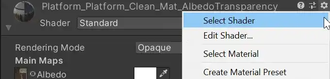
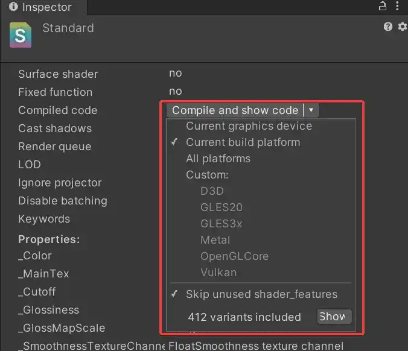

[原文地址](https://thegamedev.guru/unity-gpu-performance/shader-cost-analysis-mali-offline-compiler/)

# How to Analyze the Performance Cost of Your Unity Shaders

在这篇文章中，您将学习如何使用数字**分析 Unity 着色器的复杂性**，以便您最终能够：

- 停止在 unity 游戏性能中受到片段限制
- 比较两个着色器之间的 GPU 复杂度
- 根据纹理、计算和加载/存储 GPU 周期分析着色器消耗
- … 并达到 60、90 或更高的 FPS

为此，我们将使用这个鲜为人知的工具，称为**mali offline shader compiler**。

使用这款免费软件，您最终将能够**看到您在 Unity 着色器是如何使用 GPU 周期的**。

因此，让我们开始讨论这个令人兴奋的话题。

<iframe width="700" height="394" src="https://www.youtube.com/embed/uXO9mPHyj_Q" title="Unity Shader Performance: How to Quickly Measure the GPU Cycles Your Shaders Take" frameborder="0" allow="accelerometer; autoplay; clipboard-write; encrypted-media; gyroscope; picture-in-picture" allowfullscreen></iframe>

## Is It Important to Count GPU Cycles Nowadays?

现在比以往任何时候都更重要的是**了解着色器对游戏性能的影响**。

随着分辨率的不断提高（我看着你，VR），越来越多的游戏受到片段着色阶段的瓶颈。

>“你渲染的像素越多，你就越需要关注片段着色器的成本。”

为了了解着色器的成本，这里有两种方法：

- 进行猜测，例如“这个着色器看起来很昂贵”。
- 测量：通过静态分析或游戏内分析。

在这篇博文中，**我们将通过静态分析来衡量着色器的成本**。一旦您获得更多的测量经验，猜测会更好地工作😉

在接下来的部分中，您和我将在几分钟内编译您的着色器。

这样，我们将获得有关它们的宝贵性能信息，这些信息将指导您未来的决策。

## Setting Up Your Mali Offline Compiler

您可以下载 Mali Offline Compiler 作为[Arm Mobile Studio](https://developer.arm.com/tools-and-software/graphics-and-gaming/arm-mobile-studio/downloads)的一部分。

在该页面上，您需要为您的目标平台下载最新版本。


<p align=center><font color=#B8B8B8 ><i>Download arm Mobile Studio</i></p>

一旦您完成了设置，mali 离线编译器应该是您的 PATH 变量的一部分，即您将能够通过命令行调用它。

如果不是这种情况，您可以自己添加。您可以在安装路径上找到 malioc 可执行文件。

## Compiling Your Unity Shaders

在开始使用 Mali Offline Shader Compiler 之前，我们需要指示 Unity 编译您要分析的着色器。

你看，Mali 对你的 Unity 着色器格式一无所知。

Mali 只想要 GLSL 格式。

幸运的是，这在 Unity 中非常容易。

导航到您选择的材料，然后单击其右侧的滚轮图标。然后，单击选择着色器。



<p align=center><font color=#B8B8B8 ><i>Unity: Finding Your Shader</i></p>

这样做将向您显示着色器的检查器，其中包括其名称、一些元数据以及编译它的可能性。



<p align=center><font color=#B8B8B8 ><i>Unity: Compiling Your Shader</i></p>

（您可能需要选择 GLES3x，因为这是与 Mali 配合使用的图形 API）

猜猜你会按下哪个按钮？

## Getting Your Unity Shader Performance Metrics

一旦您按下编译并显示代码，您的代码编辑器将向您显示 Unity 为您编译的可能很长的着色器列表。

这个临时文件包含 Unity 为您生成的所有顶点和片段着色器变体。

顶点着色器以 *#ifdef VERTEX 开始* 并以它的 *#endif* 结束。

您可以通过 FRAGMENT 分隔片段着色器。

以下是您要执行的操作：

- 复制顶点或片段着色器的内部代码
- 将其粘贴到新文件中并使用正确的扩展名（.vert 或 .frag）保存
- 请马里给你性能指标

让我向您展示标准着色器的两个示例。

### Vertex Shader Performance Metrics

这是我保存到 shader.vert 的代码：

#### 顶点着色器：shader.vert

```glsl
//#ifdef VERTEX
#version 300 es
#define HLSLCC_ENABLE_UNIFORM_BUFFERS 1
#if HLSLCC_ENABLE_UNIFORM_BUFFERS
#define UNITY_UNIFORM
#else
#define UNITY_UNIFORM uniform
#endif
#define UNITY_SUPPORTS_UNIFORM_LOCATION 1
#if UNITY_SUPPORTS_UNIFORM_LOCATION
#define UNITY_LOCATION(x) layout(location = x)
#define UNITY_BINDING(x) layout(binding = x, std140)
#else
#define UNITY_LOCATION(x)
#define UNITY_BINDING(x) layout(std140)
#endif
uniform vec3 _WorldSpaceCameraPos;
uniform mediump vec4 unity_SHBr;
uniform mediump vec4 unity_SHBg;
uniform mediump vec4 unity_SHBb;
uniform mediump vec4 unity_SHC;
uniform vec4 hlslcc_mtx4x4unity_ObjectToWorld[4];
uniform vec4 hlslcc_mtx4x4unity_WorldToObject[4];
uniform vec4 hlslcc_mtx4x4unity_MatrixVP[4];
uniform vec4 _MainTex_ST;
uniform vec4 _DetailAlbedoMap_ST;
uniform mediump float _UVSec;
in highp vec4 in_POSITION0;
in mediump vec3 in_NORMAL0;
in highp vec2 in_TEXCOORD0;
in highp vec2 in_TEXCOORD1;
out highp vec4 vs_TEXCOORD0;
out highp vec4 vs_TEXCOORD1;
out highp vec4 vs_TEXCOORD2;
out highp vec4 vs_TEXCOORD3;
out highp vec4 vs_TEXCOORD4;
out mediump vec4 vs_TEXCOORD5;
out highp vec4 vs_TEXCOORD7;
out highp vec3 vs_TEXCOORD8;
vec4 u_xlat0;
mediump vec4 u_xlat16_0;
bool u_xlatb0;
vec4 u_xlat1;
mediump float u_xlat16_2;
mediump vec3 u_xlat16_3;
float u_xlat12;
void main()
{
u_xlat0 = in_POSITION0.yyyy * hlslcc_mtx4x4unity_ObjectToWorld[1];
u_xlat0 = hlslcc_mtx4x4unity_ObjectToWorld[0] * in_POSITION0.xxxx + u_xlat0;
u_xlat0 = hlslcc_mtx4x4unity_ObjectToWorld[2] * in_POSITION0.zzzz + u_xlat0;
u_xlat0 = u_xlat0 + hlslcc_mtx4x4unity_ObjectToWorld[3];
u_xlat1 = u_xlat0.yyyy * hlslcc_mtx4x4unity_MatrixVP[1];
u_xlat1 = hlslcc_mtx4x4unity_MatrixVP[0] * u_xlat0.xxxx + u_xlat1;
u_xlat1 = hlslcc_mtx4x4unity_MatrixVP[2] * u_xlat0.zzzz + u_xlat1;
gl_Position = hlslcc_mtx4x4unity_MatrixVP[3] * u_xlat0.wwww + u_xlat1;
#ifdef UNITY_ADRENO_ES3
u_xlatb0 = !!(_UVSec==0.0);
#else
u_xlatb0 = _UVSec==0.0;
#endif
u_xlat0.xy = (bool(u_xlatb0)) ? in_TEXCOORD0.xy : in_TEXCOORD1.xy;
vs_TEXCOORD0.zw = u_xlat0.xy * _DetailAlbedoMap_ST.xy + _DetailAlbedoMap_ST.zw;
vs_TEXCOORD0.xy = in_TEXCOORD0.xy * _MainTex_ST.xy + _MainTex_ST.zw;
u_xlat0.xyz = in_POSITION0.yyy * hlslcc_mtx4x4unity_ObjectToWorld[1].xyz;
u_xlat0.xyz = hlslcc_mtx4x4unity_ObjectToWorld[0].xyz * in_POSITION0.xxx + u_xlat0.xyz;
u_xlat0.xyz = hlslcc_mtx4x4unity_ObjectToWorld[2].xyz * in_POSITION0.zzz + u_xlat0.xyz;
u_xlat0.xyz = hlslcc_mtx4x4unity_ObjectToWorld[3].xyz * in_POSITION0.www + u_xlat0.xyz;
vs_TEXCOORD1.xyz = u_xlat0.xyz + (-_WorldSpaceCameraPos.xyz);
vs_TEXCOORD8.xyz = u_xlat0.xyz;
vs_TEXCOORD1.w = 0.0;
vs_TEXCOORD2 = vec4(0.0, 0.0, 0.0, 0.0);
vs_TEXCOORD3 = vec4(0.0, 0.0, 0.0, 0.0);
u_xlat0.x = dot(in_NORMAL0.xyz, hlslcc_mtx4x4unity_WorldToObject[0].xyz);
u_xlat0.y = dot(in_NORMAL0.xyz, hlslcc_mtx4x4unity_WorldToObject[1].xyz);
u_xlat0.z = dot(in_NORMAL0.xyz, hlslcc_mtx4x4unity_WorldToObject[2].xyz);
u_xlat12 = dot(u_xlat0.xyz, u_xlat0.xyz);
u_xlat12 = inversesqrt(u_xlat12);
u_xlat0.xyz = vec3(u_xlat12) * u_xlat0.xyz;
vs_TEXCOORD4.xyz = u_xlat0.xyz;
vs_TEXCOORD4.w = 0.0;
u_xlat16_2 = u_xlat0.y * u_xlat0.y;
u_xlat16_2 = u_xlat0.x * u_xlat0.x + (-u_xlat16_2);
u_xlat16_0 = u_xlat0.yzzx * u_xlat0.xyzz;
u_xlat16_3.x = dot(unity_SHBr, u_xlat16_0);
u_xlat16_3.y = dot(unity_SHBg, u_xlat16_0);
u_xlat16_3.z = dot(unity_SHBb, u_xlat16_0);
vs_TEXCOORD5.xyz = unity_SHC.xyz * vec3(u_xlat16_2) + u_xlat16_3.xyz;
vs_TEXCOORD5.w = 0.0;
vs_TEXCOORD7 = vec4(0.0, 0.0, 0.0, 0.0);
return;
}
//#endif
```

请注意，您必须排除第一个 *#ifdef VERTEX* 和最后一个 *#endif*。我只是把它们留在那里供你参考。

然后，调用像 *“ malioc shader.vert”* 这样的mali离线编译器，它会产生这个输出：

```c
`C:\Users\rtorresb\Desktop\Tmp>malioc shader.vert
Mali Offline Compiler v7.1.0 (Build 7a3538)
Copyright 2007-2020 Arm Limited, all rights reserved
Configuration
=============
Hardware: Mali-G76 r0p0
Driver: Bifrost r19p0-00rel0
Shader type: OpenGL ES Vertex (inferred)
Main shader
===========
Work registers: 32
Uniform registers: 82
Stack spilling: False
A LS V T Bound
Total instruction cycles: 2.9 16.0 0.0 0.0 LS
Shortest path cycles: 2.9 16.0 0.0 0.0 LS
Longest path cycles: 2.9 16.0 0.0 0.0 LS
A = Arithmetic, LS = Load/Store, V = Varying, T = Texture
```

如您所见，此特定着色器在 Mali G76 GPU 上需要 16 个周期进行加载/存储。这是一个相当昂贵的着色器，但这就是您使用标准着色器时得到的结果。如果您想优化此着色器，那么您我想减少着色器的加载/存储操作。然后，重做这一步，看看你是如何改进它的。

### Fragment Shader Performance Metrics

让我们使用下面的片段着色器执行相同的过程：

#### Fragment Shader: shader.frag

```glsl
//#ifdef FRAGMENT
#version 300 es
#ifdef GL_EXT_shader_texture_lod
#extension GL_EXT_shader_texture_lod : enable
#endif
precision highp float;
precision highp int;
#define HLSLCC_ENABLE_UNIFORM_BUFFERS 1
#if HLSLCC_ENABLE_UNIFORM_BUFFERS
#define UNITY_UNIFORM
#else
#define UNITY_UNIFORM uniform
#endif
#define UNITY_SUPPORTS_UNIFORM_LOCATION 1
#if UNITY_SUPPORTS_UNIFORM_LOCATION
#define UNITY_LOCATION(x) layout(location = x)
#define UNITY_BINDING(x) layout(binding = x, std140)
#else
#define UNITY_LOCATION(x)
#define UNITY_BINDING(x) layout(std140)
#endif
uniform mediump vec4 _WorldSpaceLightPos0;
uniform mediump vec4 unity_SHAr;
uniform mediump vec4 unity_SHAg;
uniform mediump vec4 unity_SHAb;
uniform mediump vec4 unity_SpecCube0_HDR;
uniform mediump vec4 _LightColor0;
uniform mediump vec4 _Color;
uniform float _GlossMapScale;
uniform mediump float _OcclusionStrength;
UNITY_LOCATION(0) uniform mediump sampler2D _MainTex;
UNITY_LOCATION(1) uniform mediump sampler2D _MetallicGlossMap;
UNITY_LOCATION(2) uniform mediump sampler2D _OcclusionMap;
UNITY_LOCATION(3) uniform mediump samplerCube unity_SpecCube0;
in highp vec4 vs_TEXCOORD0;
in highp vec4 vs_TEXCOORD1;
in highp vec4 vs_TEXCOORD4;
in mediump vec4 vs_TEXCOORD5;
layout(location = 0) out mediump vec4 SV_Target0;
vec3 u_xlat0;
vec3 u_xlat1;
mediump vec4 u_xlat16_1;
mediump vec3 u_xlat16_2;
vec4 u_xlat3;
mediump float u_xlat16_4;
mediump vec3 u_xlat16_5;
mediump vec3 u_xlat16_6;
mediump vec3 u_xlat16_7;
mediump vec3 u_xlat16_8;
vec3 u_xlat9;
mediump vec3 u_xlat16_9;
mediump vec3 u_xlat16_13;
mediump vec3 u_xlat16_15;
float u_xlat18;
float u_xlat20;
mediump float u_xlat16_24;
float u_xlat27;
mediump float u_xlat16_27;
float u_xlat28;
void main()
{
u_xlat0.x = dot(vs_TEXCOORD1.xyz, vs_TEXCOORD1.xyz);
u_xlat0.x = inversesqrt(u_xlat0.x);
u_xlat9.xyz = (-vs_TEXCOORD1.xyz) * u_xlat0.xxx + _WorldSpaceLightPos0.xyz;
u_xlat1.xyz = u_xlat0.xxx * vs_TEXCOORD1.xyz;
u_xlat0.x = dot(u_xlat9.xyz, u_xlat9.xyz);
u_xlat0.x = max(u_xlat0.x, 0.00100000005);
u_xlat0.x = inversesqrt(u_xlat0.x);
u_xlat0.xyz = u_xlat0.xxx * u_xlat9.xyz;
u_xlat27 = dot(_WorldSpaceLightPos0.xyz, u_xlat0.xyz);
#ifdef UNITY_ADRENO_ES3
u_xlat27 = min(max(u_xlat27, 0.0), 1.0);
#else
u_xlat27 = clamp(u_xlat27, 0.0, 1.0);
#endif
u_xlat27 = max(u_xlat27, 0.319999993);
u_xlat16_2.xy = texture(_MetallicGlossMap, vs_TEXCOORD0.xy).xw;
u_xlat28 = (-u_xlat16_2.y) * _GlossMapScale + 1.0;
u_xlat20 = u_xlat28 * u_xlat28 + 1.5;
u_xlat27 = u_xlat27 * u_xlat20;
u_xlat20 = dot(vs_TEXCOORD4.xyz, vs_TEXCOORD4.xyz);
u_xlat20 = inversesqrt(u_xlat20);
u_xlat3.xyz = vec3(u_xlat20) * vs_TEXCOORD4.xyz;
u_xlat0.x = dot(u_xlat3.xyz, u_xlat0.xyz);
#ifdef UNITY_ADRENO_ES3
u_xlat0.x = min(max(u_xlat0.x, 0.0), 1.0);
#else
u_xlat0.x = clamp(u_xlat0.x, 0.0, 1.0);
#endif
u_xlat0.x = u_xlat0.x * u_xlat0.x;
u_xlat9.x = u_xlat28 * u_xlat28;
u_xlat18 = u_xlat9.x * u_xlat9.x + -1.0;
u_xlat0.x = u_xlat0.x * u_xlat18 + 1.00001001;
u_xlat0.x = u_xlat0.x * u_xlat27;
u_xlat0.x = u_xlat9.x / u_xlat0.x;
u_xlat16_4 = u_xlat28 * u_xlat9.x;
u_xlat16_4 = (-u_xlat16_4) * 0.280000001 + 1.0;
u_xlat0.x = u_xlat0.x + -9.99999975e-05;
u_xlat0.x = max(u_xlat0.x, 0.0);
u_xlat0.x = min(u_xlat0.x, 100.0);
u_xlat16_9.xyz = texture(_MainTex, vs_TEXCOORD0.xy).xyz;
u_xlat16_5.xyz = u_xlat16_9.xyz * _Color.xyz;
u_xlat16_13.xyz = _Color.xyz * u_xlat16_9.xyz + vec3(-0.220916301, -0.220916301, -0.220916301);
u_xlat16_13.xyz = u_xlat16_2.xxx * u_xlat16_13.xyz + vec3(0.220916301, 0.220916301, 0.220916301);
u_xlat16_6.x = (-u_xlat16_2.x) * 0.779083729 + 0.779083729;
u_xlat16_15.xyz = u_xlat16_5.xyz * u_xlat16_6.xxx;
u_xlat16_6.x = (-u_xlat16_6.x) + 1.0;
u_xlat16_6.x = u_xlat16_2.y * _GlossMapScale + u_xlat16_6.x;
#ifdef UNITY_ADRENO_ES3
u_xlat16_6.x = min(max(u_xlat16_6.x, 0.0), 1.0);
#else
u_xlat16_6.x = clamp(u_xlat16_6.x, 0.0, 1.0);
#endif
u_xlat16_7.xyz = (-u_xlat16_13.xyz) + u_xlat16_6.xxx;
u_xlat0.xyz = u_xlat0.xxx * u_xlat16_13.xyz + u_xlat16_15.xyz;
u_xlat0.xyz = u_xlat0.xyz * _LightColor0.xyz;
u_xlat3.w = 1.0;
u_xlat16_8.x = dot(unity_SHAr, u_xlat3);
u_xlat16_8.y = dot(unity_SHAg, u_xlat3);
u_xlat16_8.z = dot(unity_SHAb, u_xlat3);
u_xlat16_8.xyz = u_xlat16_8.xyz + vs_TEXCOORD5.xyz;
u_xlat16_8.xyz = max(u_xlat16_8.xyz, vec3(0.0, 0.0, 0.0));
u_xlat16_2.xyz = log2(u_xlat16_8.xyz);
u_xlat16_2.xyz = u_xlat16_2.xyz * vec3(0.416666657, 0.416666657, 0.416666657);
u_xlat16_2.xyz = exp2(u_xlat16_2.xyz);
u_xlat16_2.xyz = u_xlat16_2.xyz * vec3(1.05499995, 1.05499995, 1.05499995) + vec3(-0.0549999997, -0.0549999997, -0.0549999997);
u_xlat16_2.xyz = max(u_xlat16_2.xyz, vec3(0.0, 0.0, 0.0));
u_xlat16_27 = texture(_OcclusionMap, vs_TEXCOORD0.xy).y;
u_xlat16_6.x = (-_OcclusionStrength) + 1.0;
u_xlat16_6.x = u_xlat16_27 * _OcclusionStrength + u_xlat16_6.x;
u_xlat16_8.xyz = u_xlat16_2.xyz * u_xlat16_6.xxx;
u_xlat16_15.xyz = u_xlat16_15.xyz * u_xlat16_8.xyz;
u_xlat27 = dot(u_xlat3.xyz, _WorldSpaceLightPos0.xyz);
#ifdef UNITY_ADRENO_ES3
u_xlat27 = min(max(u_xlat27, 0.0), 1.0);
#else
u_xlat27 = clamp(u_xlat27, 0.0, 1.0);
#endif
u_xlat0.xyz = u_xlat0.xyz * vec3(u_xlat27) + u_xlat16_15.xyz;
u_xlat16_15.x = (-u_xlat28) * 0.699999988 + 1.70000005;
u_xlat16_15.x = u_xlat28 * u_xlat16_15.x;
u_xlat16_15.x = u_xlat16_15.x * 6.0;
u_xlat16_24 = dot(u_xlat1.xyz, u_xlat3.xyz);
u_xlat16_24 = u_xlat16_24 + u_xlat16_24;
u_xlat16_8.xyz = u_xlat3.xyz * (-vec3(u_xlat16_24)) + u_xlat1.xyz;
u_xlat27 = dot(u_xlat3.xyz, (-u_xlat1.xyz));
#ifdef UNITY_ADRENO_ES3
u_xlat27 = min(max(u_xlat27, 0.0), 1.0);
#else
u_xlat27 = clamp(u_xlat27, 0.0, 1.0);
#endif
u_xlat16_24 = (-u_xlat27) + 1.0;
u_xlat16_24 = u_xlat16_24 * u_xlat16_24;
u_xlat16_24 = u_xlat16_24 * u_xlat16_24;
u_xlat16_13.xyz = vec3(u_xlat16_24) * u_xlat16_7.xyz + u_xlat16_13.xyz;
u_xlat16_1 = textureLod(unity_SpecCube0, u_xlat16_8.xyz, u_xlat16_15.x);
u_xlat16_15.x = u_xlat16_1.w + -1.0;
u_xlat16_15.x = unity_SpecCube0_HDR.w * u_xlat16_15.x + 1.0;
u_xlat16_15.x = u_xlat16_15.x * unity_SpecCube0_HDR.x;
u_xlat16_15.xyz = u_xlat16_1.xyz * u_xlat16_15.xxx;
u_xlat16_6.xyz = u_xlat16_6.xxx * u_xlat16_15.xyz;
u_xlat16_6.xyz = vec3(u_xlat16_4) * u_xlat16_6.xyz;
u_xlat0.xyz = u_xlat16_6.xyz * u_xlat16_13.xyz + u_xlat0.xyz;
SV_Target0.xyz = u_xlat0.xyz;
SV_Target0.w = 1.0;
return;
}
//#endif
```

我们将它保存到 shader.frag 并调用 mali 离线着色器编译器：

```c
C:\Users\rtorresb\Desktop\Tmp>malioc shader.frag
Mali Offline Compiler v7.1.0 (Build 7a3538)
Copyright 2007-2020 Arm Limited, all rights reserved
Configuration
=============
Hardware: Mali-G76 r0p0
Driver: Bifrost r19p0-00rel0
Shader type: OpenGL ES Fragment (inferred)
Main shader
===========
Work registers: 32
Uniform registers: 24
Stack spilling: False
A LS V T Bound
Total instruction cycles: 1.7 0.0 1.0 2.0 T
Shortest path cycles: 1.7 0.0 1.0 2.0 T
Longest path cycles: 1.7 0.0 1.0 2.0 T
A = Arithmetic, LS = Load/Store, V = Varying, T = Texture
```

在这种情况下，我们的着色器是纹理绑定的。要优化它，您需要减少在着色器中进行的纹理通道和访问的数量。

（顺便说一下，这些数字在标准着色器的其他变体上要差得多）。

## What Does This Teach Us?

以下是您可以从这篇文章中获得的一些重要经验教训：

- 一切都取决于性能：指令、纹理通道、变体。一切。
- 你有一个简洁的工具来衡量你的着色器的成本
- 更重要的是，您现在可以在有疑问时比较着色器的性能
- 您现在距离 60 FPS 又近了一步。

但是，请记住：

- 这些估计值因架构甚至驱动程序版本而有很大差异……
- 然而，这些指标对您的优化之旅非常有用

你怎么看？

要获得更多有用的技巧来提高您的 Unity 游戏性能并避免 1 星评价，请立即获取我的Unity 性能清单。