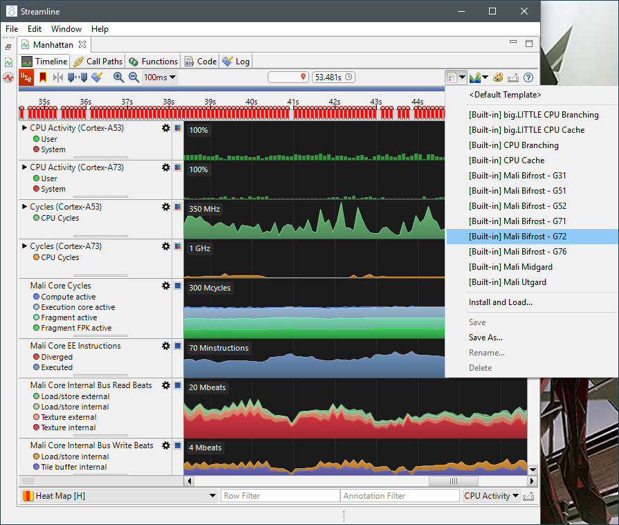
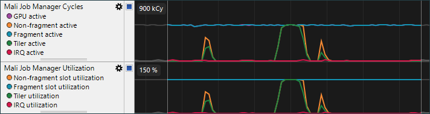
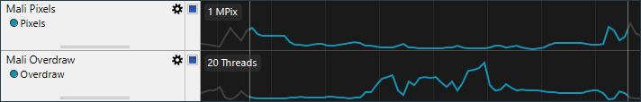
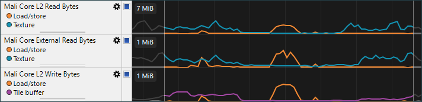

[原文地址](https://community.arm.com/cn/b/blog/posts/arm-mobile-studio-mali-gpu)

# 使用Arm Mobile Studio加速Mali GPU分析

Streamline性能分析器是一个基于采样的分析器，可以提供有关设备中存在的Arm CPU和Mali GPU的详细性能信息。最新版本的Streamline包含一组预定义模板，可用于方便选择要使用的数据源，并控制它们的显示方式。最新版本的Streamline包含在 [Arm Mobile Studio](https://developer.arm.com/mobile-studio) 2019.0和 [Arm Development Studio](https://developer.arm.com/tools-and-software/embedded/arm-development-studio) 2019.0中，它包含对Mali Bifrost GPU系列的Mali GPU模板的一些改进。本文将介绍如何使用Mali-G72 GPU的模板。

本文假设读者熟悉图形术语，特别是与基于Tile渲染的GPU架构相关术语。有关这些主题的一些有用的快速入门指南可在下面文章中找到：

- [了解渲染过程](https://developer.arm.com/solutions/graphics/developer-guides/understanding-render-passes)

- [了解GPU流水线](https://developer.arm.com/graphics/developer-guides/workload-pipelining)

- [了解基于平铺的渲染](https://developer.arm.com/solutions/graphics/developer-guides/tile-based-rendering)

- [Mali Bifrost着色器核心简介](https://developer.arm.com/solutions/graphics/developer-guides/the-bifrost-shader-core)

## 选择计数器

按照[快速入门指南](https://developer.arm.com/mobile-studio/get-started)设置应用程序并将gator守护程序安装到目标后，就可以选择一些数据源并开始分析。连接到您的设备并调出计数器选择对话框。在“计数器选择”对话框中，从下拉菜单中为设备选择适当的模板。

这将自动选择呈现模板可视化所需的所有数据源。单击“保存”，然后捕获应用程序产生的数据。初始数据分析完成后，将默认显示基于时间轴的图表：

这里显示了基于字母顺序列排列的系列图表。因此，我们需要做的第一件事是选择我们当前设备对应的可视化模板：

这将显示由arm内部性能分析团队设预定义的可视化图表。它以更有条理的顺序对图表进行排序，并利用数学表达式组合多个原始计数器，以获得更易于理解的数据，例如功能单元的利用率百分比。

## 寻找关键帧

初始视图上显示1秒样本的数据，但这对于调试图形程序来说精度不足，因为我们最感兴趣的是查看一帧时间内的信息，我们处理帧的时间通常在16-32毫秒之间。因此，分析的第一步是放大视图，直到单帧变清晰。

在示例中显示的应用程序中，我们在源代码中添加了一些辅助代码，以便在应用程序调用 eglSwapBuffers()时生成Streamline报表上的标记。这些标记在图表上方的时间轨道顶端以红色显示。

一旦您可以看到单个帧，就可以对当前系统行为进行初步评估：

- 测量帧之间的时间以确定帧率。

- 测量CPU负载以确定是否有CPU瓶颈。

- 测量GPU负载以确定是否有GPU瓶颈。

- 检查CPU和GPU负载的操作流程，以确定应用程序是否会因为GPU数据供给导致在图形管线中产生气泡。

在我们上面的例子中，我们可以看到CPU在一帧的很大部分时间中完全空闲，所以CPU不是瓶颈。我们还可以看到GPU始终处于活动状态，因此GPU极有可能是应用程序性能的瓶颈。

进一步细化GPU工作负载，我们发现片元着色器队列一直处于活动状态，而用于几何和计算的非片元队列在一帧中大部分时间处于空闲状态。因此，如果要提高性能，可以优先考虑为此应用程序优化片元单元负载。

本教程的以下部分介绍了模板中的每个图表，并解释了它们的含义以及它们的变化对于指导程序开发人员提高应用程序性能的意义。

## CPU负载

CPU图表显示了系统中CPU的总体使用情况。

所述CPU活动图显示每个CPU利用率，对于big.LITTLE多簇系统，显示每个CPU处于运行状态的时间百分比，信息基于OS调度事件数据。CPU Cycles显示为CPU在活跃时运行的Cycle数，这通过PMU得到。通过综合考虑这两者，我们可以评估整个应用软件的CPU负载。 高利用率和高CPU Cycle数表明CPU非常繁忙并且以高时钟频率运行。  

“时间轴”选项卡底部的流程视图显示应用程序线程活动，可以用来识别进程中带来负载的线程。从列表中选择一个或多个线程将过滤CPU相关图表，以便仅显示来自所选线程的负载。当线程过滤器处于活动状态时，图表标题背景将变为蓝色，表示并非所有测量的负载当前都可见。

如果应用程序未达到其性能目标并且具有始终处于活动状态的单个CPU线程，那么它的性能瓶颈很可能是CPU。降低每一帧所需要的时间需要优化软件来降低此线程工作负载。除性能计数器视图外，Streamline还通过程序计数器采样进行底层软件分析。CPU软件性能分析超出了本教程的范围，因此请参阅[Streamline用户指南](http://infocenter.arm.com/help/topic/com.arm.doc.100769_0607_00_en/index.html)以获取更多信息。

## GPU负载

GPU工作负载图表显示了GPU的整体使用情况。

在Mali任务管理器Cycle图表显示运行当前工作花费GPU Cycle的数量，包含运行在GPU上的片元和非片元工作队列。在Mali任务管理器利用率图表中显示经过GPU活跃Cycle归一化的任务队列数据。   

对于存在GPU瓶颈的应用，GPU任务队列应始终处于活动状态，其他任务队列与其并行运行。如果有GPU瓶颈的应用程序没有对API调用实现良好的并行性检查，可能会耗尽渲染管道资源，例如glFinish()或同步使用glReadPixels()，或者Vulkan依赖项，这些依赖项过于保守，不允许多个渲染过程的阶段重叠（包括跨帧重叠）。  

图表中的Tiler活动计数器往往不能直接使用，因为Tiler单元通常在几何处理的整个过程都处于活动状态，但它表示存在多少着色需要计算。非片元活动和Tile活动之间存在较大不同可能是因为应用程序的计算着色器造成。   

IRQ活动计数器显示GPU在等待CPU处理中断时消耗的Cycle数。IRQ挂起率占GPU Cycle大约2％以内是正常的，但是应用程序可能因为将大量小渲染或计算调度排入队列导致更高的中断率。 

**注意：**高IRQ开销也可能表示系统集成问题，例如CPU中断被特权内核活动长时间屏蔽。通常不可能修改应用程序来修复高IRQ开销。

## GPU内存系统

内存系统图表显示了在GPU内存接口上看到的行为，包括GPU生成的内存存取流量以及系统处理该流量的效率。

Mali外部总线带宽图表显示由应用程序产生的总的读取和写入带宽。减少内存带宽占用是非常有效的应用程序优化目标，因为外部DDR访问非常耗电。后面的图表可以帮助确定由应用程序中哪种资源导致内存带宽的占用。 

在Mali外部总线等待率图表显示因为总线读取失败导致GPU等待的Cycle百分比，表明GPU由于外部存储系统性能不足带来的背压。等待率5％以内是正常的， 更高的等待率表示GPU上负载产生的内存访问流量超过存储器系统可以处理的流量。可以通过降低总内存访问或尽量使用GPU片上缓存来降低等待率。 

Mali外部总线读延迟图表显示外部存储器访问延迟的堆叠图。Mali GPU可以忍受高达170个GPU周期的外部存储器延迟，因此如果在图表中看到长延迟占用比例过高，可能表示存储器系统性能有问题。DDR性能不稳定，并且当DDR处于高负载时延迟会增加，因此减少带宽是减少延迟的有效方法。 

**注意：** 预计小部分慢速的内存访问将显示图表中，因为DDR是共享资源，GPU需要和系统中其他模块共享总线。

Mali外部总线等侍读/写图表显示另一组堆叠图，显示GPU访存队列中已允许的外部读/写访存请求在整个队列中的比例。如果图中的75-100％区间在图中占据高比例，则GPU可能会耗尽队列。这将导致新访存请求等待，直到较旧的请求退出。减少内存带宽需求或增加访存的局部性可以提高性能。 

## GPU几何单元

几何单元图表显示GPU正在处理的几何体的数量，以及三角形剔除单元的行为。

Mali三角形剔除表显示正在处理的三角形的绝对数量，有多少是由每个剔除阶段删除，有多少是可见的。处理单个原生顶点比单个生成顶点所耗费的代价昂贵得多，因为它们原生顶点需要消耗大量带宽从系统内存读取顶点相关信息，因此你应该尽可能地减少每帧的总三角形数。 

Mali三角形淘汰率表显示GPU在每个阶段删除三角形的比例，可见三角形的百分比。剔除管道分为下面几个步骤顺序运行： 

对于3D场景，约50％的背面会在表面剔除单元中去除。如果面剔除率远低于此，请检查是否正确启用了表面剔除测试。 

对于应用程序来说，一般会在CPU上进行视体剔除，因此GPU上视体剔除率应该保持尽可能低。如果在此阶段超过10％的输入三角形被剔除，请检查CPU端视体剔除的有效性。此外，还需要检查每批剔除检查的三角形数量，因为数量过多可能降低剔除效率。 

最后一个剔除率，通过样本测试剔除三角形百分比。因为它们太小，不会在任何光栅化过程后显示。无论是从直接的顶点处理成本还是三角形着色的效率来看，高密度的曲面代价都非常高，因此该数量应尽可能接近0％。如果在这里剔除大量三角形，请检查静态几何网格密度和动态细节精度级别。 

在Mali几何线程表显示由Mali指数驱动顶点着色算法生成顶点着色线程请求的数量。这种设计将应用程序的顶点着色器分成两部分，一部分用于计算位置，另一部分用于计算其他变化。变化着色器仅针对在剪辑和剔除流程后剩下的三角形的顶点运行。此时可以查看多个内容。 

- 将位置着色器调用的总数与应用程序索引缓冲区进行比较。如果GPU着色的顶点比应用程序提交更多，那么这可能表示索引局部性不佳，导致位置缓存的颠簸并强制重新绘形。

- 将位置着色器调用的总数与输入基元的总数进行比较。对于大多数内容，多个相邻三角形应该使用同一个顶点来尽可能地分摊成本，争取每个三角形的平均少于一个顶点。

## GPU着色器前端

着色器前端表显示了固定功能单元的行为，该单元将三角形送入片段线程着色。

Mali核心三角形图表显示已加载的光栅化三角形的数量。请注意，Mali将在每个图块中加载一次覆盖之上的三角形，因此对于处于图块相交部分的三角形每次加载都会被计数。 

在Mali早期ZS测试淘汰率表显示在前端的深度（Z）和模板（S）中测试的淘汰率。早期ZS测试比晚期ZS测试代价小得多，因此让几乎所有片段都进行早期ZS测试，淘汰无需的片段来最小化着色器阶段的三角形丢弃，多重采样和深度值计算。FPK剔除计数器显示由Mali隐藏面消除法消除剔除的四边形比例。被FPK剔除的大部分四边形表示从后到前的渲染顺序; 将其反转为前后渲染顺序将在早期ZS测试中剔除这些四边形，从而减少功耗。

Mali后期ZS检测率图表显示片段着色后进行的深度和模板测试淘汰率。在ZS后期测试期间剔除的四边形比例过高说明潜在效率问题，因为这些着色后的片段被抛弃了。 

**注意：** 使用现有深度或模板状态作为起始状态而不是初始色的渲染过程将在重新加载过程中触发延迟ZS操作。这可能是不可避免的，但尽量减少渲染过程中使用未清空的管线资源。

在Mali核心批处理表显示由计算前端（包括所有非片段的工作负载）和片段前端创建的并行线程(GPU上可以同时执行多个线程)批量数。请注意，线程并行度可能因产品而异。 

最后两个表显示平均每个GPU线程使用着色器核心消耗的Cycle数。对于存在GPU瓶颈的应用，着色器工作负载有两种可能的优化方向：

- 通过简化场景内容减少创建的批处理的数量，或

- 优化着色器程序以降低每个线程消耗的Cycle数。

## GPU着色器前端像素

这组图用于显示哪些着色器在生成像素，以及速率。

Mali像素表显示所有着色器核心生成的像素的总数，用来评估产生一帧所需的像素的总数。

Mali重复绘制图表显示了最终输出的每个像素上重复绘制的次数。即使每次绘制代价很低，但多次重复绘制也会降低性能。最大限度地减少透明像素层数，以减少重复绘制。 

## GPU着色器核心

着色器是GPU的核心，因此我们用大量计数器来检查着色器核心工作负载也就不足为奇了。第一组图表旨在让您一目了然地了解整个着色器核心利用率。

**注意：**着色器核心“计算”数据路径用于处理所有非片段工作负载，因此任何与计算相关的计数器也将考虑顶点着色工作负载。

Mali核心利用率表显示着色器核心的三个主要部分的利用率百分比。 

- 计算利用率图和片段利用率图显示着色器核心用于处理该类型的工作负荷的时间百分比，包括所有固定功能逻辑，诸如光栅化和块写回。

- 执行核心利用率图显示可编程核心在GPU运行中使用百分比;如果长时间低于100％，这可能说明可编程核心工作量供给不足。 

- 片段FPK利用率图显示等待进入片段线程的四边形数量占队列长度百分比。如果长时间低于100％，这可能表明我们未能为着色器核心生成足够快的新片段。这可能是由于很多只能生成少量片段的大量微三角形引起的，但也可能是该负载在很多Tile上没有任何几何体，例如常见类型的阴影贴图。

Mali核心单元利用率图显示了执行核心内部主要管线的利用率百分比。 

- 执行引擎的利用率图展示着色器核心运算单元的活动状态时间百分比。

- 插值单元利用率图展示的是固定功能的插值单元活动状态时间百分比。 

- 纹理单元利用率图展示的是固定功能纹理采样和滤波单元活动状态时间百分比。 

- “ 存取单元利用率” 利用率图展示的是通用内存访问单元处于活动状态的时间百分比。 

对于存在着色器瓶颈的内容，使用这些图表识别负载最重的单元是确定优化点的好方法。

## 负载属性

Mali工作负载特性表中展示了一系列单元反映负载行为的变化。 

发散率图表显示一个批处理中因为跳转指令而部分执行指令的百分比，批处理需要等待所有通路都执行完才能将此批处理返回。最大限度地减少跳转分支，因为分支会大大降低着色器执行效率。 

无用线程率表显示批处理线程中无法生成有效屏幕像素的线程比例。这是由于片段四边形与三角形边缘相交，导致片段中没有覆盖有效像素。高百分比的无用线程率显示应用中生成了大量过小的三角形或非常细长的三角形。尽量降低无用线程占用率，因为它们也会降低着色器执行效率。 

方块CRC剔除率表显示因为CRC匹配而被剔除的方块，表明计算出的色块已经在内存中。如果应用程序能够识别并仅绘制屏幕的改变部分，高剔除率表明潜在的优化机会。

## 算术单元

执行引擎用于执行所有着色器指令，包括所有算术工作负载。前面Mali核心单元利用率图表中的执行引擎利用率系列可用于确定应用程序是否有算术处理瓶颈。  

## 变量单元

Mali核心变量Cycle表报告固化的内插器的使用情况，不同数据精度分别显示。 

对于存在变量插值瓶颈的应用，有三种可能的优化方式：

- 直接减少工作量：减少每帧必须加载的变量总数。

- 降低精度：从32位highp 切换到16位mediump 将使插值器性能要求减半，这通常会导致着色器逻辑的连锁改进。

- 变量打包：将16位变量打包到矢量中，这些矢量是32位的倍数，可以最大限度地减少因未使用的插值器通道而导致的丢失周期。例如，打包后进vec4进行插值比分别对一个float和单独vec3插值更快。

## 纹理单元

纹理单元是一个复杂的单元，处理所有纹理采样和滤波。它的性能具体取决于所使用的纹理格式和过滤模式。

Mali核心纹理Cycle图表显示固定功能纹理过滤单元的总使用量。 

Mali核心纹理CPI图表显示每个请求纹理Cycle的平均数目，考虑到一些复杂的滤波模式会触发多Cycle的操作才可以实现。对于纹理处理存在瓶颈的应用，可以通过使用更简单的过滤模式来降低CPI可以是提高性能的有效手段。 

Mali核心纹理使用率图显示不同类型的纹理访问统计数据。 

- 压缩纹理访问表显示使用基于块的压缩的纹理格式如ASTC和游戏渲染应尽可能使用块压缩纹理以减少内存带宽占用。 

- Mipmapped访问表显示使用mipmapped纹理访问的百分比。游戏渲染应该使用mipmapped纹理来处理所有3D场景，以提高性能和图像质量。

- 三线性过滤纹理访问表显示使用三线性过滤纹理样本的百分比。这些访问只有双线性访问速率的一半。

- 3D纹理访问图显示3D纹理样本访问的百分比。这些访问以2D纹理访问的一半速率运行。

在Mali核心纹理字节/周期图表显示在每个滤波周期中有多少字节需要被从L2和从外部存储器取出。外部访问特别耗能，因此建议使用压缩纹理和mipmap，以及确保良好的样本局部性以降低缓存压力。 

## 存取单元

存取单元提供通用读/写数据存储器访问，以及图像和原子访问。

在Mali核心存取Cycle图表显示高速缓存访问类型。读/写分为“完整”或“短”，其中短访问没能完全利用可用的数据总线宽度。通过进行矢量化存储器访问以减少访问次数和在操作计算着色器的空间相邻线程中尽量存取空间相邻数据来提高性能。 

在Mali核心存取字节数/Cycle图表显示每次读有多少字节需要从L2和外部存储，以及每次写有多少字节写入。在不了解应用所使用的算法的情况下解释此计数器可能比较困难，但它在已知存储器访问和数据使用模式的情况下，研究计算着色器性能非常有用。例如，当看到大多数存取来自外部存储器而不是L2高速缓存，这可能表明工作集太大。 

## 内存带宽

最后一组图表显示了着色器核心引入数据带宽，根据功能分别列出相应的流量。

对于具有总带宽问题的应用，这些计数器可以帮助识别哪个数据源消耗了最多的带宽。

- 存取单元流量显示所有对缓存和通过image() 进行的数据存取的带宽占用。

- 纹理单元流量与着色器中texture() 访问相关带宽，包括在渲染过程开始时，恢复没清空或重置相关单元的切片缓冲区内容所需的隐式加载。 

- Tile缓冲区流量显示在渲染最后阶段将所有帧缓冲数据写回内存占用的带宽。

 

## 总结

本文介绍了如何使用Arm CPU和Mali GPU对图形应用程序进行初始性能评估，使用性能计数器信息来识别主要工作负载和性能降低的可能原因。Streamline内置的预定义模板可用于快速有效地捕获必要的计数器，以支持有条理地检查工作流程，允许逐步审查设计中的各种模块和行为。