# **Custom Render Pipeline**

[原文地址](https://catlikecoding.com/unity/tutorials/custom-srp/custom-render-pipeline/)

- Create a render pipeline asset and instance.
- Render a camera's view.
- Perform culling, filtering, and sorting.
- Separate opaque, transparent, and invalid passes.
- Work with more than one camera.

## 1. A new Render Pipeline

当进行渲染的时候，Unity需要决定把它画成什么形状，以及画在哪里、什么时候画、用什么样的设定去画等等。它的复杂程度取决于涉及到多少的效果。灯光、阴影、透明度、图像效应（后处理）、体积效应等等。所有的效果都需要按照正确的顺序叠加到最后的图像上，这就是我们说的渲染管线所做的事情。

在以前，Unity只支持一些内置的方式来渲染物体。Unity2018引入了脚本化的渲染管线scriptable render pipelines(简称RPS)，让我们可以做任何我们想做的事情，同时仍然能够依靠Unity来执行基本的步骤，比如剔除。Unity2018年还增加了两个实验性的RPs来支持这个特性：轻量级RP和高清晰度RP。在Unity2019，轻量级RP不再是实验性的，并在Unity2019.3被重新命名为Universal RP。

Universal RP注定要取代当前遗留的RP作为默认的渲染管线。之所以这么说，是因为这是一个适合大多数的RP，也相当容易定制。除了自定义RP之外，这个系列还将从零开始创建一个完整的RP。

这个教程会使用最基础的Unlit的前向渲染来画一个基础形状，用来做RP演示的基础。完成之后，会在后面的教程里拓展光照、阴影、不同的渲染方法以及更多的高级特性。

### 1.1 Project Setup

在Unity 2019.2.6或更高版本中创建新的3D项目。因为我们将创建自己的管线，因此不要选择任意的RP项目模板。打开项目后，你可以转到package manager并删除所有不需要的package 。在本教程中，将仅使用Unity UI包来绘制UI，因此可以保留该UI。

该示例会在linear 色彩空间中工作，但Unity 2019.2仍将gamma空间用作默认值。通过“Edit / Project Settings ”进入Player设置，然后选择“Player”，然后将“Other Settings”部分下的“Color Space”切换为“Linear”。


使用标准的， standard, unlit opaque 和transparent 的材质进行混合，然后用一些对象填充默认场景。因为“Unlit/Transparent”着色器仅适用于纹理，因此这里看到的是该球体的UV贴图。


<p align=center><font color=#B8B8B8 ><i>UV sphere alpha map, on black background.</i></p>

我在测试场景中放了几个立方体，所有这些都是不透明的。红色的使用Standard 着色器的材质，绿色和黄色的使用Unlit/Color着色器的材质。蓝色球体使用Standard 着色器，Rendering Mode 设置为Transparent，而白色球体使用Unlit/Transparent着色器。

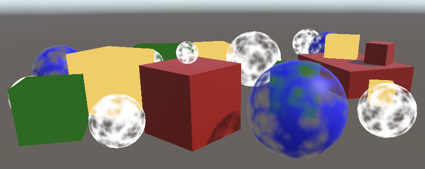

<p align=center><font color=#B8B8B8 ><i>Test scene.</i></p>

### 1.2 Pipeline Asset

目前，Unity使用默认还都是默认渲染管线。如果要用自定义渲染管线替换它的话，首必须为它创建一个资产类型。我们将使用与Universal RP大致相同的文件夹结构，在Run time子文件夹创建自定义RP资产文件夹。放置一个新的C#脚本命名为CustomRenderPiineAsset作为它的类型。


<p align=center><font color=#B8B8B8 ><i>Folder structure.</i></p>

资产类型必须继承在UnityEngine.Rendering命名空间下的RenderPipelineAsset。

```cs
using UnityEngine;
using UnityEngine.Rendering;

public class CustomRenderPipelineAsset : RenderPipelineAsset {}
```

RP资产的主要目的是提供一种方法来获取负责渲染的管线的对象实例。资产本身只是一个句柄和存储设置的地方。我们还没有进行任何设置，所以所要做的就是给Unity一个获得管线对象实例的方法。通过重写抽象方法CreatePipeline方法来完成，该方法需要返回RenderPipeline实例。但是因为我们还没有定义自定义RP类型，所以先返回NULL。

CreatePipeline管线方法是用protected 的访问修饰符定义的，这意味着只有定义方法的类(即RenderPipelineAsset)和从它继承的类才能访问它。

```cs
	protected override RenderPipeline CreatePipeline () {
		return null;
	}
```

现在，需要在我们的项目中添加这个类型的资产。要做到这一点，需要向CustomRenderPipelineAsset添加一个CreateAssetMenu属性。

```cs
[CreateAssetMenu]
public class CustomRenderPipelineAsset : RenderPipelineAsset { … }
```

这会在Asset/Create菜单中添加一个菜单条目。如果需要保持菜单整洁，并将其放在呈现的子菜单中的话，我可以将属性的menuName属性设置为Rendering/Custom Render Pipeline。在属性类型之后，圆括号内直接设置此属性。

```cs
[CreateAssetMenu(menuName = "Rendering/Custom Render Pipeline")]
public class CustomRenderPipelineAsset : RenderPipelineAsset { … }
```

使用新菜单项将资产添加到项目中，然后转到Graphics设置并在Scriptable Render Pipeline Settings下选择它。


<p align=center><font color=#B8B8B8 ><i>Custom RP selected.</i></p>

替换默认RP会改变一些事。首先是信息面板中提到了许多图形相关的设置选项。其次因为禁用了默认RP，并且还没有提供有效的替换，因此它不再呈现任何内容。游戏窗口，场景窗口和材质预览都不再起作用。如果你通过“Window/ Analysis / Frame Debugger”打开调试器并启动的话，你将看到在游戏窗口中确实没有绘制任何内容。

### 1.3 Render Pipeline Instance

创建CustomRenderPipeline类，并将其脚本文件放入与CustomRenderPipelineAsset相同的文件夹中。这将是我们的资产返回的RP实例所使用的类型，因此它必须从RenderPipeline继承。

```cs
using UnityEngine;
using UnityEngine.Rendering;

public class CustomRenderPipeline : RenderPipeline {}
```

RenderPipeline定义了一个受保护的抽象的Render方法，我们必须重写这个方法来创建一个具体的管线。它有两个参数：一个ScriptableRenderContext和一个Camera数组。暂时保持该方法为空。

```cs
	protected override void Render (
		ScriptableRenderContext context, Camera[] cameras
	) {}
```

**CustomRenderPipelineAsset** .CreatePipeline返回一个**CustomRenderPipeline** 新实例。他会给我们一个有效的，附带功能的管线实例，尽管它现在还没有提供任何功能。

```cs
	protected override RenderPipeline CreatePipeline () {
		return new CustomRenderPipeline();
	}
```

## 2. Rendering

每一帧Unity都会调用RP实例的Render方法。它传递一个上下文结构，该结构会提供到当前引擎的连接，我们可以使用它来进行渲染。它也需要传递一个相机的数组，因为可以有多个活动相机在当前场景。按照提供的摄像机顺序进行渲染是RP的责任。

### 2.1 Camera Renderer

每个相机的渲染都是独立的。因此，与其让__CustomRenderPipeline__ 渲染所有摄像机，倒不如把这个责任转发给一个专门用于渲染单个摄像机的新类。将其命名为CameraRenderer，并给它一个带有上下文和照相机参数的公开的Public方法。为了方便起见，让我们将这些参数存储在字段中。

```cs
using UnityEngine;
using UnityEngine.Rendering;

public class CameraRenderer {

	ScriptableRenderContext context;

	Camera camera;

	public void Render (ScriptableRenderContext context, Camera camera) {
		this.context = context;
		this.camera = camera;
	}
}
```

让CustomRenderPipeline在初始化的时候，创建一个CameraRenderer实例，然后使用它在一个循环中渲染所有相机。

```cs
	CameraRenderer renderer = new CameraRenderer();

	protected override void Render (ScriptableRenderContext context, Camera[] cameras) {
		foreach (Camera camera in cameras) {
			renderer.Render(context, camera);
		}
	}
```

camera renderer 大致相当于通用RP的scriptable renderer。这种方法能让每个相机在未来更容易支持不同的渲染方法。例如一个渲染第一人称视图，一个渲染三维地图，或前向和延迟渲染的区别。但现在我们会用同样的方式渲染所有的摄像机。

### 2.2 Drawing the Skybox

CameraRenderer.Render的工作是绘制相机所能看到的所有几何图形。为了清晰起见，在一个单独的DrawVisibleGeometry方法中隔离这个特定的工作任务。第一步先让它绘制默认的Skybox，这可以通过使用摄像机作为参数在上下文中调用DrawSkybox来完成。

```cs
	public void Render (ScriptableRenderContext context, Camera camera) {
		this.context = context;
		this.camera = camera;

		DrawVisibleGeometry();
	}

	void DrawVisibleGeometry () {
		context.DrawSkybox(camera);
	}
```

仅仅这样并没有使天空盒渲染出来。这是因为我们向上下文发出的命令都是缓冲的。必须通过在上下文上调用Submit来提交排队的工作才会执行。再写一个单独的Submit方法，该方法在DrawVisibleGeometry学之后调用。

```cs
	public void Render (ScriptableRenderContext context, Camera camera) {
		this.context = context;
		this.camera = camera;

		DrawVisibleGeometry();
		Submit();
	}

	void Submit () {
		context.Submit();
	}
```

天空盒现在出现在游戏窗口和场景窗口中了。启用提交之后时，还可以在frame debugger中看到它的相关信息。在调试器中它被列为Camera.RenderSkybox条目，它下面有一个Draw Mesh项，表示实际的Draw Call。它是与游戏窗口的呈现相对应（frame debugger不会报告在其他窗口中绘制）。


<p align=center><font color=#B8B8B8 ><i>Skybox gets drawn.</i></p>

注意，相机的方向目前并不会影响天窗盒的渲染方式。虽然已经将相机传递给了DrawSkybox，但这只用于确定是否应该绘制天空盒，这是通过摄像机的clear标志来控制的。

为了正确渲染天空盒以及整个场景，我们必须设置视图投影矩阵。此转换矩阵将摄像机的位置和方向（视图矩阵）与摄像机的透视或正投影（投影矩阵）结合在一起。在着色器中称为unity_MatrixVP，这是绘制几何图形时使用的着色器属性之一。选择一个Draw Call后，可以在帧调试器的ShaderProperties部分中检查此矩阵。

目前来说，unity_MatrixVP矩阵始终相同。我们必须通过SetupCameraProperties方法将摄像机的属性应用于上下文。这会设置矩阵以及其他一些属性。在DrawVisibleGeometry之前，创建单独的Setup方法并调用，需要执行此操作。

```cs
	public void Render (ScriptableRenderContext context, Camera camera) {
		this.context = context;
		this.camera = camera;

		Setup();
		DrawVisibleGeometry();
		Submit();
	}

	void Setup () {
		context.SetupCameraProperties(camera);
	}
```


<p align=center><font color=#B8B8B8 ><i>Skybox, correctly aligned.</i></p>

### 2.3 Command Buffers

上下文会延迟实际的渲染，直到我们提交它为止。在此之前，我们对其进行配置并向其添加命令以供后续的执行。某些任务（例如绘制天空盒）提供了专属方法，但其他命令则必须通过单独的命令缓冲区（command buffer）间接执行。我们需要用这样的缓冲区来绘制场景中的其他几何图形。

为了获得缓冲区，我们必须创建一个新的CommandBuffer对象实例。一般只需要一个缓冲区，因此默认情况下为CameraRenderer创建一个缓冲区，并将对它的引用存储在字段中。给缓冲区起一个名字，以便我们在frame debugger中识别它。就叫Render Camera好了。

```cs
	const string bufferName = "Render Camera";

	CommandBuffer buffer = new CommandBuffer {
		name = bufferName
	};
```

> 对象初始化器语法是如何工作的？
> 就好像我们写了 buffer.name = bufferName; 作为调用构造函数后的单独语句。 但是在创建新对象时，您可以将代码块附加到构造函数的调用中。 然后，您可以在块中设置对象的字段和属性，而无需显式引用对象实例。 它明确指出，只有在设置了这些字段和属性之后才能使用实例。 除此之外，它还可以在只允许单个语句的情况下进行初始化——例如我们在这里使用的字段初始化——而不需要具有许多参数变体的构造函数。
>
> 请注意，我们省略了构造函数调用的空参数列表，这在使用对象初始化器语法时是允许的。

我们可以使用命令缓冲区注入给Profiler注入样本，这些样本将同时显示在Profiler和帧调试器中。通过在适当的位置插入BeginSample和EndSample就可以完成。在本例中，在Setup和Submit的开头添加。注意两个方法必须提供相同的样本名称，为此我们直接使用缓冲区的名称。

```cs
	void Setup () {
		buffer.BeginSample(bufferName);
		context.SetupCameraProperties(camera);
	}

	void Submit () {
		buffer.EndSample(bufferName);
		context.Submit();
	}
```

要执行缓冲区，需以缓冲区为参数在上下文上调用ExecuteCommandBuffer。这会从缓冲区复制命令但并不会清除它，如果要重用它的话，就必须在之后明确地执行该操作。因为执行和清除总是一起完成的，所以添加同时执行这两种方法的方法很方便。

```cs
	void Setup () {
		buffer.BeginSample(bufferName);
		ExecuteBuffer();
		context.SetupCameraProperties(camera);
	}

	void Submit () {
		buffer.EndSample(bufferName);
		ExecuteBuffer();
		context.Submit();
	}

	void ExecuteBuffer () {
		context.ExecuteCommandBuffer(buffer);
		buffer.Clear();
	}
```

现在Camera.RenderSkyBox的样本将会出现在Render Camera下面。

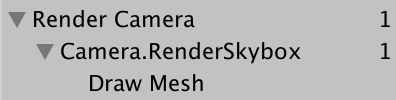

<p align=center><font color=#B8B8B8 ><i>Render camera sample.</i></p>

### 2.4 Clearing the Render Target

无论我们画了什么，最终都会被渲染到摄像机的渲染目标上，默认情况下，是帧缓冲区，但也可能是渲染纹理。但是所有之前已经画过的东西仍然存在，这可能会干扰现在渲染的图像。为了保证正确的渲染，我们必须清除渲染目标，以消除其旧的内容。通过调用命令缓冲区上的ClearRenderTarget来完成的，它应该属于Setup方法。

ClearRenderTarget至少需要三个参数。前两个指示是否应该清除深度和颜色数据，这对两者都应该是true。第三个参数是用于清除的颜色，我们将对其使用Color.clear。

```cs
	void Setup () {
		buffer.BeginSample(bufferName);
		buffer.ClearRenderTarget(true, true, Color.clear);
		ExecuteBuffer();
		context.SetupCameraProperties(camera);
	}
```


<p align=center><font color=#B8B8B8 ><i>Clearing, with nested sample.</i></p>

帧调试器现在显示一个用于清除操作的 Draw GL 条目，该条目嵌套在 Render Camera 的附加级别中。 发生这种情况是因为 ClearRenderTarget 将清除包装在带有命令缓冲区名称的样本中。 我们可以在开始我们自己的采样之前清除多余的嵌套。 这会导致两个相邻的 Render Camera 示例范围合并。

```cs
	void Setup () {
		buffer.ClearRenderTarget(true, true, Color.clear);
		buffer.BeginSample(bufferName);
		//buffer.ClearRenderTarget(true, true, Color.clear);
		ExecuteBuffer();
		context.SetupCameraProperties(camera);
	}
```


<p align=center><font color=#B8B8B8 ><i>Clearing, without nesting.</i></p>

Draw GL 条目表示使用写入渲染目标的 Hidden/InternalClear 着色器绘制全屏四边形，这不是清除它的最有效方法。 使用这种方法是因为我们在设置相机属性之前要进行清除。 如果我们交换这两个步骤的顺序，我们可以快速清除。

```cs
	void Setup () {
		context.SetupCameraProperties(camera);
		buffer.ClearRenderTarget(true, true, Color.clear);
		buffer.BeginSample(bufferName);
		ExecuteBuffer();
		//context.SetupCameraProperties(camera);
	}
```


<p align=center><font color=#B8B8B8 ><i>Correct clearing.</i></p>

现在我们看到 Clear (color+Z+stencil)，这表明颜色和深度缓冲区都被清除了。 Z 表示深度缓冲区，模板数据是同一缓冲区的一部分。

### 2.5 Culling

我们目前看到的是天空盒，但没有看到我们放置在场景中的任何物体。 我们不会绘制每个对象，而是只渲染那些对相机可见的对象。 我们首先从场景中具有渲染器组件的所有对象开始，然后剔除那些落在相机视锥体之外的对象。

找出什么可以被剔除需要我们跟踪多个相机设置和矩阵，可以使用ScriptableCullingParameters结构。这个结构可以在摄像机上调用TryGetCullingParameters，而不是自己去填充它。它返回是否可以成功检索该参数，因为它可能会获取失败。要获得参数数据，我们必须将其作为输出(out)参数提供，方法是在它前面写一个out。在返回成功或失败的单独的Cull方法中执行此操作。

```cs
	bool Cull () {
		ScriptableCullingParameters p
		if (camera.TryGetCullingParameters(out p)) {
			return true;
		}
		return false;
	}
```

> Why do we have to write `**out**`?
>
> 当struct参数被定义为输出参数时，它的作用就像一个对象引用，指向参数所在的内存堆栈上的位置。
>
> Out关键字告诉我们，该方法负责正确设置参数，替换以前的值。
> Try-get方法是表示成功或失败并产生结果的常见方法。

当用作输出参数时，可以在参数列表中内联变量声明，看看写法。

```cs
	bool Cull () {
		//ScriptableCullingParameters p
		if (camera.TryGetCullingParameters(out ScriptableCullingParameters p)) {
			return true;
		}
		return false;
	}
```

在“Render”中的“Setup”之前调用Cull，如果失败则中止。

```cs
	public void Render (ScriptableRenderContext context, Camera camera) {
		this.context = context;
		this.camera = camera;

		if (!Cull()) {
			return;
		}

		Setup();
		DrawVisibleGeometry();
		Submit();
	}
```

实际的裁剪是通过调用上下文上的Cull来完成的，这会产生一个CullingResults结构。如果成功的话，可以在清除中执行此操作，并将结果存储在字段中。在这种情况下，我们必须将剔除参数作为引用参数传递，方法是在前面写ref。

```cs
	CullingResults cullingResults;

	…
	
	bool Cull () {
		if (camera.TryGetCullingParameters(out ScriptableCullingParameters p)) {
			cullingResults = context.Cull(ref p);
			return true;
		}
		return false;
	}
```

> 为什么需要用ref?
> ref关键字的工作方式与out一样，只不过该方法不需要为其分配新的东西。调用该方法的人首先要负责正确初始化该值。因此，它可以用于输入，也可以选择用于输出。
> 在本例中，ref用作优化项，以防止传递ScriptableCullingParameters结构的副本，因为该结构相当大。

### 2.6 Drawing Geometry

一旦我们知道什么是可见的，我们就可以继续渲染它们。这是通过调用上下文中的DrawRenderers作为参数来实现的，并告诉它要使用哪个renderers 。此外，我们还必须提供绘图设置和筛选设置。这两种都是结构体DrawingSettings和FilteringSettings
我们将首先使用它们的默认构造函数。两者都必须以引用的方式传递。在绘制天空盒之前，调用DrawVisibleGeometry。

```cs
	void DrawVisibleGeometry () {
		var drawingSettings = new DrawingSettings();
		var filteringSettings = new FilteringSettings();

		context.DrawRenderers(
			cullingResults, ref drawingSettings, ref filteringSettings
		);

		context.DrawSkybox(camera);
	}
```

我们还是没有看到任何东西，因为我们还必须指出使用哪种shader pass。因为在本教程中我们只支持unlit 的着色器，所以我们必须获取SRPDefaultUnlitPass的着色器标签ID，可以新建一次，并将它缓存在一个静态字段中。

```cs
	static ShaderTagId unlitShaderTagId = new ShaderTagId("SRPDefaultUnlit");
```

提供它作为DrawinSettings构造函数的第一个参数，以及一个新的SortingSettings结构值。将相机传递给SortingSettings的构造函数，它用于确定基于正焦还是基于透视的应用排序。

```cs
	void DrawVisibleGeometry () {
		var sortingSettings = new SortingSettings(camera);
		var drawingSettings = new DrawingSettings(
			unlitShaderTagId, sortingSettings
		);
		…
	}
```

此外，还必须指出哪些 render 队列是允许的。将RenderQueueRange.all传递给FilteringSettings构造函数，这样就能包含所有内容。

```cs
var filteringSettings = new FilteringSettings(RenderQueueRange.all);
```


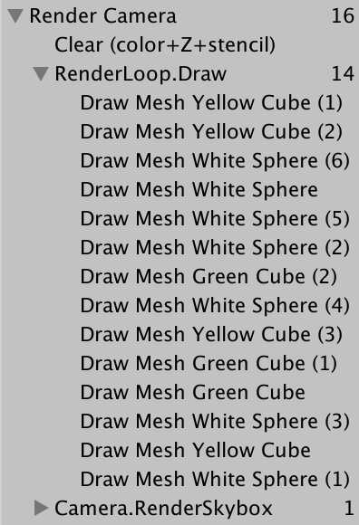


<p align=center><font color=#B8B8B8 ><i>Drawing unlit geometry.</i></p>

只绘制使用不受光着色器的可见对象。所有的Draw Call都列在帧调试器中，RenderLoop.Draw分组之下。透明对象显然有一些奇怪，我们可以先看看对象的绘制顺序。帧调试器会显示这个顺序，你只要逐个选择或使用箭头键来查看DrawCall就可以了。

<video width="320" height="240" controls>
    <source src="BothAnyIndianskimmer-mobile.mp4" type="video/mp4">
</video>

<p align=center><font color=#B8B8B8 ><i>Stepping through the frame debugger.</i></p>

绘制顺序是杂乱无章的。我们可以通过设置排序设置的条件属性来强制特定的绘制顺序。用SortingCriteria.CommonOpaque试试。

```cs
		var sortingSettings = new SortingSettings(camera) {
			criteria = SortingCriteria.CommonOpaque
		};
```

<video width="320" height="240" controls>
    <source src="RawImpishAlpinegoat-mobile.mp4" type="video/mp4">
</video>

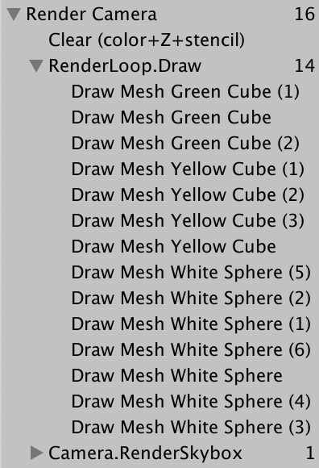

<p align=center><font color=#B8B8B8 ><i>Common opaque sorting.</i></p>

对象现在或多或少地从前到后绘制，这是不透明对象的理想选择。 如果某些东西最终被绘制在其他东西后面，则可以跳过其隐藏的片段，从而加快渲染速度。 常见的不透明排序选项还考虑了一些其他标准，包括渲染队列和材质。

### 2.7 Drawing Opaque and Transparent Geometry Separately

帧调试器向我们展示了透明对象被绘制出来，但是天空盒被绘制在所有没有出现在不透明对象前面的东西上。 天空盒在不透明几何体之后绘制，因此可以跳过所有隐藏的片段，但它会覆盖透明几何体。 发生这种情况是因为透明着色器不会写入深度缓冲区。 他们不会隐藏他们身后的任何东西，因为我们可以看穿他们。 解决方案是先绘制不透明物体，然后是天空盒，然后才是透明物体。

我们可以将透明对象从最初的DrawRenderers调用中删除，方法是切换到RenderQueueRange.opaque。

```cs
		var filteringSettings = new FilteringSettings(RenderQueueRange.opaque);
```

然后，在绘制Skybox之后，再次调用DrawRenderers。但在此之前，需要将渲染队列范围更改为RenderQueueRange.transparent。还将排序条件更改为
SortingCriteria.CommonTransparent，并再次设置绘图设置的排序。这将倒置透明对象的绘制顺序。

```cs
		context.DrawSkybox(camera);

		sortingSettings.criteria = SortingCriteria.CommonTransparent;
		drawingSettings.sortingSettings = sortingSettings;
		filteringSettings.renderQueueRange = RenderQueueRange.transparent;

		context.DrawRenderers(
			cullingResults, ref drawingSettings, ref filteringSettings
		);
```

<video width="320" height="240" controls>
    <source src="DisloyalRemarkableAvocet-mobile.mp4" type="video/mp4">
</video>


<p align=center><font color=#B8B8B8 ><i>Opaque, then skybox, then transparent.</i></p>

> 为什么绘制顺序倒置了？
> 由于透明对象不写入深度缓冲区，因此从前到后对它们进行排序没有性能优势。 但是，当透明对象最终在视觉上彼此交替时，它们必须从后到前绘制才能正确混合。
>
> 不幸的是，从后到前的排序并不能保证正确的混合，因为排序是针对每个对象的，并且仅基于对象的位置。 相交的大型透明对象仍会产生不正确的结果。 这有时可以通过将几何体切割成更小的部分来解决。

## 3. Editor Rendering

自定义的RP正确地绘制了Unlit对象，但我们还可以做一些事情来改进在Unity编辑器中的使用。

### 3.1 Drawing Legacy Shaders

因为我们的管线只支持Unlit的着色器通过，所以使用不同Pass渲染的对象便不会呈现，因此它们是不可见的。虽然结果正确的，但它也帮助隐瞒了问题，如果物体在场景里使用错误的着色器的话。我们应该把它们呈现出来，但要分开处理。

如果有人从默认的 Unity 项目开始，然后切换到我们的 RP，那么他们的场景中可能会有带有错误着色器的对象。 为了覆盖所有 Unity 的默认着色器，我们必须为 Always、ForwardBase、PrepassBase、Vertex、VertexLMRGBM 和 VertexLM 通道使用着色器标签 ID。 在静态数组中跟踪这些。

```cs
	static ShaderTagId[] legacyShaderTagIds = {
		new ShaderTagId("Always"),
		new ShaderTagId("ForwardBase"),
		new ShaderTagId("PrepassBase"),
		new ShaderTagId("Vertex"),
		new ShaderTagId("VertexLMRGBM"),
		new ShaderTagId("VertexLM")
	};
```

在可见几何体之后以单独的方法绘制所有不受支持的着色器，仅从第一遍开始。 由于这些是无效的通行证，结果无论如何都是错误的，所以我们不关心其他设置。 我们可以通过 FilteringSettings.defaultValue 属性获取默认过滤设置。

```cs
	public void Render (ScriptableRenderContext context, Camera camera) {
		…

		Setup();
		DrawVisibleGeometry();
		DrawUnsupportedShaders();
		Submit();
	}

	…

	void DrawUnsupportedShaders () {
		var drawingSettings = new DrawingSettings(
			legacyShaderTagIds[0], new SortingSettings(camera)
		);
		var filteringSettings = FilteringSettings.defaultValue;
		context.DrawRenderers(
			cullingResults, ref drawingSettings, ref filteringSettings
		);
	}
```

我们可以通过在绘图设置上调用 SetShaderPassName 来绘制多个通道，并将绘制顺序索引和标记作为参数。 对数组中的所有通道执行此操作，从第二个通道开始，因为我们在构建绘图设置时已经设置了第一个通道。

```cs
		var drawingSettings = new DrawingSettings(
			legacyShaderTagIds[0], new SortingSettings(camera)
		);
		for (int i = 1; i < legacyShaderTagIds.Length; i++) {
			drawingSettings.SetShaderPassName(i, legacyShaderTagIds[i]);
		}
```


<p align=center><font color=#B8B8B8 ><i>Standard shader renders black.</i></p>

使用标准着色器渲染的对象出现了，但它们现在是纯黑色的，因为我们的 RP 没有为它们设置所需的着色器属性。

### 3.2 Error Material

为了清楚地表明哪些对象使用了不受支持的着色器，我们将使用 Unity 的错误着色器来绘制它们。 使用该着色器作为参数构造一个新材质，我们可以通过调用 Shader.Find 并将 Hidden/InternalErrorShader 字符串作为参数来找到它。 通过静态字段缓存材质，因此我们不会每帧创建一个新的。 然后将其分配给绘图设置的 overrideMaterial 属性。

```cs
	static Material errorMaterial;

	…

	void DrawUnsupportedShaders () {
		if (errorMaterial == null) {
			errorMaterial =
				new Material(Shader.Find("Hidden/InternalErrorShader"));
		}
		var drawingSettings = new DrawingSettings(
			legacyShaderTagIds[0], new SortingSettings(camera)
		) {
			overrideMaterial = errorMaterial
		};
		…
	}
```

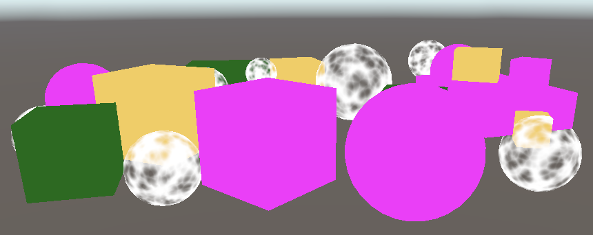

<p align=center><font color=#B8B8B8 ><i>Rendered with magenta error shader.</i></p>

现在所有不支持的物体都可见，并且展示为错误的了。

### 3.3 Partial Class

绘制无效对象对开发很有用，但不适用于已发布的应用程序。 因此，让我们将 CameraRenderer 的所有仅编辑器代码放在一个单独的部分类文件中。 首先复制原始的 CameraRenderer 脚本资源并将其重命名为 CameraRenderer.Editor。


<p align=center><font color=#B8B8B8 ><i>One class, two script assets.</i></p>

然后将原始CameraRenderer转换为一个局部类类，并从其中移除标记数组、错误材料和DrawUnSupporttedShaders方法。

```cs
public partial class CameraRenderer { … }
```

> 什么是局部类？
> 这是一种将类或结构定义拆分为多个部分的方法，分别存储在不同的文件中，它唯一的目的就是组织代码。典型的用例是将自动生成的代码与手工编写的代码分开。就编译器而言，它都是同一个类定义的一部分。它们在 **对象管理** ， **更复杂的关卡** 教程中引入的。

清理另一个局部类文件，以便它只包含我们从另一个类中删除的内容。

```cs
using UnityEngine;
using UnityEngine.Rendering;

partial class CameraRenderer {

	static ShaderTagId[] legacyShaderTagIds = {	… };

	static Material errorMaterial;

	void DrawUnsupportedShaders () { … }
}
```

编辑器部分的内容只需要存在于编辑器中，因此以UnityEditor为条件。

```cs
partial class CameraRenderer {

#if UNITY_EDITOR

	static ShaderTagId[] legacyShaderTagIds = { … }
	};

	static Material errorMaterial;

	void DrawUnsupportedShaders () { … }

#endif
}
```

但是，此时进行构建将失败，因为另一部分总是包含对DrawUnsupportedShaders的调用，该调用现在只应该存在于编辑器中。为了解决这一问题，对该方法也进行局部定义。为此，我们总是在方法的前面声明部分加partial，类似于抽象的方法声明。其实可以在类定义的任何部分这样做，所以让我们把它放在编辑器部分。完整的方法声明也必须标记为partial。

```cs
	partial void DrawUnsupportedShaders ();

#if UNITY_EDITOR

	…

	partial void DrawUnsupportedShaders () { … }

#endif
```

构建的编译现在可以成功了。编译器将剔除所有未以完整声明结束的分部方法的调用。

> 我们能让无效的对象出现在development 构建中吗？
> 当然，你可以将条件编译建立在
> UNITY_EDITOR||DEVELOPMENT_BUILD基础上。那么DrawUnsupportedShaders也存在于development 构建中，不存在于release 版构建中。但本系列教程会始终限制与编辑器相关的所有开发。

### 3.4 Drawing Gizmos

目前，我们的RP没有绘制Gizmos，无论是在场景窗口或是游戏窗口都没有。


<p align=center><font color=#B8B8B8 ><i>Scene without gizmos.</i></p>

我们可以通过调用UnityEditor.Handles.ShouldRenderGizmos来检查是否应该绘制gizmos。如果是这样的话，就必须在上下文中调用DrawGizmos作为参数，再加上第二个参数来指示应该绘制哪个gizmo子集。有两个子集，用于图像效果的前和后。由于此时我们不支持图像效果，所以我们将同时调用这两种效果。在一个只使用DrawGizmos编辑器的新方法中写逻辑。

```cs
using UnityEditor;
using UnityEngine;
using UnityEngine.Rendering;

partial class CameraRenderer {
	
	partial void DrawGizmos ();

	partial void DrawUnsupportedShaders ();

#if UNITY_EDITOR

	…

	partial void DrawGizmos () {
		if (Handles.ShouldRenderGizmos()) {
			context.DrawGizmos(camera, GizmoSubset.PreImageEffects);
			context.DrawGizmos(camera, GizmoSubset.PostImageEffects);
		}
	}

	partial void DrawUnsupportedShaders () { … }

#endif
}
```

这些gizmos应该在所有其他东西之后画出来。

```cs
	public void Render (ScriptableRenderContext context, Camera camera) {
		…

		Setup();
		DrawVisibleGeometry();
		DrawUnsupportedShaders();
		DrawGizmos();
		Submit();
	}
```


<p align=center><font color=#B8B8B8 ><i>Scene with gizmos.</i></p>

### 3.5 Drawing Unity UI

另一个需要我们关注的事情是Unity的游戏中的用户界面。例如，通过GameObject/UI/Button添加一个按钮来创建一个简单的UI。它会出现在游戏窗口中，但不会出现在场景窗口中。

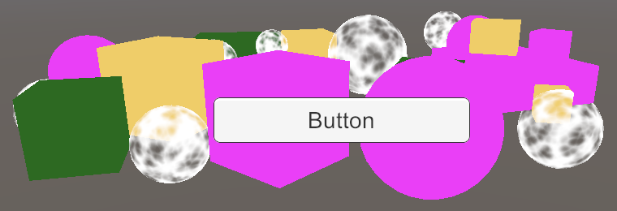

<p align=center><font color=#B8B8B8 ><i>UI button in game window.</i></p>

帧调试器向我们显示UI是单独呈现的，而不是由RP呈现的。


<p align=center><font color=#B8B8B8 ><i>UI in frame debugger.</i></p>

至少，当画布组件的 Render Mode 设置为 Screen Space - Overlay 时，这是默认设置。 将其更改为屏幕空间 - 相机并使用主相机作为其渲染相机将使其成为透明几何体的一部分。


<p align=center><font color=#B8B8B8 ><i>Screen-space-camera UI in frame debugger.</i></p>

UI 在场景窗口中渲染时总是使用世界空间模式，这就是为什么它通常会非常大。 但是虽然我们可以通过场景窗口编辑 UI，但它不会被绘制出来。


<p align=center><font color=#B8B8B8 ><i>UI invisible in scene window.</i></p>

在渲染场景窗口时，我们必须通过调用 ScriptableRenderContext.EmitWorldGeometryForSceneView 并将相机作为参数显式地将 UI 添加到世界几何体。 在仅编辑器的新 PrepareForSceneWindow 方法中执行此操作。 当其 cameraType 属性等于 CameraType.SceneView 时，我们使用场景相机进行渲染。

```CS
	partial void PrepareForSceneWindow ();

#if UNITY_EDITOR

	…

	partial void PrepareForSceneWindow () {
		if (camera.cameraType == CameraType.SceneView) {
			ScriptableRenderContext.EmitWorldGeometryForSceneView(camera);
		}
	}
```

因为这可能会给场景添加几何体，所以必须在裁剪之前完成。

```CS
		PrepareForSceneWindow();
		if (!Cull()) {
			return;
		}
```

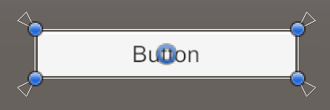

<p align=center><font color=#B8B8B8 ><i>UI visible in scene window.</i></p>

## 4. Multiple Cameras

场景上有可能同时存在多个激活的摄像机，我们需要保证它们之间都能正常渲染。

### 4.1 Two Cameras

每个摄像机都有一个深度值，默认主摄像机的深度值为−1。它们是按深度递增的顺序渲染的。要验证这个的话，可以复制主摄像机，将其重命名为Secondary Camera，并将其深度设置为0。最好给它设置另外一个tag，因为MainCamera标签应该只标记一台相机。

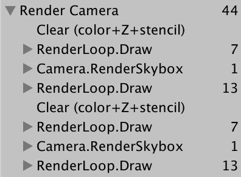

<p align=center><font color=#B8B8B8 ><i>Both cameras grouped in a single sample scope.</i></p>

这个场景现在被渲染了两次。而生成的图像仍然是相同的，因为渲染的目标在中间被清除过。帧调试器显示了这个记录，但是由于具有相同名称的相邻Sample作用域会被合并，所以我们最终只使用一个Render Camera作用域。

如果每个相机都有自己的镜头，那就更清楚了。为此，添加一个仅编辑器能用的PrepareBuffer方法，使缓冲区的名称与摄像机的名称相等。

```CS
	partial void PrepareBuffer ();

#if UNITY_EDITOR

	…
	
	partial void PrepareBuffer () {
		buffer.name = camera.name;
	}

#endif
```

在准备场景窗口之前调用它。

```CS
		PrepareBuffer();
		PrepareForSceneWindow();
```


<p align=center><font color=#B8B8B8 ><i>Separate samples per camera.</i></p>

### 4.2 Dealing with Changing Buffer Names

虽然帧调试器现在显示了每个摄像机的一个单独的样本层次结构，但当我们进入Play模式时，Unity的控制台将收到警告，BeginSample和EndSample计数必须匹配的消息。它被混淆弄糊涂了，因为我们对样本和它们的缓冲区之间使用了不同的名称。此外，每次访问相机的Name属性时，都会分配内存，这样会造成性能问题。

为了解决这两个问题，需要添加一个SampleName字符串属性。如果在编辑器中，就在PrepareBuffer中设置它以及缓冲区的名称，否则它只是赋值给相机字符串的常量别名。

```CS
#if UNITY_EDITOR

	…

	string SampleName { get; set; }
	
	…
	
	partial void PrepareBuffer () {
		buffer.name = SampleName = camera.name;
	}

#else

	const string SampleName = bufferName;

#endif
```

在Setup和Submit中对样本使用SampleName。

```CS
	void Setup () {
		context.SetupCameraProperties(camera);
		buffer.ClearRenderTarget(true, true, Color.clear);
		buffer.BeginSample(SampleName);
		ExecuteBuffer();
	}

	void Submit () {
		buffer.EndSample(SampleName);
		ExecuteBuffer();
		context.Submit();
	}
```

我们可以通过检查分析器（通过 Window / Analysis / Profiler 打开）并首先在编辑器中播放来查看差异。 切换到 Hierarchy 模式并按 GC Alloc 列排序。 您将看到两次调用 GC.Alloc 的条目，总共分配了 100 个字节，这是由检索相机名称引起的。 再往下，您会看到这些名称显示为示例：主摄像头和辅助摄像头。


<p align=center><font color=#B8B8B8 ><i>Profiler with separate samples and 100B allocations.</i></p>

接下来，在启用了“Development Build”和“Autoconnect Profiler”的情况下进行构建。运行并确保分析器已连接并开始录制。在这种情况下，我们没有看到100字节的分配，得到的是单一渲染相机样本。


<p align=center><font color=#B8B8B8 ><i>Profiling build.</i></p>

> 另外48个字节的分配是干什么的？
> 是我们无法控制的摄像机数组。它的大小取决于有多少摄像机被渲染。

通过将相机名称包装在一个名为Editor的分析器示例中，可以让示例只在编辑器中分配了内存，而不在在构建后分配内存。在本例中，我们需要从UnityEngine.Profiling命名空间调用Profiler.BeginSample和Profiler.EndSample。只有BeginSample需要传递名称。

```cs
using UnityEditor;
using UnityEngine;
using UnityEngine.Profiling;
using UnityEngine.Rendering;

partial class CameraRenderer {

	…
	
#if UNITY_EDITOR

	…

	partial void PrepareBuffer () {
		Profiler.BeginSample("Editor Only");
		buffer.name = SampleName = camera.name;
		Profiler.EndSample();
	}

#else

	string SampleName => bufferName;

#endif
}
```


<p align=center><font color=#B8B8B8 ><i>Editor-only allocations made obvious.</i></p>

### 4.3 Layers

通过调整他们的Culling Mask，相机也可以配置成只能看到某些层上的东西。想要实验这点的话，可以将使用标准着色器的所有对象移动到Ignore Raycast层。

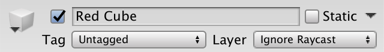

<p align=center><font color=#B8B8B8 ><i>Layer switched to Ignore Raycast.</i></p>

将这一层排除在主摄像机的culling mask之外。

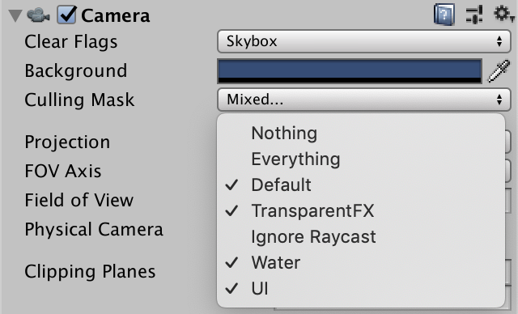

<p align=center><font color=#B8B8B8 ><i>Culling the Ignore Raycast layer.</i></p>

然后让二号位摄像机只看这个层。


<p align=center><font color=#B8B8B8 ><i>Culling everything but the Ignore Raycast layer.</i></p>

因为第二摄像机是后渲染的，所以我们暂时只能看到无效的对象。


<p align=center><font color=#B8B8B8 ><i>Only Ignore Raycast layer visible in game window.</i></p>

### 4.4 Clear Flags

通过调整第二个摄像机的清除标志，我们可以结合两个相机的渲染结果。它们是由
CameraClearFlags 枚举定义的，通过相机的“clearFlags”属性来获取和定义它。在Setup函数里，清除渲染目标前执行。

```cs
	void Setup () {
		context.SetupCameraProperties(camera);
		CameraClearFlags flags = camera.clearFlags;
		buffer.ClearRenderTarget(true, true, Color.clear);
		buffer.BeginSample(SampleName);
		ExecuteBuffer();
	}
```

CameraClearFlag枚举定义了四个值。从1到4，它们是Skybox，Color，Depth和Nothing。它实际上不是一个独立的标志值，但表示清除量递减。除最后一种情况外，其他情况都必须清除深度缓冲区，因此，标志值最多的设置是Depth。

```cs
		buffer.ClearRenderTarget(
			flags <= CameraClearFlags.Depth, true, Color.clear
		);
```

如果我们要清除一个不透明的颜色，就要使用到相机的背景色。但是因为我们是在线性颜色空间中绘制，所以我们必须把颜色转换到线性空间，所以我们最终需要camera.backgroundColor.linear。在所有其他情况下，颜色都不重要，所以使用Color.clear就足够了。

```cs
		buffer.ClearRenderTarget(
			flags <= CameraClearFlags.Depth,
			flags == CameraClearFlags.Color,
			flags == CameraClearFlags.Color ?
				camera.backgroundColor.linear : Color.clear
		);
```

因为主摄像机是第一个渲染的，它的Clear Flags 应该设置为Skybox或Color。当启用帧调试器的时候，一般是从一个Clear的缓冲区开始，但并不是绝对的。

二号位摄像机的Clear Flags将决定如何组合两个摄像机的渲染。对于skybox 或color 而言，之前的结果将完全替换。如果仅清除深度，则二号位摄影机将正常渲染，但不会绘制天空盒，因此之前的结果会显示为背景。当标志是nothing的时候，深度缓冲区将保留，因此unlit的对象最终将遮挡无效对象，就像它们是由同一台摄像机绘制的一样。但是，前一台摄像机绘制的透明对象因为没有深度信息，因此会像天空盒之前所展示的那样被绘制。

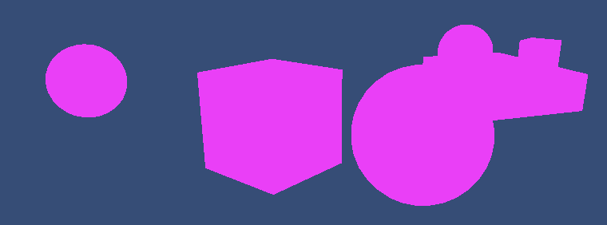

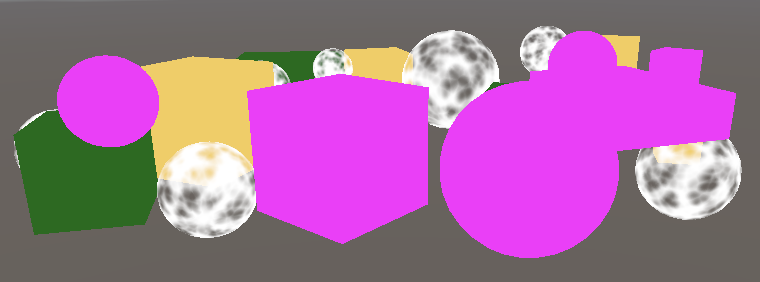

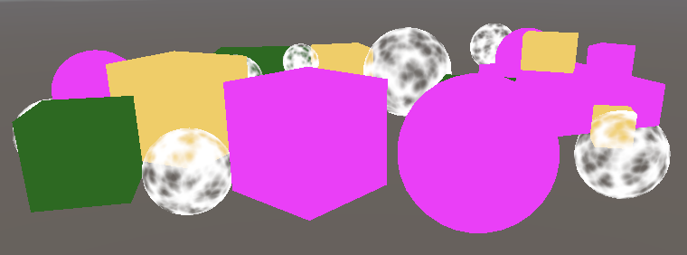

<p align=center><font color=#B8B8B8 ><i>Clear color, depth-only, and nothing.</i></p>

通过调整摄像机的视口，还可以将渲染区域缩小到整个渲染目标的一小部分。呈现目标的其余部分不受影响。在这种情况下，清除发生在Hidden/InternalClear着色器。模板缓冲区用于将渲染限制在视口区域。


<p align=center><font color=#B8B8B8 ><i>Reduced viewport of secondary camera, clearing color.</i></p>

请注意，每帧渲染一个以上的相机意味着裁剪、设置、排序等也必须多次完成。一般高效的做法是，只为每个独特的视角分配一台相机。