# **Directional Lights**

[原文地址](https://catlikecoding.com/unity/tutorials/custom-srp/directional-lights/)

## 1. Lighting

如果要创建一个更加真实的场景，我们就需要模拟光和物体表面的交互。这比我们之前制作的不受光的着色器要复杂的多。

### 1.1 Lit Shader

复制UnlitPass HLSL文件，并将其重命名为LitPass。调整包含保护的定义以及顶点和片段函数名称以匹配响应的修改，并在稍后添加光照计算。

```c
#ifndef CUSTOM_LIT_PASS_INCLUDED
#define CUSTOM_LIT_PASS_INCLUDED

…

Varyings LitPassVertex (Attributes input) { … }

float4 LitPassFragment (Varyings input) : SV_TARGET { … }

#endif
```

同时复制“Unlit ”着色器，并将其重命名为“Lit”。更改其菜单名称，包含的文件及其使用的功能。将默认颜色更改为灰色，因为在光线充足的场景中全白色的表面可能显得过于明亮。默认情况下，通用管道也使用灰色。

```c
Shader "Custom RP/Lit" {
	
	Properties {
		_BaseMap("Texture", 2D) = "white" {}
		_BaseColor("Color", Color) = (0.5, 0.5, 0.5, 1.0)
		…
	}

	SubShader {
		Pass {
			…
			#pragma vertex LitPassVertex
			#pragma fragment LitPassFragment
			#include "LitPass.hlsl"
			ENDHLSL
		}
	}
}
```

我们将使用一种自定义的光照方法，通过将着色器的照明模式设置为CustomLit来进行说明。向Pass里添加一个Tag块，其中包含“ LightMode” =“ CustomLit”。

```c
		Pass {
			Tags {
				"LightMode" = "CustomLit"
			}

			…
		}
```

要渲染使用此pass的对象，必须将其包含在CameraRenderer中。首先为其添加一个着色器标签标识符。

```c
	static ShaderTagId
		unlitShaderTagId = new ShaderTagId("SRPDefaultUnlit"),
		litShaderTagId = new ShaderTagId("CustomLit");
```

然后将其添加到要在DrawVisibleGeometry中渲染的过程中，就像在DrawUnsupportedShaders中所做的那样。

```c
		var drawingSettings = new DrawingSettings(
			unlitShaderTagId, sortingSettings
		) {
			enableDynamicBatching = useDynamicBatching,
			enableInstancing = useGPUInstancing
		};
		drawingSettings.SetShaderPassName(1, litShaderTagId);
```

现在，创建一个新的不透明材质，到现在为止，它产生的结果与unlit 材质还没有区别。

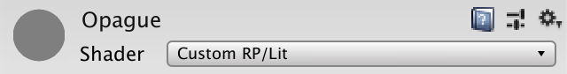

<p align=center><font color=#B8B8B8 ><i>Default opaque material.</i></p>

### 1.2 Normal Vectors

物体的光照程度取决于多个因素，比如灯光和表面之间的相对角度。要知道表面的方向，就需要访问表面的法线，该法线是一个单位长度的向量，指向远离它的方向。该向量是顶点数据的一部分，就像位置在对象空间中的定义一样。因此，将其添加到LitPass中的“Attributes”中。

```c
struct Attributes {
	float3 positionOS : POSITION;
	float3 normalOS : NORMAL;
	float2 baseUV : TEXCOORD0;
	UNITY_VERTEX_INPUT_INSTANCE_ID
};
```

光照是按每个片段计算的，因此我们也必须将法向矢量添加到Varyings中。因为是在世界空间中执行计算，因此将其命名为normalWS。

```c
struct Varyings {
	float4 positionCS : SV_POSITION;
	float3 normalWS : VAR_NORMAL;
	float2 baseUV : VAR_BASE_UV;
	UNITY_VERTEX_INPUT_INSTANCE_ID
};
```

我们可以使用SpaceTransforms中的TransformObjectToWorldNormal在LitPassVertex中将法线转换到世界空间。

```c
	output.positionWS = TransformObjectToWorld(input.positionOS);
	output.positionCS = TransformWorldToHClip(positionWS);
	output.normalWS = TransformObjectToWorldNormal(input.normalOS);
```

> TransformObjectToWorldNormal如何工作？
> 如果你去查看代码，你会看到它使用两种方法之一，基于是否定义了UNITY_ASSUME_UNIFORM_SCALING。
> 定义UNITY_ASSUME_UNIFORM_SCALING时，它将调用TransformObjectToWorldDir，该函数与TransformObjectToWorld相同，但它忽略平移部分，因为我们正在处理方向矢量而不是位置。但是矢量也会得到均匀缩放，因此应在之后进行归一化。
> 在另一种情况下，则不假定均匀缩放。这会更加复杂，因为当对象因不均匀缩放而变形时，法向矢量必须反向缩放以匹配新的表面方向。这需要与转置的UNITY_MATRIX_I_M矩阵相乘，再进行归一化。
>
> 
>
> <p align=center><font color=#B8B8B8 ><i>Incorrect and correct normal transformation.</i></p>
>
> 使用UNITY_ASSUME_UNIFORM_SCALING是一个轻微的优化，可以通过自己定义来启用。但是，在使用GPU实例化时，它的作用更大，因为必须将一组UNITY_MATRIX_I_M矩阵发送到GPU。在不需要时避免多余的计算是值得的。你可以通过向着色器添加**#pragma instancing_options assumeuniformscaling**指令来启用它，但仅在以专门以uniform scale为渲染对象时才这么做。

为了验证是否在LitPassFragment中获得正确的法线向量，我们可以将其用作颜色看看。

```c
	base.rgb = input.normalWS;
	return base;
```

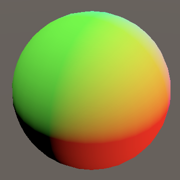

<p align=center><font color=#B8B8B8 ><i>World-space normal vectors.</i></p>

负值无法显示，因此将其限制为零。

### 1.3 Interpolated Normals

尽管法线向量在顶点程序中是单位长度的，但三角形的线性插值会影响它们的长度。 我们可以通过渲染 1 和向量长度之间的差异来可视化错误，将其放大 10 以使其更明显。

```c
	base.rgb = abs(length(input.normalWS) - 1.0) * 10.0;
```

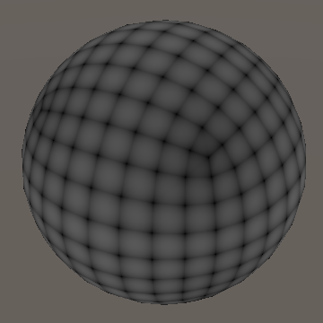

<p align=center><font color=#B8B8B8 ><i>Interpolated normal error, exaggerated.</i></p>

我们可以通过对 LitPassFragment 中的法线向量进行归一化来平滑插值失真。 仅查看法线向量时差异并不明显，但在用于光照时更为明显。

```c
	base.rgb = normalize(input.normalWS);
```

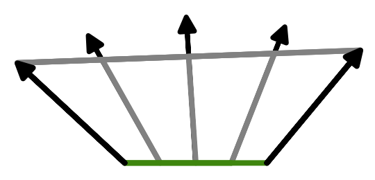

<p align=center><font color=#B8B8B8 ><i>Normalization after interpolation.</i></p>

### 1.4 Surface Properties

着色器中的光照是关于模拟照射到表面的光之间的相互作用，这意味着我们必须跟踪表面的属性。 现在我们有一个法线向量和一个基色。 我们可以将后者一分为二：RGB 颜色和 alpha 值。 我们将在几个地方使用这些数据，所以让我们定义一个方便的 Surface 结构来包含所有相关数据。 将其放在 ShaderLibrary 文件夹中的单独 Surface HLSL 文件中。

```c
#ifndef CUSTOM_SURFACE_INCLUDED
#define CUSTOM_SURFACE_INCLUDED

struct Surface {
	float3 normal;
	float3 color;
	float alpha;
};

#endif
```

>应该把normal定义为normalWS吗？
>可以，但是表面不在乎法线的定义空间。它可以在任何适当的3D空间中执行光照计算。因此，我们保留了定义的空间不填。填充数据时，我们仅需在各处使用相同的空间即可。现在使用的是世界空间，但是稍后我们可以切换到另一个空间，并且一切任然正常进行。

在Common之后，将其包含在LitPass中。这样，我们可以使LitPass简短。从现在开始，我们将专用代码放入其自己的HLSL文件中，以使查找相关功能更加容易。

```c
#include "../ShaderLibrary/Common.hlsl"
#include "../ShaderLibrary/Surface.hlsl"
```

在LitPassFragment中定义一个surface变量并填充它。然后，最终结果将成为表面的颜色和Alpha。

```c
	Surface surface;
	surface.normal = normalize(input.normalWS);
	surface.color = base.rgb;
	surface.alpha = base.a;

	return float4(surface.color, surface.alpha);
```

> 这种写法会有性能问题吗？
> 没关系，因为着色器编译器会生成高度优化的程序，从而完全重写我们的代码。该结构纯粹是为了我们阅读和理解的方便。你可以通过着色器检视面板中的“Compile and show code ”按钮来检查编译器的工作。

### 1.5 Calculating Lighting

为了计算实际的光照，我们将创建一个具有Surface参数的GetLighting函数。最初使它返回表面法线的Y分量。由于这是光照功能，因此我们将其放在单独的Lighting HLSL文件中。

```c
#ifndef CUSTOM_LIGHTING_INCLUDED
#define CUSTOM_LIGHTING_INCLUDED

float3 GetLighting (Surface surface) {
	return surface.normal.y;
}

#endif
```

在LitPass里包含它，然后包含Surface，因为计算光照需要依赖它。

```c
#include "../ShaderLibrary/Surface.hlsl"
#include "../ShaderLibrary/Lighting.hlsl"
```

> 为什么不把Surface直接写在Light里？
> 可以这么做，但最终我们会有多少个文件取决于它们依赖多少个文件。之所以我选择把它们分来是因为分离的文件比糅合在一起的更加清晰。这也能让我们更加轻松的通过替换带有相同函数的文件来修改着色器的功能修改。

现在，我们可以在LitPassFragment中获取光照并将其用于片段的RGB部分了。

```c
	float3 color = GetLighting(surface);
	return float4(color, surface.alpha);
```

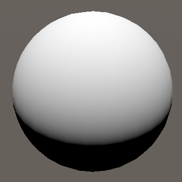

<p align=center><font color=#B8B8B8 ><i>Diffuse lighting from above.</i></p>

此时，结果是表面法线的 Y 分量，因此它在球体顶部为 1，在其两侧下降到零。在此之下，结果变为负数，在底部达到 -1，但我们看不到负值。它匹配法线向量和上向量之间角度的余弦值。忽略负面部分，这在视觉上匹配指向直下的定向光的漫射照明。最后一步是将表面颜色纳入结果中`GetLighting`，将其解释为表面反照率。

```c
float3 GetLighting (Surface surface) {
	return surface.normal.y * surface.color;
}
```

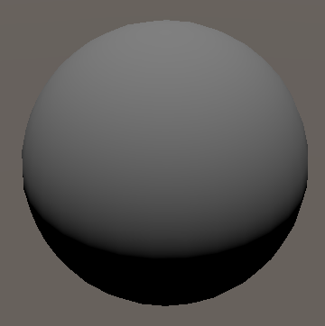

<p align=center><font color=#B8B8B8 ><i>Albedo applied.</i></p>

>反照率是什么意思？
>
>反照率在拉丁语中是白色的意思。它是衡量有多少光被表面漫反射的量度。如果反照率不是全白的，那么部分光能会被吸收而不是反射。

## 2. Lights

要执行适当的照明，我们还需要了解灯光的属性。在本教程中，我们将仅限于定向灯。定向光代表了一个距离很远的光源，它的位置无关紧要，只关心它的方向。这是一种简化，但足以模拟地球上的太阳光以及入射光或多或少是单向的其他情况。

### 2.1 Light Structure

我们将使用一个结构来存储光照数据。现在我们只要有颜色和方向就足够了。放在单独的*Light*HLSL 文件。还要定义一个`GetDirectionalLight`返回配置的定向光的函数。最初使用白色和向上向量，匹配我们当前使用的光照数据。请注意，光的方向因此被定义为光从哪里来的方向，而不是它去哪里。

```c
#ifndef CUSTOM_LIGHT_INCLUDED
#define CUSTOM_LIGHT_INCLUDED

struct Light {
	float3 color;
	float3 direction;
};

Light GetDirectionalLight () {
	Light light;
	light.color = 1.0;
	light.direction = float3(0.0, 1.0, 0.0);
	return light;
}

#endif
```

将文件包含在*LitPass*前*Lighting*.

```c
#include "../ShaderLibrary/Light.hlsl"
#include "../ShaderLibrary/Lighting.hlsl"
```

### 2.2 Lighting Functions

添加一个`IncomingLight`函数到*Lighting*计算给定表面和光的入射光量。对于任意光线方向，我们必须取表面法线和方向的点积。我们可以使用该`dot`功能。结果应该由光的颜色调制。

```c
float3 IncomingLight (Surface surface, Light light) {
	return dot(surface.normal, light.direction) * light.color;
}
```

>### 什么是点积？
>
>两个向量之间的点积在几何上定义为$A⋅B=||A|| ||B|| cosθ$。这意味着它是向量之间角度的余弦值乘以它们的长度。 所以在两个单位长度向量的情况下$A⋅B=cosθ$。
>
>在代数上，它被定义为$A⋅B=\sum_{i=1}^n A_iB_i=A_1B_1+A_2B_2+…+A_nB_n$。这意味着您可以通过将所有组件对相乘并将它们相加来计算它。
>
>```c
>float dotProduct = a.x * b.x + a.y * b.y + a.z * b.z;
>```
>
>从视觉上看，这个操作将一个向量直接投射到另一个向量上，就好像在它上面投下了阴影。 这样做，你最终得到一个直角三角形，其底边的长度是点积的结果。 如果两个向量都是单位长度，那就是它们角度的余弦值。
>
>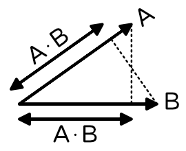
>
><p align=center><font color=#B8B8B8 ><i>Dot product.</i></p>

但这仅在表面朝向光线时才是正确的。当点积为负时，我们必须将其钳位为零，这可以通过`saturate`函数来完成。

```c
float3 IncomingLight (Surface surface, Light light) {
	return saturate(dot(surface.normal, light.direction)) * light.color;
}
```

>`saturate`做什么？
>
>它钳制该值，使其位于零和一之间。我们只需要指定一个最小值，因为点积永远不应大于一，但饱和度是一种常见的着色器操作，它通常是一个自由操作修改器。

添加另一个`GetLighting`函数，该函数返回表面和灯光的最终光照。现在它是入射光乘以表面颜色。在其他函数之上定义它。

```c
float3 GetLighting (Surface surface, Light light) {
	return IncomingLight(surface, light) * surface.color;
}
```

最后，调整`GetLighting`只有表面参数的函数，使其调用另一个函数，`GetDirectionalLight`用于提供光照数据。

```c
float3 GetLighting (Surface surface) {
	return GetLighting(surface, GetDirectionalLight());
}
```

### 2.3 Sending Light Data to the GPU

我们应该使用当前场景的光，而不是总是使用来自上方的白光。默认场景带有代表太阳的定向光，颜色略带黄色 - FFF4D6 十六进制 - 围绕 X 轴旋转 50°，围绕 Y 轴旋转 -30°。如果不存在这样的灯，请创建一个。

为了使光照数据在着色器中可访问，我们必须为其创建 uniform 值，就像着色器属性一样。在这种情况下，我们将定义两个**`float3`**向量：`_DirectionalLightColor`和`_DirectionalLightDirection`。将它们放在`_CustomLight`定义在顶部的缓冲区中*Light*.

```c
CBUFFER_START(_CustomLight)
	float3 _DirectionalLightColor;
	float3 _DirectionalLightDirection;
CBUFFER_END
```

使用这些值代替`GetDirectionalLight`.

```c
Light GetDirectionalLight () {
	Light light;
	light.color = _DirectionalLightColor;
	light.direction = _DirectionalLightDirection;
	return light;
}
```

现在我们的 RP 必须将光照数据发送到 GPU。我们将为此创建一个新**`Lighting`**类。它的工作原理类似于**`CameraRenderer`**但是用于灯光。给它一个`Setup`带有上下文参数的公共方法，它在其中调用一个单独的`SetupDirectionalLight`方法。虽然不是绝对必要的，但让我们也给它一个专用的命令缓冲区，我们在完成时执行它，这对于调试来说很方便。另一种方法是添加缓冲区参数。

```cs
using UnityEngine;
using UnityEngine.Rendering;

public class Lighting {

	const string bufferName = "Lighting";

	CommandBuffer buffer = new CommandBuffer {
		name = bufferName
	};
	
	public void Setup (ScriptableRenderContext context) {
		buffer.BeginSample(bufferName);
		SetupDirectionalLight();
		buffer.EndSample(bufferName);
		context.ExecuteCommandBuffer(buffer);
		buffer.Clear();
	}
	
	void SetupDirectionalLight () {}
}
```

跟踪两个着色器属性的标识符。

```cs
	static int
		dirLightColorId = Shader.PropertyToID("_DirectionalLightColor"),
		dirLightDirectionId = Shader.PropertyToID("_DirectionalLightDirection");
```

我们可以通过 访问场景的主光`RenderSettings.sun`。默认情况下，这为我们提供了最重要的定向光，它也可以通过显式配置*Window / Rendering / Lighting Settings*. 用于`CommandBuffer.SetGlobalVector`将光照数据发送到 GPU。颜色是光在线性空间中的颜色，而方向是光变换的前向向量取反。

> SetGlobalVector 不需要 Vector4? 
>
> 是的，发送到 GPU 的向量总是有四个分量，即使我们用较少分量定义它们。 额外的组件在着色器中被隐式屏蔽。 同样，也有从 Vector3 到 Vector4 的隐式转换，但不是在另一个方向上。

灯光的`color`属性是其配置的颜色，但灯光也有单独的强度因子。最终的颜色是都相乘。

```cs
		buffer.SetGlobalVector(
			dirLightColorId, light.color.linear * light.intensity
		);
```

在绘制可见几何体之前，提供**`CameraRenderer`**一个**`Lighting`**实例并使用它来设置照明。

```cs
	Lighting lighting = new Lighting();

	public void Render (
		ScriptableRenderContext context, Camera camera,
		bool useDynamicBatching, bool useGPUInstancing
	) {
		…

		Setup();
		lighting.Setup(context);
		DrawVisibleGeometry(useDynamicBatching, useGPUInstancing);
		DrawUnsupportedShaders();
		DrawGizmos();
		Submit();
	}
```

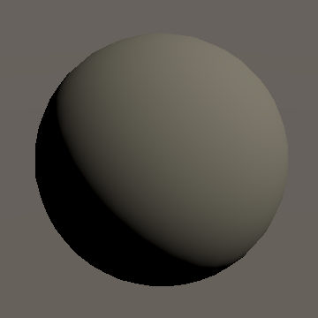

<p align=center><font color=#B8B8B8 ><i>Lit by the sun.</i></p>

### 2.4 Visible Lights

在剔除 Unity 时，还会计算出哪些灯光会影响摄像机可见的空间。我们可以依靠这些信息而不是全局sun。为此**`Lighting`**需要访问剔除结果，因此`Setup`为方便起见，为此添加一个参数并将其存储在一个字段中。那么我们就可以支持多盏灯了，所以`SetupDirectionalLight`用一个新的`SetupLights`方法来代替的调用。

```cs
	CullingResults cullingResults;

	public void Setup (
		ScriptableRenderContext context, CullingResults cullingResults
	) {
		this.cullingResults = cullingResults;
		buffer.BeginSample(bufferName);
		//SetupDirectionalLight();
		SetupLights();
		…
	}
	
	void SetupLights () {}
```

在 **`CameraRenderer.Render`** 中调用 Setup 时将 culling results 作为参数。

```c
		lighting.Setup(context, cullingResults);
```

现在**`Lighting.SetupLights`**可以通过剔除结果的`visibleLights`属性检索所需的数据。它用`VisibleLight`元素类型的`Unity.Collections.NativeArray`一起提供。

```cs
using Unity.Collections;
using UnityEngine;
using UnityEngine.Rendering;

public class Lighting {
	…

	void SetupLights () {
		NativeArray<VisibleLight> visibleLights = cullingResults.visibleLights;
	}

	…
}
```

> 什么是`NativeArray`？
>
> 它是一个类似于数组的结构，但提供与本机内存缓冲区的连接。它使在托管 C# 代码和本机 Unity 引擎代码之间有效共享数据成为可能。

### 2.5 Multiple Directional Lights

使用可见光数据可以支持多个定向光，但我们必须将所有这些光的数据发送到 GPU。因此，我们将使用两个数组，而不是一对向量`Vector4`，加上一个整数来表示光照计数。我们还将定义最大数量的定向光，我们可以使用它来初始化两个数组字段以缓冲数据。让我们将最大值设置为四个，这对于大多数场景来说应该足够了。

```cs
	const int maxDirLightCount = 4;

	static int
		//dirLightColorId = Shader.PropertyToID("_DirectionalLightColor"),
		//dirLightDirectionId = Shader.PropertyToID("_DirectionalLightDirection");
		dirLightCountId = Shader.PropertyToID("_DirectionalLightCount"),
		dirLightColorsId = Shader.PropertyToID("_DirectionalLightColors"),
		dirLightDirectionsId = Shader.PropertyToID("_DirectionalLightDirections");

	static Vector4[]
		dirLightColors = new Vector4[maxDirLightCount],
		dirLightDirections = new Vector4[maxDirLightCount];
```

> 为什么不使用结构化缓冲区？
>
> 这是可能的，但我不会，因为对结构化缓冲区的着色器支持还不够好。要么根本不支持它们，要么只在片段程序中，要么性能比常规数组差。好消息是数据在 CPU 和 GPU 之间传递的细节只在少数地方很重要，所以很容易改变。**`Light`**这是使用结构的另一个好处。

将索引和`VisibleLight`参数添加到`SetupDirectionalLight`. 让它使用提供的索引设置颜色和方向元素。在这种情况下，最终颜色是通过`VisibleLight.finalColor`属性提供的。前向向量可以通过`VisibleLight.localToWorldMatrix`属性找到。它是矩阵的第三列，必须再次取反。

```cs
	void SetupDirectionalLight (int index, VisibleLight visibleLight) {
		dirLightColors[index] = visibleLight.finalColor;
		dirLightDirections[index] = -visibleLight.localToWorldMatrix.GetColumn(2);
	}
```

最终颜色已经应用了灯光的强度，但默认情况下 Unity 不会将其转换为线性空间。我们必须设置`GraphicsSettings.lightsUseLinearIntensity`为**`true`**，我们可以在 的构造函数中执行一次**`CustomRenderPipeline`**。

```cs
	public CustomRenderPipeline (
		bool useDynamicBatching, bool useGPUInstancing, bool useSRPBatcher
	) {
		this.useDynamicBatching = useDynamicBatching;
		this.useGPUInstancing = useGPUInstancing;
		GraphicsSettings.useScriptableRenderPipelineBatching = useSRPBatcher;
		GraphicsSettings.lightsUseLinearIntensity = true;
	}
```

接下来，遍历所有可见光**`Lighting.SetupLights`**并为每个元素调用`SetupDirectionalLight`。然后在缓冲区上调用`SetGlobalInt`和`SetGlobalVectorArray`以将数据发送到 GPU。

```cs
		NativeArray<VisibleLight> visibleLights = cullingResults.visibleLights;
		for (int i = 0; i < visibleLights.Length; i++) {
			VisibleLight visibleLight = visibleLights[i];
			SetupDirectionalLight(i, visibleLight);
		}

		buffer.SetGlobalInt(dirLightCountId, visibleLights.Length);
		buffer.SetGlobalVectorArray(dirLightColorsId, dirLightColors);
		buffer.SetGlobalVectorArray(dirLightDirectionsId, dirLightDirections);
```

但是我们最多只支持四个方向灯，所以当我们达到最大值时我们应该中止循环。让我们跟踪与循环的迭代器分开的方向光索引。

```cs
		int dirLightCount = 0;
		for (int i = 0; i < visibleLights.Length; i++) {
			VisibleLight visibleLight = visibleLights[i];
			SetupDirectionalLight(dirLightCount++, visibleLight);
			if (dirLightCount >= maxDirLightCount) {
				break;
			}
		}

		buffer.SetGlobalInt(dirLightCountId, dirLightCount);
```

因为我们只支持定向光源，所以我们应该忽略其他光源类型。我们可以通过检查`lightType`可见光的属性是否等于 来做到这一点`LightType.Directional`。

```cs
			VisibleLight visibleLight = visibleLights[i];
			if (visibleLight.lightType == LightType.Directional) {
				SetupDirectionalLight(dirLightCount++, visibleLight);
				if (dirLightCount >= maxDirLightCount) {
					break;
				}
			}
```

这可行，但`VisibleLight`结构相当大。理想情况下，我们只从本机数组中检索一次，并且不要将其作为常规参数传递给`SetupDirectionalLight`，因为这会复制它。我们可以使用 Unity 用于该`ScriptableRenderContext.DrawRenderers`方法的相同技巧，即通过引用传递参数。

```cs
				SetupDirectionalLight(dirLightCount++, ref visibleLight);
```

这要求我们也将参数定义为参考。

```cs
	void SetupDirectionalLight (int index, ref VisibleLight visibleLight) { … }
```

### 2.6 Shader Loop

调整`_CustomLight`缓冲区*Light*所以它匹配我们的新数据格式。在这种情况下，我们将显式使用**`float4`**数组类型。数组在着色器中具有固定大小，无法调整大小。确保使用我们在**`Lighting`**中定义的相同最大值。

```cs
#define MAX_DIRECTIONAL_LIGHT_COUNT 4

CBUFFER_START(_CustomLight)
	//float4 _DirectionalLightColor;
	//float4 _DirectionalLightDirection;
	int _DirectionalLightCount;
	float4 _DirectionalLightColors[MAX_DIRECTIONAL_LIGHT_COUNT];
	float4 _DirectionalLightDirections[MAX_DIRECTIONAL_LIGHT_COUNT];
CBUFFER_END
```

添加一个函数来获取定向光计数并进行调整`GetDirectionalLight`，以便检索特定光索引的数据。

```c
int GetDirectionalLightCount () {
	return _DirectionalLightCount;
}

Light GetDirectionalLight (int index) {
	Light light;
	light.color = _DirectionalLightColors[index].rgb;
	light.direction = _DirectionalLightDirections[index].xyz;
	return light;
}
```

> **`rgb`**和有区别**`xyz`**吗？
>
> 它们是语义别名。Swizzling 使用**`rgba`**和**`xyzw`**是等价的。

然后调整`GetLight`一个表面，使其使用**`for`**循环来累积所有定向光的贡献。

```c
float3 GetLighting (Surface surface) {
	float3 color = 0.0;
	for (int i = 0; i < GetDirectionalLightCount(); i++) {
		color += GetLighting(surface, GetDirectionalLight(i));
	}
	return color;
}
```

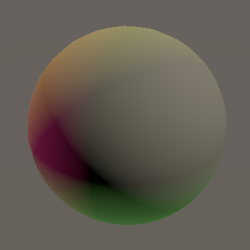

<p align=center><font color=#B8B8B8 ><i>Four directional lights.</i></p>

现在我们的着色器最多支持四个方向灯。通常只需要一个定向光来代表太阳或月亮，但也许在一个有多个太阳的行星上有一个场景。定向灯也可用于模拟多个大型灯光设备，例如大型体育场的灯光设备。

如果您的游戏始终只有一个定向光，那么您可以摆脱循环，或制作多个着色器变体。但是对于本教程，我们将保持简单并坚持使用单个通用循环。最好的性能总是通过剔除所有你不需要的东西来实现，尽管它并不总是有很大的不同。

### 2.7 Shader Target Level

可变长度的循环曾经是着色器的问题，但现代 GPU 可以毫无问题地处理它们，尤其是当绘制调用的所有片段以相同的方式迭代相同的数据时。但是，OpenGL ES 2.0 和 WebGL 1.0 图形 API 默认无法处理此类循环。我们可以通过合并一个硬编码的最大值来使其工作，例如通过`GetDirectionalLight`返回`min(_DirectionalLightCount, MAX_DIRECTIONAL_LIGHT_COUNT)`. 这使得展开循环成为可能，将其变成一系列条件代码块。不幸的是，生成的着色器代码是一团糟，性能下降很快。在非常老式的硬件上，所有代码块总是会被执行，它们的贡献通过条件赋值来控制。虽然我们可以完成这项工作，但它会使代码更加复杂，因为我们还必须进行其他调整。因此，为了简单起见，我选择忽略这些限制并在构建中关闭 WebGL 1.0 和 OpenGL ES 2.0 支持。无论如何，它们不支持线性照明。`#pragma target 3.5`我们还可以通过指令将着色器通道的目标级别提高到 3.5，从而避免为它们编译 OpenGL ES 2.0 着色器变体。让我们保持一致并为两个着色器执行此操作。

```c
			HLSLPROGRAM
			#pragma target 3.5
			…
			ENDHLSL
```

## 3 BRDF

我们目前正在使用一个非常简单的光照模型，仅适用于完美的漫反射表面。 通过应用双向反射率分布函数，简称BRDF，我们可以实现更加多样化和逼真的照明。 有很多这样的功能。 我们将使用与 Universal RP 相同的版本，它以一些真实感换取性能。

### 3.1 Incoming Light

当一束光正面撞击表面碎片时，其所有能量都会影响碎片。为简单起见，我们假设光束的宽度与片段的宽度相匹配。这是光线方向 $L$ 和表面法线 $N$ 对齐的情况，所以 $N*L=1$. 当它们没有对齐时，至少部分光束会错过表面碎片，因此影响碎片的能量较少。影响碎片的能量部分是 $N*L$。负面结果意味着表面的方向远离灯光，因此它不会受到它的影响。

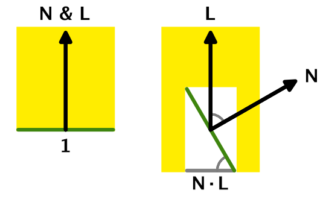

<p align=center><font color=#B8B8B8 ><i>Incoming light portion.</i></p>

### 3.2 Outgoing Light

我们看不到直接到达表面的光。我们只看到从表面反弹并到达相机或我们眼睛的部分。如果表面是一个完全平坦的镜子，那么光线会从它上面反射出来，出射角等于入射角。只有当相机与它对齐时，我们才会看到这种光。这称为镜面反射。这是对光交互的简化，但对于我们的目的来说已经足够了。

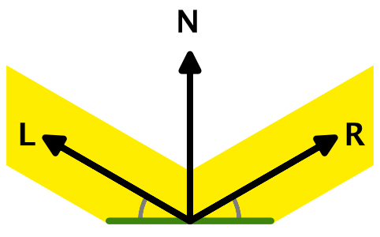

<p align=center><font color=#B8B8B8 ><i>Perfect specular reflection.</i></p>

但是如果表面不是完全平坦的，那么光线就会被散射，因为碎片实际上是由许多具有不同方向的较小碎片组成的。这将光束分成不同方向的较小光束，从而有效地模糊镜面反射。即使没有与完美的反射方向对齐，我们最终也会看到一些散射光。

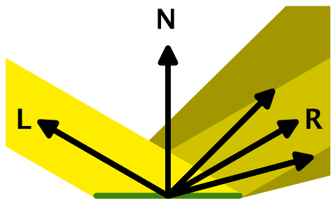

<p align=center><font color=#B8B8B8 ><i>Scattered specular reflection.</i></p>

除此之外，光线还可以穿透表面，在周围反射，并以不同的角度射出，以及其他我们不需要考虑的事情。极端情况下，我们最终得到了一个完美的漫反射表面，可以在所有可能的方向上均匀地散射光。这是我们当前在着色器中计算的光照。

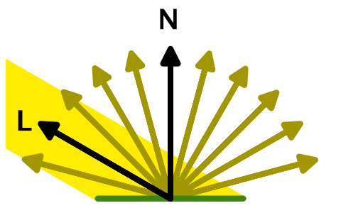

<p align=center><font color=#B8B8B8 ><i>Perfect diffuse reflection.</i></p>

无论相机在哪里，从表面接收到的漫射光量都是一样的。但这意味着我们观察到的光能远小于到达地表碎片的光能。这表明我们应该按某个因子缩放入射光。然而，因为这个因素总是相同的，我们可以把它烘焙成光的颜色和强度。因此，我们使用的最终光色表示当从正面照射的完美白色漫射表面片段反射时观察到的量。这只是实际发射的光总量的一小部分。还有其他配置灯光的方法，例如通过指定流明或勒克斯，这使得配置逼真的光源更容易，但我们将坚持当前的方法。

### 3.3 Surface Properties

表面可以是完全漫射的、完美的镜子，或者介于两者之间的任何东西。我们可以通过多种方式来控制它。我们将使用金属工作流程，这需要我们将两个表面属性添加到*Lit*着色器。

第一个属性是表面是金属的还是非金属的，也称为电介质。因为表面可以包含两者的混合，我们将为它添加一个 0-1 范围的滑块，其中 1 表示它是完全金属的。默认为全电介质。

第二个属性控制表面的光滑程度。我们还将为此使用 0–1 范围的滑块，0 表示非常粗糙，1 表示非常平滑。我们将使用 0.5 作为默认值。

```c
		_Metallic ("Metallic", Range(0, 1)) = 0
		_Smoothness ("Smoothness", Range(0, 1)) = 0.5
```

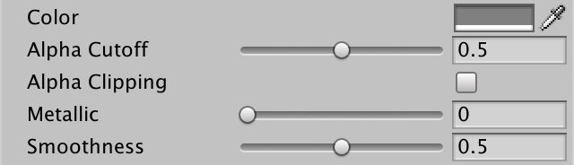

<p align=center><font color=#B8B8B8 ><i>Material with metallic and smoothness sliders.</i></p>

将属性添加到`UnityPerMaterial`缓冲区。

```c
UNITY_INSTANCING_BUFFER_START(UnityPerMaterial)
	UNITY_DEFINE_INSTANCED_PROP(float4, _BaseMap_ST)
	UNITY_DEFINE_INSTANCED_PROP(float4, _BaseColor)
	UNITY_DEFINE_INSTANCED_PROP(float, _Cutoff)
	UNITY_DEFINE_INSTANCED_PROP(float, _Metallic)
	UNITY_DEFINE_INSTANCED_PROP(float, _Smoothness)
UNITY_INSTANCING_BUFFER_END(UnityPerMaterial)
```

还有**`Surface`**结构。

```c
struct Surface {
	float3 normal;
	float3 color;
	float alpha;
	float metallic;
	float smoothness;
};
```

将它们复制到`LitPassFragment`.

```c
	Surface surface;
	surface.normal = normalize(input.normalWS);
	surface.color = base.rgb;
	surface.alpha = base.a;
	surface.metallic = UNITY_ACCESS_INSTANCED_PROP(UnityPerMaterial, _Metallic);
	surface.smoothness =
		UNITY_ACCESS_INSTANCED_PROP(UnityPerMaterial, _Smoothness);
```

并且还将对它们的支持添加到**`PerObjectMaterialProperties`**.

```c
	static int
		baseColorId = Shader.PropertyToID("_BaseColor"),
		cutoffId = Shader.PropertyToID("_Cutoff"),
		metallicId = Shader.PropertyToID("_Metallic"),
		smoothnessId = Shader.PropertyToID("_Smoothness");

	…

	[SerializeField, Range(0f, 1f)]
	float alphaCutoff = 0.5f, metallic = 0f, smoothness = 0.5f;

	…

	void OnValidate () {
		…
		block.SetFloat(metallicId, metallic);
		block.SetFloat(smoothnessId, smoothness);
		GetComponent<Renderer>().SetPropertyBlock(block);
	}
}
```

### 3.4 BRDF Properties

我们将使用表面属性来计算 BRDF 方程。它告诉我们最终看到多少光从表面反射，这是漫反射和镜面反射的组合。我们需要将表面颜色分成漫反射和镜面反射部分，我们还需要知道表面的粗糙程度。让我们在一个结构中跟踪这三个值**`BRDF`**，放在一个单独的*BRDF*HLSL 文件。

```c
#ifndef CUSTOM_BRDF_INCLUDED
#define CUSTOM_BRDF_INCLUDED

struct BRDF {
	float3 diffuse;
	float3 specular;
	float roughness;
};

#endif
```

添加一个函数来获取给定表面的 BRDF 数据。从完美的漫反射表面开始，因此漫反射部分等于表面颜色，而镜面反射为黑色，粗糙度为 1。

```c
BRDF GetBRDF (Surface surface) {
	BRDF brdf;
	brdf.diffuse = surface.color;
	brdf.specular = 0.0;
	brdf.roughness = 1.0;
	return brdf;
}
```

包括*BRDF*后*Light*和之前*Lighting*.

```c
#include "../ShaderLibrary/Common.hlsl"
#include "../ShaderLibrary/Surface.hlsl"
#include "../ShaderLibrary/Light.hlsl"
#include "../ShaderLibrary/BRDF.hlsl"
#include "../ShaderLibrary/Lighting.hlsl"
```

为这两个函数添加一个**`BRDF`**参数`GetLighting`，然后将入射光与漫反射部分而不是整个表面颜色相乘。

```c
float3 GetLighting (Surface surface, BRDF brdf, Light light) {
	return IncomingLight(surface, light) * brdf.diffuse;
}

float3 GetLighting (Surface surface, BRDF brdf) {
	float3 color = 0.0;
	for (int i = 0; i < GetDirectionalLightCount(); i++) {
		color += GetLighting(surface, brdf, GetDirectionalLight(i));
	}
	return color;
}
```

最后，获取 BRDF 数据`LitPassFragment`并将其传递给`GetLighting`.

```c
	BRDF brdf = GetBRDF(surface);
	float3 color = GetLighting(surface, brdf);
```

### 3.5 Reflectivity

表面的反射程度各不相同，但通常金属通过镜面反射反射所有光并且具有零漫反射。所以我们将声明反射率等于金属表面属性。被反射的光不会被漫射，所以我们应该将漫反射颜色减去 1 中的反射率`GetBRDF`。

```c
	float oneMinusReflectivity = 1.0 - surface.metallic;
	brdf.diffuse = surface.color * oneMinusReflectivity;
```

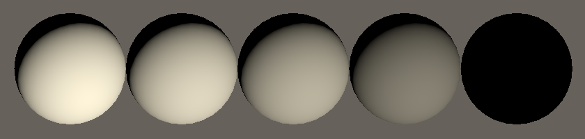

<p align=center><font color=#B8B8B8 ><i>White spheres with metallic 0, 0.25, 0.5, 0.75, and 1.</i></p>

实际上，一些光也会从电介质表面反弹，这使它们成为亮点。非金属的反射率各不相同，但平均约为 0.04。让我们将其定义为最小反射率并添加一个`OneMinusReflectivity`将范围从 0-1 调整到 0-0.96 的函数。这种范围调整与通用 RP 的方法相匹配。

```c
#define MIN_REFLECTIVITY 0.04

float OneMinusReflectivity (float metallic) {
	float range = 1.0 - MIN_REFLECTIVITY;
	return range - metallic * range;
}
```

使用该函数`GetBRDF`来强制执行最小值。仅渲染漫反射时几乎不会注意到差异，但当我们添加镜面反射时，差异会很重要。没有它，非金属将不会获得镜面高光。

```c
	float oneMinusReflectivity = OneMinusReflectivity(surface.metallic);
```

### 3.6 Specular Color

以一种方式反射的光也不能以另一种方式反射。这称为能量守恒，即出射光量不能超过入射光量。这表明镜面反射颜色应该等于表面颜色减去漫反射颜色。

```c
	brdf.diffuse = surface.color * oneMinusReflectivity;
	brdf.specular = surface.color - brdf.diffuse;
```

然而，这忽略了金属会影响镜面反射的颜色而非金属不会影响的事实。电介质表面的镜面反射颜色应该是白色，我们可以通过使用金属属性在最小反射率和表面颜色之间进行插值来实现。

```c
	brdf.specular = lerp(MIN_REFLECTIVITY, surface.color, surface.metallic);
```

### 3.7 Roughness

粗糙度与平滑度相反，所以我们可以简单地取一减去平滑度。这*Core RP Library*具有执行此操作的函数，名为`PerceptualSmoothnessToPerceptualRoughness`. 我们将使用此函数来明确将平滑度以及粗糙度定义为可感知的。`PerceptualRoughnessToRoughness`我们可以通过将感知值平方的函数转换为实际粗糙度值。这与迪士尼照明模型相匹配。这样做是因为在编辑素材时调整感知版本更直观。

```c
	float perceptualRoughness =
		PerceptualSmoothnessToPerceptualRoughness(surface.smoothness);
	brdf.roughness = PerceptualRoughnessToRoughness(perceptualRoughness);
```

这些函数定义在Core RP Libary的 *CommonMaterial HLSL* 文件. 将其包含在我们的*Common*文件，在包含核心*Common*后.

```c
#include "Packages/com.unity.render-pipelines.core/ShaderLibrary/Common.hlsl"
#include "Packages/com.unity.render-pipelines.core/ShaderLibrary/CommonMaterial.hlsl"
#include "UnityInput.hlsl"
```

### 3.8 View Direction

为了确定相机与完美反射方向的对齐程度，我们需要知道相机的位置。Unity 通过 使这些数据可用**`float3 _WorldSpaceCameraPos`**，因此将其添加到*UnityInput*.

```c
float3 _WorldSpaceCameraPos;
```

为了获得视图方向——从表面到相机的方向——`LitPassFragment`我们需要将世界空间表面位置添加到**`Varyings`**.

```c
struct Varyings {
	float4 positionCS : SV_POSITION;
	float3 positionWS : VAR_POSITION;
	…
};

Varyings LitPassVertex (Attributes input) {
	…
	output.positionWS = TransformObjectToWorld(input.positionOS);
	output.positionCS = TransformWorldToHClip(output.positionWS);
	…
}
```

我们将视图方向视为表面数据的一部分，因此将其添加到**`Surface`**.

```c
struct Surface {
	float3 normal;
	float3 viewDirection;
	float3 color;
	float alpha;
	float metallic;
	float smoothness;
};
```

将其分配在`LitPassFragment`. 它等于相机位置减去片段位置，归一化。

```c
	surface.normal = normalize(input.normalWS);
	surface.viewDirection = normalize(_WorldSpaceCameraPos - input.positionWS);
```

### 3.9 Specular Strength

我们观察到的镜面反射强度取决于我们的观察方向与反射方向的匹配程度。我们将使用 Universal RP 中使用的相同公式，它是 Minimalist CookTorrance BRDF 的变体。公式包含几个块，所以让我们添加一个方便的`Square`函数*Common*第一的。

```c
float Square (float v) {
	return v * v;
}
```

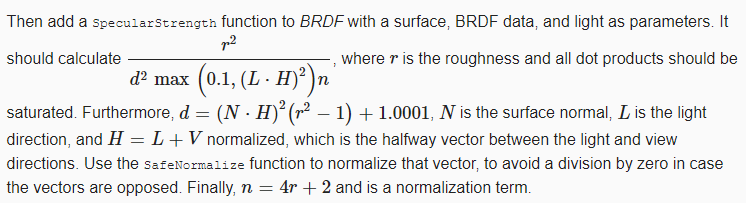

```c
float SpecularStrength (Surface surface, BRDF brdf, Light light) {
	float3 h = SafeNormalize(light.direction + surface.viewDirection);
	float nh2 = Square(saturate(dot(surface.normal, h)));
	float lh2 = Square(saturate(dot(light.direction, h)));
	float r2 = Square(brdf.roughness);
	float d2 = Square(nh2 * (r2 - 1.0) + 1.00001);
	float normalization = brdf.roughness * 4.0 + 2.0;
	return r2 / (d2 * max(0.1, lh2) * normalization);
}
```

> 该功能如何工作？
>
> BRDF 理论过于复杂，无法简单地完整解释，也不是本教程的重点。你可以检查*Lighting*用于一些代码文档和参考的通用 RP 的 HLSL 文件。

接下来，添加一个`DirectBRDF`返回通过直接照明获得的颜色，给定表面、BRDF 和光。结果是由高光强度调制的高光颜色加上漫反射颜色。

```c
float3 DirectBRDF (Surface surface, BRDF brdf, Light light) {
	return SpecularStrength(surface, brdf, light) * brdf.specular + brdf.diffuse;
}
```

`GetLighting`然后必须将入射光乘以该函数的结果。

```c
float3 GetLighting (Surface surface, BRDF brdf, Light light) {
	return IncomingLight(surface, light) * DirectBRDF(surface, brdf, light);
}
```

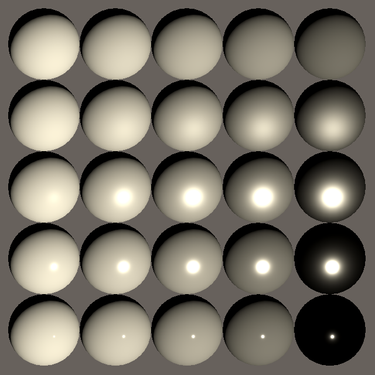

<p align=center><font color=#B8B8B8 ><i>Smoothness top to bottom 0, 0.25, 0.5, 0.75, and 0.95.</i></p>

我们现在得到镜面反射，它为我们的表面添加了高光。对于完美粗糙的表面，高光模拟漫反射。更光滑的表面获得更集中的亮点。一个完全光滑的表面会得到一个我们看不到的极小的亮点。需要一些散射才能使其可见。

由于能量守恒，对于光滑的表面，高光会变得非常明亮，因为大部分到达表面片段的光都会聚焦。因此，我们最终看到的光比由于高光可见的漫反射所可能看到的光要多得多。您可以通过大量缩小最终渲染的颜色来验证这一点。

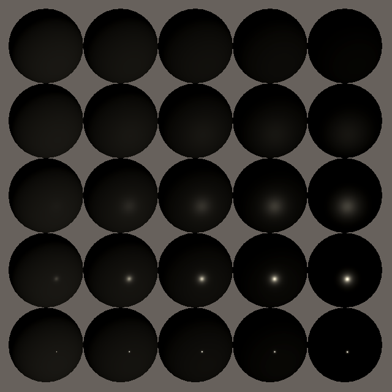

<p align=center><font color=#B8B8B8 ><i>Final color divided by 100.</i></p>

您还可以通过使用白色以外的基色来验证金属会影响镜面反射的颜色，而非金属则不会。

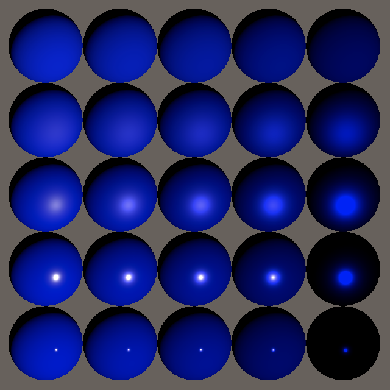

<p align=center><font color=#B8B8B8 ><i>Blue base color.</i></p>

我们现在有了可信的功能性直接照明，尽管目前结果太暗了——尤其是对于金属来说——因为我们还不支持环境反射。此时，统一的黑色环境将比默认的天空盒更逼真，但这会使我们的对象更难看到。添加更多灯也可以。

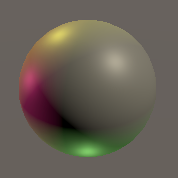

<p align=center><font color=#B8B8B8 ><i>Four lights.</i></p>

### 3.10 Mesh Ball

让我们还添加对不同金属和平滑度属性的支持**`MeshBall`**。这需要添加两个浮点数组。

```cs
	static int
		baseColorId = Shader.PropertyToID("_BaseColor"),
		metallicId = Shader.PropertyToID("_Metallic"),
		smoothnessId = Shader.PropertyToID("_Smoothness");

	…
	float[]
		metallic = new float[1023],
		smoothness = new float[1023];

	…

	void Update () {
		if (block == null) {
			block = new MaterialPropertyBlock();
			block.SetVectorArray(baseColorId, baseColors);
			block.SetFloatArray(metallicId, metallic);
			block.SetFloatArray(smoothnessId, smoothness);
		}
		Graphics.DrawMeshInstanced(mesh, 0, material, matrices, 1023, block);
	}
```

让我们将 25% 的实例设为金属，并在 0.05 到 0.95 英寸之间改变平滑度`Awake`。

```c
			baseColors[i] =
				new Vector4(
					Random.value, Random.value, Random.value,
					Random.Range(0.5f, 1f)
				);
			metallic[i] = Random.value < 0.25f ? 1f : 0f;
			smoothness[i] = Random.Range(0.05f, 0.95f);
```

然后让网球使用发光的材料。

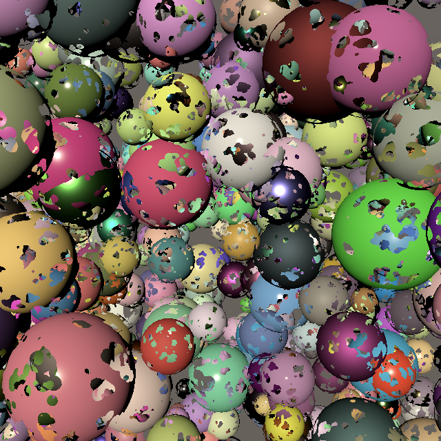

<p align=center><font color=#B8B8B8 ><i>Lit mesh ball.</i></p>

## 4. Transparency

让我们再次考虑透明度。对象仍然根据它们的 alpha 值淡化，但现在淡化的是反射光。这对于漫反射来说是有意义的，因为只有一部分光被反射，而其余部分则穿过表面。

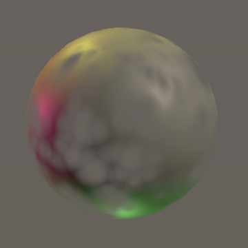

<p align=center><font color=#B8B8B8 ><i>Fading sphere.</i></p>

然而，镜面反射也会减弱。在完全透明的玻璃的情况下，光线要么通过，要么被反射。镜面反射不会褪色。我们不能用我们目前的方法来表示这一点。

### 4.1 Premultiplied Alpha

解决方案是仅使漫射光褪色，同时保持镜面反射的全部强度。由于源混合模式适用于我们无法使用的所有内容，因此让我们将其设置为 1，同时仍将 one-minus-source-alpha 用于目标混合模式。

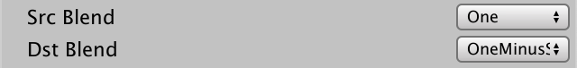

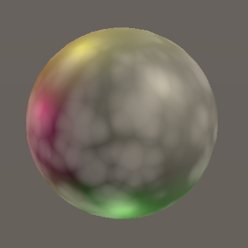

<p align=center><font color=#B8B8B8 ><i>Source blend mode set to one.</i></p>

这将恢复镜面反射，但漫反射不再淡出。我们通过将表面 alpha 分解为漫反射颜色来解决此问题。因此，我们通过 alpha 预乘漫反射，而不是稍后依赖 GPU 混合。这种方法称为预乘 alpha 混合。在`GetBRDF`中执行.

```c
	brdf.diffuse = surface.color * oneMinusReflectivity;
	brdf.diffuse *= surface.alpha;
```

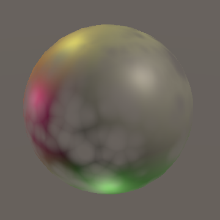

<p align=center><font color=#B8B8B8 ><i>Premultiplied diffuse.</i></p>

### 4.2 Premultiplication Toggle

预乘 alpha 与漫反射有效地将对象变成玻璃，而常规 alpha 混合使对象仅部分有效地存在。让我们支持两者，通过添加一个布尔参数来`GetBRDF`控制我们是否预乘 alpha，默认设置为 false。

```c
BRDF GetBRDF (inout Surface surface, bool applyAlphaToDiffuse = false) {
	…
	if (applyAlphaToDiffuse) {
		brdf.diffuse *= surface.alpha;
	}

	…
}
```

我们可以使用`_PREMULTIPLY_ALPHA`关键字来决定使用哪种方法`LitPassFragment`，类似于我们控制 alpha 裁剪的方式。

```c
	#if defined(_PREMULTIPLY_ALPHA)
		BRDF brdf = GetBRDF(surface, true);
	#else
		BRDF brdf = GetBRDF(surface);
	#endif
	float3 color = GetLighting(surface, brdf);
	return float4(color, surface.alpha);
```

**`Pass`**为关键字添加着色器功能*Lit*.

```c
			#pragma shader_feature _CLIPPING
			#pragma shader_feature _PREMULTIPLY_ALPHA
```

并为着色器添加一个切换属性。

```c
		[Toggle(_PREMULTIPLY_ALPHA)] _PremulAlpha ("Premultiply Alpha", Float) = 0
```

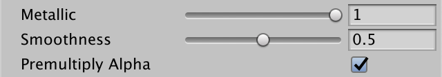

<p align=center><font color=#B8B8B8 ><i>Premultiply alpha toggle.</i></p>

## 5 Shader GUI

我们现在支持多种渲染模式，每种都需要特定的设置。为了更容易在模式之间切换，让我们在材质检查器中添加一些按钮以应用预设配置。

### 5.1 Custom Shader GUI

将**`CustomEditor "CustomShaderGUI"`**语句添加到*Lit*着色器主块。

```c
Shader "Custom RP/Lit" {
	…

	CustomEditor "CustomShaderGUI"
}
```

这指示 Unity 编辑器使用**`CustomShaderGUI`**该类的一个实例来绘制使用*Lit*着色器。为该类创建一个脚本资产并将其放入一个新的*Custom RP / Editor*文件夹。

我们需要使用`UnityEditor`、`UnityEngine`和`UnityEngine.Rendering`命名空间。该类必须继承`ShaderGUI`和重写具有一个`MaterialEditor`和一个`MaterialProperty`数组参数的`OnGUI`公共方法。让它调用基类方法，所以我们最终得到了默认的检查器。

```c
using UnityEditor;
using UnityEngine;
using UnityEngine.Rendering;

public class CustomShaderGUI : ShaderGUI {

	public override void OnGUI (
		MaterialEditor materialEditor, MaterialProperty[] properties
	) {
		base.OnGUI(materialEditor, properties);
	}
}
```

### 5.2 Setting Properties and Keywords

为了完成我们的工作，我们需要访问三件东西，我们将它们存储在字段中。首先是材质编辑器，它是负责显示和编辑材质的底层编辑器对象。其次是对正在编辑的材质的引用，我们可以通过编辑器的`targets`属性来检索它。它被定义为一个`Object`数组，因为`targets`它是通用`Editor`类的一个属性。第三是可以编辑的属性数组。

```c
	MaterialEditor editor;
	Object[] materials;
	MaterialProperty[] properties;

	public override void OnGUI (
		MaterialEditor materialEditor, MaterialProperty[] properties
	) {
		base.OnGUI(materialEditor, properties);
		editor = materialEditor;
		materials = materialEditor.targets;
		this.properties = properties;
	}
```

>为什么有多种材料？
>
>可以同时编辑使用相同着色器的多个材质，就像您可以选择和编辑多个游戏对象一样。

要设置属性，我们首先必须在数组中找到它，我们可以为此使用`ShaderGUI.FindPropery`方法，将名称和属性数组传递给它。然后我们可以通过分配给它的`floatValue`属性来调整它的值。`SetProperty`使用名称和值参数将其封装在一个方便的方法中。

```c
	void SetProperty (string name, float value) {
		FindProperty(name, properties).floatValue = value;
	}
```

设置关键字有点复杂。我们将`SetKeyword`为此创建一个方法，使用名称和布尔参数来指示是否应该启用或禁用关键字。我们必须对所有材质调用`EnableKeyword`或`DisableKeyword`其中一个，并将关键字名称传递给它们。

```cs
	void SetKeyword (string keyword, bool enabled) {
		if (enabled) {
			foreach (Material m in materials) {
				m.EnableKeyword(keyword);
			}
		}
		else {
			foreach (Material m in materials) {
				m.DisableKeyword(keyword);
			}
		}
	}
```

让我们还创建一个`SetProperty`开关属性-关键字组合的变体。

```cs
	void SetProperty (string name, string keyword, bool value) {
		SetProperty(name, value ? 1f : 0f);
		SetKeyword(keyword, value);
	}
```

现在我们可以定义简单`Clipping`的 、`PremultiplyAlpha`、`SrcBlend`、`DstBlend`和`ZWrite`setter 属性。

```cs
	bool Clipping {
		set => SetProperty("_Clipping", "_CLIPPING", value);
	}

	bool PremultiplyAlpha {
		set => SetProperty("_PremulAlpha", "_PREMULTIPLY_ALPHA", value);
	}

	BlendMode SrcBlend {
		set => SetProperty("_SrcBlend", (float)value);
	}

	BlendMode DstBlend {
		set => SetProperty("_DstBlend", (float)value);
	}

	bool ZWrite {
		set => SetProperty("_ZWrite", value ? 1f : 0f);
	}
```

最后，通过赋值给所有材质的`RenderQueue`属性来设置渲染队列。我们可以为此使用`RenderQueue`枚举。

```cs
	RenderQueue RenderQueue {
		set {
			foreach (Material m in materials) {
				m.renderQueue = (int)value;
			}
		}
	}
```

### 5.3 Preset Buttons

可以通过该`GUILayout.Button`方法创建一个按钮，向它传递一个标签，该标签将是一个预设的名称。如果该方法返回**`true`**，则它被按下。在应用预设之前，我们应该向编辑器注册一个撤消步骤，这可以通过`RegisterPropertyChangeUndo`使用名称调用它来完成。由于此代码对于所有预设都相同，因此将其放在`PresetButton`返回是否应应用预设的方法中。

```cs
	bool PresetButton (string name) {
		if (GUILayout.Button(name)) {
			editor.RegisterPropertyChangeUndo(name);
			return true;
		}
		return false;
	}
```

我们将为每个预设创建一个单独的方法，从默认开始*Opaque*模式。让它在激活时适当地设置属性。

```c
	void OpaquePreset () {
		if (PresetButton("Opaque")) {
			Clipping = false;
			PremultiplyAlpha = false;
			SrcBlend = BlendMode.One;
			DstBlend = BlendMode.Zero;
			ZWrite = true;
			RenderQueue = RenderQueue.Geometry;
		}
	}
```

第二个预设是*Clip*, 这是一个副本*Opaque*打开剪辑并将队列设置为*AlphaTest*.

```c
	void ClipPreset () {
		if (PresetButton("Clip")) {
			Clipping = true;
			PremultiplyAlpha = false;
			SrcBlend = BlendMode.One;
			DstBlend = BlendMode.Zero;
			ZWrite = true;
			RenderQueue = RenderQueue.AlphaTest;
		}
	}
```

第三个预设用于标准透明度，它会淡出对象，因此我们将其命名*Fade*. 这是另一个副本*Opaque*，具有调整的混合模式和队列，加上没有深度写入。

```c
	void FadePreset () {
		if (PresetButton("Fade")) {
			Clipping = false;
			PremultiplyAlpha = false;
			SrcBlend = BlendMode.SrcAlpha;
			DstBlend = BlendMode.OneMinusSrcAlpha;
			ZWrite = false;
			RenderQueue = RenderQueue.Transparent;
		}
	}
```

第四个预设是*Fade*应用预乘 alpha 混合。我们将其命名*Transparent*因为它适用于具有正确照明的半透明表面。

```c
	void TransparentPreset () {
		if (PresetButton("Transparent")) {
			Clipping = false;
			PremultiplyAlpha = true;
			SrcBlend = BlendMode.One;
			DstBlend = BlendMode.OneMinusSrcAlpha;
			ZWrite = false;
			RenderQueue = RenderQueue.Transparent;
		}
	}
```

在末尾调用预设方法，`OnGUI`以便它们显示在默认检查器下方。

```cs
	public override void OnGUI (
		MaterialEditor materialEditor, MaterialProperty[] properties
	) {
		…

		OpaquePreset();
		ClipPreset();
		FadePreset();
		TransparentPreset();
	}
```

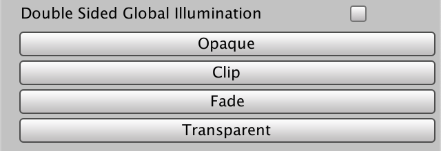

<p align=center><font color=#B8B8B8 ><i>Preset buttons.</i></p>

预设按钮不会经常使用，所以让我们将它们放在默认折叠的折叠内。这是通过调用`EditorGUILayout.Foldout`当前折叠状态、标签来完成的，并**`true`**指示单击它应该切换其状态。它返回新的折叠状态，我们应该将其存储在一个字段中。仅在折叠打开时绘制按钮。

```cs
	bool showPresets;

	…

	public override void OnGUI (
		MaterialEditor materialEditor, MaterialProperty[] properties
	) {
		…

		EditorGUILayout.Space();
		showPresets = EditorGUILayout.Foldout(showPresets, "Presets", true);
		if (showPresets) {
			OpaquePreset();
			ClipPreset();
			FadePreset();
			TransparentPreset();
		}
	}
```

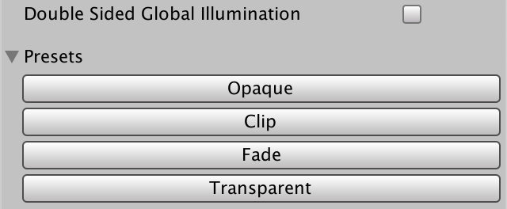

<p align=center><font color=#B8B8B8 ><i>Preset foldout.</i></p>

### 5.4 Presets for Unlit

我们还可以使用自定义着色器 GUI 用于*Unlit*着色器。

```c
Shader "Custom RP/Unlit" {
	…

	CustomEditor "CustomShaderGUI"
}
```

但是，激活预设会导致错误，因为我们试图设置着色器没有的属性。我们可以通过调整来防范`SetProperty`。让它作为附加参数调用`FindProperty`，**`false`**表明如果找不到该属性，它不应该记录错误。结果将是**`null`**，所以只有在不是这种情况下才设置值。还返回属性是否存在。

```cs
	bool SetProperty (string name, float value) {
		MaterialProperty property = FindProperty(name, properties, false);
		if (property != null) {
			property.floatValue = value;
			return true;
		}
		return false;
	}
```

然后调整关键字版本，`SetProperty`使其仅在相关属性存在时设置关键字。

```cs
	void SetProperty (string name, string keyword, bool value) {
		if (SetProperty(name, value ? 1f : 0f)) {
			SetKeyword(keyword, value);
		}
	}
```

### 5.5 No Transparency

现在预设也适用于使用*Unlit*着色器，虽然*Transparent*在这种情况下，模式没有多大意义，因为相关属性不存在。当它不相关时，让我们隐藏这个预设。

首先，添加一个`HasProperty`返回属性是否存在的方法。

```cs
	bool HasProperty (string name) =>
		FindProperty(name, properties, false) != null;
```

二、创建一个方便的属性来检查是否*_PremultiplyAlpha*存在。

```cs
	bool HasPremultiplyAlpha => HasProperty("_PremulAlpha");
```

最后，做好一切*Transparent*通过首先在`TransparentPreset`.

```cs
		if (HasPremultiplyAlpha && PresetButton("Transparent")) { … }
```

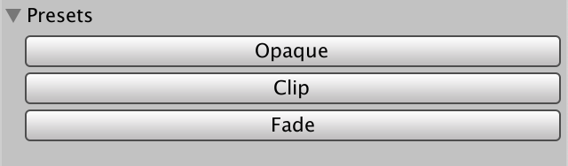

<p align=center><font color=#B8B8B8 ><i>Unlit materials lack Transparent preset.</i></p>