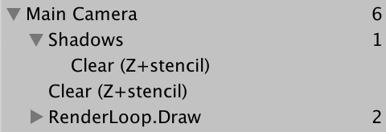
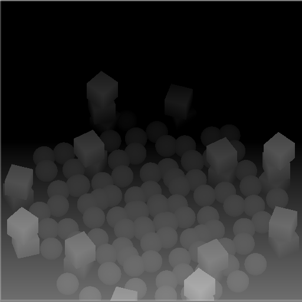
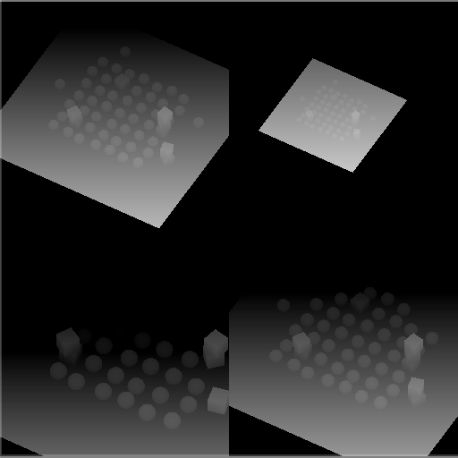
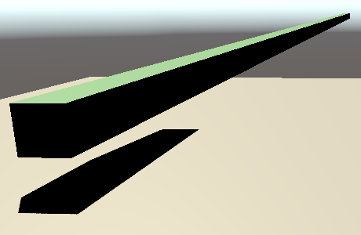
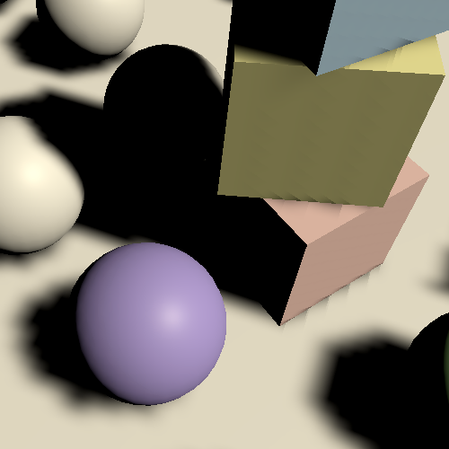

# **Directional Lights**

[原文地址](https://catlikecoding.com/unity/tutorials/custom-srp/directional-shadows/)

## 1. Rendering Shadows

绘制某些东西时，表面和光照信息足以计算光照。但是两者之间可能有一些东西阻挡了光线，在我们正在绘制的表面上投下阴影。为了使阴影成为可能，我们必须以某种方式让着色器意识到阴影投射对象。为此有多种技术。最常见的方法是生成一个阴影贴图，该贴图存储光在到达表面之前可以离开其光源的距离。在同一方向上更远的任何东西都不能被同一光照亮。Unity 的 RP 使用这种方法，我们也将如此。

### 1.1 Shadow Settings

在我们开始渲染阴影之前，我们首先必须对质量做出一些决定，特别是我们将渲染阴影的距离以及我们的阴影贴图的大小。

虽然我们可以在相机所能看到的范围内渲染阴影，但这需要大量的绘图和非常大的地图才能充分覆盖该区域，这几乎是不切实际的。因此，我们将引入阴影的最大距离，最小值为零，默认设置为 100 个单位。创建一个新的可序列化**`ShadowSettings`**类以包含此选项。这个类纯粹是一个配置选项的容器，所以我们会给它一个公共`maxDistance`字段。

```cs
using UnityEngine;

[System.Serializable]
public class ShadowSettings {

	[Min(0f)]
	public float maxDistance = 100f;
}
```

对于贴图大小，我们将引入嵌套在**`ShadowSettings`**内部的**`TextureSize`**枚举类型。使用它来定义允许的纹理大小，都是在 256-8192 范围内的 2 的幂。

```cs
	public enum TextureSize {
		_256 = 256, _512 = 512, _1024 = 1024,
		_2048 = 2048, _4096 = 4096, _8192 = 8192
	}
```

然后为阴影贴图添加一个大小字段，默认为 1024。我们将使用单个纹理来包含多个阴影贴图，因此将其命名为`atlasSize`。由于我们目前仅支持定向光，因此我们还专门在此点使用平行阴影贴图。但我们将来会支持其他灯光类型，它们将获得自己的阴影设置。所以`atlasSize`放在一个内部**`Directional`**结构中。这样我们就可以在检查器中自动获得分层配置。

```cs
	[System.Serializable]
	public struct Directional {

		public TextureSize atlasSize;
	}

	public Directional directional = new Directional {
		atlasSize = TextureSize._1024
	};
```

将阴影设置的字段添加到**`CustomRenderPipelineAsset`**.

```cs
	[SerializeField]
	ShadowSettings shadows = default;
```


<p align=center><font color=#B8B8B8 ><i>Shadow settings.</i></p>

**`CustomRenderPipeline`**在构造实例时将这些设置传递给 实例。

```cs
	protected override RenderPipeline CreatePipeline () {
		return new CustomRenderPipeline(
			useDynamicBatching, useGPUInstancing, useSRPBatcher, shadows
		);
	}
```

并让它保持它们。

```cs
	ShadowSettings shadowSettings;

	public CustomRenderPipeline (
		bool useDynamicBatching, bool useGPUInstancing, bool useSRPBatcher,
		ShadowSettings shadowSettings
	) {
		this.shadowSettings = shadowSettings;
		…
	}
```

### 1.2 Passing Along Settings

从现在开始，我们将在调用相机渲染器的Render方法时将这些设置传递给它。这样一来，就很容易在运行时添加对改变阴影设置的支持，但在本教程中我们不会处理这个问题。

```cs
	protected override void Render (
		ScriptableRenderContext context, Camera[] cameras
	) {
		foreach (Camera camera in cameras) {
			renderer.Render(
				context, camera, useDynamicBatching, useGPUInstancing,
				shadowSettings
			);
		}
	}
```

**`CameraRenderer.Render`**然后将它传递给**`Lighting.Setup`**和它自己的`Cull`方法。

```cs
	public void Render (
		ScriptableRenderContext context, Camera camera,
		bool useDynamicBatching, bool useGPUInstancing,
		ShadowSettings shadowSettings
	) {
		…
		if (!Cull(shadowSettings.maxDistance)) {
			return;
		}

		Setup();
		lighting.Setup(context, cullingResults, shadowSettings);
		…
	}
```

我们需要`Cull`中的设置，因为阴影距离是通过剔除参数设置的。

```cs
	bool Cull (float maxShadowDistance) {
		if (camera.TryGetCullingParameters(out ScriptableCullingParameters p)) {
			p.shadowDistance = maxShadowDistance;
			cullingResults = context.Cull(ref p);
			return true;
		}
		return false;
	}
```

渲染比相机能看到的更远的阴影是没有意义的，所以取最大阴影距离和相机远剪辑平面中的最小值。

```cs
			p.shadowDistance = Mathf.Min(maxShadowDistance, camera.farClipPlane);
```

为了使代码编译，我们还必须为**`Lighting.Setup`**添加一个阴影设置参数，但我们暂时不会对它们做任何事情。

```cs
	public void Setup (
		ScriptableRenderContext context, CullingResults cullingResults,
		ShadowSettings shadowSettings
	) { … }
```

### 1.3 Shadows Class

尽管阴影在逻辑上是光照的一部分，但它们相当复杂，所以让我们创建一个专门用于它们的新**`Shadows`**类。它从**`Lighting`**的精简存根副本开始，具有自己的缓冲区、上下文字段、剔除结果和设置、初始化字段的`Setup`方法和`ExecuteBuffer`方法。

```cs
using UnityEngine;
using UnityEngine.Rendering;

public class Shadows {

	const string bufferName = "Shadows";

	CommandBuffer buffer = new CommandBuffer {
		name = bufferName
	};

	ScriptableRenderContext context;

	CullingResults cullingResults;

	ShadowSettings settings;

	public void Setup (
		ScriptableRenderContext context, CullingResults cullingResults,
		ShadowSettings settings
	) {
		this.context = context;
		this.cullingResults = cullingResults;
		this.settings = settings;
	}

	void ExecuteBuffer () {
		context.ExecuteCommandBuffer(buffer);
		buffer.Clear();
	}
}
```

然后所有**`Lighting`**需要做的就是跟踪一个**`Shadows`**实例并在它自己的`Setup`方法中`SetupLights`之前调用它的`Setup`方法。

```cs
	Shadows shadows = new Shadows();

	public void Setup (…) {
		this.cullingResults = cullingResults;
		buffer.BeginSample(bufferName);
		shadows.Setup(context, cullingResults, shadowSettings);
		SetupLights();
		…
	}
```

### 1.4 Lights with Shadows

由于渲染阴影需要额外的工作，它会降低帧速率，因此我们将限制可以有多少阴影定向光，而与支持多少定向光无关。 为**`Shadows`**添加一个常量，最初设置为1。

```cs
	const int maxShadowedDirectionalLightCount = 1;
```

我们不知道哪些可见光会产生阴影，所以我们必须跟踪它。 除此之外，稍后我们还将跟踪每个阴影光的更多数据，因此让我们定义一个内部 ShadowedDirectionalLight 结构，该结构目前仅包含索引并跟踪这些数据的数组。

```cs
	struct ShadowedDirectionalLight {
		public int visibleLightIndex;
	}

	ShadowedDirectionalLight[] ShadowedDirectionalLights =
		new ShadowedDirectionalLight[maxShadowedDirectionalLightCount];
```

为了确定哪个灯光得到阴影，我们将添加一个公共 ReserveDirectionalShadows 方法，其中包含灯光和可见光索引参数。 它的工作是在阴影图集中为灯光的阴影贴图保留空间，并存储渲染它们所需的信息。

```cs
	public void ReserveDirectionalShadows (Light light, int visibleLightIndex) {}
```

由于阴影灯的数量有限，我们必须跟踪已经保留了多少。 在设置中将计数重置为零。 然后在 ReserveDirectionalShadows 中检查我们是否还没有达到最大值。 如果还有空间，则存储灯光的可见索引并增加计数。

```cs
	int ShadowedDirectionalLightCount;

	…
	
	public void Setup (…) {
		…
		ShadowedDirectionalLightCount = 0;
	}
	
	public void ReserveDirectionalShadows (Light light, int visibleLightIndex) {
		if (ShadowedDirectionalLightCount < maxShadowedDirectionalLightCount) {
			ShadowedDirectionalLights[ShadowedDirectionalLightCount++] =
				new ShadowedDirectionalLight {
					visibleLightIndex = visibleLightIndex
				};
		}
	}
```

但是阴影应该只保留给有阴影的灯光。如果一个灯光的阴影模式被设置为无或其阴影强度为零，那么它就没有阴影，应该被忽略。

```cs
		if (
			ShadowedDirectionalLightCount < maxShadowedDirectionalLightCount &&
			light.shadows != LightShadows.None && light.shadowStrength > 0f
		) { … }
```

除此之外，有可能一个可见光最终没有影响任何投射阴影的物体，要么是因为它们被配置为不投射阴影，要么是因为该光只影响最大阴影距离以外的物体。我们可以通过调用GetShadowCasterBounds对一个可见光索引的剔除结果进行检查。它有一个第二个输出参数，是关于边界的--我们不需要这个参数--并返回边界是否有效。如果不是，那么这个灯就没有阴影需要渲染，它应该被忽略。

```cs
		if (
			ShadowedDirectionalLightCount < maxShadowedDirectionalLightCount &&
			light.shadows != LightShadows.None && light.shadowStrength > 0f &&
			cullingResults.GetShadowCasterBounds(visibleLightIndex, out Bounds b)
		) { … }
```

现在我们可以在Lighting.SetupDirectionalLight中保留阴影。

```cs
	void SetupDirectionalLight (int index, ref VisibleLight visibleLight) {
		dirLightColors[index] = visibleLight.finalColor;
		dirLightDirections[index] = -visibleLight.localToWorldMatrix.GetColumn(2);
		shadows.ReserveDirectionalShadows(visibleLight.light, index);
	}
```

### 1.5 Creating the Shadow Atlas

在保留了阴影之后，我们需要渲染它们。我们在**Lighting.Render**中的**SetupLights**完成后，通过调用一个新的**Shadows.Render**方法来实现。

```cs
		shadows.Setup(context, cullingResults, shadowSettings);
		SetupLights();
		shadows.Render();
```

**Shadows.Render**方法会将方向性阴影的渲染委托给另一个**RenderDirectionalShadows**方法，但只有在有任意阴影灯的情况下。

```cs
	public void Render () {
		if (ShadowedDirectionalLightCount > 0) {
			RenderDirectionalShadows();
		}
	}

	void RenderDirectionalShadows () {}
```

创建阴影贴图是通过将阴影投射对象绘制到纹理来完成的。我们将使用 **_DirectionalShadowAtlas** 来指代方向性的阴影图集。从设置中获取图集大小的整数，然后在命令缓冲区上调用**GetTemporaryRT**，将纹理标识符作为参数，加上其宽度和高度的像素大小。

```cs
	static int dirShadowAtlasId = Shader.PropertyToID("_DirectionalShadowAtlas");
	
	…
	
	void RenderDirectionalShadows () {
		int atlasSize = (int)settings.directional.atlasSize;
		buffer.GetTemporaryRT(dirShadowAtlasId, atlasSize, atlasSize);
	}
```

这要求一个正方形的渲染纹理，但它默认是一个正常的ARGB纹理。我们需要一个阴影贴图，我们通过在调用中添加另外三个参数来指定它。首先是深度缓冲区的位数。我们希望这个位数越高越好，所以我们使用32。第二是过滤模式，我们使用默认的双线性过滤。第三是渲染纹理类型，它必须是**RenderTextureFormat.Shadowmap**。这给了我们一个适合渲染阴影贴图的纹理，尽管具体格式取决于目标平台。

```cs
		buffer.GetTemporaryRT(
			dirShadowAtlasId, atlasSize, atlasSize,
			32, FilterMode.Bilinear, RenderTextureFormat.Shadowmap
		);
```

>我们能得到什么样的纹理格式？
>它通常是24或32比特的整数或浮点纹理。你也可以选择16比特，Unity的RP就是这样做的。

当我们得到一个临时的渲染纹理时，我们也应该在用完后释放它。我们必须保留它，直到我们用摄像机完成渲染，之后我们可以通过调用**ReleaseTemporaryRT**与缓冲区的纹理标识符来释放它，然后执行它。我们将在一个新的公共Cleanup方法中做到这一点。

```cs
	public void Cleanup () {
		buffer.ReleaseTemporaryRT(dirShadowAtlasId);
		ExecuteBuffer();
	}
```

也给Lighting一个公共的Cleanup方法，将调用转给Shadows。

```cs
	public void Cleanup () {
		shadows.Cleanup();
	}
```

然后CameraRenderer可以在提交前直接请求清理。

```cs
	public void Render (…) {
		…
		lighting.Cleanup();
		Submit();
	}
```

我们只有在先获得纹理的情况下才能释放它，目前我们只在有方向性阴影需要渲染时才会这样做。显而易见的解决方案是只有当我们有阴影时才释放纹理。然而，不获得一个纹理将导致WebGL 2.0的问题，因为它将纹理和采样器绑定在一起。当一个带有我们的着色器的材质在纹理缺失的情况下被加载时，它将会失败，因为它将会得到一个默认的纹理，而这个纹理将不会与阴影采样器兼容。我们可以通过引入shader关键字来避免这种情况，生成省略阴影采样代码的shader变体。另一种方法是在不需要阴影的时候得到一个1×1的假纹理，避免额外的着色器变体。让我们这样做吧。

```cs
	public void Render () {
		if (shadowedDirLightCount > 0) {
			RenderDirectionalShadows();
		}
		else {
			buffer.GetTemporaryRT(
				dirShadowAtlasId, 1, 1,
				32, FilterMode.Bilinear, RenderTextureFormat.Shadowmap
			);
		}
	}
```

在请求渲染纹理后，**Shadows.RenderDirectionalShadows**还必须指示GPU向这个纹理而不是相机的目标进行渲染。这是通过在缓冲区上调用SetRenderTarget来完成的，确定一个渲染纹理以及它的数据应该如何被加载和存储。我们并不关心它的初始状态，因为我们会立即清除它，所以我们会使用**RenderBufferLoadAction.DontCare**。而纹理的目的是为了包含阴影数据，所以我们需要使用**RenderBufferStoreAction.Store**作为第三个参数。

```cs
		buffer.GetTemporaryRT(…);
		buffer.SetRenderTarget(
			dirShadowAtlasId,
			RenderBufferLoadAction.DontCare, RenderBufferStoreAction.Store
		);
```

一旦完成，我们就可以像清除摄像机目标一样使用ClearRenderTarget，在这种情况下只关心深度缓冲区。最后执行缓冲区。如果你至少有一个有阴影的定向光处于活动状态，那么你会看到阴影图集的清除动作在帧调试器中显示出来。

```cs
		buffer.SetRenderTarget(
			dirShadowAtlasId,
			RenderBufferLoadAction.DontCare, RenderBufferStoreAction.Store
		);
		buffer.ClearRenderTarget(true, false, Color.clear);
		ExecuteBuffer();
```


<p align=center><font color=#B8B8B8 ><i>Clearing two render targets.</i></p>

>为什么我得到一个关于尺寸不匹配的错误？
>这在Unity 2020中可能会发生。继续吧，它将在下一节得到解决。

### 1.6 Shadows First

由于我们在阴影图集之前设置普通相机，我们最终会在渲染普通几何体之前切换到阴影图集，这并不是我们想要的结果。我们应该在**CameraRenderer.Render**中调用**CameraRenderer.Setup**之前渲染阴影，这样常规渲染就不会受到影响。

```cs
		//Setup();
		lighting.Setup(context, cullingResults, shadowSettings);
		Setup();
		DrawVisibleGeometry(useDynamicBatching, useGPUInstancing);
```


<p align=center><font color=#B8B8B8 ><i>Shadows first.</i></p>

我们可以在帧调试器中保持阴影条目嵌套在摄像机的条目中，方法是在设置照明之前开始采样，并在其之后立即结束采样，然后再清除摄像机的目标。

```cs
		buffer.BeginSample(SampleName);
		ExecuteBuffer();
		lighting.Setup(context, cullingResults, shadowSettings);
		buffer.EndSample(SampleName);
		Setup();
```



<p align=center><font color=#B8B8B8 ><i>Nested shadows.</i></p>

### 1.7 Rendering

为了渲染单个灯光的阴影，我们将为 *Shadow* 添加一个变体 **RenderDirectionalShadows** 方法，有两个参数：第一是被阴影的灯光索引，第二是它在图集中的瓦片大小。然后在另一个 **RenderDirectionalShadows** 方法中为所有被阴影的灯光调用这个方法，由 *BeginSample* 和 *EndSample* 调用来包装。因为我们目前只支持一个阴影灯，它的瓦片大小等于图集大小。

```cs
	void RenderDirectionalShadows () {
		…
		buffer.ClearRenderTarget(true, false, Color.clear);
		buffer.BeginSample(bufferName);
		ExecuteBuffer();

		for (int i = 0; i < ShadowedDirectionalLightCount; i++) {
			RenderDirectionalShadows(i, atlasSize);
		}
		
		buffer.EndSample(bufferName);
		ExecuteBuffer();
	}	

	void RenderDirectionalShadows (int index, int tileSize) {}
```

为了渲染阴影，我们需要一个 **ShadowDrawingSettings** 结构值。我们可以通过调用它的构造方法来创建一个正确配置的结构值，其中包括我们之前存储的剔除结果和适当的可见光索引。

```cs
	void RenderDirectionalShadows (int index, int tileSize) {
		ShadowedDirectionalLight light = ShadowedDirectionalLights[index];
		var shadowSettings =
			new ShadowDrawingSettings(cullingResults, light.visibleLightIndex);
	}
```

阴影图的概念是，我们从光线的角度来渲染场景，只存储深度信息。其结果是告诉我们光线在击中某物之前走了多远。

然而，定向灯被认为是无限远的，因此没有一个真实的位置。所以我们要做的是找出与灯光的方向相匹配的视图和投影矩阵，并给我们一个剪辑空间立方体，该立方体与相机可见的区域重叠，包含灯光的阴影。与其自己想办法，我们不如使用剪裁结果中的 **ComputeDirectionalShadowMatricesAndCullingPrimitives** 方法来帮我们做这件事，给它传递九个参数。

第一个参数是可见光指数。接下来的三个参数是两个整数和一个Vector3，它们控制阴影的级联。我们稍后会处理级联问题，所以现在使用0、1和零矢量。之后是纹理大小，我们需要使用瓦片大小。第六个参数是阴影的近平面，我们将忽略这个参数，暂时设置为零。

这些是输入参数，剩下的三个是输出参数。首先是视图矩阵，然后是投影矩阵，最后一个参数是ShadowSplitData结构。

```cs
		var shadowSettings =
			new ShadowDrawingSettings(cullingResults, light.visibleLightIndex);
		cullingResults.ComputeDirectionalShadowMatricesAndCullingPrimitives(
			light.visibleLightIndex, 0, 1, Vector3.zero, tileSize, 0f,
			out Matrix4x4 viewMatrix, out Matrix4x4 projectionMatrix,
			out ShadowSplitData splitData
		);
```

分割数据包含了关于如何剔除投射阴影的对象的信息，我们必须将其复制到阴影设置中。我们还必须通过调用缓冲区上的 **SetViewProjectionMatrices** 来应用视图和投影矩阵。

```cs
		cullingResults.ComputeDirectionalShadowMatricesAndCullingPrimitives(…);
		shadowSettings.splitData = splitData;
		buffer.SetViewProjectionMatrices(viewMatrix, projectionMatrix);
```

我们最后通过执行缓冲区来安排阴影投射器的绘制，然后在上下文中调用DrawShadows，阴影设置通过引用传递给它。

```cs
		shadowSettings.splitData = splitData;
		buffer.SetViewProjectionMatrices(viewMatrix, projectionMatrix);
		ExecuteBuffer();
		context.DrawShadows(ref shadowSettings);
```

### 1.8 Shadow Caster Pass

在这一点上，投影者应该被渲染出来，但图集仍然是空的。这是因为 **DrawShadows** 只渲染有 **ShadowCaster** 通道的材质的物体。因此，在我们的 *Lit shader*上添加第二个 *Pass* 块，将其光照模式设置为 **ShadowCaster**。使用相同的目标层，让它支持实例化，加上 **_CLIPPING** 着色器功能。然后让它使用特殊的shadow-caster函数，我们将在一个新的 *ShadowCasterPass HLSL* 文件中定义。另外，因为我们只需要写深度，所以禁止写颜色数据，在HLSL程序前加入 `ColorMask 0`。

```cs
	SubShader {
		Pass {
			Tags {
				"LightMode" = "CustomLit"
			}

			…
		}

		Pass {
			Tags {
				"LightMode" = "ShadowCaster"
			}

			ColorMask 0

			HLSLPROGRAM
			#pragma target 3.5
			#pragma shader_feature _CLIPPING
			#pragma multi_compile_instancing
			#pragma vertex ShadowCasterPassVertex
			#pragma fragment ShadowCasterPassFragment
			#include "ShadowCasterPass.hlsl"
			ENDHLSL
		}
	}
```

创建ShadowCasterPass文件，复制LitPass并删除所有不需要的阴影投射器。所以我们只需要裁剪空间的位置，加上裁剪的基础颜色。片段函数没有任何东西可以返回，所以变成了没有语义的 **void**。它所做的唯一事情就是潜在地裁剪片段。

```c
#ifndef CUSTOM_SHADOW_CASTER_PASS_INCLUDED
#define CUSTOM_SHADOW_CASTER_PASS_INCLUDED

#include "../ShaderLibrary/Common.hlsl"

TEXTURE2D(_BaseMap);
SAMPLER(sampler_BaseMap);

UNITY_INSTANCING_BUFFER_START(UnityPerMaterial)
	UNITY_DEFINE_INSTANCED_PROP(float4, _BaseMap_ST)
	UNITY_DEFINE_INSTANCED_PROP(float4, _BaseColor)
	UNITY_DEFINE_INSTANCED_PROP(float, _Cutoff)
UNITY_INSTANCING_BUFFER_END(UnityPerMaterial)

struct Attributes {
	float3 positionOS : POSITION;
	float2 baseUV : TEXCOORD0;
	UNITY_VERTEX_INPUT_INSTANCE_ID
};

struct Varyings {
	float4 positionCS : SV_POSITION;
	float2 baseUV : VAR_BASE_UV;
	UNITY_VERTEX_INPUT_INSTANCE_ID
};

Varyings ShadowCasterPassVertex (Attributes input) {
	Varyings output;
	UNITY_SETUP_INSTANCE_ID(input);
	UNITY_TRANSFER_INSTANCE_ID(input, output);
	float3 positionWS = TransformObjectToWorld(input.positionOS);
	output.positionCS = TransformWorldToHClip(positionWS);

	float4 baseST = UNITY_ACCESS_INSTANCED_PROP(UnityPerMaterial, _BaseMap_ST);
	output.baseUV = input.baseUV * baseST.xy + baseST.zw;
	return output;
}

void ShadowCasterPassFragment (Varyings input) {
	UNITY_SETUP_INSTANCE_ID(input);
	float4 baseMap = SAMPLE_TEXTURE2D(_BaseMap, sampler_BaseMap, input.baseUV);
	float4 baseColor = UNITY_ACCESS_INSTANCED_PROP(UnityPerMaterial, _BaseColor);
	float4 base = baseMap * baseColor;
	#if defined(_CLIPPING)
		clip(base.a - UNITY_ACCESS_INSTANCED_PROP(UnityPerMaterial, _Cutoff));
	#endif
}

#endif
```

我们现在可以渲染投影者了。我创建了一个简单的测试场景，其中包含一些不透明的物体在一个平面上，有一个方向性的灯光，在全强度下启用了阴影，以尝试它。无论灯光被设置为使用硬阴影还是软阴影都没有关系。


<p align=center><font color=#B8B8B8 ><i>Shadow test scene.</i></p>

阴影还不影响最终渲染的图像，但我们已经可以通过帧调试器看到被渲染到阴影图集中的东西了。它通常被看作是一个单色纹理，随着距离的增加由白变黑，但在使用OpenGL时，它是红色的，并向相反方向发展。


<p align=center><font color=#B8B8B8 ><i>512 atlas; max distance 100.</i></p>

在最大阴影距离设置为100的情况下，我们最终会发现所有东西都只渲染到纹理的一小部分。减少最大距离可以有效地使阴影贴图放大到摄像机前面的部分。


<p align=center><font color=#B8B8B8 ><i>512 atlas; max distance 100.</i></p>

请注意，投影者是用正交影来渲染的，因为我们是为定向光而渲染的。

### 1.9 Multiple Lights

我们最多可以有四个方向性的灯光，所以我们也支持最多四个有阴影的方向性灯光。

```cs
	const int maxShadowedDirectionalLightCount = 4;
```

作为一个快速测试，我使用了四个等效的定向灯，只是我将它们的Y轴旋转调整为90°的增量。



<p align=center><font color=#B8B8B8 ><i>Shadow casters for four lights, superimposed.</i></p>

尽管我们最终正确地渲染了所有灯光的阴影投射器，但当我们为每个灯光渲染整个图集时，它们是叠加的。我们必须分割我们的图集，这样我们就可以给每个灯提供它自己的瓦片来渲染。

我们最多支持四个有阴影的灯光，我们将在我们的方形图集中给每个灯光一个方形的瓦片。因此，如果我们最终有一个以上的阴影灯，我们就必须把图集分成四块，把瓦片的大小减半。在Shadows.RenderDirectionalShadows中确定分割量和瓦片大小，并将两者都传给每个灯的另一个方法。

```cs
	void RenderDirectionalShadows () {
		…
		
		int split = ShadowedDirectionalLightCount <= 1 ? 1 : 2;
		int tileSize = atlasSize / split;

		for (int i = 0; i < ShadowedDirectionalLightCount; i++) {
			RenderDirectionalShadows(i, split, tileSize);
		}
	}
	
	void RenderDirectionalShadows (int index, int split, int tileSize) { … }
```

我们可以通过调整渲染视口来渲染到单个瓦片。为此创建一个新的方法，它有一个瓦片索引和分割作为参数。它首先计算瓦片的偏移量，将索引与分割线相乘作为X偏移量，将索引除以分割线作为Y偏移量。这些都是整数运算，但我们最终定义了一个Rect，所以将结果存储为Vector2。

```cs
	void SetTileViewport (int index, int split) {
		Vector2 offset = new Vector2(index % split, index / split);
	}
```

然后用Rect对缓冲区调用**SetViewPort**，偏移量按瓦片大小缩放，这应该成为第三个参数，它可以立即成为一个浮点数。

```cs
	void SetTileViewport (int index, int split, float tileSize) {
		Vector2 offset = new Vector2(index % split, index / split);
		buffer.SetViewport(new Rect(
			offset.x * tileSize, offset.y * tileSize, tileSize, tileSize
		));
	}
```

在设置矩阵时调用**RenderDirectionalShadows**的**SetTileViewport**。

```cs
		SetTileViewport(index, split, tileSize);
		buffer.SetViewProjectionMatrices(viewMatrix, projectionMatrix);
```


<p align=center><font color=#B8B8B8 ><i>Shadow atlas with four tiles in use.</i></p>

## 2. Sampling Shadows

现在我们正在渲染阴影投射器，但这还不影响最终的图像。为了使阴影显示出来，我们必须在**CustomLit Pass**中对阴影贴图进行采样，并利用它来确定一个表面片段是否有阴影。

### 2.1 Shadow Matrices

对于每个片段，我们必须从阴影图集中的适当瓦片中提取深度信息。所以我们必须为一个给定的世界空间位置找到阴影纹理坐标。我们将通过为每个阴影方向的光线创建一个阴影变换矩阵并将它们发送到GPU来实现这一目标。在Shadows中添加一个**_DirectionalShadowMatrices**着色器属性标识符和静态矩阵数组来实现这一目标。

```cs
	static int
		dirShadowAtlasId = Shader.PropertyToID("_DirectionalShadowAtlas"),
		dirShadowMatricesId = Shader.PropertyToID("_DirectionalShadowMatrices");
		
	static Matrix4x4[]
		dirShadowMatrices = new Matrix4x4[maxShadowedDirectionalLightCount];
```

我们可以通过在**RenderDirectionalShadows**中乘以灯光的阴影投影矩阵和视图矩阵来创建一个从世界空间到灯光空间的转换矩阵。

```cs
	void RenderDirectionalShadows (int index, int split, int tileSize) {
		…
		SetTileViewport(index, split, tileSize);
		dirShadowMatrices[index] = projectionMatrix * viewMatrix;
		buffer.SetViewProjectionMatrices(viewMatrix, projectionMatrix);
		…
	}
```

然后，一旦所有的阴影灯被渲染，通过调用缓冲区的**SetGlobalMatrixArray**将矩阵发送到GPU。

```cs
	void RenderDirectionalShadows () {
		…

		buffer.SetGlobalMatrixArray(dirShadowMatricesId, dirShadowMatrices);
		buffer.EndSample(bufferName);
		ExecuteBuffer();
	}
```

然而，这忽略了一个事实，即我们正在使用一个阴影图集。让我们创建一个**ConvertToAtlasMatrix**方法，该方法接收光照矩阵、瓦片偏移量和分割，并返回一个从世界空间转换到阴影瓦片空间的矩阵。

```cs
	Matrix4x4 ConvertToAtlasMatrix (Matrix4x4 m, Vector2 offset, int split) {
		return m;
	}
```

我们已经在SetTileViewport中计算了瓷砖的偏移量，所以让它返回这个值。

```cs
	Vector2 SetTileViewport (int index, int split, float tileSize) {
		…
		return offset;
	}
```

然后调整**RenderDirectionalShadows**，使其调用**ConvertToAtlasMatrix**。

```cs
		//SetTileViewport(index, split, tileSize);
		dirShadowMatrices[index] = ConvertToAtlasMatrix(
			projectionMatrix * viewMatrix,
			SetTileViewport(index, split, tileSize), split
		);
```

在**ConvertToAtlasMatrix**中，我们应该做的第一件事是，如果使用了反转的Z缓冲区，就要取反Z轴。我们可以通过**SystemInfo.usesReversedZBuffer**来检查。

```cs
	Matrix4x4 ConvertToAtlasMatrix (Matrix4x4 m, Vector2 offset, int split) {
		if (SystemInfo.usesReversedZBuffer) {
			m.m20 = -m.m20;
			m.m21 = -m.m21;
			m.m22 = -m.m22;
			m.m23 = -m.m23;
		}
		return m;
	}
```

>为什么Z缓冲区是相反的？
>最直观的做法是让0代表零深度，1代表最大深度。这就是OpenGL的做法。但是由于深度缓冲区的精度是有限的，而且它是以非线性方式存储的，我们通过反转来更好地利用这些位。其他图形API也使用了反转的方法。我们通常不需要担心这个问题，除非我们明确地使用裁剪空间。

第二，剪辑空间被定义在一个立方体内，其坐标从-1到1，中心是0。但纹理坐标和深度则从0到1。我们可以通过缩放和偏移XYZ尺寸的一半来将这种转换烘托到矩阵中。我们可以用矩阵乘法来做，但这将导致大量的零乘法和无谓的加法。所以让我们直接调整矩阵。

```cs
		m.m00 = 0.5f * (m.m00 + m.m30);
		m.m01 = 0.5f * (m.m01 + m.m31);
		m.m02 = 0.5f * (m.m02 + m.m32);
		m.m03 = 0.5f * (m.m03 + m.m33);
		m.m10 = 0.5f * (m.m10 + m.m30);
		m.m11 = 0.5f * (m.m11 + m.m31);
		m.m12 = 0.5f * (m.m12 + m.m32);
		m.m13 = 0.5f * (m.m13 + m.m33);
		m.m20 = 0.5f * (m.m20 + m.m30);
		m.m21 = 0.5f * (m.m21 + m.m31);
		m.m22 = 0.5f * (m.m22 + m.m32);
		m.m23 = 0.5f * (m.m23 + m.m33);
		return m;
```

最后，我们必须应用瓦片的偏移和比例。我们可以再次直接这样做，以避免大量不必要的计算。

```cs
		float scale = 1f / split;
		m.m00 = (0.5f * (m.m00 + m.m30) + offset.x * m.m30) * scale;
		m.m01 = (0.5f * (m.m01 + m.m31) + offset.x * m.m31) * scale;
		m.m02 = (0.5f * (m.m02 + m.m32) + offset.x * m.m32) * scale;
		m.m03 = (0.5f * (m.m03 + m.m33) + offset.x * m.m33) * scale;
		m.m10 = (0.5f * (m.m10 + m.m30) + offset.y * m.m30) * scale;
		m.m11 = (0.5f * (m.m11 + m.m31) + offset.y * m.m31) * scale;
		m.m12 = (0.5f * (m.m12 + m.m32) + offset.y * m.m32) * scale;
		m.m13 = (0.5f * (m.m13 + m.m33) + offset.y * m.m33) * scale;
```

### 2.2 Storing Shadow Data Per Light

为了对一个光源的阴影进行采样，我们需要知道它在阴影图集中的索引，如果它有的话。这是每个光源都必须存储的东西，所以让我们让**ReserveDirectionalShadows**返回所需的数据。我们将提供两个值：阴影强度和阴影瓦片的偏移，装在一个Vector2中。如果该灯没有得到阴影，那么结果就是零矢量。

```cs
	public Vector2 ReserveDirectionalShadows (…) {
		if (…) {
			ShadowedDirectionalLights[ShadowedDirectionalLightCount] =
				new ShadowedDirectionalLight {
					visibleLightIndex = visibleLightIndex
				};
			return new Vector2(
				light.shadowStrength, ShadowedDirectionalLightCount++
			);
		}
		return Vector2.zero;
	}
```

让Lighting通过一个**_DirectionalLightShadowData**向量数组将这些数据提供给着色器。

```cs
	static int
		dirLightCountId = Shader.PropertyToID("_DirectionalLightCount"),
		dirLightColorsId = Shader.PropertyToID("_DirectionalLightColors"),
		dirLightDirectionsId = Shader.PropertyToID("_DirectionalLightDirections"),
		dirLightShadowDataId =
			Shader.PropertyToID("_DirectionalLightShadowData");

	static Vector4[]
		dirLightColors = new Vector4[maxDirLightCount],
		dirLightDirections = new Vector4[maxDirLightCount],
		dirLightShadowData = new Vector4[maxDirLightCount];

	…

	void SetupLights () {
		…
		buffer.SetGlobalVectorArray(dirLightShadowDataId, dirLightShadowData);
	}

	void SetupDirectionalLight (int index, ref VisibleLight visibleLight) {
		dirLightColors[index] = visibleLight.finalColor;
		dirLightDirections[index] = -visibleLight.localToWorldMatrix.GetColumn(2);
		dirLightShadowData[index] =
			shadows.ReserveDirectionalShadows(visibleLight.light, index);
	}
```

并把它也添加到Light HLSL文件中的**_CustomLight**缓冲区。

```cs
CBUFFER_START(_CustomLight)
	int _DirectionalLightCount;
	float4 _DirectionalLightColors[MAX_DIRECTIONAL_LIGHT_COUNT];
	float4 _DirectionalLightDirections[MAX_DIRECTIONAL_LIGHT_COUNT];
	float4 _DirectionalLightShadowData[MAX_DIRECTIONAL_LIGHT_COUNT];
CBUFFER_END
```

### 2.3 Shadows HLSL File

我们还将创建一个专门的**Shadows HLSL**文件用于阴影采样。定义相同的最大阴影方向光数，以及**_DirectionalShadowAtlas**纹理，加上**_DirectionalShadowMatrices**数组在**_CustomShadows**缓冲区中。

```cs
#ifndef CUSTOM_SHADOWS_INCLUDED
#define CUSTOM_SHADOWS_INCLUDED

#define MAX_SHADOWED_DIRECTIONAL_LIGHT_COUNT 4

TEXTURE2D(_DirectionalShadowAtlas);
SAMPLER(sampler_DirectionalShadowAtlas);

CBUFFER_START(_CustomShadows)
	float4x4 _DirectionalShadowMatrices[MAX_SHADOWED_DIRECTIONAL_LIGHT_COUNT];
CBUFFER_END

#endif
```

由于图集不是一个普通的纹理，为了清楚起见，我们通过**TEXTURE2D_SHADOW**宏来定义它，尽管这对我们支持的平台来说并没有什么区别。我们将使用一个特殊的**SAMPLER_CMP**宏来定义采样器的状态，因为这确实定义了一种不同的阴影贴图采样方式，因为常规的双线性滤波对深度数据没有意义。

```cs
TEXTURE2D_SHADOW(_DirectionalShadowAtlas);
SAMPLER_CMP(sampler_DirectionalShadowAtlas);
```

事实上，只有一种合适的方式来对阴影贴图进行采样，所以我们可以定义一个明确的采样器状态，而不是依赖Unity为我们的渲染纹理推导出来的状态。采样器状态可以通过创建一个名称中带有特定文字的采样器来内联定义。我们可以使用**sampler_linear_clamp_compare**。让我们也为它定义一个简写的**SHADOW_SAMPLER**宏。

```cs
TEXTURE2D_SHADOW(_DirectionalShadowAtlas);
#define SHADOW_SAMPLER sampler_linear_clamp_compare
SAMPLER_CMP(SHADOW_SAMPLER);
```

在 *LitPass* 中 *Light* 之前包含 *Shadows* 

```cs
#include "../ShaderLibrary/Surface.hlsl"
#include "../ShaderLibrary/Shadows.hlsl"
#include "../ShaderLibrary/Light.hlsl"
```

### 2.4 Sampling Shadows

为了对阴影进行采样，我们需要知道每个灯光的阴影数据，所以让我们在Shadows中定义一个结构，专门用于定向灯光。它包含了强度和瓦片偏移量，但Shadows中的代码并不知道它被存储在哪里。

```cs
struct DirectionalShadowData {
	float strength;
	int tileIndex;
};
```

我们还需要知道表面的位置，所以把它添加到Surface结构中。

```cs
struct Surface {
	float3 position;
	…
};
```

并在 LitPassFragment 中赋值

```cs
	Surface surface;
	surface.position = input.positionWS;
	surface.normal = normalize(input.normalWS);
```

在Shadows中添加一个**SampleDirectionalShadowAtlas**函数，通过**SAMPLE_TEXTURE2D_SHADOW**宏对阴影图集进行采样，将图集、阴影采样器和阴影纹理空间中的位置传递给它，这是一个相应的参数。

```cs
float SampleDirectionalShadowAtlas (float3 positionSTS) {
	return SAMPLE_TEXTURE2D_SHADOW(
		_DirectionalShadowAtlas, SHADOW_SAMPLER, positionSTS
	);
}
```

然后添加一个**GetDirectionalShadowAttenuation**函数，给定方向性阴影数据和一个表面，返回阴影衰减，这个表面应该定义在世界空间。它使用瓦片偏移量来检索正确的矩阵，将表面位置转换为阴影瓦片空间，然后对图集进行采样。

```cs
float GetDirectionalShadowAttenuation (DirectionalShadowData data, Surface surfaceWS) {
	float3 positionSTS = mul(
		_DirectionalShadowMatrices[data.tileIndex],
		float4(surfaceWS.position, 1.0)
	).xyz;
	float shadow = SampleDirectionalShadowAtlas(positionSTS);
	return shadow;
}
```

对阴影图集进行采样的结果是一个系数，它决定了有多少光线到达表面，只考虑到阴影。这是一个在0-1范围内的值，被称为衰减因子。如果片段完全被阴影覆盖，那么我们得到的是0，当它完全没有阴影时，我们得到的是1。介于两者之间的数值表示该片段是部分阴影的。

除此之外，灯光的阴影强度可以被降低，无论是出于艺术原因还是为了表现半透明表面的阴影。当强度降低到零时，衰减就完全不受阴影的影响，应该是1。所以最终的衰减是通过1和采样衰减之间的线性插值找到的，以强度为基础。

```cs
	return lerp(1.0, shadow, data.strength);
```

但是当阴影强度为零时，就根本不需要对阴影进行采样，因为它们没有任何效果，甚至还没有被渲染过。在这种情况下，我们有一个没有阴影的光线，应该总是返回一个。

```cs
float GetDirectionalShadowAttenuation (DirectionalShadowData data, Surface surfaceWS) {
	if (data.strength <= 0.0) {
		return 1.0;
	}
	…
}
```

>在着色器中进行分支是一个好主意吗？
>分支曾经是低效的，但现代GPU可以很好地处理它们。你必须记住的是，片段的块是平行着色的。如果哪怕是一个片段以特定的方式进行分支，那么整个块都会这样做，即使所有其他片段都忽略了该代码路径的结果。在这种情况下，我们根据光线的强度进行分支，至少在这一点上，所有片段都是一样的。

### 2.5 Attenuating Light

我们将在Light结构中存储光线的衰减。

```cs
struct Light {
	float3 color;
	float3 direction;
	float attenuation;
};
```

给Light添加一个函数，获取方向性阴影数据。

```cs
DirectionalShadowData GetDirectionalShadowData (int lightIndex) {
	DirectionalShadowData data;
	data.strength = _DirectionalLightShadowData[lightIndex].x;
	data.tileIndex = _DirectionalLightShadowData[lightIndex].y;
	return data;
}
```

然后给*GetDirectionalLight*添加一个世界空间表面参数，让它检索方向性阴影数据并使用*GetDirectionalShadowAttenuation*来设置灯光的衰减。

```cs
Light GetDirectionalLight (int index, Surface surfaceWS) {
	Light light;
	light.color = _DirectionalLightColors[index].rgb;
	light.direction = _DirectionalLightDirections[index].xyz;
	DirectionalShadowData shadowData = GetDirectionalShadowData(index);
	light.attenuation = GetDirectionalShadowAttenuation(shadowData, surfaceWS);
	return light;
}
```

现在Lighting中的*GetLighting*也必须把曲面传给**GetDirectionalLight**。而且现在表面应该是在世界空间中定义的，所以要相应地重命名这个参数。只有BRDF不关心光和面的空间，只要它们匹配即可。

```cs
float3 GetLighting (Surface surfaceWS, BRDF brdf) {
	float3 color = 0.0;
	for (int i = 0; i < GetDirectionalLightCount(); i++) {
		color += GetLighting(surfaceWS, brdf, GetDirectionalLight(i, surfaceWS));
	}
	return color;
}
```

让阴影发挥作用的最后一步是将衰减计入光的强度。

```cs
float3 IncomingLight (Surface surface, Light light) {
	return
		saturate(dot(surface.normal, light.direction) * light.attenuation) *
		light.color;
}
```


<p align=center><font color=#B8B8B8 ><i>Two lights with shadows, both at half intensity.</i></p>

我们以后会正确地去掉最大距离的阴影，但现在这些无效的阴影仍然可见。

## 3. Cascaded Shadow Maps

因为定向光会影响到最大阴影距离以内的所有东西，他们的阴影图最终会覆盖很大的区域。由于阴影贴图使用正投影，阴影贴图中的每个纹素有一个固定的世界空间大小。如果这个尺寸太大，那么个别的阴影文本就会清晰可见，导致阴影边缘参差不齐，小的阴影也会消失。这种情况可以通过增加图集的大小来缓解，但只能达到一定程度。

当使用透视摄影机时，更远的东西看起来更小。在一定的视觉距离内，一个阴影贴图的文本将映射到一个显示像素，这意味着阴影的分辨率在理论上是最佳的。在离摄像机较近的地方，我们需要较高的阴影分辨率，而较远的地方，较低的分辨率就足够了。这表明，在理想情况下，我们会根据阴影接收器的视距，使用一个可变的阴影图分辨率。

级联阴影图是解决这个问题的一个办法。这个想法是，阴影投射者被渲染了不止一次，所以每个光在图集中得到了多个瓦片，被称为级联。第一个级联只覆盖靠近摄像机的一个小区域，而连续的级联则以相同数量的 texels 覆盖一个越来越大的区域。然后，着色器对每个片断的最佳级联进行采样。

### 3.1 Settings

Unity的阴影代码支持每个方向的灯光最多有四个级联。到目前为止，我们只使用了一个单一的级联，它覆盖了所有最大的阴影距离。为了支持更多，我们将在方向性阴影设置中添加一个级联计数滑块。虽然我们可以对每个方向灯使用不同的数量，但对所有有阴影的方向灯使用相同的数量是最合理的。

每个级联都覆盖了阴影区域的一部分，直到最大的阴影距离。我们将通过为前三个级联添加比例滑块来使确切的部分可以配置。最后一个级联总是覆盖整个范围，所以不需要一个滑块。默认情况下将级联计数设置为4，级联比率为0.1、0.25和0.5。这些比率应该在每级联中增加，但我们不会在用户界面中强制执行。

```cs
	public struct Directional {

		public MapSize atlasSize;

		[Range(1, 4)]
		public int cascadeCount;

		[Range(0f, 1f)]
		public float cascadeRatio1, cascadeRatio2, cascadeRatio3;
	}

	public Directional directional = new Directional {
		atlasSize = MapSize._1024,
		cascadeCount = 4,
		cascadeRatio1 = 0.1f,
		cascadeRatio2 = 0.25f,
		cascadeRatio3 = 0.5f
	};
```


<p align=center><font color=#B8B8B8 ><i>Cascade counts and ratios.</i></p>

**ComputeDirectionalShadowMatricesAndCullingPrimitives**方法要求我们提供打包在Vector3中的比率，所以让我们为设置添加一个方便的属性，以这种形式检索它们。

```cs
		public Vector3 CascadeRatios =>
			new Vector3(cascadeRatio1, cascadeRatio2, cascadeRatio3);
```

### 3.2 Rendering Cascades

每个级联都需要自己的变换矩阵，所以Shadows的阴影矩阵阵列大小必须乘以每个灯的最大级联数量，也就是四个。

```cs
	const int maxShadowedDirectionalLightCount = 4, maxCascades = 4;

	…

	static Matrix4x4[]
		dirShadowMatrices = new Matrix4x4[maxShadowedDirectionalLightCount * maxCascades];
```

在 *Shadows* 中也要增加数组的大小。

```cs
#define MAX_SHADOWED_DIRECTIONAL_LIGHT_COUNT 4
#define MAX_CASCADE_COUNT 4

…

CBUFFER_START(_CustomShadows)
	float4x4 _DirectionalShadowMatrices
		[MAX_SHADOWED_DIRECTIONAL_LIGHT_COUNT * MAX_CASCADE_COUNT];
CBUFFER_END
```

这样做之后，Unity会警告着色器的数组大小发生了变化，但它不能使用新的大小。这是因为一旦固定的数组被着色器声明，它们的大小就不能在GPU上同一个会话中改变。我们必须重新启动Unity来重新初始化它。

完成后，将**Shadows.ReserveDirectionalShadows**中返回的瓦片偏移量乘以配置的级联量，因为现在每个方向的光都会要求多个连续的瓦片。

```cs
			return new Vector2(
				light.shadowStrength,
				settings.directional.cascadeCount * ShadowedDirectionalLightCount++
			);
```

同样，在**RenderDirectionalShadows**中，使用的瓷砖数量会被乘以，这意味着我们最终可能会有16块瓷砖，需要分成4份。

```cs
		int tiles = ShadowedDirectionalLightCount * settings.directional.cascadeCount;
		int split = tiles <= 1 ? 1 : tiles <= 4 ? 2 : 4;
		int tileSize = atlasSize / split;
```

>为什么不同时支持3的分割？
>我们把自己限制在2的幂，这与我们对图集大小的限制相同。这样一来，整数除法总是可能的，否则我们会出现错位的问题。这意味着有些灯光配置不会使用所有可用的瓦片，浪费了纹理空间。如果这是一个问题，那么你可以增加对矩形图集的支持，而不需要是方形的。然而，你更有可能受到你能渲染的瓷砖数量的限制，而不是纹理空间。

现在*RenderDirectionalShadows*必须为每个级联绘制阴影。把从*ComputeDirectionalShadowMatricesAndCullingPrimitives*到*DrawShadows*的代码放在每个配置的级联的一个循环中。*ComputeDirectionalShadowMatricesAndCullingPrimitives*的第二个参数现在变成了级联索引，然后是级联计数和级联比率。同时调整瓦片索引，使其成为灯光的瓦片偏移量加上级联索引。

```cs
	void c (int index, int split, int tileSize) {
		ShadowedDirectionalLight light = shadowedDirectionalLights[index];
		var shadowSettings =
			new ShadowDrawingSettings(cullingResults, light.visibleLightIndex);
		int cascadeCount = settings.directional.cascadeCount;
		int tileOffset = index * cascadeCount;
		Vector3 ratios = settings.directional.CascadeRatios;
		
		for (int i = 0; i < cascadeCount; i++) {
			cullingResults.ComputeDirectionalShadowMatricesAndCullingPrimitives(
				light.visibleLightIndex, i, cascadeCount, ratios, tileSize, 0f,
				out Matrix4x4 viewMatrix, out Matrix4x4 projectionMatrix,
				out ShadowSplitData splitData
			);
			shadowSettings.splitData = splitData;
			int tileIndex = tileOffset + i;
			dirShadowMatrices[tileIndex] = ConvertToAtlasMatrix(
				projectionMatrix * viewMatrix,
				SetTileViewport(tileIndex, split, tileSize), split
			);
			buffer.SetViewProjectionMatrices(viewMatrix, projectionMatrix);
			ExecuteBuffer();
			context.DrawShadows(ref shadowSettings);
		}
	}
```

<p align=center>

    
</p>

<p align=center><font color=#B8B8B8 ><i>One and four lights with four cascades; max distance 30; ratios 0.3, 0.4, 0.5.</i></p>

### 3.3 Culling Spheres

Unity通过为每个级联创建一个剔除球来确定其覆盖的区域。由于阴影的投影是正交的，而且是方形的，它们最终会与它们的剔除球体紧密结合，但也会覆盖它们周围的一些空间。这就是为什么有些影子可以在剔除区域之外看到。另外，光的方向对球体来说并不重要，所以所有方向的光最终都使用相同的剔除球体。


<p align=center><font color=#B8B8B8 ><i>Culling spheres visualized with transparent spheres.</i></p>

这些球体也需要用来确定从哪个级联中取样，所以我们必须将它们发送到GPU。添加一个级联计数的标识符和一个级联剔除球体数组，外加一个球体数据的静态数组。它们由四个分量的向量定义，包含它们的XYZ位置加上W分量的半径。

```cs
	static int
		dirShadowAtlasId = Shader.PropertyToID("_DirectionalShadowAtlas"),
		dirShadowMatricesId = Shader.PropertyToID("_DirectionalShadowMatrices"),
		cascadeCountId = Shader.PropertyToID("_CascadeCount"),
		cascadeCullingSpheresId = Shader.PropertyToID("_CascadeCullingSpheres");

	static Vector4[] cascadeCullingSpheres = new Vector4[maxCascades];
```

级联的剔除球体是**ComputeDirectionalShadowMatricesAndCullingPrimitives**输出的分割数据的一部分。在*RenderDirectionalShadows*的循环中把它分配给球体阵列。但是我们只需要对第一个灯做这个，因为所有灯的级联都是相等的。

```cs
		for (int i = 0; i < cascadeCount; i++) {
			cullingResults.ComputeDirectionalShadowMatricesAndCullingPrimitives(…);
			shadowSettings.splitData = splitData;
			if (index == 0) {
				cascadeCullingSpheres[i] = splitData.cullingSphere;
			}
			…
		}
```

我们需要着色器中的球体来检查表面碎片是否在其内部，这可以通过比较球体中心的距离平方和其半径平方来完成。因此，让我们来存储半径平方，这样我们就不必在着色器中计算它了。

```cs
				Vector4 cullingSphere = splitData.cullingSphere;
				cullingSphere.w *= cullingSphere.w;
				cascadeCullingSpheres[i] = cullingSphere;
```

在渲染级联后将级联计数和球体发送到GPU。

```cs
	void RenderDirectionalShadows () {
		…
		
		buffer.SetGlobalInt(cascadeCountId, settings.directional.cascadeCount);
		buffer.SetGlobalVectorArray(
			cascadeCullingSpheresId, cascadeCullingSpheres
		);
		buffer.SetGlobalMatrixArray(dirShadowMatricesId, dirShadowMatrices);
		buffer.EndSample(bufferName);
		ExecuteBuffer();
	}
```

### 3.4 Sampling Cascades

将级联计数和剔除球体数组添加到Shadows中。

```cs
CBUFFER_START(_CustomShadows)
	int _CascadeCount;
	float4 _CascadeCullingSpheres[MAX_CASCADE_COUNT];
	float4x4 _DirectionalShadowMatrices
		[MAX_SHADOWED_DIRECTIONAL_LIGHT_COUNT * MAX_CASCADE_COUNT];
CBUFFER_END
```

级联索引是由每个片断决定的，而不是由每个光决定的。所以让我们引入一个包含它的全局ShadowData结构。我们稍后会向它添加一些更多的数据。同时添加一个GetShadowData函数来返回世界空间表面的阴影数据，最初级联索引总是设置为零。

```c
struct ShadowData {
	int cascadeIndex;
};

ShadowData GetShadowData (Surface surfaceWS) {
	ShadowData data;
	data.cascadeIndex = 0;
	return data;
}
```

将新的数据作为参数添加到**GetDirectionalShadowData**中，这样它就可以通过将级联索引添加到灯光的阴影瓦片偏移量中来选择正确的瓦片索引。

```c
DirectionalShadowData GetDirectionalShadowData (
	int lightIndex, ShadowData shadowData
) {
	DirectionalShadowData data;
	data.strength = _DirectionalLightShadowData[lightIndex].x;
	data.tileIndex =
		_DirectionalLightShadowData[lightIndex].y + shadowData.cascadeIndex;
	return data;
}
```

同时给GetDirectionalLight添加同样的参数，这样它就能把数据转发给GetDirectionalShadowData。适当地重命名方向性阴影数据变量。

```c
Light GetDirectionalLight (int index, Surface surfaceWS, ShadowData shadowData) {
	…
	DirectionalShadowData dirShadowData =
		GetDirectionalShadowData(index, shadowData);
	light.attenuation = GetDirectionalShadowAttenuation(dirShadowData, surfaceWS);
	return light;
}
```

在GetLighting中获取阴影数据，并将其传递出去。

```c
float3 GetLighting (Surface surfaceWS, BRDF brdf) {
	ShadowData shadowData = GetShadowData(surfaceWS);
	float3 color = 0.0;
	for (int i = 0; i < GetDirectionalLightCount(); i++) {
		Light light = GetDirectionalLight(i, surfaceWS, shadowData);
		color += GetLighting(surfaceWS, brdf, light);
	}
	return color;
}
```


<p align=center><font color=#B8B8B8 ><i>Always using the first vs. the last cascade.</i></p>

为了选择正确的级联，我们需要计算两点之间的平方距离。让我们为Common添加一个方便的函数来实现这一点。

```c
float DistanceSquared(float3 pA, float3 pB) {
	return dot(pA - pB, pA - pB);
}
```

循环浏览GetShadowData中的所有级联剔除球体，直到找到一个包含表面位置的球体。一旦找到，就跳出循环，然后使用当前的循环迭代器作为级联索引。这意味着如果片段位于所有球体之外，我们最终会得到一个无效的索引，但我们现在会忽略这一点。

```c
	int i;
	for (i = 0; i < _CascadeCount; i++) {
		float4 sphere = _CascadeCullingSpheres[i];
		float distanceSqr = DistanceSquared(surfaceWS.position, sphere.xyz);
		if (distanceSqr < sphere.w) {
			break;
		}
	}
	data.cascadeIndex = i;
```


<p align=center><font color=#B8B8B8 ><i>Selecting the best cascade.</i></p>

我们现在得到的阴影在texel密度上的分布要好得多。级联之间的弧形过渡边界也是由于自阴影伪影而可见的，尽管我们可以通过用级联指数代替阴影衰减，再除以4来使它们更容易被发现。

```c
Light GetDirectionalLight (int index, Surface surfaceWS, ShadowData shadowData) {
	…
	light.attenuation = GetDirectionalShadowAttenuation(dirShadowData, surfaceWS);
	light.attenuation = shadowData.cascadeIndex * 0.25;
	return light;
}
```


<p align=center><font color=#B8B8B8 ><i>Shadowing with cascade indices.</i></p>

### 3.5 Culling Shadow Sampling

如果我们最终超过了最后一个级联，那么很可能就没有有效的阴影数据，我们根本就不应该对阴影进行采样。一个简单的方法是为ShadowData添加一个强度字段，默认设置为1，如果我们超过了最后的级联，则设置为0。

```C
struct ShadowData {
	int cascadeIndex;
	float strength;
};

ShadowData GetShadowData (Surface surfaceWS) {
	ShadowData data;
	data.strength = 1.0;
	int i;
	for (i = 0; i < _CascadeCount; i++) {
		…
	}

	if (i == _CascadeCount) {
		data.strength = 0.0;
	}

	data.cascadeIndex = i;
	return data;
}
```

然后在*GetDirectionalShadowData*中把全局阴影强度计入方向性阴影强度。这就把最后一个级联以外的所有阴影都剔除了。

```C
	data.strength =
		_DirectionalLightShadowData[lightIndex].x * shadowData.strength;
```

另外，在*GetDirectionalLight*中恢复正确的衰减。

```C
	light.attenuation = GetDirectionalShadowAttenuation(dirShadowData, surfaceWS);
	//light.attenuation = shadowData.cascadeIndex * 0.25;
```


<p align=center><font color=#B8B8B8 ><i>Culled shadows; max distance 12.</i></p>

### 3.6 Max Distance

对最大阴影距离的一些实验会发现，一些阴影投射者在最后一个级联的剔除球内突然消失。这是因为最外层的剔除球体并不完全在配置的最大距离处结束，而是在它之外延伸了一点。这种差异在小的最大距离下最为明显。

我们可以通过停止对最大距离的阴影进行采样来解决阴影的跳出问题。为了实现这一点，我们必须在Shadows中向GPU发送最大距离。

```cs
	static int
		…
		cascadeCullingSpheresId = Shader.PropertyToID("_CascadeCullingSpheres"),
		shadowDistanceId = Shader.PropertyToID("_ShadowDistance");

	…

	void RenderDirectionalShadows () {
		…
		buffer.SetGlobalFloat(shadowDistanceId, settings.maxDistance);
		buffer.EndSample(bufferName);
		ExecuteBuffer();
	}
```

最大距离是基于视图空间的深度，而不是到摄像机位置的距离。所以要进行这种删减，我们需要知道表面的深度。在Surface中添加一个字段。

```c
struct Surface {
	float3 position;
	float3 normal;
	float3 viewDirection;
	float depth;
	…
};
```

在*LitPassFragment*中，深度可以通过*TransformWorldToView*从世界空间转换到视图空间，并采取取反的Z坐标来找到。由于这种转换只是相对于世界空间的旋转和偏移，深度在视图空间和世界空间都是一样的。

```c
	surface.viewDirection = normalize(_WorldSpaceCameraPos - input.positionWS);
	surface.depth = -TransformWorldToView(input.positionWS).z;
```

现在，在*GetShadowData*中不要总是将强度初始化为1，而是只在表面深度小于最大距离时才这样做，否则将其设置为0。

```c
CBUFFER_START(_CustomShadows)
	…
	float _ShadowDistance;
CBUFFER_END

…
float FadedShadowStrength (float distance, float scale, float fade) {
	return saturate((1.0 - distance * scale) * fade);
}

ShadowData GetShadowData (Surface surfaceWS) {
	ShadowData data;
	data.strength = surfaceWS.depth < _ShadowDistance ? 1.0 : 0.0;
	…
}
```


<p align=center><font color=#B8B8B8 ><i>Also culled based on depth.</i></p>

### 3.7 Fading Shadows

在最大距离处突然切断阴影会非常明显，所以让我们通过线性淡化它们来使过渡更加平滑。褪色从最大距离前的一些距离开始，直到我们在最大距离处达到零的强度。我们可以用夹在0-1的函数$\frac{1 - \frac dm}{f}$来做，其中 $d$ 是表面深度，$m$ 是最大的阴影距离，和 $f$ 是淡化范围，表示为最大距离的一个分数。


<p align=center><font color=#B8B8B8 ><i>f 0.1, 0.2, and 0.5.</i></p>

在阴影设置中添加一个用于淡化距离的滑块。由于淡出值和最大值都被用作除数，它们不应该是零，所以把它们的最小值设置为0.001。

```cs
	[Min(0.001f)]
	public float maxDistance = 100f;
	
	[Range(0.001f, 1f)]
	public float distanceFade = 0.1f;
```

将阴影中的阴影距离标识符替换为距离值和淡化值都是一个。

```c
		//shadowDistanceId = Shader.PropertyToID("_ShadowDistance");
		shadowDistanceFadeId = Shader.PropertyToID("_ShadowDistanceFade");
						
```

当把它们作为向量的XY分量发送到GPU时，使用1除以数值，这样我们就可以避免在着色器中进行除法，因为乘法更快。

```c
		buffer.SetGlobalFloat(shadowDistanceId, settings.maxDistance);
		buffer.SetGlobalVector(
			shadowDistanceFadeId,
			new Vector4(1f / settings.maxDistance, 1f / settings.distanceFade)
		);
```

调整Shadows中的*_CustomShadows*缓冲区以匹配。

```c
	//float _ShadowDistance;
	float4 _ShadowDistanceFade;
```

现在我们可以使用 saturate $(1-ds)f$ 计算阴影淡化强度，$\frac 1m$用于比例$s$和$\frac 1f$用于新的淡化乘数$f$。为其创建一个*FadedShadowStrength*函数，并在*GetShadowData*中使用它。

```c
float FadedShadowStrength (float distance, float scale, float fade) {
	return saturate((1.0 - distance * scale) * fade);
}

ShadowData GetShadowData (Surface surfaceWS) {
	ShadowData data;
	data.strength = FadedShadowStrength(
		surfaceWS.depth, _ShadowDistanceFade.x, _ShadowDistanceFade.y
	);
	…
}
```


<p align=center><font color=#B8B8B8 ><i>Distance fade.</i></p>

### 3.8 Fading Cascades

我们也可以在最后一个级联的边缘淡化阴影，而不是把它们切断，使用同样的方法。为此添加一个级联淡化阴影的设置滑块。

```cs
	public struct Directional {

		…

		[Range(0.001f, 1f)]
		public float cascadeFade;
	}

	public Directional directional = new Directional {
		…
		cascadeRatio3 = 0.5f,
		cascadeFade = 0.1f
	};
```

唯一的区别是，我们是用平方距离和半径来处理级联，而不是用线性深度和最大值。这意味着，过渡变得非线性 :  $\frac {1 - \frac {d^2} {r^2}}{f}$, $r$是剔除球体的半径。差别不是很大，但为了保持配置的淡化率不变，我们必须用$1 - (1 - f)^2$代替$f$。然后我们把它储存在阴影距离淡化向量的Z分量中，再一次倒置。


<p align=center><font color=#B8B8B8 ><i>f 0.1, 0.2, and 0.5 with square distance.</i></p>

```c
		float f = 1f - settings.directional.cascadeFade;
		buffer.SetGlobalVector(
			shadowDistanceFadeId, new Vector4(
				1f / settings.maxDistance, 1f / settings.distanceFade,
				1f / (1f - f * f)
			)
		);
```

为了进行级联淡化，在*GetShadowData*的循环中检查我们是否在最后一个级联中。如果是的话，计算级联的淡化阴影强度，并将其作为最终强度的因素。

```c
	for (i = 0; i < _CascadeCount; i++) {
		float4 sphere = _CascadeCullingSpheres[i];
		float distanceSqr = DistanceSquared(surfaceWS.position, sphere.xyz);
		if (distanceSqr < sphere.w) {
			if (i == _CascadeCount - 1) {
				data.strength *= FadedShadowStrength(
					distanceSqr, 1.0 / sphere.w, _ShadowDistanceFade.z
				);
			}
			break;
		}
	}
```


<p align=center><font color=#B8B8B8 ><i>Both cascade and distance fade.</i></p>

## 4. Shadow Quality

现在我们有了功能性的级联阴影贴图，让我们把重点放在提高阴影的质量上。我们一直以来观察到的伪影被称为阴影失真，它是由没有完全与光线方向对齐的表面的不正确的自我阴影造成的。失真会随着表面越来越接近与光线方向平行而变得更严重。


<p align=center><font color=#B8B8B8 ><i>Shadow acne.</i></p>

增加图集的大小会减少纹素的世界空间大小，所以失真的伪影会变小。然而，伪影的数量也会增加，所以这个问题不能通过简单地增加图集的大小来解决。

### 4.1 Depth Bias

有各种方法来减轻阴影失真。最简单的是给投影者的深度添加一个恒定的偏置，将它们推离光线，这样就不会再发生不正确的自影。添加这种技术的最快方法是在渲染时应用一个全局深度偏置，在DrawShadows之前调用缓冲区的SetGlobalDepthBias，之后将其设置为零。这是一个在裁剪空间中应用的深度偏置，是一个非常小的数值的倍数，具体细节取决于用于阴影贴图的具体格式。我们可以通过使用一个大的数值，比如50000，来了解它是如何工作的。还有一个第二个参数是斜率偏置，但我们现在将其保持为零。

```cs
			buffer.SetGlobalDepthBias(50000f, 0f);
			ExecuteBuffer();
			context.DrawShadows(ref shadowSettings);
			buffer.SetGlobalDepthBias(0f, 0f);
```


<p align=center><font color=#B8B8B8 ><i>Constant depth bias.</i></p>

一个恒定的偏置很简单，但只能够去除大部分正面照亮的表面的伪影。去除所有的粉刺需要一个更大的偏置，比如说大一个数量级。

```cs
			buffer.SetGlobalDepthBias(500000f, 0f);
```


<p align=center><font color=#B8B8B8 ><i>Larger depth bias.</i></p>

然而，当深度偏差将影子投射器推离光线时，采样的影子也会向同一方向移动。偏差大到足以消除大多数失真的时候，就会把影子移得很远，以至于它们看起来与投射者分离，造成被称为Peter-Panning的视觉假象。

<p align=center></p>

<p align=center><font color=#B8B8B8 ><i>Bias causes peter-panning.</i></p>

另一种方法是应用斜率偏置，这可以通过为SetGlobalDepthBias的第二个参数使用一个非零值来实现。这个值用于沿X和Y维度缩放绝对剪辑空间深度导数的最高值。因此，对于正面照射的表面，它是零，当光线在两个维度中至少有一个维度上以45°角照射时，它是1，而当表面法线和光线方向的点积达到零时，它接近于无穷大。因此，当需要更多的时候，偏差会自动增加，但没有上限。因此，需要一个更低的系数来消除失真，例如，3代替500000。

```cs
			buffer.SetGlobalDepthBias(0f, 3f);
```


<p align=center><font color=#B8B8B8 ><i>Slope scale bias.</i></p>

斜率刻度偏差是有效的，但不是直观的。需要进行实验来得出一个可接受的结果，用失真来换取Peter-Panning。因此，让我们暂时禁用它，并寻找一个更直观和可预测的方法。

```cs
			//buffer.SetGlobalDepthBias(0f, 3f);
			ExecuteBuffer();
			context.DrawShadows(ref shadowSettings);
			//buffer.SetGlobalDepthBias(0f, 0f);
```

### 4.2 Cascade Data

因为失真的大小取决于世界空间的texel大小，所以一个在所有情况下都有效的一致方法必须考虑到这一点。由于每个级联的texel大小不同，这意味着我们必须向GPU发送一些更多的级联数据。为此在Shadows中添加一个通用的级联数据向量数组。

```cs
	static int
		…
		cascadeCullingSpheresId = Shader.PropertyToID("_CascadeCullingSpheres"),
		cascadeDataId = Shader.PropertyToID("_CascadeData"),
		shadowDistanceFadeId = Shader.PropertyToID("_ShadowDistanceFade");

	static Vector4[]
		cascadeCullingSpheres = new Vector4[maxCascades],
		cascadeData = new Vector4[maxCascades];
```

把它和其他东西一起送到GPU。

```cs
		buffer.SetGlobalVectorArray(
			cascadeCullingSpheresId, cascadeCullingSpheres
		);
		buffer.SetGlobalVectorArray(cascadeDataId, cascadeData);
```

我们已经可以做的一件事是把级联半径的平方的倒数放在这些向量的X分量中。这样我们就不必在着色器中进行这种划分。在一个新的SetCascadeData方法中做到这一点，同时存储剔除球体并在RenderDirectionalShadows中调用它。将级联索引、剔除球体和瓦片大小作为浮点传给它。

```cs
	void RenderDirectionalShadows (int index, int split, int tileSize) {
		…
		
		for (int i = 0; i < cascadeCount; i++) {
			…
			if (index == 0) {
				SetCascadeData(i, splitData.cullingSphere, tileSize);
			}
			…
		}
	}

	void SetCascadeData (int index, Vector4 cullingSphere, float tileSize) {
		cascadeData[index].x = 1f / cullingSphere.w;
		cullingSphere.w *= cullingSphere.w;
		cascadeCullingSpheres[index] = cullingSphere;
	}
```

将级联数据添加到Shadows中的_CustomShadows缓冲区。

```c
CBUFFER_START(_CustomShadows)
	int _CascadeCount;
	float4 _CascadeCullingSpheres[MAX_CASCADE_COUNT];
	float4 _CascadeData[MAX_CASCADE_COUNT];
	…
CBUFFER_END
```

并在GetShadowData中使用新的预计算出的反值。

```c
				data.strength *= FadedShadowStrength(
					distanceSqr, _CascadeData[i].x, _ShadowDistanceFade.z
				);
```

### 4.3 Normal Bias

不正确的自影会发生，因为一个阴影的深度纹素覆盖了不止一个片段，这导致投影的体积从其表面探出。因此，如果我们把caster缩小到足够大，这种情况就不会再发生。然而，缩减shadow caster会使阴影比它们应该的要小，并且会引入不应该存在的洞。

我们也可以做相反的事情：在对阴影进行采样的同时对表面进行放大。然后我们在离表面稍远的地方取样，刚好可以避免不正确的自影。这将对阴影的位置进行一些调整，有可能造成沿边缘的错位和增加虚假的阴影，但这些伪影往往远没有Peter-Panning那么明显。

我们可以通过沿法线向量移动表面的位置来实现这一目的，以便对阴影进行采样。如果我们只考虑单一维度，那么一个相当于世界空间texel大小的偏移量就足够了。我们可以在SetCascadeData中找到texel的大小，方法是用culling sphere的直径除以tile的大小。将其存储在级联数据向量的Y分量中。

```c
		float texelSize = 2f * cullingSphere.w / tileSize;
		cullingSphere.w *= cullingSphere.w;
		cascadeCullingSpheres[index] = cullingSphere;
		//cascadeData[index].x = 1f / cullingSphere.w;
		cascadeData[index] = new Vector4(
			1f / cullingSphere.w,
			texelSize
		);
```

然而，这并不总是足够的，因为文本是正方形。在最坏的情况下，我们最终不得不沿着正方形的对角线进行偏移，所以让我们把它按√2进行缩放。

```cs
			texelSize * 1.4142136f
```

在着色器方面，为GetDirectionalShadowAttenuation添加一个全局阴影数据的参数。将表面法线与偏移量相乘，以找到法线偏差，并在计算阴影瓦片空间的位置之前将其添加到世界位置上。

```c
float GetDirectionalShadowAttenuation (
	DirectionalShadowData directional, ShadowData global, Surface surfaceWS
) {
	if (directional.strength <= 0.0) {
		return 1.0;
	}
	float3 normalBias = surfaceWS.normal * _CascadeData[global.cascadeIndex].y;
	float3 positionSTS = mul(
		_DirectionalShadowMatrices[directional.tileIndex],
		float4(surfaceWS.position + normalBias, 1.0)
	).xyz;
	float shadow = SampleDirectionalShadowAtlas(positionSTS);
	return lerp(1.0, shadow, directional.strength);
}
```

在GetDirectionalLight中把额外的数据传给它。

```c
	light.attenuation =
		GetDirectionalShadowAttenuation(dirShadowData, shadowData, surfaceWS);
```

<p align=center></p>

<p align=center><font color=#B8B8B8 ><i>Normal bias equal to texel size.</i></p>

### 4.4 Configurable Biases

法线偏置可以摆脱阴影失真而不引入明显的新伪影，但它不能消除所有阴影问题。例如，在墙壁下面的地板上可以看到一些不应该出现的阴影线。这不是自影，而是从墙上探出的阴影影响了它下面的地板。添加一点斜率偏置可以处理这些问题，但没有一个完美的数值。因此，我们将使用现有的偏置滑块对每个灯进行配置。在Shadows中的ShadowedDirectionalLight结构中添加一个字段。

```cs
	struct ShadowedDirectionalLight {
		public int visibleLightIndex;
		public float slopeScaleBias;
	}
```

灯光的偏向是通过它的shadowBias属性提供的。把它添加到ReserveDirectionalShadows的数据中。

```cs
			shadowedDirectionalLights[ShadowedDirectionalLightCount] =
				new ShadowedDirectionalLight {
					visibleLightIndex = visibleLightIndex,
					slopeScaleBias = light.shadowBias
				};
```

并用它来配置RenderDirectionalShadows中的坡度偏差。

```cs
			buffer.SetGlobalDepthBias(0f, light.slopeScaleBias);
			ExecuteBuffer();
			context.DrawShadows(ref shadowSettings);
			buffer.SetGlobalDepthBias(0f, 0f);
```

让我们也使用灯光现有的法线偏置滑块来调节我们应用的法线偏置。让ReserveDirectionalShadows返回一个Vector3并使用灯光的shadowNormalBias作为新的Z分量。

```cs
	public Vector3 ReserveDirectionalShadows (
		Light light, int visibleLightIndex
	) {
		if (…) {
			…
			return new Vector3(
				light.shadowStrength,
				settings.directional.cascadeCount * ShadowedDirectionalLightCount++,
				light.shadowNormalBias
			);
		}
		return Vector3.zero;
	}
```

将新的法线偏向添加到DirectionalShadowData中，并在Shadows中的GetDirectionalShadowAttenuation中应用它。

```cs
struct DirectionalShadowData {
	float strength;
	int tileIndex;
	float normalBias;
};

…

float GetDirectionalShadowAttenuation (…) {
	…
	float3 normalBias = surfaceWS.normal *
		(directional.normalBias * _CascadeData[global.cascadeIndex].y);
	…
}
```

并在Light的GetDirectionalShadowData中进行配置。

```cs
	data.tileIndex =
		_DirectionalLightShadowData[lightIndex].y + shadowData.cascadeIndex;
	data.normalBias = _DirectionalLightShadowData[lightIndex].z;
```

我们现在可以调整每个灯的两个偏置。斜率偏压为零，法线偏压为一，这是一个很好的默认值。如果你增加第一个，你可以减少第二个。但是请记住，我们对这些灯光设置的解释与它们最初的目的不同。它们曾经是剪辑空间的深度偏置和世界空间的收缩正常偏置。所以当你创建一个新的灯光时，你会得到严重的Peter-Panning，直到你调整偏置。


<p align=center></p>

<p align=center><font color=#B8B8B8 ><i>Both biases set to 0.6.</i></p>

### 4.5 Shadow Pancaking

另一个可能导致伪影的潜在问题是Unity应用了shadow pancaking。这个想法是，在渲染定向光的阴影投射者时，近平面会尽可能地向前移动。这增加了深度精度，但这意味着不在摄像机视线范围内的阴影投射器最终会出现在近平面的前面，这导致它们被剪切，而它们不应该被剪切。


<p align=center><font color=#B8B8B8 ><i>Shadows get clipped.</i></p>

这可以通过在ShadowCasterPassVertex中把顶点位置夹在近平面上来解决，有效地把位于近平面前面的阴影投射器压平，把它们变成粘在近平面上的薄饼。我们通过取夹层空间Z和W坐标的最大值，或者在定义了UNITY_REVERSED_Z时取其最小值来实现。为了给W坐标使用正确的符号，请将其与UNITY_NEAR_CLIP_VALUE相乘。

```c
	output.positionCS = TransformWorldToHClip(positionWS);

	#if UNITY_REVERSED_Z
		output.positionCS.z =
			min(output.positionCS.z, output.positionCS.w * UNITY_NEAR_CLIP_VALUE);
	#else
		output.positionCS.z =
			max(output.positionCS.z, output.positionCS.w * UNITY_NEAR_CLIP_VALUE);
	#endif
```


<p align=center><font color=#B8B8B8 ><i>Shadows get clamped.</i></p>

这对于完全在近平面两侧的投影者来说是完美的，但是跨越平面的投影者会变形，因为只有它们的一些顶点会受到影响。这对小的三角形来说并不明显，但大的三角形最终会产生很大的变形，使它们弯曲，并经常导致它们沉入表面。



<p align=center><font color=#B8B8B8 ><i>Deformed shadows of very long cube.</i></p>

这个问题可以通过把近平面往后拉一点来缓解。这就是灯光的近平面滑块的作用。在ShadowedDirectionalLight中添加一个近平面偏移的字段。

```cs
	struct ShadowedDirectionalLight {
		public int visibleLightIndex;
		public float slopeScaleBias;
		public float nearPlaneOffset;
	}
```

并将灯光的shadowNearPlane属性复制给它。

```cs
			shadowedDirectionalLights[ShadowedDirectionalLightCount] =
				new ShadowedDirectionalLight {
					visibleLightIndex = visibleLightIndex,
					slopeScaleBias = light.shadowBias,
					nearPlaneOffset = light.shadowNearPlane
				};
```

我们通过填写ComputeDirectionalShadowMatricesAndCullingPrimitives的最后一个参数来应用它，我们仍然给了一个固定的值0。

```cs
			cullingResults.ComputeDirectionalShadowMatricesAndCullingPrimitives(
				light.visibleLightIndex, i, cascadeCount, ratios, tileSize,
				light.nearPlaneOffset, out Matrix4x4 viewMatrix,
				out Matrix4x4 projectionMatrix, out ShadowSplitData splitData
			);
```

### 4.6 PCF Filtering

到目前为止，我们只使用了硬阴影，通过对每个片段的阴影贴图采样一次。阴影比较采样器使用一种特殊形式的双线性插值，在插值之前进行深度比较。这就是所谓的百分比接近滤波--简称PCF--特别是2×2的PCF滤波，因为涉及到四个texels 。

但这并不是我们可以过滤阴影贴图的唯一方法。我们还可以使用一个更大的过滤器，使阴影更柔和，更少的别名，尽管也不太准确。让我们增加对2×2、3×3、5×5和7×7过滤的支持。我们将不使用现有的软阴影模式来控制每个光线。我们将使所有方向性的灯光使用相同的滤镜。为此在ShadowSettings中添加一个FilterMode枚举，以及一个默认设置为2×2的定向滤镜选项。

```cs
	public enum FilterMode {
		PCF2x2, PCF3x3, PCF5x5, PCF7x7
	}

	…

	[System.Serializable]
	public struct Directional {

		public MapSize atlasSize;

		public FilterMode filter;

		…
	}

	public Directional directional = new Directional {
		atlasSize = MapSize._1024,
		filter = FilterMode.PCF2x2,
		…
	};
```


<p align=center><font color=#B8B8B8 ><i>Filter set to PCF 2x2.</i></p>

我们将为新的滤镜模式创建着色器变体。在Shadows中添加一个带有三个关键字的静态数组。

```cs
	static string[] directionalFilterKeywords = {
		"_DIRECTIONAL_PCF3",
		"_DIRECTIONAL_PCF5",
		"_DIRECTIONAL_PCF7",
	};
```

创建一个SetKeywords方法，启用或禁用相应的关键字。在执行缓冲区之前，在RenderDirectionalShadows中调用它。

```cs
	void RenderDirectionalShadows () {
		…
		SetKeywords();
		buffer.EndSample(bufferName);
		ExecuteBuffer();
	}

	void SetKeywords () {
		int enabledIndex = (int)settings.directional.filter - 1;
		for (int i = 0; i < directionalFilterKeywords.Length; i++) {
			if (i == enabledIndex) {
				buffer.EnableShaderKeyword(directionalFilterKeywords[i]);
			}
			else {
				buffer.DisableShaderKeyword(directionalFilterKeywords[i]);
			}
		}
	}
```

较大的过滤器需要更多的纹理样本。我们需要知道着色器中的图集尺寸和纹理尺寸来做到这一点。为这些数据添加一个着色器标识符。

```c
		cascadeDataId = Shader.PropertyToID("_CascadeData"),
		shadowAtlasSizeId = Shader.PropertyToID("_ShadowAtlasSize"),
		shadowDistanceFadeId = Shader.PropertyToID("_ShadowDistanceFade");
```

并将其添加到着色器侧的_CustomShadow中。

```c
CBUFFER_START(_CustomShadows)
	…
	float4 _ShadowAtlasSize;
	float4 _ShadowDistanceFade;
CBUFFER_END
```

在其X分量中存储尺寸，在其Y分量中存储texel尺寸。

```cs
		SetKeywords();
		buffer.SetGlobalVector(
			shadowAtlasSizeId, new Vector4(atlasSize, 1f / atlasSize)
		);
```

在Lit的CustomLit通道上添加#pragma multi_compile指令，用于三个关键词，加上和下划线用于匹配2×2过滤器的无关键词选项。

```c
			#pragma shader_feature _PREMULTIPLY_ALPHA
			#pragma multi_compile _ _DIRECTIONAL_PCF3 _DIRECTIONAL_PCF5 _DIRECTIONAL_PCF7
			#pragma multi_compile_instancing
```

我们将使用核心RP库的Shadow/ShadowSamplingTent HLSL文件中定义的函数，所以在Shadows的顶部包含它。如果定义了3×3关键字，我们总共需要四个滤镜样本，我们将用SampleShadow_ComputeSamples_Tent_3x3函数设置。我们只需要取四个样本，因为每个样本都使用双线性2×2滤波器。那些在各个方向上偏移了半个texel的正方形覆盖了3×3个texel的帐篷滤波器，中心的权重比边缘的更强。

>帐篷滤波器是如何工作的？
>Bloom教程涵盖了利用双线性纹理采样的滤镜内核，而景深教程则包含了一个3×3帐篷滤镜的例子。

```c
#include "Packages/com.unity.render-pipelines.core/ShaderLibrary/Shadow/ShadowSamplingTent.hlsl"

#if defined(_DIRECTIONAL_PCF3)
	#define DIRECTIONAL_FILTER_SAMPLES 4
	#define DIRECTIONAL_FILTER_SETUP SampleShadow_ComputeSamples_Tent_3x3
#endif

#define MAX_SHADOWED_DIRECTIONAL_LIGHT_COUNT 4
#define MAX_CASCADE_COUNT 4
```

出于同样的原因，我们对5×5滤波器用9个样本，对7×7滤波器用16个样本，再加上适当命名的函数就足够了。

```c
#if defined(_DIRECTIONAL_PCF3)
	#define DIRECTIONAL_FILTER_SAMPLES 4
	#define DIRECTIONAL_FILTER_SETUP SampleShadow_ComputeSamples_Tent_3x3
#elif defined(_DIRECTIONAL_PCF5)
	#define DIRECTIONAL_FILTER_SAMPLES 9
	#define DIRECTIONAL_FILTER_SETUP SampleShadow_ComputeSamples_Tent_5x5
#elif defined(_DIRECTIONAL_PCF7)
	#define DIRECTIONAL_FILTER_SAMPLES 16
	#define DIRECTIONAL_FILTER_SETUP SampleShadow_ComputeSamples_Tent_7x7
#endif
```

为一个阴影瓦片空间位置创建一个新的FilterDirectionalShadow函数。当DIRECTIONAL_FILTER_SETUP被定义时，它需要进行多次采样，否则只需调用一次SampleDirectionalShadowAtlas就足够了。

```c
float FilterDirectionalShadow (float3 positionSTS) {
	#if defined(DIRECTIONAL_FILTER_SETUP)
		float shadow = 0;
		return shadow;
	#else
		return SampleDirectionalShadowAtlas(positionSTS);
	#endif
}
```

滤波器设置函数有四个参数。首先是float4中的尺寸，前两个部分是X和Y的纹理尺寸，Z和W的总纹理尺寸。然后是原始样本位置，接着是每个样本的权重和位置的输出参数。它们被定义为float和float2数组。之后，我们可以循环浏览所有的样本，将它们按权重进行累积。

```c
	#if defined(DIRECTIONAL_FILTER_SETUP)
		float weights[DIRECTIONAL_FILTER_SAMPLES];
		float2 positions[DIRECTIONAL_FILTER_SAMPLES];
		float4 size = _ShadowAtlasSize.yyxx;
		DIRECTIONAL_FILTER_SETUP(size, positionSTS.xy, weights, positions);
		float shadow = 0;
		for (int i = 0; i < DIRECTIONAL_FILTER_SAMPLES; i++) {
			shadow += weights[i] * SampleDirectionalShadowAtlas(
				float3(positions[i].xy, positionSTS.z)
			);
		}
		return shadow;
	#else
```

在GetDirectionalShadowAttenuation中调用这个新函数，而不是直接进入SampleDirectionalShadowAtlas。

```c
	float shadow = FilterDirectionalShadow(positionSTS);
	return lerp(1.0, shadow, directional.strength);
```

<p align=center></p>

<p align=center></p>

<p align=center><font color=#B8B8B8 ><i>PCF 2x2, 3x3, 5x5, and 7x7.</i></p>

增加滤镜尺寸会使阴影更平滑，但也会导致失真再次出现。我们必须增加法线偏差以匹配滤镜的大小。我们可以通过在SetCascadeData中把texel大小乘以1再加上滤镜模式来自动做到这一点。

```cs
	void SetCascadeData (int index, Vector4 cullingSphere, float tileSize) {
		float texelSize = 2f * cullingSphere.w / tileSize;
		float filterSize = texelSize * ((float)settings.directional.filter + 1f);
		…
			1f / cullingSphere.w,
			filterSize * 1.4142136f
		);
	}
```

除此之外，增加采样区域也意味着我们最终会在级联的剔除球体之外采样。我们可以通过在平方之前将球体的半径减少到滤波器的大小来避免这种情况。

```cs
		cullingSphere.w -= filterSize;
		cullingSphere.w *= cullingSphere.w;
```

<p align=center></p>

<p align=center><font color=#B8B8B8 ><i>PCF 5x5 and 7x7 with scaled bias.</i></p>

这又解决了阴影失真，但增加的滤镜尺寸加剧了应用正常偏置的弊端，并使我们之前看到的墙面阴影问题也变得更严重。需要一些斜率偏置或更大的图集尺寸来缓解这些假象。

>我们是不是也应该减少半径以考虑到法线偏差？
>法线偏差是根据每个光定义的，所以不能根据级联来设置。幸运的是，只有当偏置会将阴影采样推到所选级联之外时，它才会成为一个问题。这只发生在远离摄像机的法线上，这意味着它几乎总是限制在不可见的表面。如果偏置确实导致了问题，那么你可以通过一些可配置的因素来增加半径的减少。

### 4.7 Blending Cascades

较软的阴影看起来更好，但它们也使层叠之间的突然过渡更加明显。


<p align=center><font color=#B8B8B8 ><i>Hard cascade transitions; PCF 7x7</i></p>

我们可以通过在级联之间添加一个过渡区域来使过渡不那么明显--虽然不能完全隐藏。我们已经有了一个级联淡化系数，我们可以用它来达到这个目的。

首先，在Shadows中的ShadowData中添加一个级联混合值，我们将用它来在相邻的级联之间进行插值。

```cs
struct ShadowData {
	int cascadeIndex;
	float cascadeBlend;
	float strength;
};
```

最初在GetShadowData中把混合系数设置为1，表示所选的级联是全强度的。然后在循环中找到级联时总是计算淡化系数。如果我们是在最后一个级联的时候，就像以前一样把它算进强度里，否则就用它来计算混合。

```cs
	data.cascadeBlend = 1.0;
	data.strength = FadedShadowStrength(
		surfaceWS.depth, _ShadowDistanceFade.x, _ShadowDistanceFade.y
	);
	int i;
	for (i = 0; i < _CascadeCount; i++) {
		float4 sphere = _CascadeCullingSpheres[i];
		float distanceSqr = DistanceSquared(surfaceWS.position, sphere.xyz);
		if (distanceSqr < sphere.w) {
			float fade = FadedShadowStrength(
				distanceSqr, _CascadeData[i].x, _ShadowDistanceFade.z
			);
			if (i == _CascadeCount - 1) {
				data.strength *= fade;
			}
			else {
				data.cascadeBlend = fade;
			}
			break;
		}
	}
```

现在在GetDirectionalShadowAttenuation中检查在检索第一个阴影值后，级联混合是否小于1。如果是的话，我们就处于一个过渡区，而且还必须从下一个级联中取样并在两个值之间插值。

```cs
	float shadow = FilterDirectionalShadow(positionSTS);
	if (global.cascadeBlend < 1.0) {
		normalBias = surfaceWS.normal *
			(directional.normalBias * _CascadeData[global.cascadeIndex + 1].y);
		positionSTS = mul(
			_DirectionalShadowMatrices[directional.tileIndex + 1],
			float4(surfaceWS.position + normalBias, 1.0)
		).xyz;
		shadow = lerp(
			FilterDirectionalShadow(positionSTS), shadow, global.cascadeBlend
		);
	}
	return lerp(1.0, shadow, directional.strength);
```


<p align=center><font color=#B8B8B8 ><i>Soft cascade transitions.</i></p>

注意，级联淡化比率适用于每个级联的整个半径，而不仅仅是其可见部分。所以要确保这个比例不会一直延伸到较低的级联。一般来说，这不是一个问题，因为你想保持过渡区域很小。

### 4.8 Dithered Transition

虽然级联之间的混合看起来更好，但它也使我们在混合区域对阴影贴图的采样次数增加了一倍。另一种方法是基于抖动模式，始终从一个级联中采样。这看起来没有那么好，但却便宜得多，尤其是在使用大型过滤器时。

为 "定向 "添加一个级联混合模式选项，支持hard, soft或dither方式。

```cs
		public enum CascadeBlendMode {
			Hard, Soft, Dither
		}

		public CascadeBlendMode cascadeBlend;
	}

	public Directional directional = new Directional {
		…
		cascadeFade = 0.1f,
		cascadeBlend = Directional.CascadeBlendMode.Hard
	};
```


<p align=center><font color=#B8B8B8 ><i>Cascade blend mode.</i></p>

在Shadows中添加一个静态数组，用于软化和抖动级联混合的关键词。

```cs
	static string[] cascadeBlendKeywords = {
		"_CASCADE_BLEND_SOFT",
		"_CASCADE_BLEND_DITHER"
	};
```

调整SetKeywords，使其适用于任意的关键词阵列和索引，然后也设置级联混合关键词。

```cs
	void RenderDirectionalShadows () {
		SetKeywords(
			directionalFilterKeywords, (int)settings.directional.filter - 1
		);
		SetKeywords(
			cascadeBlendKeywords, (int)settings.directional.cascadeBlend - 1
		);
		buffer.SetGlobalVector(
			shadowAtlasSizeId, new Vector4(atlasSize, 1f / atlasSize)
		);
		buffer.EndSample(bufferName);
		ExecuteBuffer();
	}

	void SetKeywords (string[] keywords, int enabledIndex) {
		//int enabledIndex = (int)settings.directional.filter - 1;
		for (int i = 0; i < keywords.Length; i++) {
			if (i == enabledIndex) {
				buffer.EnableShaderKeyword(keywords[i]);
			}
			else {
				buffer.DisableShaderKeyword(keywords[i]);
			}
		}
	}
```

在CustomLit通道上添加所需的多编译方向。

```c
			#pragma multi_compile _ _CASCADE_BLEND_SOFT _CASCADE_BLEND_DITHER
			#pragma multi_compile_instancing
```

为了进行抖动，我们需要一个抖动的浮动值，我们可以把它加到Surface中。

```
struct Surface {
	…
	float dither;
};
```

在LitPassFragment中，有多种方法来生成抖动值。最简单的是使用Core RP库中的InterleavedGradientNoise函数，它能在屏幕空间的XY位置生成一个旋转的平铺的抖动图案。在fragment函数中，这等于剪辑空间的XY位置。它还需要第二个参数，用来制作动画，我们不需要这个参数，可以让它保持为零。

```cs
	surface.smoothness =
		UNITY_ACCESS_INSTANCED_PROP(UnityPerMaterial, _Smoothness);
	surface.dither = InterleavedGradientNoise(input.positionCS.xy, 0);
```

在GetShadowData中设置级联索引之前，当不使用软混合时，将级联混合设置为零。这样一来，整个分支将从那些着色器变体中被消除。

```c
	if (i == _CascadeCount) {
		data.strength = 0.0;
	}
	#if !defined(_CASCADE_BLEND_SOFT)
		data.cascadeBlend = 1.0;
	#endif
	data.cascadeIndex = i;
```

而当使用抖动混合时，如果我们不在最后一个级联中，如果混合值小于抖动值，就跳到下一个级联。

```c
	if (i == _CascadeCount) {
		data.strength = 0.0;
	}
	#if defined(_CASCADE_BLEND_DITHER)
		else if (data.cascadeBlend < surfaceWS.dither) {
			i += 1;
		}
	#endif
	#if !defined(_CASCADE_BLEND_SOFT)
		data.cascadeBlend = 1.0;
	#endif
```


<p align=center><font color=#B8B8B8 ><i>Dithered cascades.</i></p>

抖动混合的可接受程度取决于我们渲染画面时的分辨率。如果使用一种后期效果来弄脏最终结果，那么它可能会相当有效，例如与时间抗锯齿和动画抖动模式相结合。


<p align=center><font color=#B8B8B8 ><i>Dithered zoomed in.</i></p>

### 4.9 Culling Bias

使用级联阴影贴图的一个缺点是，我们最终会在每个灯光下多次渲染相同的阴影投射器。如果能保证他们的结果总是被一个较小的级联所覆盖，那么尝试从较大的级联中剔除一些阴影投射器是有意义的。Unity通过将分割数据的shadowCascadeBlendCullingFactor设置为1来实现这一点。在应用于阴影设置之前，在RenderDirectionalShadows中做这个。

```c
			splitData.shadowCascadeBlendCullingFactor = 1f;
			shadowSettings.splitData = splitData;
```

<p align=center></p>

<p align=center><font color=#B8B8B8 ><i>Culling bias 0 and 1.</i></p>

这个值是一个因素，它可以调节用于执行剔除的前级联的半径。Unity在剔除时是相当保守的，但是我们应该用级联淡出的比例来减少它，并多加一点，以确保过渡区域的阴影投射者不会被剔除。所以让我们用0.8减去渐变范围，最小为0。如果你看到层叠过渡周围的阴影出现了洞，那么它必须进一步减少。

```cs
		float cullingFactor =
			Mathf.Max(0f, 0.8f - settings.directional.cascadeFade);
		
		for (int i = 0; i < cascadeCount; i++) {
			…
			splitData.shadowCascadeBlendCullingFactor = cullingFactor;
			…
		}
```

## 5 Transparency

我们将通过考虑透明阴影投射器来结束本教程。夹层、淡化和透明材质都可以像不透明材质一样接收阴影，但目前只有夹层材质可以自己投下正确的阴影。透明物体的行为就像它们是固体阴影投射器一样。

<p align=center></p>

<p align=center><font color=#B8B8B8 ><i>Clipped and transparent with shadows.</i></p>

### 5.1 Shadow Modes

我们有几种方法可以修改阴影投射器。由于涉及到向深度缓冲区的写入，我们的阴影是二进制的，要么存在，要么不存在，但这仍然给我们一些灵活性。它们可以被打开并完全实体化，也可以被剪切，抖动，或者完全关闭。我们可以做到这一点，独立于其他的材质属性，以支持最大的灵活性。所以让我们为它添加一个单独的_Shadows shader属性。我们可以使用KeywordEnum属性来为它创建一个关键词下拉菜单，默认情况下阴影是打开的。

```c
		[KeywordEnum(On, Clip, Dither, Off)] _Shadows ("Shadows", Float) = 0
```


<p align=center><font color=#B8B8B8 ><i>Shadows enabled.</i></p>

为这些模式添加一个着色器特性，取代现有的_CLIPPING特性。我们只需要三个变体，不使用关键字来表示开和关，_SHADOWS_CLIP，和_SHADOWS_DITHER。

```c
			//#pragma shader_feature _CLIPPING
			#pragma shader_feature _ _SHADOWS_CLIP _SHADOWS_DITHER
```

在CustomShaderGUI中为阴影创建一个setter属性。

```c
	enum ShadowMode {
		On, Clip, Dither, Off
	}

	ShadowMode Shadows {
		set {
			if (SetProperty("_Shadows", (float)value)) {
				SetKeyword("_SHADOWS_CLIP", value == ShadowMode.Clip);
				SetKeyword("_SHADOWS_DITHER", value == ShadowMode.Dither);
			}
		}
	}
```

然后在预设方法中适当地设置阴影。这将是对不透明的开启，对剪辑的剪辑，让我们对褪色和透明都使用抖动。

### 5.2 Clipped Shadows

在ShadowCasterPassFragment中，用_SHADOWS_CLIP的检查来代替_CLIPPED的检查。

```c
	#if defined(_SHADOWS_CLIP)
		clip(base.a - UNITY_ACCESS_INSTANCED_PROP(UnityPerMaterial, _Cutoff));
	#endif
```

现在可以给透明材料提供剪切的阴影，这可能适合于有大部分完全不透明或透明但需要alpha混合的部分的表面。


<p align=center><font color=#B8B8B8 ><i>Transparent with clipped shadows.</i></p>

请注意，剪切的阴影并不像实体阴影那样稳定，因为当视图移动时，阴影矩阵会发生变化，这导致片段会有一些移动。这可能会导致阴影贴图的一个文本突然从剪切状态过渡到不剪切状态。

### 5.3 Dithered Shadows

抖动阴影的工作方式与剪切阴影一样，只是标准不同。在这种情况下，我们从表面的阿尔法值中减去一个抖动值，然后根据这个值来剪辑。我们可以再次使用InterleavedGradientNoise函数。

```c
	#if defined(_SHADOWS_CLIP)
		clip(base.a - UNITY_ACCESS_INSTANCED_PROP(UnityPerMaterial, _Cutoff));
	#elif defined(_SHADOWS_DITHER)
		float dither = InterleavedGradientNoise(input.positionCS.xy, 0);
		clip(base.a - dither);
	#endif
```


<p align=center><font color=#B8B8B8 ><i>Dithered shadows.</i></p>

抖动可以用来接近半透明的阴影投射器，但这是一个相当粗糙的方法。硬抖动的阴影看起来很糟糕，但当使用较大的PCF滤镜时，它可能看起来可以接受。


<p align=center><font color=#B8B8B8 ><i>Dithered with PCF7x7.</i></p>

因为每个文本的抖动模式是固定的，重叠的半透明阴影投射器不会投射出一个组合的暗影。这种效果与最不透明的阴影投射器一样强。另外，由于产生的图案是有噪声的，当阴影矩阵发生变化时，它受到的时间伪影的影响更大，这可能会使阴影出现颤动。只要物体不移动，这种方法对其他有固定投影的光线类型效果更好。对于半透明的物体，通常更实际的做法是使用剪切的阴影或根本没有阴影。

### 5.4 No Shadows

我们可以通过调整一个物体的MeshRenderer组件的Cast Shadows设置来关闭每个物体的阴影投射。然而，如果你想为所有使用相同材质的物体关闭阴影，这并不实际，所以我们也将支持为每个材质关闭阴影。我们通过禁用材质的ShadowCaster通道来做到这一点。

为CustomShaderGUI添加一个SetShadowCasterPass方法，首先检查_Shadows着色器属性是否存在。如果存在，还要通过其hasMixedValue属性，检查所有被选中的材质是否被设置为相同的模式。如果没有模式或者是混合模式，那么就放弃。否则，通过调用SetShaderPassEnabled，对所有材质启用或禁用ShadowCaster通道，并将通道名称和启用状态作为参数。

```c
	void SetShadowCasterPass () {
		MaterialProperty shadows = FindProperty("_Shadows", properties, false);
		if (shadows == null || shadows.hasMixedValue) {
			return;
		}
		bool enabled = shadows.floatValue < (float)ShadowMode.Off;
		foreach (Material m in materials) {
			m.SetShaderPassEnabled("ShadowCaster", enabled);
		}
	}
```

最简单的方法是，当材质通过GUI被改变时，总是调用SetShadowCasterPass来确保通行证被正确设置。我们可以通过在OnGUI开始时调用EditorGUI.BeginChangeCheck和在其结束时调用EditorGUI.EndChangeCheck来实现。后面的方法返回自我们开始检查以来是否有变化。如果是的话，就设置影子施主通行证。

```cs
	public override void OnGUI (
		MaterialEditor materialEditor, MaterialProperty[] properties
	) {
		EditorGUI.BeginChangeCheck();
		…
		if (EditorGUI.EndChangeCheck()) {
			SetShadowCasterPass();
		}
	}
```


<p align=center><font color=#B8B8B8 ><i>Not casting shadows.</i></p>

### 5.5 Unlit Shadow Casters

虽然非光照材质不受光照影响，但你可能希望它们能投射阴影。我们可以通过简单地将Lit中的ShadowCaster通道复制到Unlit着色器中来支持这一点。


<p align=center><font color=#B8B8B8 ><i>Unlit but casting shadows.</i></p>

### 5.6 Receiving Shadows

最后，我们还可以让发光的表面忽略阴影，这对全息图等东西可能很有用，或者只是出于艺术目的。在Lit上添加一个_RECEIVE_SHADOWS的关键字切换属性来实现。

```c
		[Toggle(_RECEIVE_SHADOWS)] _ReceiveShadows ("Receive Shadows", Float) = 1
```

加上CustomLit pass中的附带着色器功能。

```c
			#pragma shader_feature _RECEIVE_SHADOWS
```


<p align=center><font color=#B8B8B8 ><i>Receiving shadows.</i></p>

我们要做的就是在定义关键词时，在GetDirectionalShadowAttenuation中强制将阴影衰减改为1。

```cs
float GetDirectionalShadowAttenuation (…) {
	#if !defined(_RECEIVE_SHADOWS)
		return 1.0;
	#endif
	…
}
```


<p align=center><font color=#B8B8B8 ><i>Casting but not receiving shadows.</i></p>