# Baked Light

[原文地址](https://catlikecoding.com/unity/tutorials/custom-srp/baked-light/)

## 1. Baking Static Light

到目前为止，我们已经在渲染时计算了所有的光照，但这并不是唯一的选择。光照也可以提前计算并存储在光照图和探针中。这样做的主要原因有两个：减少实时计算量和增加无法在运行时计算的间接光照。后者是统称为全局光照的一部分：光线不是直接来自于光源，而是通过反射、环境或发光表面间接产生的。

烘焙照明的缺点是它是静态的，所以不能在运行时改变。它还需要被存储，这就增加了构建大小和内存使用。

> 实时全局光照怎么办？
> Unity使用Enlighten系统进行实时全局光照，但这已经被废弃了，所以我们不会使用它。除此之外，反射探针可以在运行时渲染，以创建镜面环境反射，但我们不会在本教程中涉及它们。

### 1.1 Scene Lighting Settings

全局光照是通过 Lighting 窗口的 Scene 选项卡对每个场景进行配置。烘烤光照是通过*Mixed Lighting*下的*Baked Global Illumination*开关来启用的。还有一个*Lighting Mode*选项，我们将其设置为*Baked Indirect*，这意味着我们烘烤所有的静态间接光照。

如果你的项目是在Unity 2019.2或更早的版本中创建的，那么你还会看到一个启用实时照明的选项，它应该是禁用的。如果你的项目是在Unity 2019.3或更高版本中创建的，那么该选项将不会显示。

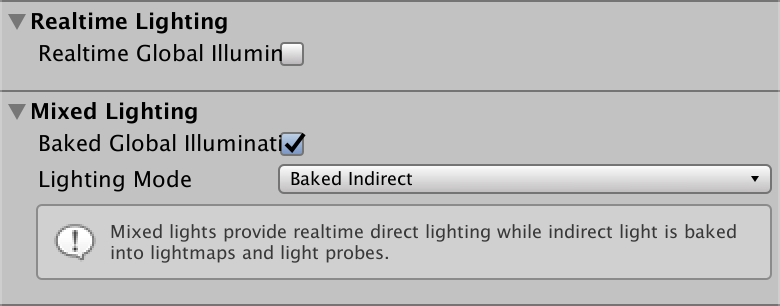

<p align=center><font color=#B8B8B8 ><i>Baked indirect lighting only.</i></p>

再往下是*Lightmapping Settings*部分，可以用来控制lightmapping过程，这是由Unity编辑器完成的。我将使用默认的设置，除了将*LightMap Resolution*降低到20，禁用*Compress Lightmaps*，并将*Directional Mode*设置为*Non-Directional*。我还使用了*Progressive CPU* lightmapper。


<p align=center><font color=#B8B8B8 ><i>Lightmapping settings.</i></p>

>方向性模式是做什么的？
>它还可以烘烤方向性数据，这使得法线贴图可以影响进入烘烤的光线。由于我们目前不支持法线贴图，所以没有理由启用它。

### 1.2 Static Objects

为了演示烘烤照明，我创建了一个场景，用一个绿色的平面作为地面，几个盒子和球体，以及中心的一个结构，这个结构只有一个开放的侧面，所以它的内部是完全阴影的。

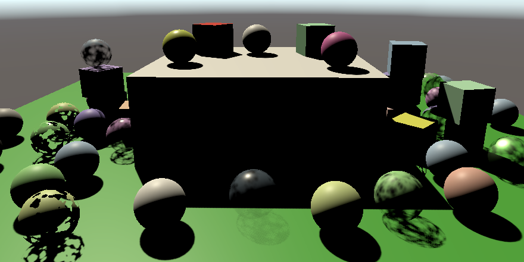

<p align=center><font color=#B8B8B8 ><i>Scene with dark interior.</i></p>

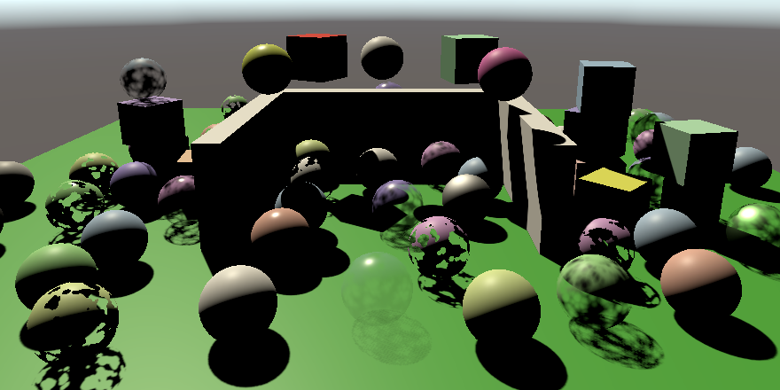

<p align=center><font color=#B8B8B8 ><i>Same scene without ceiling.</i></p>

场景中有一个单一的方向性灯光，其模式设置为混合。这告诉Unity，它应该为这个灯光烘培出间接光照。除此之外，这个灯光仍然像一个普通的实时灯一样工作。


<p align=center><font color=#B8B8B8 ><i>Mixed-mode light.</i></p>

我还将地平面和所有立方体--包括那些形成结构的立方体--纳入烘培过程。它们将成为光线反弹的对象，从而成为间接光线。这可以通过启用MeshRenderer组件的Contribute Global Illumination（贡献全局照明）开关来实现。启用这个功能也会自动将它们的*Receive Global Illumination*模式切换为*Lightmaps*，这意味着到达它们表面的间接光会被烤成光照图。你也可以通过在对象的 *Static* 下拉列表中启用贡献全局照明（Contribute GI），或者使其完全静态化来启用这个模式。


<p align=center><font color=#B8B8B8 ><i>Contribute global illumination enabled.</i></p>

一旦启用，场景的光照将再次被烘焙，前提是在Lighting窗口中启用了Auto Generate（自动生成），否则你就必须按下Generate Lighting（生成光照）按钮。光照映射设置也会显示在MeshRenderer组件中，包括包含物体的光照映射的视图。

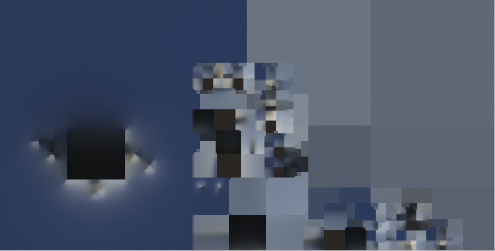

<p align=center><font color=#B8B8B8 ><i>Map of baked received indirect light.</i></p>

>不是应该有很多绿色的间接光吗？
>是的。我们稍后会讨论这个问题。

球体没有显示在光照图中，因为它们对全局照明没有贡献，因此被认为是动态的。它们将不得不依赖于光探针，这一点我们将在后面介绍。静态物体也可以通过将它们的*Receive Global Illumination*模式切换回*Light Probes*而从贴图中排除。它们仍然会影响烘烤的结果，但不会占用光照贴图的空间。

### 1.3 Fully-Baked Light

烘培的光照大部分是蓝色的，因为它被天空盒所主导，代表了来自环境天空的间接照明。中心建筑周围较亮的区域是由光源反弹到地面和墙壁上的间接照明造成的。

我们还可以把所有的光照都烘烤到贴图中，包括直接和间接照明。这可以通过将灯光的模式设置为烘烤来完成。然后它就不再提供实时照明了。

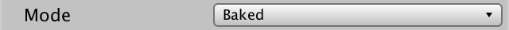

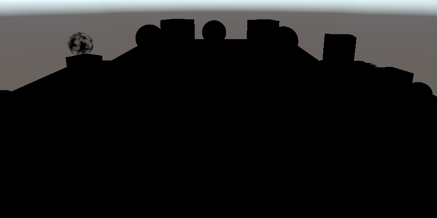

<p align=center><font color=#B8B8B8 ><i>No realtime lighting.</i></p>

实际上，烘培的光源的直射光也被当作间接光，从而最终进入地图，使其变得更加明亮。

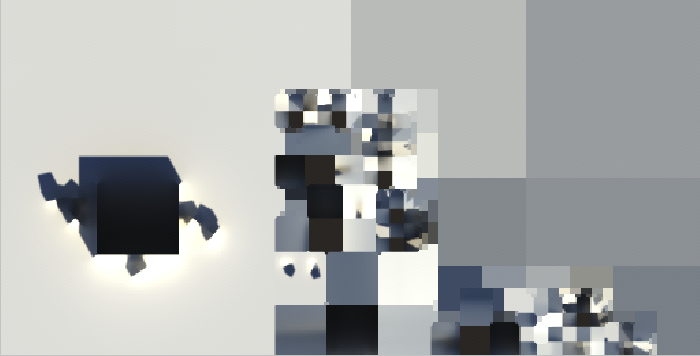

<p align=center><font color=#B8B8B8 ><i>Map of fully baked light.</i></p>

## 2. Sampling Baked Light

目前所有的东西都被渲染成纯黑色，因为没有实时光线，而且我们的着色器还不知道全局照明。我们必须对光照图进行采样以使其发挥作用。

### 2.1 Global Illumination

创建一个新的*ShaderLibrary/GI.hlsl*文件，包含所有与全局光照有关的代码。在这个文件中，定义一个GI结构和一个GetGI函数来检索它，给定一些光照贴图的UV坐标。间接光来自各个方向，因此只能用于漫反射照明，不能用于镜面。所以给GI结构一个漫反射色域。为了调试的目的，最初用光照图的UV填充它。

```c
#ifndef CUSTOM_GI_INCLUDED
#define CUSTOM_GI_INCLUDED

struct GI {
	float3 diffuse;
};

GI GetGI (float2 lightMapUV) {
	GI gi;
	gi.diffuse = float3(lightMapUV, 0.0);
	return gi;
}

#endif
```

>那么，镜面全局光照呢？
>镜面环境反射通常是通过反射探针提供的，我们将在未来的教程中介绍。屏幕空间的反射是另一种选择。

在*GetLighting*中增加一个GI参数，在积累实时光照之前，用它来初始化颜色值。在这一点上，我们不与表面的漫反射率相乘，所以我们可以看到未经修改的接收光。

```c
float3 GetLighting (Surface surfaceWS, BRDF brdf, GI gi) {
	ShadowData shadowData = GetShadowData(surfaceWS);
	float3 color = gi.diffuse;
	…
	return color;
}
```

在*LitPass*中，在*Lighting*之前包括*GI*。

```c
#include "../ShaderLibrary/GI.hlsl"
#include "../ShaderLibrary/Lighting.hlsl"
```

在*LitPassFragment*中获取全局光照数据，最初的UV坐标为零，并将其传递给GetLighting。

```c
	GI gi = GetGI(0.0);
	float3 color = GetLighting(surface, brdf, gi);
```

### 2.2 Light Map Coordinates

为了得到光照贴图的UV坐标，Unity必须将它们发送到着色器。我们必须指示管线为每个被光照的物体做这件事。这可以通过在CameraRenderer.DrawVisibleGeometry中把绘图设置的每个对象数据属性设置为PerObjectData.Lightmaps来完成。

```c
		var drawingSettings = new DrawingSettings(
			unlitShaderTagId, sortingSettings
		) {
			enableDynamicBatching = useDynamicBatching,
			enableInstancing = useGPUInstancing,
			perObjectData = PerObjectData.Lightmaps
		};
```

Unity现在会用具有LIGHTMAP_ON关键字的着色器变体来渲染光照贴图对象。在我们的Lit着色器的CustomLit通道中添加一个多编译指令。

```c
			#pragma multi_compile _ LIGHTMAP_ON
			#pragma multi_compile_instancing
```

光照图的UV坐标是属性顶点数据的一部分。我们必须把它们转移到Varyings中，这样我们才能在LitPassFragment中使用它们。但我们应该只在需要时才这样做。我们可以使用类似于转移实例标识符的方法，并依靠GI_ATTRIBUTE_DATA、GI_VARYINGS_DATA和TRANSFER_GI_DATA宏。

```c
struct Attributes {
	…
	GI_ATTRIBUTE_DATA
	UNITY_VERTEX_INPUT_INSTANCE_ID
};

struct Varyings {
	…
	GI_VARYINGS_DATA
	UNITY_VERTEX_INPUT_INSTANCE_ID
};

Varyings LitPassVertex (Attributes input) {
	Varyings output;
	UNITY_SETUP_INSTANCE_ID(input);
	UNITY_TRANSFER_INSTANCE_ID(input, output);
	TRANSFER_GI_DATA(input, output);
	…
}
```

加上另一个GI_FRAGMENT_DATA宏，以检索GetGI的必要参数。

```c
	GI gi = GetGI(GI_FRAGMENT_DATA(input));
```

我们必须自己定义这些宏，在GI中。除了GI_FRAGMENT_DATA之外，最初将它们定义为空，因为GI_FRAGMENT_DATA将直接为零。宏的参数列表与函数的参数列表一样，只是没有类型，而且在宏的名称和参数列表之间不允许有空格，否则列表会被解释为宏定义的东西。

```c
#define GI_ATTRIBUTE_DATA
#define GI_VARYINGS_DATA
#define TRANSFER_GI_DATA(input, output)
#define GI_FRAGMENT_DATA(input) 0.0
```

当定义LIGHTMAP_ON时，宏应该定义代码，将另一个UV集添加到结构中，复制它，并检索它。光照图的UV是通过第二个纹理坐标通道提供的，所以我们需要在属性中使用TEXCOORD1语义。

```c
#if defined(LIGHTMAP_ON)
	#define GI_ATTRIBUTE_DATA float2 lightMapUV : TEXCOORD1;
	#define GI_VARYINGS_DATA float2 lightMapUV : VAR_LIGHT_MAP_UV;
	#define TRANSFER_GI_DATA(input, output) output.lightMapUV = input.lightMapUV;
	#define GI_FRAGMENT_DATA(input) input.lightMapUV
#else
	#define GI_ATTRIBUTE_DATA
	#define GI_VARYINGS_DATA
	#define TRANSFER_GI_DATA(input, output)
	#define GI_FRAGMENT_DATA(input) 0.0
#endif
```

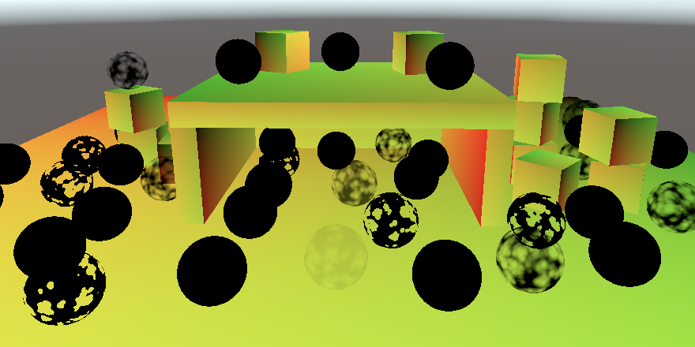

<p align=center><font color=#B8B8B8 ><i>Light map coordinates.</i></p>

所有静态烘烤的物体现在都显示它们的UV，而所有动态物体都保持黑色。

### 2.3 Transformed Light Map Coordinates

光照图坐标通常是由Unity自动生成的，或者是导入的网格数据的一部分。他们定义了一个纹理解包，将网格压平，使其映射到纹理坐标。在光照图中，每个物体的解包都被缩放和定位，所以每个实例都有自己的空间。这就像应用于基础UV的缩放和平移一样。我们也要把它应用到光照图的UV上。

光照图的UV变换作为UnityPerDraw缓冲区的一部分被传递给GPU，所以要把它加到那里。它被称为unity_LightmapST。尽管它已被废弃，但也要在它之后添加unityDynamicLightmapST，否则SRP批处理程序的兼容性会被破坏。

```c
CBUFFER_START(UnityPerDraw)
	float4x4 unity_ObjectToWorld;
	float4x4 unity_WorldToObject;
	float4 unity_LODFade;
	real4 unity_WorldTransformParams;

	float4 unity_LightmapST;
	float4 unity_DynamicLightmapST;
CBUFFER_END
```

>光照贴图是否可以与GPU实例化一起使用？
>是的。所有的UnityPerDraw数据在需要时都会被实例化。

然后调整TRANSFER_GI_DATA宏，使其应用转换。宏定义可以分成多行，如果每行的末尾都用反斜杠标记，但最后一行除外。

```c
	#define TRANSFER_GI_DATA(input, output) \
		output.lightMapUV = input.lightMapUV * \
		unity_LightmapST.xy + unity_LightmapST.zw;
```


<p align=center><font color=#B8B8B8 ><i>Transformed light map coordinates.</i></p>

### 2.4 Sampling the Light Map

对光照图的采样是GI的责任。光照图纹理被称为unity_Lightmap，并伴随有采样器状态。也包括核心RP库中的EntityLighting.hlsl，因为我们将用它来检索光照数据。

```c
#include "Packages/com.unity.render-pipelines.core/ShaderLibrary/EntityLighting.hlsl"

TEXTURE2D(unity_Lightmap);
SAMPLER(samplerunity_Lightmap);
```

创建一个SampleLightMap函数，当有光照图时调用SampleSingleLightmap，否则返回0。在GetGI中使用它来设置漫反射光。

```c
float3 SampleLightMap (float2 lightMapUV) {
	#if defined(LIGHTMAP_ON)
		return SampleSingleLightmap(lightMapUV);
	#else
		return 0.0;
	#endif
}

GI GetGI (float2 lightMapUV) {
	GI gi;
	gi.diffuse = SampleLightMap(lightMapUV);
	return gi;
}
```

SampleSingleLightmap函数还需要一些参数。首先，我们必须把纹理和采样器状态作为前两个参数传给它，为此我们可以使用TEXTURE2D_ARGS宏。

```c
		return SampleSingleLightmap(
			TEXTURE2D_ARGS(unity_Lightmap, samplerunity_Lightmap), lightMapUV
		);
```

之后是要应用的缩放和平移。因为我们之前已经做过了，所以在这里我们将使用一个身份转换。

```c
		return SampleSingleLightmap(
			TEXTURE2D_ARGS(unity_Lightmap, samplerunity_Lightmap), lightMapUV,
			float4(1.0, 1.0, 0.0, 0.0)
		);
```

然后是一个布尔值，表示光照图是否被压缩，当UNITY_LIGHTMAP_FULL_HDR没有被定义时，就是这种情况。最后一个参数是一个包含解码指令的float4。它的第一个组件使用LIGHTMAP_HDR_MULTIPLIER，第二个组件使用LIGHTMAP_HDR_EXPONENT。它的其他组件没有被使用。

```c
		return SampleSingleLightmap(
			TEXTURE2D_ARGS(unity_Lightmap, samplerunity_Lightmap), lightMapUV,
			float4(1.0, 1.0, 0.0, 0.0),
			#if defined(UNITY_LIGHTMAP_FULL_HDR)
				false,
			#else
				true,
			#endif
			float4(LIGHTMAP_HDR_MULTIPLIER, LIGHTMAP_HDR_EXPONENT, 0.0, 0.0)
		);
```

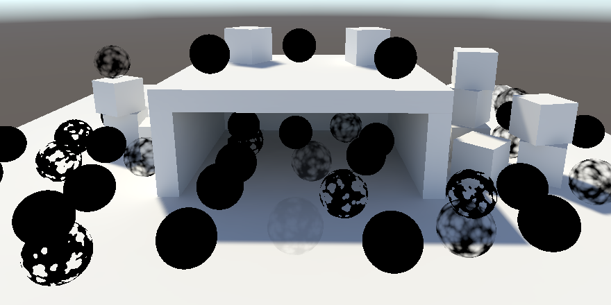

<p align=center><font color=#B8B8B8 ><i>Sampled baked light.</i></p>

### 2.5 Disabling Environment Lighting

烘烤的光线是相当明亮的，因为它还包括来自天空的间接照明。我们可以通过将其*Intensity Multiplier*减少到零来禁用它。这样我们就可以把注意力集中在单一方向的光线上。


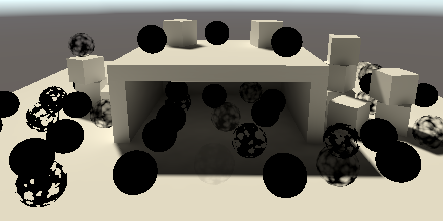

<p align=center><font color=#B8B8B8 ><i>Environment intensity set to zero.</i></p>

请注意，现在结构的内部是间接照明，主要是通过地面。

>我们还能烤制其他类型的灯吗？
>是的，尽管我们目前只关注方向性灯光。其他类型的灯可以烘烤，但需要一些额外的工作才能正确地烘烤。

## 3. Light Probes

动态物体不影响烘焙的全局光照，但它们可以通过光探针受其影响。光线探针是场景中的一个点，它通过用三阶多项式，特别是L2球面谐波来近似烘烤所有进入的光线。光探针被放置在场景周围，Unity在每个物体之间进行插值，得出它们位置的最终照明近似值。

### 3.1 Light Probe Group

通过**GameObject/Light/Light Probe Group**创建一个灯光探针组，将灯光探针添加到场景中。这将创建一个具有[LightProbeGroup](http://docs.unity3d.com/Documentation/ScriptReference/LightProbeGroup.html)组件的游戏对象，该组件默认包含六个立方体形状的探头。启用 *Edit Light Probes* 后，你可以移动、复制和删除单个探针，就像它们是游戏对象一样。

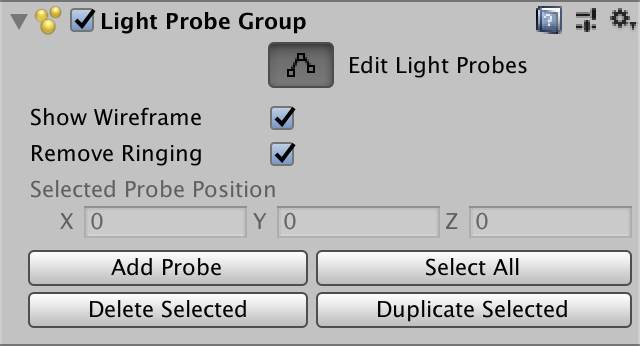

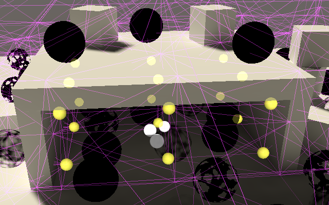

<p align=center><font color=#B8B8B8 ><i>Editing light probe group inside structure.</i></p>

一个场景中可以有多个探测组。Unity将所有的探针组合起来，然后创建一个连接它们的四面体网格。每个动态物体最终都在一个四面体内。在其顶点的四个探针被插值，以达到应用于物体的最终照明。如果一个物体最终出现在探针覆盖的区域之外，就会使用最近的三角形来代替，所以照明可能会显得很奇怪。

默认情况下，当一个动态物体被选中时，会使用小工具来显示影响该物体的探针，以及其位置的内插结果。你可以通过调整照明窗口的调试设置下的光探针可视化来改变这一点。


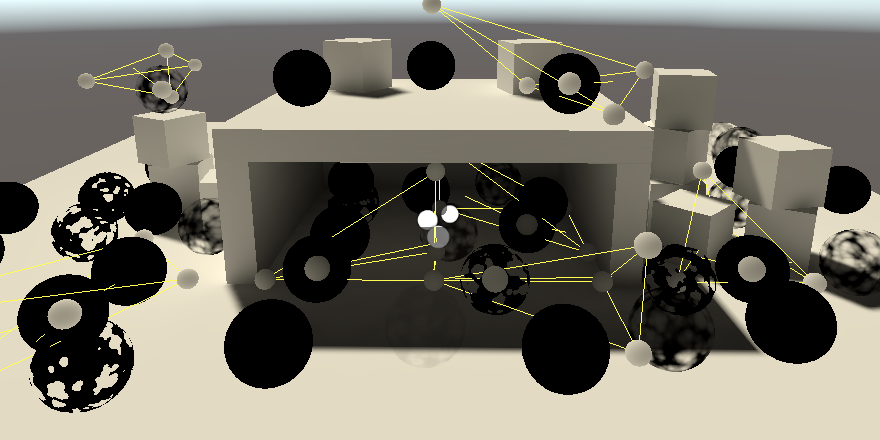

<p align=center><font color=#B8B8B8 ><i>Light probes used by selected objects.</i></p>

你在哪里放置探照灯取决于场景。首先，它们只需要放在动态物体的地方。第二，把它们放在有照明变化的地方。每个探针都是插值的终点，所以把它们放在光照转换的地方。第三，不要把它们放在烘烤的几何体里面，因为它们最终会变成黑色。最后，插值会穿过物体，所以如果一堵墙的两边光照不同，就把探针放在靠近墙的两边。这样，就不会有物体在两边插值了。除此之外，你必须进行试验。


<p align=center><font color=#B8B8B8 ><i>Showing all light probes.</i></p>

### 3.2 Sampling Probes

插值的探照灯数据必须被传递给每个物体的GPU。我们必须告诉Unity这样做，这次是通过PerObjectData.LightProbe而不是PerObjectData.Lightmaps。我们需要启用这两个特征标志，所以用布尔OR运算符将它们结合起来。

```cs
			perObjectData = PerObjectData.Lightmaps | PerObjectData.LightProbe
```

所需的UnityPerDraw数据由七个float4向量组成，代表红、绿、蓝光的多项式分量。它们被命名为unity_SH*，*代表A、B或C。前两个有三个版本，分别是r、g和b的后缀。

```c
CBUFFER_START(UnityPerDraw)
	…

	float4 unity_SHAr;
	float4 unity_SHAg;
	float4 unity_SHAb;
	float4 unity_SHBr;
	float4 unity_SHBg;
	float4 unity_SHBb;
	float4 unity_SHC;
CBUFFER_END
```

我们通过一个新的SampleLightProbe函数对GI中的光探针进行采样。我们需要一个方向来做这个，所以给它一个世界空间的表面参数。

如果这个对象正在使用光照图，那么返回0。否则返回0和SampleSH9的最大值。该函数需要探测数据和法线向量作为参数。探针数据必须以系数数组的形式提供。

```c
float3 SampleLightProbe (Surface surfaceWS) {
	#if defined(LIGHTMAP_ON)
		return 0.0;
	#else
		float4 coefficients[7];
		coefficients[0] = unity_SHAr;
		coefficients[1] = unity_SHAg;
		coefficients[2] = unity_SHAb;
		coefficients[3] = unity_SHBr;
		coefficients[4] = unity_SHBg;
		coefficients[5] = unity_SHBb;
		coefficients[6] = unity_SHC;
		return max(0.0, SampleSH9(coefficients, surfaceWS.normal));
	#endif
}
```

在GetGI中添加一个表面参数，使其将光探针样本添加到漫射光中。

```c
GI GetGI (float2 lightMapUV, Surface surfaceWS) {
	GI gi;
	gi.diffuse = SampleLightMap(lightMapUV) + SampleLightProbe(surfaceWS);
	return gi;
}
```

最后，在LitPassFragment中把表面传递给它。

```c
	GI gi = GetGI(GI_FRAGMENT_DATA(input), surface);
```


<p align=center><font color=#B8B8B8 ><i>Sampling light probes.</i></p>

### 3.3 Light Probe Proxy Volumes

光线探针对相当小的动态物体有效，但由于照明是基于单点的，所以对较大的物体来说效果并不理想。作为一个例子，我在场景中添加了两个被拉伸的立方体。因为它们的位置位于黑暗区域内，所以立方体是均匀的黑暗，尽管这显然不符合照明的要求。

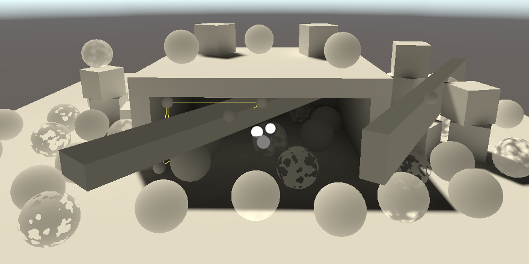

<p align=center><font color=#B8B8B8 ><i>Large objects sampling from one position.</i></p>

我们可以通过使用光探针代理体，简称LPPV来解决这个限制。最简单的做法是在每个立方体上添加一个LightProbeProxyVolume组件，然后将它们的光探针模式设置为使用代理卷。

Volume可以用多种方式配置。在这个案例中，我使用了一个自定义的分辨率模式，将子探针沿着立方体的边缘放置，所以它们是可见的。

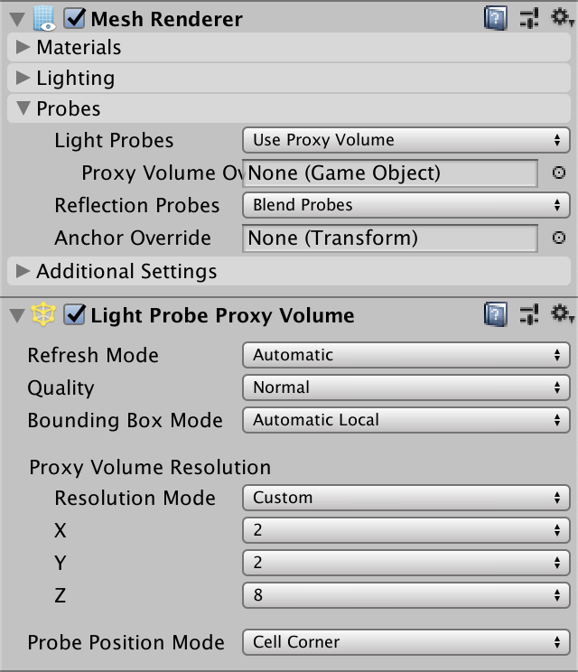


<p align=center><font color=#B8B8B8 ><i>Using LPPVs.</i></p>

> 为什么我在场景视图中没有看到探头？
> 当LPPV的刷新模式被设置为自动时，它们可能不会显示出来。在这种情况下，您可以暂时将其设置为每一帧。

### 3.4 Sampling LPPVs

LPPV也需要向每个物体的GPU发送数据。在这种情况下，我们必须启用PerObjectData.LightProbeProxyVolume。

```cs
			perObjectData =
				PerObjectData.Lightmaps | PerObjectData.LightProbe |
				PerObjectData.LightProbeProxyVolume
```

四个额外的值必须被添加到UnityPerDraw中：unity_ProbeVolumeParams, unity_ProbeVolumeWorldToObject, unity_ProbeVolumeSizeInv, 和unity_ProbeVolumeMin。第二个是一个矩阵，而其他的是4D向量。

```c
CBUFFER_START(UnityPerDraw)
	…

	float4 unity_ProbeVolumeParams;
	float4x4 unity_ProbeVolumeWorldToObject;
	float4 unity_ProbeVolumeSizeInv;
	float4 unity_ProbeVolumeMin;
CBUFFER_END
```

体积数据被存储在一个3D浮点纹理中，称为unity_ProbeVolumeSH。通过TEXTURE3D_FLOAT宏把它和它的采样器状态一起添加到GI中。

```c
TEXTURE3D_FLOAT(unity_ProbeVolumeSH);
SAMPLER(samplerunity_ProbeVolumeSH);
```

是否使用LPPV或插值光探针是通过unity_ProbeVolumeParams的第一个组件来传达的。如果它被设置了，那么我们必须通过SampleProbeVolumeSH4函数对体积进行采样。我们必须把纹理和采样器传给它，然后是世界位置和法线。然后是矩阵，unity_ProbeVolumeParams的Y和Z分量，接着是最小值和大小值的XYZ部分的数据。

```c
		if (unity_ProbeVolumeParams.x) {
			return SampleProbeVolumeSH4(
				TEXTURE3D_ARGS(unity_ProbeVolumeSH, samplerunity_ProbeVolumeSH),
				surfaceWS.position, surfaceWS.normal,
				unity_ProbeVolumeWorldToObject,
				unity_ProbeVolumeParams.y, unity_ProbeVolumeParams.z,
				unity_ProbeVolumeMin.xyz, unity_ProbeVolumeSizeInv.xyz
			);
		}
		else {
			float4 coefficients[7];
			coefficients[0] = unity_SHAr;
			coefficients[1] = unity_SHAg;
			coefficients[2] = unity_SHAb;
			coefficients[3] = unity_SHBr;
			coefficients[4] = unity_SHBg;
			coefficients[5] = unity_SHBb;
			coefficients[6] = unity_SHC;
			return max(0.0, SampleSH9(coefficients, surfaceWS.normal));
		}
```


<p align=center><font color=#B8B8B8 ><i>Sampling LPPVs.</i></p>

是否使用LPPV或插值光探针是通过unity_ProbeVolumeParams的第一个组件来传达的。如果它被设置了，那么我们必须通过SampleProbeVolumeSH4函数对体积进行采样。我们必须把纹理和采样器传给它，然后是世界位置和法线。然后是矩阵，unity_ProbeVolumeParams的Y和Z分量，接着是最小值和大小值的XYZ部分的数据。

## 4. Meta Pass

因为间接漫射光从表面反弹，它应该受到这些表面的漫反射率的影响。目前这种情况并没有发生。Unity将我们的表面视为均匀的白色。Unity使用一个特殊的meta pass来确定烘烤时的反射光。由于我们没有定义这样的传递，Unity使用了默认的传递，最后是白色的。

### 4.1 Unified Input

添加另一个通道意味着我们必须再次定义着色器属性。让我们从LitPass中提取基础纹理和UnityPerMaterial缓冲区，并把它放在一个新的Shaders/LitInput.hlsl文件中。我们还将通过引入TransformBaseUV、GetBase、GetCutoff、GetMetallic和GetSmoothness函数来隐藏实例化代码。给它们都提供一个基础UV参数，即使它是未使用的。一个值是否从地图中获取，也是这样隐藏的。

```c
#ifndef CUSTOM_LIT_INPUT_INCLUDED
#define CUSTOM_LIT_INPUT_INCLUDED

TEXTURE2D(_BaseMap);
SAMPLER(sampler_BaseMap);

UNITY_INSTANCING_BUFFER_START(UnityPerMaterial)
	UNITY_DEFINE_INSTANCED_PROP(float4, _BaseMap_ST)
	UNITY_DEFINE_INSTANCED_PROP(float4, _BaseColor)
	UNITY_DEFINE_INSTANCED_PROP(float, _Cutoff)
	UNITY_DEFINE_INSTANCED_PROP(float, _Metallic)
	UNITY_DEFINE_INSTANCED_PROP(float, _Smoothness)
UNITY_INSTANCING_BUFFER_END(UnityPerMaterial)

float2 TransformBaseUV (float2 baseUV) {
	float4 baseST = UNITY_ACCESS_INSTANCED_PROP(UnityPerMaterial, _BaseMap_ST);
	return baseUV * baseST.xy + baseST.zw;
}

float4 GetBase (float2 baseUV) {
	float4 map = SAMPLE_TEXTURE2D(_BaseMap, sampler_BaseMap, baseUV);
	float4 color = UNITY_ACCESS_INSTANCED_PROP(UnityPerMaterial, _BaseColor);
	return map * color;
}

float GetCutoff (float2 baseUV) {
	return UNITY_ACCESS_INSTANCED_PROP(UnityPerMaterial, _Cutoff);
}

float GetMetallic (float2 baseUV) {
	return UNITY_ACCESS_INSTANCED_PROP(UnityPerMaterial, _Metallic);
}

float GetSmoothness (float2 baseUV) {
	return UNITY_ACCESS_INSTANCED_PROP(UnityPerMaterial, _Smoothness);
}

#endif
```

为了在Lit的所有通道中包含这个文件，在其SubShader块的顶部，在通道之前添加一个HLSLINCLUDE块。将Common包含在其中，然后是LitInput。这段代码将被插入到所有通道的开头。

```c
	SubShader {
		HLSLINCLUDE
		#include "../ShaderLibrary/Common.hlsl"
		#include "LitInput.hlsl"
		ENDHLSL
		
		…
	}
```

从LitPass中删除现在重复的include语句和声明。

```c
//#include "../ShaderLibrary/Common.hlsl"
…

//TEXTURE2D(_BaseMap);
//SAMPLER(sampler_BaseMap);

//UNITY_INSTANCING_BUFFER_START(UnityPerMaterial)
	//…
//UNITY_INSTANCING_BUFFER_END(UnityPerMaterial)
```

在LitPassVertex中使用TransformBaseUV。

```c
	//float4 baseST = UNITY_ACCESS_INSTANCED_PROP(UnityPerMaterial, _BaseMap_ST);
	output.baseUV = TransformBaseUV(input.baseUV);
```

以及在LitPassFragment中检索着色器属性的相关函数。

```c
	//float4 baseMap = SAMPLE_TEXTURE2D(_BaseMap, sampler_BaseMap, input.baseUV);
	//float4 baseColor = UNITY_ACCESS_INSTANCED_PROP(UnityPerMaterial, _BaseColor);
	float4 base = GetBase(input.baseUV);
	#if defined(_CLIPPING)
		clip(base.a - GetCutoff(input.baseUV));
	#endif
	
	…
	surface.metallic = GetMetallic(input.baseUV);
	surface.smoothness = GetSmoothness(input.baseUV);
```

给ShadowCasterPass以同样的待遇。

### 4.2 Unlit

让我们也为Unlit shader做这件事。复制LitInput.hlsl并将其重命名为UnlitInput.hlsl。然后从其UnityPerMaterial版本中删除_Metallic和_Smoothness。保留GetMetallic和GetSmoothness函数，让它们返回0.0，代表一个非常暗淡的漫反射表面。之后，也给着色器一个HLSLINCLUDE块。

```c
		HLSLINCLUDE
		#include "../ShaderLibrary/Common.hlsl"
		#include "UnlitInput.hlsl"
		ENDHLSL
```

就像我们对LitPass所做的那样转换UnlitPass。请注意，ShadowCasterPass对这两种着色器都能正常工作，尽管它最终会有不同的输入定义。

### 4.3 Meta Light Mode

在Lit和Unlit着色器中都添加一个新的通道，LightMode设置为Meta。这个通道要求剔除总是关闭的，这可以通过添加Cull Off选项进行配置。它将使用MetaPassVertex和MetaPassFragment函数，定义在一个新的MetaPass.hlsl文件中。它不需要多编译指令。

```c
		Pass {
			Tags {
				"LightMode" = "Meta"
			}

			Cull Off

			HLSLPROGRAM
			#pragma target 3.5
			#pragma vertex MetaPassVertex
			#pragma fragment MetaPassFragment
			#include "MetaPass.hlsl"
			ENDHLSL
		}
```

我们需要知道表面的漫反射率，所以我们必须在MetaPassFragment中得到它的BRDF数据。因此，我们必须包括BRDF，加上Surface、Shadows和Light，因为它取决于它们。我们只需要知道物体空间的位置和基础UV，最初将剪辑空间的位置设置为零。表面可以通过ZERO_INITIALIZE(Surface, surface)初始化为零，之后我们只需要设置它的颜色、金属感和平滑度值。这就足以得到BRDF数据了，但我们首先要返回零。

```c
#ifndef CUSTOM_META_PASS_INCLUDED
#define CUSTOM_META_PASS_INCLUDED

#include "../ShaderLibrary/Surface.hlsl"
#include "../ShaderLibrary/Shadows.hlsl"
#include "../ShaderLibrary/Light.hlsl"
#include "../ShaderLibrary/BRDF.hlsl"

struct Attributes {
	float3 positionOS : POSITION;
	float2 baseUV : TEXCOORD0;
};

struct Varyings {
	float4 positionCS : SV_POSITION;
	float2 baseUV : VAR_BASE_UV;
};

Varyings MetaPassVertex (Attributes input) {
	Varyings output;
	output.positionCS = 0.0;
	output.baseUV = TransformBaseUV(input.baseUV);
	return output;
}

float4 MetaPassFragment (Varyings input) : SV_TARGET {
	float4 base = GetBase(input.baseUV);
	Surface surface;
	ZERO_INITIALIZE(Surface, surface);
	surface.color = base.rgb;
	surface.metallic = GetMetallic(input.baseUV);
	surface.smoothness = GetSmoothness(input.baseUV);
	BRDF brdf = GetBRDF(surface);
	float4 meta = 0.0;
	return meta;
}

#endif
```

一旦Unity用我们自己的meta pass再次烘焙场景，所有的间接光照就会消失，因为黑色表面不会反射任何东西。

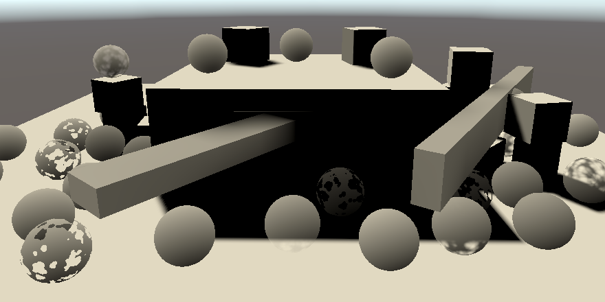

<p align=center><font color=#B8B8B8 ><i>No more indirect light.</i></p>

### 4.4 Light Map Coordinates

就像对光照图进行采样时，我们需要使用光照图的UV坐标。不同的是，这一次我们朝相反的方向走，用它们来表示XY对象空间的位置。之后，我们必须将其送入TransformWorldToHClip，尽管在这种情况下，该函数执行的是一种不同于其名称的变换。

```c
struct Attributes {
	float3 positionOS : POSITION;
	float2 baseUV : TEXCOORD0;
	float2 lightMapUV : TEXCOORD1;
};

…

Varyings MetaPassVertex (Attributes input) {
	Varyings output;
	input.positionOS.xy =
		input.lightMapUV * unity_LightmapST.xy + unity_LightmapST.zw;
	output.positionCS = TransformWorldToHClip(input.positionOS);
	output.baseUV = TransformBaseUV(input.baseUV);
	return output;
}
```

我们仍然需要对象空间的顶点属性作为输入，因为着色器希望它存在。事实上，似乎OpenGL不明确使用Z坐标就不会工作。我们将使用Unity自己的meta pass使用的相同的假赋值，即input.positionOS.z > 0.0 ? FLT_MIN : 0.0。

```c
	input.positionOS.xy =
		input.lightMapUV * unity_LightmapST.xy + unity_LightmapST.zw;
	input.positionOS.z = input.positionOS.z > 0.0 ? FLT_MIN : 0.0;
```

### 4.5 Diffuse Reflectivity

元传递可以用来生成不同的数据。所要求的东西是通过一个bool4 unity_MetaFragmentControl标志向量来传达的。

```c
bool4 unity_MetaFragmentControl;
```

如果X标志被设置了，那么就需要漫反射，所以要把它变成RGB结果。A分量应该被设置为1。

```c
	float4 meta = 0.0;
	if (unity_MetaFragmentControl.x) {
		meta = float4(brdf.diffuse, 1.0);
	}
	return meta;
```

这足以给反射光上色，但Unity的meta pass也能提高一些效果，通过添加按粗糙度缩放的一半镜面反射率。这背后的想法是，高镜面但粗糙的材料也会传递一些间接光。

```c
		meta = float4(brdf.diffuse, 1.0);
		meta.rgb += brdf.specular * brdf.roughness * 0.5;
```

之后，结果被修改，通过unity_OneOverOutputBoost与PositivePow方法将其提高到一个功率，然后将其限制在unity_MaxOutputValue。

```c
		meta.rgb += brdf.specular * brdf.roughness * 0.5;
		meta.rgb = min(
			PositivePow(meta.rgb, unity_OneOverOutputBoost), unity_MaxOutputValue
		);
```

这些值都是以浮点数提供的。

```c
float unity_OneOverOutputBoost;
float unity_MaxOutputValue;
```


<p align=center><font color=#B8B8B8 ><i>Colored indirect light, mostly green from the ground.</i></p>

现在我们得到了正确颜色的间接照明，也在GetLighting中对其应用接收面的漫反射率。

```c
	float3 color = gi.diffuse * brdf.diffuse;
```


<p align=center><font color=#B8B8B8 ><i>Properly colored baked lighting.</i></p>

让我们也把环境照明再次打开，把它的强度设置为1。

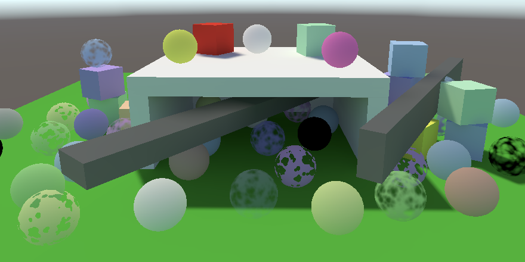

<p align=center><font color=#B8B8B8 ><i>With environment lighting.</i></p>

最后，将灯光的模式设置为混合模式。这使得它再次成为一个实时的灯光，所有的间接漫射照明都被烘烤出来。

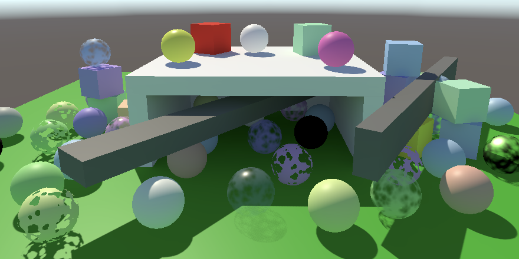

<p align=center><font color=#B8B8B8 ><i>Mixed lighting.</i></p>

## 5. Emissive Surfaces

有些表面会自己发光，因此即使在没有其他照明的情况下也能看到。这可以通过简单地在LitPassFragment的末尾添加一些颜色来实现。这不是一个真正的光源，所以它不会影响其他表面。然而，这种效果可以为烘烤照明做出贡献。

### 5.1 Emitted Light

为Lit shader添加两个新的属性：一个发射图和颜色，就像基础图和颜色一样。然而，我们将为两者使用相同的坐标变换，所以我们不需要为发射图显示单独的控件。它们可以通过赋予它NoScaleOffset属性而被隐藏。为了支持非常明亮的发射，给颜色添加HDR属性。这使得通过检查器配置亮度大于1的颜色成为可能，显示一个HRD颜色的弹出窗口，而不是普通的窗口。

作为一个例子，我做了一个不透明的发光材料，它使用了Default-Particle纹理，其中包含一个圆形的渐变，从而产生了一个明亮的点。

```c
		[NoScaleOffset] _EmissionMap("Emission", 2D) = "white" {}
		[HDR] _EmissionColor("Emission", Color) = (0.0, 0.0, 0.0, 0.0)
```


<p align=center><font color=#B8B8B8 ><i>Material with emission set to white dots.</i></p>

将贴图添加到LitInput，将发射颜色添加到UnityPerMaterial。然后添加一个GetEmission函数，它的工作原理和GetBase一样，只是它使用了其他的纹理和颜色。

```c
TEXTURE2D(_BaseMap);
TEXTURE2D(_EmissionMap);
SAMPLER(sampler_BaseMap);

UNITY_INSTANCING_BUFFER_START(UnityPerMaterial)
	UNITY_DEFINE_INSTANCED_PROP(float4, _BaseMap_ST)
	UNITY_DEFINE_INSTANCED_PROP(float4, _BaseColor)
	UNITY_DEFINE_INSTANCED_PROP(float4, _EmissionColor)
	…
UNITY_INSTANCING_BUFFER_END(UnityPerMaterial)

…

float3 GetEmission (float2 baseUV) {
	float4 map = SAMPLE_TEXTURE2D(_EmissionMap, sampler_BaseMap, baseUV);
	float4 color = UNITY_ACCESS_INSTANCED_PROP(UnityPerMaterial, _EmissionColor);
	return map.rgb * color.rgb;
}
```

在LitPassFragment的结尾处将排放物添加到最终颜色。

```c
	float3 color = GetLighting(surface, brdf, gi);
	color += GetEmission(input.baseUV);
	return float4(color, surface.alpha);
```

同时为UnlitInput添加一个GetEmission函数。在这种情况下，我们只是让它成为GetBase的一个代理。因此，如果你烘烤一个不亮的物体，它最终会发出它的全部颜色。

```c
float3 GetEmission (float2 baseUV) {
	return GetBase(baseUV).rgb;
}
```

为了使无光材料能够发出非常明亮的光，我们可以在无光的基础颜色属性中添加HDR属性。

```c
		[HDR] _BaseColor("Color", Color) = (1.0, 1.0, 1.0, 1.0)
```

最后，让我们把发射颜色添加到PerObjectMaterialProperties中。在这种情况下，我们可以通过给配置字段加上ColorUsage属性来允许HDR输入。我们必须向它传递两个布尔值。第一个表示是否必须显示alpha通道，我们不需要。第二个表示是否允许HDR值。

```c
	static int
		baseColorId = Shader.PropertyToID("_BaseColor"),
		cutoffId = Shader.PropertyToID("_Cutoff"),
		metallicId = Shader.PropertyToID("_Metallic"),
		smoothnessId = Shader.PropertyToID("_Smoothness"),
		emissionColorId = Shader.PropertyToID("_EmissionColor");

	…

	[SerializeField, ColorUsage(false, true)]
	Color emissionColor = Color.black;

	…

	void OnValidate () {
		…
		block.SetColor(emissionColorId, emissionColor);
		GetComponent<Renderer>().SetPropertyBlock(block);
	}
```

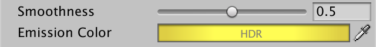

<p align=center><font color=#B8B8B8 ><i>Per-object emission set to HDR yellow.</i></p>

我在场景中添加了几个小的发光方块。我让它们为全局照明做贡献，并把它们在光照图中的比例增加了一倍，以避免出现UV坐标重叠的警告。当顶点在光照图中靠得太近时就会出现这种情况，所以它们必须共享同一个文本。

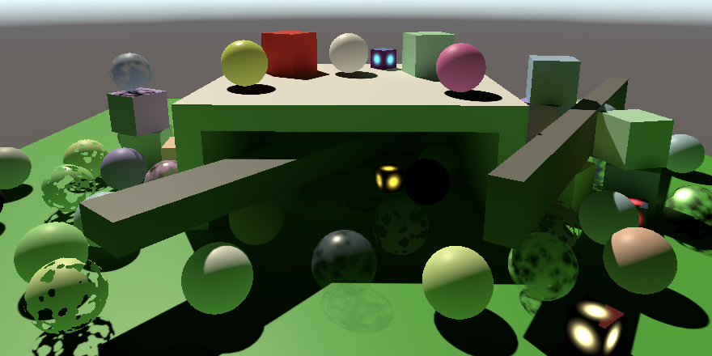

<p align=center><font color=#B8B8B8 ><i>Emissive cubes; no environment lighting.</i></p>

### 5.2 Baked Emission

放射光是通过一个单独的通道进行烘烤的。当unity_MetaFragmentControl的Y标志被设置时，MetaPassFragment应该返回发射的光，再次将A分量设置为1。

```c
	if (unity_MetaFragmentControl.x) {
		…
	}
	else if (unity_MetaFragmentControl.y) {
		meta = float4(GetEmission(input.baseUV), 1.0);
	}
```

但这并不会自动发生。我们必须启用每个材料的发射烘烤。我们可以通过在PerObjectMaterialProperties.OnGUI中调用编辑器上的LightmapEmissionProperty来显示这个配置选项。

```cs
public override void OnGUI (
	MaterialEditor materialEditor, MaterialProperty[] properties
) {
	EditorGUI.BeginChangeCheck();
	base.OnGUI(materialEditor, properties);
	editor = materialEditor;
	materials = materialEditor.targets;
	this.properties = properties;

	BakedEmission();

	…
}

void BakedEmission () {
	editor.LightmapEmissionProperty();
}c
```

这使得一个全局照明的下拉菜单显示出来，它最初被设置为无。尽管它的名字叫 "全局照明"，但它只影响烘烤的发光。把它改成烘烤的时候，lightmapper就会为发射的光运行一个单独的通道。还有一个Realtime选项，但它已经被废弃了。


<p align=center><font color=#B8B8B8 ><i>Emission set to baked.</i></p>

这还是不行，因为Unity在烘烤时积极地试图避免单独的发射通道。如果材料的发射被设置为零，那么它就被忽略了。然而，这并没有考虑到每个物体的材料属性。我们可以通过在改变发射模式时禁用所有选定材质的globalIlluminationFlags属性中默认的MaterialGlobalIlluminationFlags.EmissiveIsBlack标志来覆盖这一行为。这意味着你应该只在需要时启用烘烤选项。

```cs
	void BakedEmission () {
		EditorGUI.BeginChangeCheck();
		editor.LightmapEmissionProperty();
		if (EditorGUI.EndChangeCheck()) {
			foreach (Material m in editor.targets) {
				m.globalIlluminationFlags &=
					~MaterialGlobalIlluminationFlags.EmissiveIsBlack;
			}
		}
	}
```

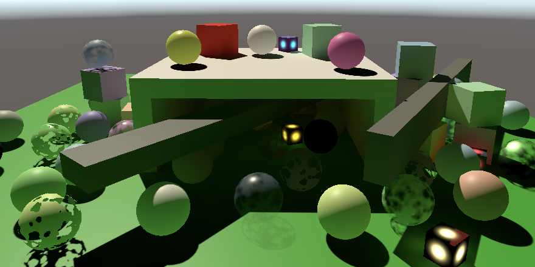

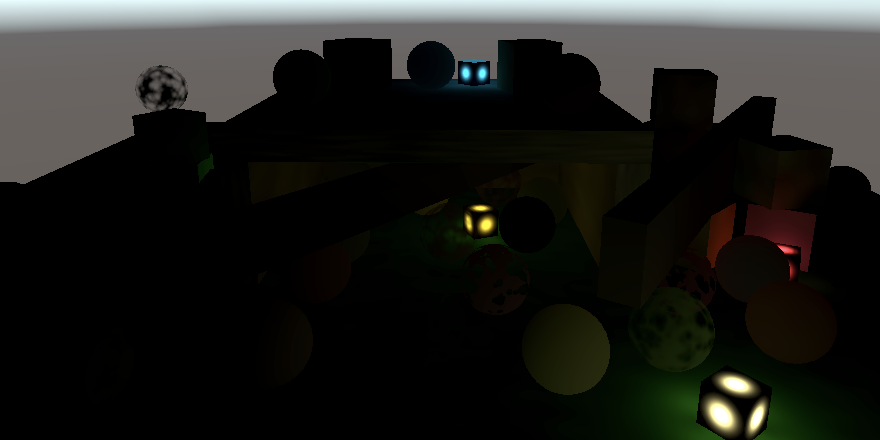

<p align=center><font color=#B8B8B8 ><i>Baked emission, with and without directional light.</i></p>

## 6. Baked Transparency

烘烤透明物体也是可能的，但这需要一点额外的努力。


<p align=center><font color=#B8B8B8 ><i>Semitransparent ceiling treated as opaque.</i></p>

### 6.1 Hard-Coded Properties

不幸的是，Unity的lightmapper对透明度有一个硬编码的方法。它通过查看材质的队列来确定它是不透明的、剪切的还是透明的。然后，它通过乘以_MainTex和_Color属性的alpha分量来确定透明度，使用_Cutoff属性进行alpha剪切。我们的着色器有第三个，但缺乏前两个。目前唯一的方法是将预期的属性添加到我们的明暗器中，赋予它们HideInInspector属性，这样它们就不会在检查器中显示出来。Unity的SRP明暗器也必须处理同样的问题。

```c
		[HideInInspector] _MainTex("Texture for Lightmap", 2D) = "white" {}
		[HideInInspector] _Color("Color for Lightmap", Color) = (0.5, 0.5, 0.5, 1.0)
```

### 6.2 Copying Properties

我们必须确保_MainTex属性指向与_BaseMap相同的纹理并使用相同的UV变换。两个颜色属性也必须是相同的。我们可以在一个新的CopyLightMappingProperties方法中做到这一点，如果发生了变化，我们会在CustomShaderGUI.OnGUI的结尾处调用这个方法。如果相关的属性存在，就复制它们的值。

```cs
	public override void OnGUI (
		MaterialEditor materialEditor, MaterialProperty[] properties
	) {
		…

		if (EditorGUI.EndChangeCheck()) {
			SetShadowCasterPass();
			CopyLightMappingProperties();
		}
	}

	void CopyLightMappingProperties () {
		MaterialProperty mainTex = FindProperty("_MainTex", properties, false);
		MaterialProperty baseMap = FindProperty("_BaseMap", properties, false);
		if (mainTex != null && baseMap != null) {
			mainTex.textureValue = baseMap.textureValue;
			mainTex.textureScaleAndOffset = baseMap.textureScaleAndOffset;
		}
		MaterialProperty color = FindProperty("_Color", properties, false);
		MaterialProperty baseColor =
			FindProperty("_BaseColor", properties, false);
		if (color != null && baseColor != null) {
			color.colorValue = baseColor.colorValue;
		}
	}
```

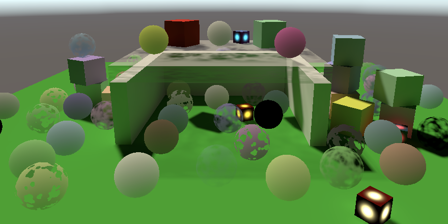

<p align=center><font color=#B8B8B8 ><i>Transparency correctly baked.</i></p>

这也适用于剪切的材料。虽然有可能，但不需要在MetaPassFragment中剪辑碎片，因为透明度是单独处理的。


<p align=center><font color=#B8B8B8 ><i>Baked clipping.</i></p>

不幸的是，这意味着烘烤的透明度只能依赖于单一的纹理、颜色和截止点属性。另外，lightmapper只考虑材质的属性。每个实例的属性都被忽略了。

## 7. Mesh Ball

我们通过为MeshBall生成的实例添加对全局光照的支持来结束。由于它的实例是在游戏模式下生成的，所以它们不能被烘焙，但只要稍加努力，它们就可以通过光探针接受烘焙的照明。


<p align=center><font color=#B8B8B8 ><i>Mesh ball with fully-baked lighting.</i></p>

### 7.1 Light Probes

我们通过调用一个变体DrawMeshInstanced方法来表明应该使用光探针，这个方法还需要五个参数。首先是投影模式，我们希望它是开启的。之后是实例是否应该投射阴影，我们希望如此。接下来是图层，我们只需使用默认的0。然后，我们必须提供一个相机，让实例可以看到。传递null意味着他们应该对所有的摄像机都进行渲染。最后我们可以设置探照灯模式。我们必须使用LightProbeUsage.CustomProvided，因为没有一个位置可以用来混合探测。

```cs
using UnityEngine;
using UnityEngine.Rendering;

public class MeshBall : MonoBehaviour {
	
	…
	
	void Update () {
		if (block == null) {
			block = new MaterialPropertyBlock();
			block.SetVectorArray(baseColorId, baseColors);
			block.SetFloatArray(metallicId, metallic);
			block.SetFloatArray(smoothnessId, smoothness);
		}
		Graphics.DrawMeshInstanced(
			mesh, 0, material, matrices, 1023, block,
			ShadowCastingMode.On, true, 0, null, LightProbeUsage.CustomProvided
		);
	}
```

我们必须手动生成所有实例的插值光探针，并将它们添加到材料属性块中。这意味着我们需要在配置块的时候访问实例的位置。我们可以通过抓取它们的变换矩阵的最后一列来获取它们，并将它们存储在一个临时数组中。

```cs
		if (block == null) {
			block = new MaterialPropertyBlock();
			block.SetVectorArray(baseColorId, baseColors);
			block.SetFloatArray(metallicId, metallic);
			block.SetFloatArray(smoothnessId, smoothness);

			var positions = new Vector3[1023];
			for (int i = 0; i < matrices.Length; i++) {
				positions[i] = matrices[i].GetColumn(3);
			}
		}
```

光探针必须通过一个SphericalHarmonicsL2数组提供。它是通过调用LightProbes.CalculateInterpolatedLightAndOcclusionProbes，以位置和光探头数组为参数来填充的。还有第三个参数用于闭塞，我们将使用null。

```cs
			for (int i = 0; i < matrices.Length; i++) {
				positions[i] = matrices[i].GetColumn(3);
			}
			var lightProbes = new SphericalHarmonicsL2[1023];
			LightProbes.CalculateInterpolatedLightAndOcclusionProbes(
				positions, lightProbes, null
			);
```

> 我们不能在这里使用列表吗？
> 是的，有一个CalculateInterpolatedLightAndOcclusionProbes的变体可以做到。但是我们只需要一次数据，所以在这种情况下，列表对我们没有好处。

之后，我们可以通过CopySHCoefficientArraysFrom将光探针复制到该区块。

```cs
			LightProbes.CalculateInterpolatedLightAndOcclusionProbes(
				positions, lightProbes, null
			);
			block.CopySHCoefficientArraysFrom(lightProbes);
```

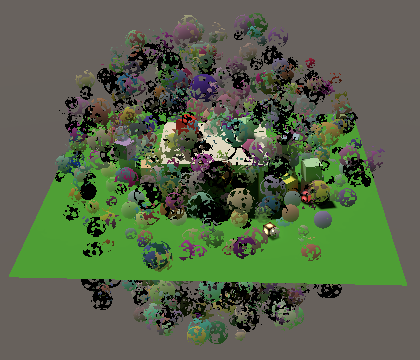

<p align=center><font color=#B8B8B8 ><i>Using light probes.</i></p>

### 7.2 LPPV

另一种方法是使用LPPV。这很有意义，因为实例都存在于一个狭小的空间里。这使我们不必计算和存储内插的光探针。另外，只要实例保持在卷内，就可以对其位置进行动画处理，而不必每一帧都提供新的光探针数据。

添加一个LightProbeProxyVolume配置字段。如果它在使用中，那么就不要将光探针数据添加到块中。然后把LightProbeUsage.UseProxyVolume传给DrawMeshInstanced而不是LightProbeUsage.CustomProvided。我们总是可以提供体积作为一个额外的参数，即使它是空的，不被使用。

```cs
	[SerializeField]
	LightProbeProxyVolume lightProbeVolume = null;
	
	…

	void Update () {
		if (block == null) {
			…

			if (!lightProbeVolume) {
				var positions = new Vector3[1023];
				…
				block.CopySHCoefficientArraysFrom(lightProbes);
			}
		}
		Graphics.DrawMeshInstanced(
			mesh, 0, material, matrices, 1023, block,
			ShadowCastingMode.On, true, 0, null,
			lightProbeVolume ?
				LightProbeUsage.UseProxyVolume : LightProbeUsage.CustomProvided,
			lightProbeVolume
		);
	}
```

你可以在网格球上添加一个LPPV组件，或者把它放在其他地方。自定义边界模式可以用来定义体积所占据的世界空间区域。


<p align=center><font color=#B8B8B8 ><i>Using an LPPV.</i></p>
