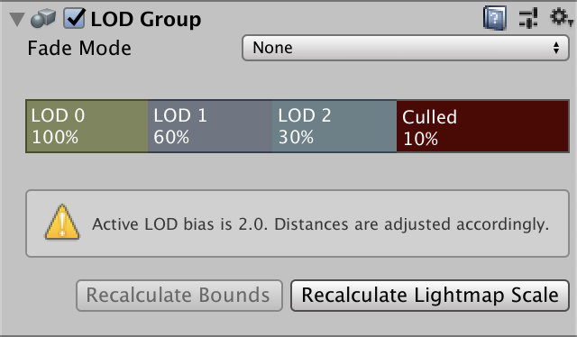
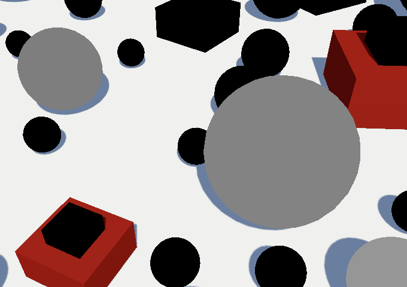

# LOD and Reflections

[原文地址](https://catlikecoding.com/unity/tutorials/custom-srp/lod-and-reflections/)

## 1. LOD Groups

许多小物体为场景增加了细节，使其更加有趣。然而，太小的细节如果不能覆盖多个像素，就会退化成不清晰的噪音。在这些视觉尺度上，最好不要渲染它们，这也能释放出CPU和GPU来渲染更重要的东西。我们也可以决定在较早的时候剔除这些物体，因为它们仍然可以被分辨出来。这可以进一步提高性能，但会导致事物根据其视觉尺寸突然出现和消失。我们还可以增加中间步骤，在最终完全剔除一个物体之前，切换到连续的不太详细的可视化。Unity通过使用LOD组使所有这些事情成为可能。

### 1.1 LOD Group Component

你可以通过创建一个空的游戏对象并向其添加一个LODGroup组件来向场景添加一个细节级别组。默认的组定义了四个级别。LOD 0, LOD 1, LOD 2, 最后是culled，这意味着没有任何东西被渲染。百分比代表了相对于显示窗口尺寸的估计视觉尺寸的阈值。因此，LOD 0用于覆盖窗口60%以上的物体，通常考虑垂直尺寸，因为那是最小的。



<p align=center><font color=#B8B8B8 ><i>Default LOD group component.</i></p>

然而，*Quality*项目设置部分包含一个LOD偏差，它可以缩放这些阈值。默认情况下，它被设置为2，这意味着它将该评估的估计视觉尺寸翻倍。因此，LOD 0最终被用于30%以上的一切，而不是只有60%。当偏差设置为1以外的时候，组件的检查器会显示一个警告。除此之外，还有一个最大LOD级别选项，可以用来限制最高LOD级别。例如，如果它被设置为1，那么LOD 1也将被使用，而不是LOD 0。

这个想法是，你让所有可视化LOD级别的游戏对象都成为组对象的子对象。例如，我用三个相同大小的彩色球体来表示三个LOD级别。


<p align=center><font color=#B8B8B8 ><i>LOD group containing three spheres.</i></p>

每个对象都必须被分配到适当的LOD级别。你可以通过在组组件中选择一个级别块，然后将对象拖到它的渲染器列表中，或者直接将它放到一个LOD级别块上。


<p align=center><font color=#B8B8B8 ><i>Renderers for LOD 0.</i></p>

Unity会自动渲染相应的对象。在编辑器中选择一个特定的对象将覆盖这一行为，所以你可以在场景中看到你的选择。如果你有一个LOD组本身被选中，编辑器也会显示当前可见的LOD级别。


<p align=center><font color=#B8B8B8 ><i>Scene with LOD sphere prefab instances.</i></p>

移动摄像机将改变每组使用的LOD级别。另外，你也可以调整LOD偏差，以看到可视化的变化，而其他方面保持不变。

<video width="320" height="240" controls>
    <source src="ImaginativeDifficultDevilfish.mp4" type="video/mp4">
</video>

<p align=center><font color=#B8B8B8 ><i>Adjusting LOD bias.</i></p>

### 1.2 Additive LOD Groups

对象可以被添加到一个以上的LOD级别。你可以利用这一点将较小的细节添加到较高的层次，而同样较大的物体则用于多个层次。例如，我用堆叠的扁平立方体做了一个三层的金字塔。基层立方体是所有三个层次的一部分。中间的立方体是LOD 0和LOD 1的一部分，而最小的顶层立方体只是LOD 0的一部分。 因此，细节并根据视觉尺寸添加和删除到组中，而不是替换整个东西。


<p align=center><font color=#B8B8B8 ><i>Stacked cubes LOD groups.</i></p>

>LOD组可以进行光照映射吗？
>可以。当你让一个LOD组贡献给GI时，它确实被包括在光照映射中。LOD 0被用来进行光照映射，这是预料之中的。其他的LOD级别也会被烘焙成光照，但是场景的其他部分只考虑到LOD 0。你也可以决定只烘烤一些层次，而让其他的层次依靠光线探测器。

### 1.3 LOD Transitions

LOD级别的突然交换在视觉上可能会很刺眼，尤其是当一个物体由于自身或摄像机的轻微移动而最终快速来回切换时。通过将组的淡出模式设置为交叉淡出，可以使这种过渡变得渐进。这使得旧的层次淡出，而新的层次同时淡入。


<p align=center><font color=#B8B8B8 ><i>Cross-fade mode.</i></p>

>那么Speed Tree的淡化模式选项呢？
>那个模式是专门针对SpeedTree树的，它使用它自己的LOD系统来折叠树，并在3D模型和广告牌表现之间过渡。我们不会使用它。

你可以控制每个LOD级别何时开始交叉渐变到下一个级别。这个选项在交叉渐变被启用时是可见的。渐变过渡宽度为0意味着在这个级别和下一个级别之间没有渐变，而数值为1意味着它立即开始渐变。在0.5时，在默认设置下，LOD 0会在80%时开始交叉淡化到LOD 1。


<p align=center><font color=#B8B8B8 ><i>Fade transition width.</i></p>

当交叉渐变被激活时，两个LOD级别会同时被渲染。这就需要着色器以某种方式来混合它们。Unity为LOD_FADE_CROSSFADE关键字挑选了一个着色器变体，所以在我们的Lit着色器中为它添加了一个多编译指令。对CustomLit和ShadowCaster通道都要这样做。

```c
			#pragma multi_compile _ LOD_FADE_CROSSFADE
```

一个物体被淡化的程度通过UnityPerDraw缓冲区的unity_LODFade向量来传达，我们已经定义了它。它的X分量包含淡化因子。它的Y分量包含相同的因子，但被量化为16个步骤，我们不会使用它。让我们通过在LitPassFragment的开始部分返回淡出系数，使其在使用时可视化。

```c
float4 LitPassFragment (Varyings input) : SV_TARGET {
	UNITY_SETUP_INSTANCE_ID(input);
	#if defined(LOD_FADE_CROSSFADE)
		return unity_LODFade.x;
	#endif
	
	…
}
```


<p align=center><font color=#B8B8B8 ><i>Fade transition width.</i></p>

逐渐消失的物体开始时的系数为1，然后减少到0，如预期。但是我们也看到了代表更高LOD级别的纯黑色物体。这是因为正在淡出的对象的淡出系数被取反了。我们可以通过返回被取反的淡出系数来看到这一点。

```c
		return -unity_LODFade.x;
```



<p align=center><font color=#B8B8B8 ><i>Negated fade factor.</i></p>

注意，处于两个LOD级别的物体不会与自己交叉淡化。

### 1.4 Dithering

为了混合这两个LOD级别，我们可以使用剪切，应用一种类似于接近半透明阴影的方法。由于我们需要对两个表面和它们的阴影都这样做，让我们为这个添加一个ClipLOD函数。给它提供剪辑空间的XY坐标和淡化系数作为参数。然后--如果交叉渐变是有效的--根据渐变系数减去抖动模式来剪辑。

```c
void ClipLOD (float2 positionCS, float fade) {
	#if defined(LOD_FADE_CROSSFADE)
		float dither = 0;
		clip(fade - dither);
	#endif
}
```

为了检查剪裁是否像预期的那样工作，我们将从一个每32像素重复的垂直渐变开始。这应该会产生交替的水平条纹。

```c
		float dither = (positionCS.y % 32) / 32;
```

在LitPassFragment中调用ClipLOD，而不是返回渐变系数。

```c
	//#if defined(LOD_FADE_CROSSFADE)
	//	return unity_LODFade.x;
	//#endif
	ClipLOD(input.positionCS.xy, unity_LODFade.x);
```

也可以在ShadowCasterPassFragment开始时调用它来交叉淡化阴影。

```c
void ShadowCasterPassFragment (Varyings input) {
	UNITY_SETUP_INSTANCE_ID(input);
	ClipLOD(input.positionCS.xy, unity_LODFade.x);

	…
}
```


<p align=center><font color=#B8B8B8 ><i>LOD stripes, half.</i></p>

我们得到了条纹状的渲染，但是在交叉淡入时只有两个LOD级别中的一个显示出来。这是因为其中一个有一个负的渐变系数。在这种情况下，我们通过添加而不是减去抖动模式来解决这个问题。

```c
		clip(fade + (fade < 0.0 ? dither : -dither));
```


<p align=center><font color=#B8B8B8 ><i>LOD stripes, complete.</i></p>

现在它已经工作了，我们可以切换到一个适当的抖动模式。让我们选择与我们用于半透明阴影的相同的模式。

```c
		float dither = InterleavedGradientNoise(positionCS.xy, 0);
```


<p align=center><font color=#B8B8B8 ><i>Dithered LOD.</i></p>

### 1.5 Animated Cross-Fading

虽然抖动创造了一个相当平滑的过渡，但模式很明显。而且，就像半透明的阴影一样，褪色的阴影是不稳定的，会让人分心。理想情况下，交叉渐变只是暂时的，即使这样也没有其他变化。我们可以通过启用LOD组的Animate Cross-fading选项来使它变成这样。这就不考虑淡化过渡的宽度，而是一旦一个组通过了LOD的阈值，就迅速交叉淡化。


<video width="320" height="240" controls>
    <source src="AssuredMarriedDove-mobile.mp4" type="video/mp4">
</video>

<p align=center><font color=#B8B8B8 ><i>Animated cross-fading.</i></p>

默认的动画持续时间是半秒，可以通过设置静态的LODGroup.crossFadeAnimationDuration属性来改变所有组。

## 2. Reflections