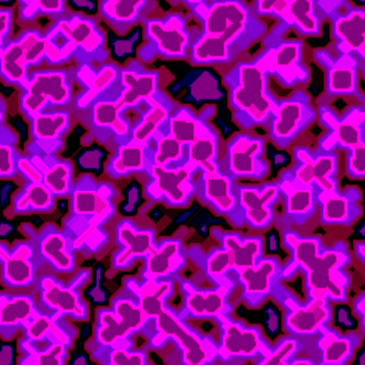
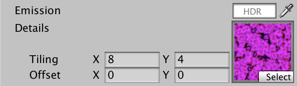
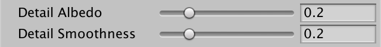
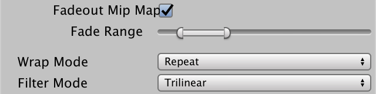
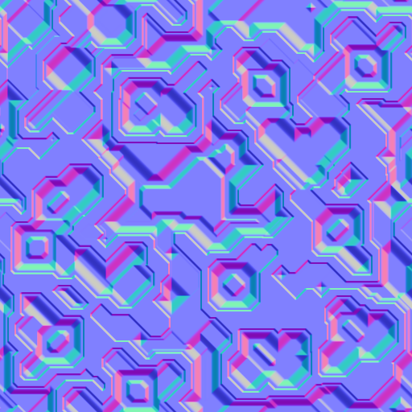

* [Complex Maps](https://catlikecoding.com/unity/tutorials/custom-srp/complex-maps/)

# Complex Maps

## 1. Circuitry Material

到目前为止，我们总是使用非常简单的材料来测试我们的RP。但它也应该支持复杂的材料，这样我们才能表现出更有趣的表面。在本教程中，我们将在一些纹理的帮助下，创建一个类似电路的艺术材料。

### 1.1 Albedo

我们材质的基础是其 [albedo map](https://catlikecoding.com/unity/tutorials/custom-srp/complex-maps/circuitry-material/circuitry-albedo.png)。它由几层不同色调的绿色组成，上面是金色。每个颜色区域都是统一的，除了一些棕色的污点，这使得我们更容易分辨出后面要添加的细节。


<p align=center><font color=#B8B8B8 ><i>Albedo map.</i></p>

用我们的Lit shader创建一个新材料，使用这个反照率贴图。我把它的平铺设置为2乘1，这样正方形纹理就可以包裹住一个球体而不会被拉得太长。默认球体的两极总是会发生很大的变形，这是无法避免的。


<p align=center><font color=#B8B8B8 ><i>Circuitry sphere.</i></p>

### 1.2 Emission

我们已经支持发射图，所以让我们使用一个在金色电路之上添加浅蓝色照明图案的图。


<p align=center><font color=#B8B8B8 ><i>Emission map.</i></p>

将其分配给材质，并将发射颜色设置为白色，这样它就变得可见。


<p align="center">
    
    
</p>

<p align=center><font color=#B8B8B8 ><i>Emissive circuitry.</i></p>

## 2. Mask Map

现在，我们不能做很多其他事情来使我们的材料更有趣。金色的电路应该是金属的，而绿色的电路板则不是，但我们目前只能配置统一的金属和光滑度值。我们需要额外的地图来支持整个表面的变化。


<p align=center><font color=#B8B8B8 ><i>Metallic 1 and smoothness 0.95.</i></p>

### 2.1 MODS

我们可以为金属感添加一个单独的贴图，为平滑度添加另一个贴图，但这两个贴图都只需要一个通道，所以我们可以将它们合并在一个贴图中。这个贴图被称为遮罩贴图，它的各个通道遮罩着不同的着色器属性。我们将使用与Unity的HDRP相同的格式，也就是MODS贴图。这代表Metallic(金属), Occlusion(遮蔽), Detail(细节), h和 Smoothness(平滑度)，按照这个顺序存储在RGBA通道中。

[Here](https://catlikecoding.com/unity/tutorials/custom-srp/complex-maps/mask-map/circuitry-mask-mods.png)是我们的电路的地图。它的所有通道都有数据，但目前我们只使用它的R和A通道。由于这个纹理包含遮罩数据而不是颜色，所以要确保它的sRGB（Color Texture）纹理导入属性被禁用。不这样做会导致GPU在对纹理进行采样时错误地应用伽玛-线性转换。


<p align=center><font color=#B8B8B8 ><i>Mask MODS map.</i></p>

为Lit添加一个遮罩图属性。因为它是一个遮罩，我们将使用白色作为默认值，这不会改变什么。

```c
		[NoScaleOffset] _MaskMap("Mask (MODS)", 2D) = "white" {}
		_Metallic ("Metallic", Range(0, 1)) = 0
		_Smoothness ("Smoothness", Range(0, 1)) = 0.5
```


<p align=center><font color=#B8B8B8 ><i>Mask shader property.</i></p>

### 2.2 Mask Input

给LitInput增加一个GetMask函数，简单地对遮罩纹理进行采样并返回。

```c
TEXTURE2D(_BaseMap);
TEXTURE2D(_MaskMap);
…

float4 GetMask (float2 baseUV) {
	return SAMPLE_TEXTURE2D(_MaskMap, sampler_BaseMap, baseUV);
}
```

在我们继续之前，也让我们把LitInput的代码整理一下。定义一个带有名称参数的INPUT_PROP宏，为使用UNITY_ACCESS_INSTANCED_PROP宏提供一个速记方法。

```c
#define INPUT_PROP(name) UNITY_ACCESS_INSTANCED_PROP(UnityPerMaterial, name)
```

现在我们可以简化所有getter函数的代码了。我只展示了在GetBase中检索_BaseMap_ST的变化。

```c
	float4 baseST = INPUT_PROP(_BaseMap_ST);
```

这一变化也可以应用于UnlitInput中的代码。

### 2.3 Metallic

LitPass不应该需要知道某些属性是否依赖掩码图。单独的函数可以在需要时检索掩码。在GetMetallic中这样做，通过乘法将其结果与遮罩的R通道进行遮罩。

```c
float GetMetallic (float2 baseUV) {
	float metallic = INPUT_PROP(_Metallic);
	metallic *= GetMask(baseUV).r;
	return metallic;
}
```


<p align=center><font color=#B8B8B8 ><i>Only golden circuitry is metallic.</i></p>

金属图通常大多是二进制的。在我们的案例中，金色的电路是完全金属化的，而绿色的电路板则不是。金色的染色区域是个例外，其金属性稍差。

### 2.4 Smoothness

在GetSmoothness中做同样的事情，这次是依靠遮罩的A通道。金色的电路是相当光滑的，而绿色的电路板则不光滑。

```c
float GetSmoothness (float2 baseUV) {
	float smoothness = INPUT_PROP(_Smoothness);
	smoothness *= GetMask(baseUV).a;
	return smoothness;
}
```


<p align=center><font color=#B8B8B8 ><i>Smoothness map in use.</i></p>

### 2.5 Occlusion

遮罩的G通道包含闭塞数据。我们的想法是，像缝隙和洞这样的小的后退区域大多被物体的其他部分所遮挡，但如果这些特征是由纹理表示的，那么就会被灯光所忽略。缺少的闭塞数据是由遮罩提供的。添加一个新的GetOcclusion函数来获取它，最初总是返回0，以展示其最大效果。

```c
float GetOcclusion (float2 baseUV) {
	return 0.0;
}
```

将闭塞数据添加到Surface结构中。

```c
struct Surface {
	…
	float occlusion;
	float smoothness;
	float fresnelStrength;
	float dither;
};
```

并在LitPassFragment中初始化它。

```c
	surface.metallic = GetMetallic(input.baseUV);
	surface.occlusion = GetOcclusion(input.baseUV);
	surface.smoothness = GetSmoothness(input.baseUV);
```

这个想法是，闭塞只适用于间接环境照明。直接光线不受影响，所以当光源直接对准它们时，间隙不会保持黑暗。因此，我们只用闭塞来调节间接BRDF的结果。

```c
float3 IndirectBRDF (
	Surface surface, BRDF brdf, float3 diffuse, float3 specular
) {
	…
	
    return (diffuse * brdf.diffuse + reflection) * surface.occlusion;
}
```


<p align=center><font color=#B8B8B8 ><i>Fully occluded.</i></p>

在验证了它的作用后，让GetOcclusion返回掩码的G通道。

```c
float GetOcclusion (float2 baseUV) {
	return GetMask(baseUV).g;
}
```


<p align=center><font color=#B8B8B8 ><i>Occlusion map in use.</i></p>

绿板的某些部分比其他部分低，因此它们应该被遮挡一下。这些区域很大，闭塞图处于最大强度以使效果清晰可见，但结果是太强了，没有意义。与其用更好的遮挡数据创建另一个遮挡图，不如给我们的着色器添加一个遮挡强度滑块属性。

```c
		[NoScaleOffset] _MaskMap("Mask (MODS)", 2D) = "white" {}
		_Metallic ("Metallic", Range(0, 1)) = 0
		_Occlusion ("Occlusion", Range(0, 1)) = 1
		_Smoothness ("Smoothness", Range(0, 1)) = 0.5
```


<p align=center><font color=#B8B8B8 ><i>Occlusion slider; reduced to 0.5.</i></p>

把它添加到UnityPerMaterial缓冲区。

```c
UNITY_INSTANCING_BUFFER_START(UnityPerMaterial)
	…
	UNITY_DEFINE_INSTANCED_PROP(float, _Occlusion)
	UNITY_DEFINE_INSTANCED_PROP(float, _Smoothness)
	UNITY_DEFINE_INSTANCED_PROP(float, _Fresnel)
UNITY_INSTANCING_BUFFER_END(UnityPerMaterial)
```

然后调整GetOcclusion，让它用属性来调节遮罩。在这种情况下，滑块控制遮罩的强度，所以如果它被设置为零，遮罩应该被完全忽略。我们可以根据强度在遮罩和1之间插值来实现这一点。

```c
float GetOcclusion (float2 baseUV) {
	float strength = INPUT_PROP(_Occlusion);
	float occlusion = GetMask(baseUV).g;
	occlusion = lerp(occlusion, 1.0, strength);
	return occlusion;
}
```


<p align=center><font color=#B8B8B8 ><i>Occlusion at half strength.</i></p>

## 3. Detail Map

下一步是为我们的材料添加一些细节。我们通过对一个比基础贴图更高的细节纹理进行采样，并将其与基础和遮罩数据相结合。这使得表面更加有趣，并且在近距离观察表面时提供了更高的分辨率信息，而基础贴图本身就会显得像素化。

细节应该只对表面的属性做一点修改，所以我们再一次将数据结合在一个非彩色地图中。HDRP使用ANySNx格式，这意味着它用R存储反照率调制，用B存储平滑度调制，用AG存储细节法线矢量的XY分量。但是[our map](https://catlikecoding.com/unity/tutorials/custom-srp/complex-maps/detail-map/circuitry-detail.png)不包含法线矢量，所以我们只使用RB通道。因此它是一个RGB纹理，而不是RGBA。



<p align=center><font color=#B8B8B8 ><i>Detail map; not sRGB.</i></p>

### 3.1 Detail UV coordinates

因为细节图应该使用比基础图更高的平铺，它需要自己的平铺和偏移。为它添加一个材质属性，这次没有NoScaleOffset属性。它的默认值应该不会引起任何变化，我们通过使用线性灰来获得，因为0.5的值将被视为中性。

```c
		[NoScaleOffset] _EmissionMap("Emission", 2D) = "white" {}
		[HDR] _EmissionColor("Emission", Color) = (0.0, 0.0, 0.0, 0.0)

		_DetailMap("Details", 2D) = "linearGrey" {}
```



<p align=center><font color=#B8B8B8 ><i>Detail map property; tiling four times as much.</i></p>

> 我们不能只是缩放基本的紫外线吗？
> 是的，这也是可以的，甚至可以说是很方便。但是为细节使用完全独立的UV坐标可以提供最大的灵活性。它也使得使用细节图而不依赖基础图成为可能，尽管这很罕见。

在LitInput中添加所需的纹理、采样器状态和缩放偏移属性，同时添加TransformDetailUV函数来转换细节纹理坐标。

```c
TEXTURE2D(_DetailMap);
SAMPLER(sampler_DetailMap);

UNITY_INSTANCING_BUFFER_START(UnityPerMaterial)
	UNITY_DEFINE_INSTANCED_PROP(float4, _BaseMap_ST)
	UNITY_DEFINE_INSTANCED_PROP(float4, _DetailMap_ST)
	…
UNITY_INSTANCING_BUFFER_END(UnityPerMaterial)

…

float2 TransformDetailUV (float2 detailUV) {
	float4 detailST = INPUT_PROP(_DetailMap_ST);
	return detailUV * detailST.xy + detailST.zw;
}
```

然后添加一个GetDetail函数来检索所有细节数据，给定细节UV。

```c
float4 GetDetail (float2 detailUV) {
	float4 map = SAMPLE_TEXTURE2D(_DetailMap, sampler_DetailMap, detailUV);
	return map;
}
```

对LitPassVertex中的坐标进行转换，并通过Varyings将它们传递出去。

```c
struct Varyings {
	…
	float2 baseUV : VAR_BASE_UV;
	float2 detailUV : VAR_DETAIL_UV;
	…
};

Varyings LitPassVertex (Attributes input) {
	…
	output.baseUV = TransformBaseUV(input.baseUV);
	output.detailUV = TransformDetailUV(input.baseUV);
	return output;
}
```

### 3.2 Detailed Albedo

为了给反照率添加细节，我们必须给GetBase添加一个细节UV的参数，我们将默认设置为零，这样现有的代码就不会中断。开始时，在计入颜色色调之前，简单地将所有细节直接添加到基础地图中。

```c
float4 GetBase (float2 baseUV, float2 detailUV = 0.0) {
	float4 map = SAMPLE_TEXTURE2D(_BaseMap, sampler_BaseMap, baseUV);
	float4 color = INPUT_PROP(_BaseColor);
	
	float4 detail = GetDetail(detailUV);
	map += detail;
	
	return map * color;
}
```

然后在LitPassFragment中把细节UV传给它。

```c
	float4 base = GetBase(input.baseUV, input.detailUV);
```


<p align=center><font color=#B8B8B8 ><i>Albedo details added.</i></p>

这证实了细节数据得到了正确的采样，但我们还没有正确解释它。首先，0.5的值是中性的。较高的值应该增加或变亮，而较低的值应该减少或变暗。要使其发挥作用的第一步是在GetDetail中将细节值范围从0-1转换为-1-1。

```c
float4 GetDetail (float2 detailUV) {
	float4 map = SAMPLE_TEXTURE2D(_DetailMap, sampler_DetailMap, detailUV);
	return map * 2.0 - 1.0;
}
```

第二，只有R通道会影响反照率，将其推向黑色或白色。这可以通过用0或1插值颜色来完成，这取决于细节的符号。然后，内插器就是绝对的细节值。这应该只影响反照率，而不是底座的alpha通道。

```c
	float detail = GetDetail(detailUV).r;
	//map += detail;
	map.rgb = lerp(map.rgb, detail < 0.0 ? 0.0 : 1.0, abs(detail));
```


<p align=center><font color=#B8B8B8 ><i>Albedo interpolated.</i></p>

这很有效，而且非常明显，因为我们的细节图非常强。但是变亮的效果似乎比变暗的效果更强。这是因为我们是在线性空间中应用修改。在伽马空间中进行修改会更符合视觉上的平等分布。我们可以通过内插反照率的平方根，并在之后进行平方处理来近似于此。

```
	map.rgb = lerp(sqrt(map.rgb), detail < 0.0 ? 0.0 : 1.0, abs(detail));
	map.rgb *= map.rgb;
```


<p align=center><font color=#B8B8B8 ><i>Perceptual interpolation; darkening appears stronger.</i></p>

目前，细节被应用于整个表面，但我们的想法是，大部分的黄金电路是不受影响的。这就是细节掩码的作用，存储在掩码图的B通道中。我们可以通过把它纳入插值器来应用它。

```c
	float mask = GetMask(baseUV).b;
	map.rgb = lerp(sqrt(map.rgb), detail < 0.0 ? 0.0 : 1.0, abs(detail) * mask);
```


<p align=center><font color=#B8B8B8 ><i>Masked details.</i></p>

我们的细节处于可能的最大强度，这太强了。让我们引入一个细节反照率强度滑块属性来缩小它们。

```c
		_DetailMap("Details", 2D) = "linearGrey" {}
		_DetailAlbedo("Detail Albedo", Range(0, 1)) = 1
```

把它添加到UnityPerMaterial中，并与GetBase中的细节相乘。

```c
UNITY_INSTANCING_BUFFER_START(UnityPerMaterial)
	…
	UNITY_DEFINE_INSTANCED_PROP(float, _DetailAlbedo)
UNITY_INSTANCING_BUFFER_END(UnityPerMaterial)

…

float4 GetBase (float2 baseUV, float2 detailUV = 0.0) {
	…
	float detail = GetDetail(detailUV).r * INPUT_PROP(_DetailAlbedo);
	…
}
```


<p align=center><font color=#B8B8B8 ><i>Albedo details scaled down to 0.2.</i></p>

### 3.3 Detailed Smoothness

为平滑度添加细节的方法是一样的。首先，为它也添加一个强度滑块属性。

```c
		_DetailAlbedo("Detail Albedo", Range(0, 1)) = 1
		_DetailSmoothness("Detail Smoothness", Range(0, 1)) = 1
```

然后将该属性添加到UnityPerMaterial中，在GetSmoothness中检索缩放后的细节，并以同样的方式进行插值。这一次我们需要细节图的B通道。

```c
UNITY_INSTANCING_BUFFER_START(UnityPerMaterial)
	…
	UNITY_DEFINE_INSTANCED_PROP(float, _DetailSmoothness)
UNITY_INSTANCING_BUFFER_END(UnityPerMaterial)

…

float GetSmoothness (float2 baseUV, float2 detailUV = 0.0) {
	float smoothness = INPUT_PROP(_Smoothness);
	smoothness *= GetMask(baseUV).a;

	float detail = GetDetail(detailUV).b * INPUT_PROP(_DetailSmoothness);
	float mask = GetMask(baseUV).b;
	smoothness = lerp(smoothness, detail < 0.0 ? 0.0 : 1.0, abs(detail) * mask);
	
	return smoothness;
}
```

让LitPassFragment把细节UV也传给GetSmoothness。

```
	surface.smoothness = GetSmoothness(input.baseUV, input.detailUV);
```



<p align="center">
    
    
</p>

<p align=center><font color=#B8B8B8 ><i>Smoothness details; at 0.2 and full strength.</i></p>

### 3.4 Fading Details

细节只有在它们足够大的时候才重要，在视觉上。细节不应该在它们太小的时候应用，因为那会产生一个嘈杂的结果。Mip映射像往常一样模糊了数据，但对于细节，我们想更进一步，把它们也淡化掉。


<p align=center><font color=#B8B8B8 ><i>Details at full strength.</i></p>

如果我们启用了细节纹理的Fadeout Mip Maps导入选项，Unity可以为我们自动淡化细节。一个范围滑块会显示出来，它可以控制在哪个mip级别开始和结束褪色。Unity简单地将Mip贴图插值为灰色，这意味着贴图变得中性。为了使其发挥作用，纹理的过滤模式必须设置为三线，这应该是自动发生的。




<p align=center><font color=#B8B8B8 ><i>Fading details.</i></p>

## 4. Normal Maps

尽管我们把我们的表面做得很复杂，但它仍然显得很平坦，因为它就是这样。光照与表面的法线相互作用，法线在每个三角形中都被平滑地插值。如果光照也能与它的小特征相互作用，我们的表面就会更加可信。我们可以通过增加对法线图的支持来做到这一点。

通常情况下，法线贴图是由一个高多边形密度的三维模型生成的，它被烤成一个低多边形的模型，以供实时使用。高多边形几何体的法线矢量如果丢失了，就会在法线贴图中被烘烤出来。或者，法线图是按程序生成的。下面是我们的电路的法线贴图。导入后将其纹理类型设置为法线贴图。



<p align=center><font color=#B8B8B8 ><i>Normal map.</i></p>

这个地图遵循标准的切线空间法线图惯例，将上轴--在这里指定为Z--存储在B通道中，而右边和前边的XY轴则存储在RG中。就像细节图一样，法线分量的-1-1范围被转换，所以0.5是中点。因此，平坦的区域显得偏蓝。

### 4.1 Sampling Normals

为了对法线进行采样，我们必须给我们的着色器添加一个法线图纹理属性，默认为凹凸，代表一个平面图。还要添加一个法线比例属性，这样我们就可以控制地图的强度。

```c
		[NoScaleOffset] _NormalMap("Normals", 2D) = "bump" {}
		_NormalScale("Normal Scale", Range(0, 1)) = 1
```


<p align=center><font color=#B8B8B8 ><i>Normal map and scale.</i></p>

存储法线信息的最直接的方法是如上所述--RGB通道中的XYZ，但这并不是最有效的方法。如果我们假设法线向量总是指向上方而不是下方，我们就可以省略向上的分量，而从其他两个分量中推导出它。然后，这些通道可以被存储在压缩的纹理格式中，这样可以使精度损失降到最低。XY被存储在RG或AG中，这取决于纹理格式。这将改变纹理的外观，但Unity编辑器只显示原始地图的预览和缩略图。

法线图是否被改变取决于目标平台。如果贴图没有被改变，那么UNITY_NO_DXT5nm就被定义了。如果是这样，我们可以使用UnpackNormalRGB函数来转换采样的法线数据，否则我们可以使用UnpackNormalmapRGorAG。这两个函数都有一个采样参数和一个比例参数，都是在核心RP库的打包文件中定义的。在Common中添加一个函数，使用这些函数对法线数据进行解码。

```c
#include "Packages/com.unity.render-pipelines.core/ShaderLibrary/SpaceTransforms.hlsl"
#include "Packages/com.unity.render-pipelines.core/ShaderLibrary/Packing.hlsl"

…

float3 DecodeNormal (float4 sample, float scale) {
	#if defined(UNITY_NO_DXT5nm)
	    return UnpackNormalRGB(sample, scale);
	#else
	    return UnpackNormalmapRGorAG(sample, scale);
	#endif
}
```

>DXT5nm是什么意思？
>DXT5-也被称为BC3-是一种压缩格式，它将纹理分割成4×4像素的块。每个块用两种颜色近似，每个像素都有插值。每个通道用于颜色的比特数是不同的。R和B各占5位，G占6位，A占8位。这就是为什么X坐标被移到A通道的原因之一。另一个原因是，RGB通道有一个查找表，而A通道有自己的查找表。这使X和Y分量保持隔离。
当DXT5被用来存储正常矢量时，它被称为DXT5nm。然而，当使用高压缩质量时，Unity更倾向于BC7压缩。这种模式的工作原理是一样的，但每个通道的比特量可以不同。因此，X通道不需要被移动。最终的纹理最终会变大，因为两个通道都使用了更多的比特，提高了纹理质量。
UnpackNormalmapRGorAG可以通过将R和A通道相乘来处理这两种方法。这需要将未使用的通道设置为1，Unity会自动这样做。

现在将法线图、法线比例尺和一个GetNormalTS函数添加到LitInput，并检索和解码法线向量。

```c
TEXTURE2D(_NormalMap);
…

UNITY_INSTANCING_BUFFER_START(UnityPerMaterial)
	…
	UNITY_DEFINE_INSTANCED_PROP(float, _NormalScale)
UNITY_INSTANCING_BUFFER_END(UnityPerMaterial)

…

float3 GetNormalTS (float2 baseUV) {
	float4 map = SAMPLE_TEXTURE2D(_NormalMap, sampler_BaseMap, baseUV);
	float scale = INPUT_PROP(_NormalScale);
	float3 normal = DecodeNormal(map, scale);
	return normal;
}
```

### 4.2 Tangent Space

由于纹理环绕着几何体，它们在物体和世界空间的方向并不统一。因此，存储法线的空间会出现曲线，以配合几何体的表面。唯一不变的是，这个空间是与表面相切的，这就是为什么它被称为切线空间。这个空间的Y上轴与表面法线相匹配。除此之外，它必须有一个与表面相切的X右轴。如果我们有了这两个，我们就可以从中产生Z轴。

因为切线空间的X轴不是常数，所以必须定义为网格顶点数据的一部分。它被存储为一个四分量的正切向量。它的XYZ分量定义物体空间的轴。它的W分量是-1或1，用来控制Z轴指向的方向。这用于翻转具有双边对称性的网格的法线贴图--大多数动物都有这种情况--因此同一贴图可以用于网格的两边，将所需的纹理大小减半。

因此，如果我们有世界空间的法线和切线向量，我们可以构造一个从切线到世界空间的转换矩阵。我们可以使用现有的CreateTangentToWorld函数，将法线、切线XYZ和切线W作为参数传递给它。然后我们可以用切线空间法线和转换矩阵作为参数来调用TransformTangentToWorld。在Common中添加一个能完成所有这些工作的函数。

```c
float3 NormalTangentToWorld (float3 normalTS, float3 normalWS, float4 tangentWS) {
	float3x3 tangentToWorld =
		CreateTangentToWorld(normalWS, tangentWS.xyz, tangentWS.w);
	return TransformTangentToWorld(normalTS, tangentToWorld);
}
```

接下来，在LitPass中，将具有TANGENT语义的物体空间切线向量添加到Attributes中，将世界空间切线添加到Varyings。

```c
struct Attributes {
	float3 positionOS : POSITION;
	float3 normalOS : NORMAL;
	float4 tangentOS : TANGENT;
	…
};

struct Varyings {
	float4 positionCS : SV_POSITION;
	float3 positionWS : VAR_POSITION;
	float3 normalWS : VAR_NORMAL;
	float4 tangentWS : VAR_TANGENT;
	…
};
```

切线矢量的XYZ部分可以通过调用TransformObjectToWorldDir转换为LitPassVertex的世界空间。

```c
	output.normalWS = TransformObjectToWorldNormal(input.normalOS);
	output.tangentWS =
		float4(TransformObjectToWorldDir(input.tangentOS.xyz), input.tangentOS.w);
```

最后，我们通过调用LitPassFragment中的NormalTangentToWorld来获得最终的映射法线。

```c
	surface.normal = NormalTangentToWorld(
		GetNormalTS(input.baseUV), input.normalWS, input.tangentWS
	);
```


<p align=center><font color=#B8B8B8 ><i>Normal-mapped sphere.</i></p>

### 4.3 Interpolated Normal for Shadow Bias