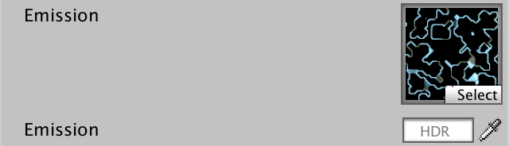
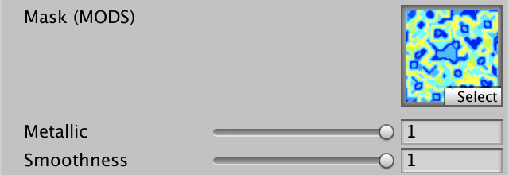

* [Complex Maps](https://catlikecoding.com/unity/tutorials/custom-srp/complex-maps/)

# Complex Maps

## 1. Circuitry Material

到目前为止，我们总是使用非常简单的材料来测试我们的RP。但它也应该支持复杂的材料，这样我们才能表现出更有趣的表面。在本教程中，我们将在一些纹理的帮助下，创建一个类似电路的艺术材料。

### 1.1 Albedo

我们材质的基础是其 [albedo map](https://catlikecoding.com/unity/tutorials/custom-srp/complex-maps/circuitry-material/circuitry-albedo.png)。它由几层不同色调的绿色组成，上面是金色。每个颜色区域都是统一的，除了一些棕色的污点，这使得我们更容易分辨出后面要添加的细节。


<p align=center><font color=#B8B8B8 ><i>Albedo map.</i></p>

用我们的Lit shader创建一个新材料，使用这个反照率贴图。我把它的平铺设置为2乘1，这样正方形纹理就可以包裹住一个球体而不会被拉得太长。默认球体的两极总是会发生很大的变形，这是无法避免的。


<p align=center><font color=#B8B8B8 ><i>Circuitry sphere.</i></p>

### 1.2 Emission

我们已经支持发射图，所以让我们使用一个在金色电路之上添加浅蓝色照明图案的图。


<p align=center><font color=#B8B8B8 ><i>Emission map.</i></p>

将其分配给材质，并将发射颜色设置为白色，这样它就变得可见。




<p align="center">
    
    
</p>

<p align=center><font color=#B8B8B8 ><i>Emissive circuitry.</i></p>

## 2. Mask Map

现在，我们不能做很多其他事情来使我们的材料更有趣。金色的电路应该是金属的，而绿色的电路板则不是，但我们目前只能配置统一的金属和光滑度值。我们需要额外的地图来支持整个表面的变化。


<p align=center><font color=#B8B8B8 ><i>Metallic 1 and smoothness 0.95.</i></p>

### 2.1 MODS

我们可以为金属感添加一个单独的贴图，为平滑度添加另一个贴图，但这两个贴图都只需要一个通道，所以我们可以将它们合并在一个贴图中。这个贴图被称为遮罩贴图，它的各个通道遮罩着不同的着色器属性。我们将使用与Unity的HDRP相同的格式，也就是MODS贴图。这代表Metallic(金属), Occlusion(遮蔽), Detail(细节), h和 Smoothness(平滑度)，按照这个顺序存储在RGBA通道中。

[Here](https://catlikecoding.com/unity/tutorials/custom-srp/complex-maps/mask-map/circuitry-mask-mods.png)是我们的电路的地图。它的所有通道都有数据，但目前我们只使用它的R和A通道。由于这个纹理包含遮罩数据而不是颜色，所以要确保它的sRGB（Color Texture）纹理导入属性被禁用。不这样做会导致GPU在对纹理进行采样时错误地应用伽玛-线性转换。


<p align=center><font color=#B8B8B8 ><i>Mask MODS map.</i></p>

为Lit添加一个遮罩图属性。因为它是一个遮罩，我们将使用白色作为默认值，这不会改变什么。

```c
		[NoScaleOffset] _MaskMap("Mask (MODS)", 2D) = "white" {}
		_Metallic ("Metallic", Range(0, 1)) = 0
		_Smoothness ("Smoothness", Range(0, 1)) = 0.5
```



<p align=center><font color=#B8B8B8 ><i>Mask shader property.</i></p>

### 2.2 Mask Input