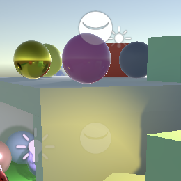
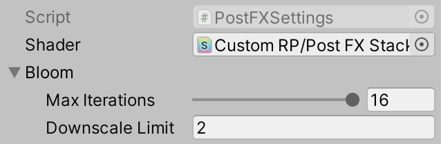
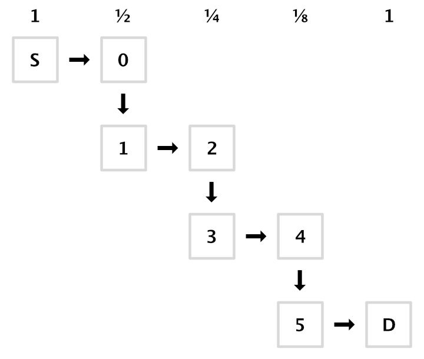
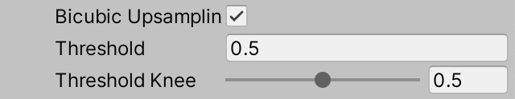
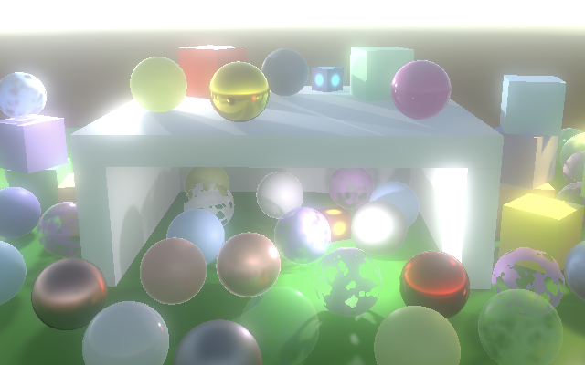

* [Post Processing](https://catlikecoding.com/unity/tutorials/custom-srp/post-processing/)

# Post Processing

## 1. Post-FX Stack

大多数时候，渲染的图像并不是按原样显示的。图像是经过后期处理的，得到各种效果--简称FX--应用在上面。常见的特效包括绽放、调色、景深、运动模糊和色调映射。这些特效是以堆叠的方式应用的，一个在另一个之上。在本教程中，我们将创建一个简单的后期特效堆栈，最初只支持bloom。

### 1.1 Settings Asset

一个项目可能需要多个Post-FX堆栈配置，所以我们首先创建一个PostFXSettings资产类型来存储一个堆栈的设置。

```cs
using UnityEngine;

[CreateAssetMenu(menuName = "Rendering/Custom Post FX Settings")]
public class PostFXSettings : ScriptableObject { }
```

在本教程中，我们将使用一个单一的堆栈，我们将通过向CustomRenderPipelineAsset添加一个配置选项，将其传递给RP的构造函数来使其可用。

```cs
	[SerializeField]
	PostFXSettings postFXSettings = default;

	protected override RenderPipeline CreatePipeline () {
		return new CustomRenderPipeline(
			useDynamicBatching, useGPUInstancing, useSRPBatcher,
			useLightsPerObject, shadows, postFXSettings
		);
	}
```

然后，CustomRenderPipeline必须跟踪FX设置，并在渲染过程中把它们和其他设置一起传递给相机渲染器。

```cs
	PostFXSettings postFXSettings;

	public CustomRenderPipeline (
		bool useDynamicBatching, bool useGPUInstancing, bool useSRPBatcher,
		bool useLightsPerObject, ShadowSettings shadowSettings,
		PostFXSettings postFXSettings
	) {
		this.postFXSettings = postFXSettings;
		…
	}

	protected override void Render (
		ScriptableRenderContext context, Camera[] cameras
	) {
		foreach (Camera camera in cameras) {
			renderer.Render(
				context, camera,
				useDynamicBatching, useGPUInstancing, useLightsPerObject,
				shadowSettings, postFXSettings
			);
		}
	}
```

CameraRenderer.Render最初对设置不做任何处理，因为我们还没有一个堆栈。

```cs
	public void Render (
		ScriptableRenderContext context, Camera camera,
		bool useDynamicBatching, bool useGPUInstancing, bool useLightsPerObject,
		ShadowSettings shadowSettings, PostFXSettings postFXSettings
	) { … }
```

现在我们可以创建一个空的 post-FX 设置资产，并将其分配给管道资产。


<p align=center><font color=#B8B8B8 ><i>Assigned post FX settings.</i></p>

### 1.2 Stack Object

我们将对堆栈使用与照明和阴影相同的方法。我们为它创建一个类，跟踪缓冲区、上下文、摄像机和后期特效设置，用一个公共的设置方法来初始化它们。

```cs
using UnityEngine;
using UnityEngine.Rendering;

public class PostFXStack {

	const string bufferName = "Post FX";

	CommandBuffer buffer = new CommandBuffer {
		name = bufferName
	};

	ScriptableRenderContext context;
	
	Camera camera;

	PostFXSettings settings;

	public void Setup (
		ScriptableRenderContext context, Camera camera, PostFXSettings settings
	) {
		this.context = context;
		this.camera = camera;
		this.settings = settings;
	}
}
```

接下来，添加一个公共属性来指示堆栈是否处于活动状态，这只有在有设置的情况下才是如此。我们的想法是，如果没有提供设置，后处理应该被跳过。

```cs
	public bool IsActive => settings != null;
```

而我们需要的最后一部分是一个公共的Render方法，用来渲染堆栈。通过使用适当的着色器，简单地绘制一个覆盖整个图像的矩形，就可以在整个图像上应用一个效果。现在我们没有着色器，所以我们将简单地把渲染到这一点的东西复制到相机的帧缓冲区。这可以通过在命令缓冲区上调用Blit来实现，并将源和目标的标识符传递给它。这些标识符可以用多种格式提供。我们将使用一个整数作为源，我们将为它添加一个参数，而BuiltinRenderTextureType.CameraTarget作为目的地。然后我们执行并清除缓冲区。

```cs
	public void Render (int sourceId) {
		buffer.Blit(sourceId, BuiltinRenderTextureType.CameraTarget);
		context.ExecuteCommandBuffer(buffer);
		buffer.Clear();
	}
```

在这种情况下，我们不需要手动开始和结束缓冲区采样，因为我们不需要调用ClearRenderTarget，因为我们完全替换了目标的东西。

### 1.3 Using the Stack

CameraRenderer现在需要一个堆栈实例，并在Render中对其调用Setup，就像对其Lighting对象一样。

```cs
	Lighting lighting = new Lighting();

	PostFXStack postFXStack = new PostFXStack();

	public void Render (…) {
		…
		lighting.Setup(
			context, cullingResults, shadowSettings, useLightsPerObject
		);
		postFXStack.Setup(context, camera, postFXSettings);
		buffer.EndSample(SampleName);
		Setup();
		…
	}
```

到此为止，我们总是直接渲染到摄像机的帧缓冲区，这些缓冲区要么是用于显示的，要么是配置的渲染纹理。我们对这些没有直接的控制，只应该向它们写入。所以为了给活动堆栈提供一个源纹理，我们必须使用一个渲染纹理作为摄像机的中间帧缓冲区。获得一个渲染纹理并将其设置为渲染目标，就像阴影贴图一样，只不过我们将使用RenderTextureFormat.Default格式。在我们清除渲染目标之前做这个。

```cs
	static int frameBufferId = Shader.PropertyToID("_CameraFrameBuffer");
	
	…
	
	void Setup () {
		context.SetupCameraProperties(camera);
		CameraClearFlags flags = camera.clearFlags;

		if (postFXStack.IsActive) {
			buffer.GetTemporaryRT(
				frameBufferId, camera.pixelWidth, camera.pixelHeight,
				32, FilterMode.Bilinear, RenderTextureFormat.Default
			);
			buffer.SetRenderTarget(
				frameBufferId,
				RenderBufferLoadAction.DontCare, RenderBufferStoreAction.Store
			);
		}

		buffer.ClearRenderTarget(…);
		buffer.BeginSample(SampleName);
		ExecuteBuffer();
	}
```

如果我们有一个活动的堆栈，还要添加一个清理方法来释放纹理。我们也可以把照明清理移到这里。

```cs
	void Cleanup () {
		lighting.Cleanup();
		if (postFXStack.IsActive) {
			buffer.ReleaseTemporaryRT(frameBufferId);
		}
	}
```

在提交前的Render结束时调用Cleanup。在这之前直接渲染堆栈，如果它是活动的。

```cs
	public void Render (…) {
		…
		DrawGizmos();
		if (postFXStack.IsActive) {
			postFXStack.Render(frameBufferId);
		}
		Cleanup();
		//lighting.Cleanup();
		Submit();
	}
```

在这一点上，结果看起来应该没有什么不同，但是增加了一个额外的绘制步骤，从中间缓冲区复制到最终帧缓冲区。它在帧调试器中被列为动态绘制。


<p align=center><font color=#B8B8B8 ><i>Rendering the FX stack.</i></p>

### 1.4 Forced Clearing

当绘制到一个中间帧缓冲区时，我们渲染到一个充满任意数据的纹理。当帧调试器处于活动状态时，你可以看到这一点。Unity确保帧调试器在每一帧开始时得到一个清晰的帧缓冲区，但是当渲染到我们自己的纹理时，我们绕过了这一点。这通常会导致我们在前一帧的结果之上进行绘制，但这并不保证。如果摄像机的Clear Flags设置为天空框或纯色，这并不重要，因为我们可以保证完全覆盖之前的数据。但是另外两个选项就不行了。为了防止随机的结果，当一个堆栈处于活动状态时，总是要清除深度，同时也要清除颜色，除非使用天空盒。

```cs
		CameraClearFlags flags = camera.clearFlags;

		if (postFXStack.IsActive) {
			if (flags > CameraClearFlags.Color) {
				flags = CameraClearFlags.Color;
			}
			…
		}

		buffer.ClearRenderTarget(…);
```

请注意，这使得在使用后期特效堆栈时，不可能让一个摄像机在另一个摄像机上面渲染而不被清除。有一些方法可以解决这个问题，但这不在本教程的范围之内。

### 1.5 Gizmos

我们目前是在同一时间绘制所有的gizmos，但是那些应该在后期特效之前和之后渲染的gizmos是有区别的。所以让我们把DrawGizmos方法一分为二。

```cs
	partial void DrawGizmosBeforeFX ();

	partial void DrawGizmosAfterFX ();
	
	…
	
#if UNITY_EDITOR
	
	…
						
	partial void DrawGizmosBeforeFX () {
		if (Handles.ShouldRenderGizmos()) {
			context.DrawGizmos(camera, GizmoSubset.PreImageEffects);
			//context.DrawGizmos(camera, GizmoSubset.PostImageEffects);
		}
	}

	partial void DrawGizmosAfterFX () {
		if (Handles.ShouldRenderGizmos()) {
			context.DrawGizmos(camera, GizmoSubset.PostImageEffects);
		}
	}
```

然后我们就可以在Render中以正确的时间绘制它们。

```cs
		//DrawGizmos();
		DrawGizmosBeforeFX();
		if (postFXStack.IsActive) {
			postFXStack.Render(frameBufferId);
		}
		DrawGizmosAfterFX();
```

注意，当3D图标被用于小工具时，当堆栈处于活动状态时，它们不再被物体遮挡。发生这种情况是因为场景窗口依赖于原始帧缓冲区的深度数据，而我们并没有使用这个数据。我们将在将来讨论深度与后期特效的结合。



<p align=center><font color=#B8B8B8 ><i>3D gizmos with and without FX.</i></p>

### 1.6 Custom Drawing

我们目前使用的Blit方法是绘制一个四边形网格--两个三角形--覆盖整个屏幕空间。但我们可以通过只画一个三角形来获得同样的结果，这样做的工作量会小一些。我们甚至不需要向GPU发送一个单三角网格，我们可以按程序生成它。

>这是否有很大的区别？
>这样做的明显好处是将顶点从六个减少到三个。然而，更重要的区别是，它消除了四边形的两个三角形相遇的对角线。因为GPU在小块中平行渲染片段，一些片段最终会沿着三角形的边缘浪费掉。由于四边形有两个三角形，沿对角线的碎片块被渲染了两次，这是不高效的。除此之外，渲染单个三角形可以有更好的本地缓存一致性。
>
>
>
><p align=center><font color=#B8B8B8 ><i>Redundant block rendering, exaggerated.</i></p>

在我们RP的Shaders文件夹中创建一个PostFXStackPasses.hlsl文件。我们将把我们的堆栈的所有通道放在那里。我们将在其中定义的第一件事是Varyings结构，它只需要包含剪辑空间的位置和屏幕空间的UV坐标。

```c
#ifndef CUSTOM_POST_FX_PASSES_INCLUDED
#define CUSTOM_POST_FX_PASSES_INCLUDED

struct Varyings {
	float4 positionCS : SV_POSITION;
	float2 screenUV : VAR_SCREEN_UV;
};

#endif
```

接下来，创建一个默认的顶点传递，只有一个顶点标识符作为参数。它是一个无符号的整数--uint--具有SV_VertexID语义。使用这个ID来生成顶点位置和UV坐标。X坐标是-1，-1，3；Y坐标是-1，3，-1。为了使可见的UV坐标覆盖0-1的范围，对U使用0, 0, 2，对V使用0, 2, 0。


<p align=center><font color=#B8B8B8 ><i>Triangle covering clip space.</i></p>

```c
Varyings DefaultPassVertex (uint vertexID : SV_VertexID) {
	Varyings output;
	output.positionCS = float4(
		vertexID <= 1 ? -1.0 : 3.0,
		vertexID == 1 ? 3.0 : -1.0,
		0.0, 1.0
	);
	output.screenUV = float2(
		vertexID <= 1 ? 0.0 : 2.0,
		vertexID == 1 ? 2.0 : 0.0
	);
	return output;
}
```

增加一个用于简单复制的片段传递，使其最初返回UV坐标，以便调试。

```c
float4 CopyPassFragment (Varyings input) : SV_TARGET {
	return float4(input.screenUV, 0.0, 1.0);
}
```

在同一个文件夹中创建一个配套的着色器文件。所有的通道都将使用无剔除和忽略深度，所以我们可以把这些指令直接放在Subshader块中。我们也总是包括我们的Common和PostFXStackPasses文件。它现在唯一的通道是用于复制，使用我们创建的顶点和片段函数。我们还可以通过使用Name指令给它起个名字，这在同一着色器中组合多个pass时很方便，因为帧调试器会用它来做pass标签而不是数字。最后，把它的菜单项放在隐藏文件夹下，这样在选择材质的着色器时，它就不会显示出来。

```c
Shader "Hidden/Custom RP/Post FX Stack" {
	
	SubShader {
		Cull Off
		ZTest Always
		ZWrite Off
		
		HLSLINCLUDE
		#include "../ShaderLibrary/Common.hlsl"
		#include "PostFXStackPasses.hlsl"
		ENDHLSL

		Pass {
			Name "Copy"
			
			HLSLPROGRAM
				#pragma target 3.5
				#pragma vertex DefaultPassVertex
				#pragma fragment CopyPassFragment
			ENDHLSL
		}
	}
}
```

我们将简单地通过设置手动将着色器链接到我们的堆栈。

```c
public class PostFXSettings : ScriptableObject {

	[SerializeField]
	Shader shader = default;
}
```


<p align=center><font color=#B8B8B8 ><i>Post FX shader assigned.</i></p>

但是我们在渲染时需要一个材质，所以添加一个公共属性，我们可以用它来直接从设置资产中获得一个材质。我们将按需创建它，并设置为隐藏，不保存在项目中。另外，材质不能和资产一起被序列化，因为它是按需创建的。

```cs
	[System.NonSerialized]
	Material material;

	public Material Material {
		get {
			if (material == null && shader != null) {
				material = new Material(shader);
				material.hideFlags = HideFlags.HideAndDontSave;
			}
			return material;
		}
	}
```

由于用名字而不是数字来称呼通行证很方便，所以在PostFXStack里面创建一个通行证枚举，最初只包含复制通行证。

```cs
	enum Pass {
		Copy
	}
```

现在我们可以定义我们自己的Draw方法。给它两个RenderTargetIdentifier参数，以指示应该从哪里和向哪里绘制，外加一个pass参数。在这个方法中，通过_PostFXSource纹理使源点可用，像以前一样使用目标点作为渲染目标，然后绘制三角形。我们通过在缓冲区上调用DrawProcedural来做到这一点，参数是一个未使用的矩阵、堆栈材质和pass。在这之后，还有两个参数。首先是我们要绘制的形状，也就是MeshTopology.Triangles。第二是我们想要多少个顶点，一个三角形需要三个顶点。

```cs
	int fxSourceId = Shader.PropertyToID("_PostFXSource");
	
	…
	
	void Draw (
		RenderTargetIdentifier from, RenderTargetIdentifier to, Pass pass
	) {
		buffer.SetGlobalTexture(fxSourceId, from);
		buffer.SetRenderTarget(
			to, RenderBufferLoadAction.DontCare, RenderBufferStoreAction.Store
		);
		buffer.DrawProcedural(
			Matrix4x4.identity, settings.Material, (int)pass,
			MeshTopology.Triangles, 3
		);
	}
```

最后，用我们自己的方法替换对Blit的调用。

```cs
		//buffer.Blit(sourceId, BuiltinRenderTextureType.CameraTarget);
		Draw(sourceId, BuiltinRenderTextureType.CameraTarget, Pass.Copy);
```

### 1.7 Don't Always Apply FX

现在我们应该看到屏幕空间的UV坐标出现在场景窗口。并在游戏窗口中。而且还出现在材质预览中，甚至出现在反射探测器中，一旦它们刷新。


<p align=center><font color=#B8B8B8 ><i>Reflection probe with FX applied.</i></p>

我们的想法是，后期特效要应用于适当的摄像机，而不是其他。我们可以通过检查PostFXStack.Setup中是否有游戏或场景摄像机来执行这一点。如果没有，我们就把设置设为null，这样就会停用该摄像机的堆栈。

```cs
		this.settings =
			camera.cameraType <= CameraType.SceneView ? settings : null;
```

除此之外，还可以在场景窗口中通过其工具栏中的效果下拉菜单来切换后期处理。有可能同时打开多个场景窗口，这些窗口可以单独启用或禁用后期效果。为了支持这一点，为PostFXStack创建了一个编辑器局部类，它有一个ApplySceneViewState方法，在构建中不做任何事情。它的编辑器版本会检查我们是否在处理一个场景视图的摄像机，如果是的话，如果当前绘制的场景视图的状态已经禁用了图像效果，则禁用堆栈。

```cs
using UnityEditor;
using UnityEngine;

partial class PostFXStack {

	partial void ApplySceneViewState ();

#if UNITY_EDITOR

	partial void ApplySceneViewState () {
		if (
			camera.cameraType == CameraType.SceneView &&
			!SceneView.currentDrawingSceneView.sceneViewState.showImageEffects
		) {
			settings = null;
		}
	}

#endif
}
```

在设置结束时调用此方法。

```cs
public partial class PostFXStack {

	…

	public void Setup (…) {
		…
		ApplySceneViewState();
	}
```

### 1.8 Copying

我们通过使我们的复制传递返回源颜色来完成堆栈。为此创建一个GetSource函数，它将进行采样。我们将始终使用一个线性钳制采样器，所以我们可以明确地声明这一点。

```c
TEXTURE2D(_PostFXSource);
SAMPLER(sampler_linear_clamp);

float4 GetSource(float2 screenUV) {
	return SAMPLE_TEXTURE2D(_PostFXSource, sampler_linear_clamp, screenUV);
}

float4 CopyPassFragment (Varyings input) : SV_TARGET {
	return GetSource(input.screenUV);
}
```

因为我们的缓冲区永远不会有mip maps，我们可以通过用**SAMPLE_TEXTURE2D_LOD**替换**SAMPLE_TEXTURE2D**来回避自动选择mip map，增加一个额外的参数来强制选择mip map的零级。

```c
	return SAMPLE_TEXTURE2D_LOD(_PostFXSource, sampler_linear_clamp, screenUV, 0);
```

我们最终得到了原始图像，但在某些情况下它是颠倒的，通常是在场景窗口中。这取决于图形API以及源和目标的类型。发生这种情况是因为一些图形API让纹理的V坐标从顶部开始，而另一些图形API则让它从底部开始。Unity通常会隐藏这一点，但不能在所有涉及渲染纹理的情况下这样做。幸运的是，Unity通过_ProjectionParams向量的X分量指示是否需要手动翻转，我们应该在UnityInput中定义。

```c
float4 _ProjectionParams;
```

如果数值为负数，我们必须翻转DefaultPassVertex中的V坐标。

```c
Varyings DefaultPassVertex (uint vertexID : SV_VertexID) {
	…
	if (_ProjectionParams.x < 0.0) {
		output.screenUV.y = 1.0 - output.screenUV.y;
	}
	return output;
}
```

## 2. Bloom

绽放的后期效果是用来使事物发光的。这是有物理学基础的，但经典的绽放效果是艺术性的，而不是现实的。非现实的绽放是非常明显的，因此是一个很好的效果，可以证明我们的后期特效堆栈的工作。我们将在下一个教程中研究更真实的绽放，届时我们将介绍HDR渲染。现在，我们的目标是实现LDR绽放的发光效果。

### 2.1 Bloom Pyramid

绽放代表了颜色的散射，这可以通过模糊图像来实现。明亮的像素会渗入相邻的较暗的像素中，从而看起来像发光。模糊一个纹理的最简单和最快的方法是将它复制到另一个宽度和高度为一半的纹理上。复制过程中的每个样本最终都会在四个源像素之间取样。通过双线性滤波，这就是2×2像素的平均块。


<p align=center><font color=#B8B8B8 ><i>Bilinear downsampling 4×4 to 2×2.</i></p>

这样做一次只能模糊一点。因此，我们重复这个过程，逐步降低采样，直到一个理想的水平，有效地建立一个纹理的金字塔。


<p align=center><font color=#B8B8B8 ><i>Pyramid with four textures, halving dimensions each level.</i></p>

我们需要跟踪堆栈中的纹理，但有多少纹理取决于金字塔有多少层，这取决于源图像的大小。让我们在PostFXStack中定义最多16个级别，这足以将65,536×65,526的纹理一直缩减到一个像素。

```c
	const int maxBloomPyramidLevels = 16;
```

为了跟踪金字塔中的纹理，我们需要纹理标识符。我们将使用属性名称_BloomPyramid0、_BloomPyramid1，以此类推。但我们不要明确地写出所有这16个名字。相反，我们将在一个构造方法中获得这些标识符，并且只跟踪第一个标识符。这样做是因为Shader.PropertyToID只是按照请求新属性名称的顺序依次分配标识符。我们只需要确保所有的标识符都是一次性请求的，因为在编辑器和构建中，每个应用会话的数量都是固定的。

```cs
	int bloomPyramidId;
	
	…
	
	public PostFXStack () {
		bloomPyramidId = Shader.PropertyToID("_BloomPyramid0");
		for (int i = 1; i < maxBloomPyramidLevels; i++) {
			Shader.PropertyToID("_BloomPyramid" + i);
		}
	}
```

现在创建一个DoBloom方法，为一个给定的源标识符应用绽放效果。首先，将相机的像素宽度和高度减半，并选择默认的渲染纹理格式。最初我们将从源头复制到金字塔的第一个纹理。追踪这些标识符。

```cs
	void DoBloom (int sourceId) {
		buffer.BeginSample("Bloom");
		int width = camera.pixelWidth / 2, height = camera.pixelHeight / 2;
		RenderTextureFormat format = RenderTextureFormat.Default;
		int fromId = sourceId, toId = bloomPyramidId;
		buffer.EndSample("Bloom");
	}
```

然后在所有的金字塔级别中循环。每次迭代，首先检查一个层次是否会变质。如果是，我们就在这一点上停止。如果没有，就得到一个新的渲染纹理，复制到它，使其成为新的源，增加目标，并再次将尺寸减半。在循环外声明循环迭代器变量，因为我们以后需要它。

```cs
		int fromId = sourceId, toId = bloomPyramidId;

		int i;
		for (i = 0; i < maxBloomPyramidLevels; i++) {
			if (height < 1 || width < 1) {
				break;
			}
			buffer.GetTemporaryRT(
				toId, width, height, 0, FilterMode.Bilinear, format
			);
			Draw(fromId, toId, Pass.Copy);
			fromId = toId;
			toId += 1;
			width /= 2;
			height /= 2;
		}
```

一旦金字塔完成，就把最终结果复制到相机目标上。然后递减迭代器并向后循环，释放所有我们要求的纹理。

```cs
		for (i = 0; i < maxBloomPyramidLevels; i++) { … }

		Draw(fromId, BuiltinRenderTextureType.CameraTarget, Pass.Copy);

		for (i -= 1; i >= 0; i--) {
			buffer.ReleaseTemporaryRT(bloomPyramidId + i);
		}
		buffer.EndSample("Bloom");
```

现在我们可以在Render中用bloom效果代替简单的复制。

```cs
	public void Render (int sourceId) {
		//Draw(sourceId, BuiltinRenderTextureType.CameraTarget, Pass.Copy);
		DoBloom(sourceId);
		context.ExecuteCommandBuffer(buffer);
		buffer.Clear();
	}
```

### 2.2 Configurable Bloom

我们现在模糊了很多，最终的结果几乎是一致的。你可以通过帧调试器检查中间的步骤。这些步骤作为终点显得更加有用，所以我们要让它有可能提前停止。


<p align=center><font color=#B8B8B8 ><i>Three iterations of progressive downsampling.</i></p>

我们可以通过两种方式做到这一点。首先，我们可以限制模糊迭代的数量。第二，我们可以将降级限制设置为一个更高的值。让我们支持这两种方法，在PostFXSettings中添加一个BloomSettings配置结构，为它们提供选项。通过一个getter属性使其公开可用。

```cs
	[System.Serializable]
	public struct BloomSettings {

		[Range(0f, 16f)]
		public int maxIterations;

		[Min(1f)]
		public int downscaleLimit;
	}

	[SerializeField]
	BloomSettings bloom = default;

	public BloomSettings Bloom => bloom;
```



<p align=center><font color=#B8B8B8 ><i>Default bloom settings.</i></p>

让PostFXStack.DoBloom使用这些设置来限制自己。

```cs
		PostFXSettings.BloomSettings bloom = settings.Bloom;
		int width = camera.pixelWidth / 2, height = camera.pixelHeight / 2;
		RenderTextureFormat format = RenderTextureFormat.Default;
		int fromId = sourceId, toId = bloomPyramidId;

		int i;
		for (i = 0; i < bloom.maxIterations; i++) {
			if (height < bloom.downscaleLimit || width < bloom.downscaleLimit) {
				break;
			}
			buffer.GetTemporaryRT(
				toId, width, height, 0, FilterMode.Bilinear, format
			);
			…
		}
```

<p align="center">
    
	
    <p align=center><font color=#B8B8B8 ><i>Progressive bilinear downsampling, 3 and 5 steps.</i></p>
</p>


### 2.3 Gaussian Filtering

用一个小的2×2的滤波器进行下采样会产生非常块的结果。通过使用更大的滤波器核，例如近似的9×9的高斯滤波器，效果可以得到很大的改善。如果我们把它和双线性下采样结合起来，就可以把它翻倍到有效的18×18。这就是Universal RP和HDRP用于它们的bloom。

虽然这个操作混合了81个样本，但它是可分离的，这意味着它可以分成水平和垂直两部分，混合每一行或每一列的九个样本。因此，我们只需要采样18次，但每次迭代都要进行两次抽样。

>可分离滤波器是如何工作的？
>这是一个可以用对称的行向量与它的转置相乘来创建的滤波器。
>
>
>
><p align=center><font color=#B8B8B8 ><i>Separable 3×3 filter with relative weights.</i></p>

让我们从水平方向的Pass开始。在PostFXStackPasses中为它创建一个新的BloomHorizontalPassFragment函数。它以当前的UV坐标为中心，累积一排9个样本。**我们还将同时进行降采样，因此每个偏移步骤是源纹素宽度的两倍**。从左边开始的样本权重是0.01621622，0.05405405，0.12162162，0.19459459，然后中间是0.22702703，另一边则是相反。

```c
float4 _PostFXSource_TexelSize;

float4 GetSourceTexelSize () {
	return _PostFXSource_TexelSize;
}

…

float4 BloomHorizontalPassFragment (Varyings input) : SV_TARGET {
	float3 color = 0.0;
	float offsets[] = {
		-4.0, -3.0, -2.0, -1.0, 0.0, 1.0, 2.0, 3.0, 4.0
	};
	float weights[] = {
		0.01621622, 0.05405405, 0.12162162, 0.19459459, 0.22702703,
		0.19459459, 0.12162162, 0.05405405, 0.01621622
	};
	for (int i = 0; i < 9; i++) {
		float offset = offsets[i] * 2.0 * GetSourceTexelSize().x;
		color += GetSource(input.screenUV + float2(offset, 0.0)).rgb * weights[i];
	}
	return float4(color, 1.0);
}
```

>这些权重是怎么来的？
>这些权重来自于帕斯卡尔的三角形。对于一个合适的9×9高斯滤波器，我们会选择三角形的第九行，也就是1 8 28 56 70 56 28 8 1。但是这样一来，滤波器边缘的样本的贡献就太弱了，所以我们向下转移到第十三行并切断其边缘，得出66 220 495 792 924 792 495 220 66。这些数字的总和是4070，所以用每个数字除以这个数字就可以得到最终的权重。

也为它在PostFXStack着色器中添加一个通道。我把它放在复制通道的上面，以保持它们的字母顺序。

```c
		Pass {
			Name "Bloom Horizontal"
			
			HLSLPROGRAM
				#pragma target 3.5
				#pragma vertex DefaultPassVertex
				#pragma fragment BloomHorizontalPassFragment
			ENDHLSL
		}
```

在PostFXStack.Pass枚举中也为其添加一个条目，同样以相同的顺序。

```c
	enum Pass {
		BloomHorizontal,
		Copy
	}
```

现在我们可以在DoBloom中下采样时使用bloom-horizontal pass。

```c
			Draw(fromId, toId, Pass.BloomHorizontal);
```

<p align="center">
    
    
    <p align=center><font color=#B8B8B8 ><i>Horizontal Gaussian, 3 and 5 steps.</i></p>
</p>

在这一点上，结果显然是水平拉伸的，但它看起来很有希望。我们可以通过复制BloomHorizontalPassFragment，重命名它，并从行切换到列来创建垂直通道。我们在第一遍中降低了采样率，但这一次**我们保持相同的尺寸来完成高斯滤波，所以纹素大小的偏移不应该是双倍的**。

```c
float4 BloomVerticalPassFragment (Varyings input) : SV_TARGET {
	float3 color = 0.0;
	float offsets[] = {
		-4.0, -3.0, -2.0, -1.0, 0.0, 1.0, 2.0, 3.0, 4.0
	};
	float weights[] = {
		0.01621622, 0.05405405, 0.12162162, 0.19459459, 0.22702703,
		0.19459459, 0.12162162, 0.05405405, 0.01621622
	};
	for (int i = 0; i < 9; i++) {
		float offset = offsets[i] * GetSourceTexelSize().y;
		color += GetSource(input.screenUV + float2(0.0, offset)).rgb * weights[i];
	}
	return float4(color, 1.0);
}
```

也为它添加一个通行证和枚举条目。从现在起，我不会再显示这些步骤了。

我们现在需要在每个金字塔层的中间增加一个步骤，为此我们还必须保留纹理标识符。我们可以通过简单地将PostFXStack构造函数中的循环限制增加一倍来做到这一点。由于我们没有引入其他着色器的属性名称，所以标识符都会按顺序排列，否则就需要重新启动Unity。

```cs
	public PostFXStack () {
		bloomPyramidId = Shader.PropertyToID("_BloomPyramid0");
		for (int i = 1; i < maxBloomPyramidLevels * 2; i++) {
			Shader.PropertyToID("_BloomPyramid" + i);
		}
	}
```

在DoBloom中，目标标识符现在必须从高处开始，在每个下采样步骤后增加两个。然后中间的纹理可以放在中间。水平绘制到中间，接着是垂直绘制到目的地。我们还必须释放额外的纹理，最简单的方法是从最后一个金字塔源头开始倒退。



<p align=center><font color=#B8B8B8 ><i>Horizontal to next level, vertical at same level.</i></p>

```cs
	void DoBloom (int sourceId) {
		…
		int fromId = sourceId, toId = bloomPyramidId + 1;
		
		for (i = 0; i < bloom.maxIterations; i++) {
			…
			int midId = toId - 1;
			buffer.GetTemporaryRT(
				midId, width, height, 0, FilterMode.Bilinear, format
			);
			buffer.GetTemporaryRT(
				toId, width, height, 0, FilterMode.Bilinear, format
			);
			Draw(fromId, midId, Pass.BloomHorizontal);
			Draw(midId, toId, Pass.BloomVertical);
			fromId = toId;
			toId += 2;
			…
		}

		Draw(fromId, BuiltinRenderTextureType.CameraTarget, Pass.Copy);

		for (i -= 1; i >= 0; i--) {
			buffer.ReleaseTemporaryRT(fromId);
			buffer.ReleaseTemporaryRT(fromId - 1);
			fromId -= 2;
		}
		buffer.EndSample("Bloom");
	}
```

<p align="center">
    
    
    <p align=center><font color=#B8B8B8 ><i>Complete Gaussian, 3 and 5 steps.</i></p>
</p>

我们的降采样过滤器现在已经完成了，看起来比简单的双线性滤波好很多，但代价是更多的纹理样本。幸运的是，我们可以通过使用双线性滤波在高斯取样点之间的适当偏移处取样来减少一点样本量。这就把九个样本减少到了五个。我们可以在BloomVerticalPassFragment中使用这个技巧。在两个方向上的偏移量变为3.23076923和1.38461538，权重为0.07027和0.31621622。

```c
	float offsets[] = {
		-3.23076923, -1.38461538, 0.0, 1.38461538, 3.23076923
	};
	float weights[] = {
		0.07027027, 0.31621622, 0.22702703, 0.31621622, 0.07027027
	};
	for (int i = 0; i < 5; i++) {
		float offset = offsets[i] * GetSourceTexelSize().y;
		color += GetSource(input.screenUV + float2(0.0, offset)).rgb * weights[i];
	}
```

我们不能在BloomHorizontalPassFragment中这样做，因为我们已经在该通道中使用双线性滤波进行下采样了。它的九个样本中的每一个都是2×2的源像素的平均值。

### 2.4 Additive Blurring

使用绽放金字塔的顶部作为最终图像，可以产生一个统一的混合，看起来不像是有什么东西在发光。我们可以通过对金字塔向下逐步升采样，将所有级别的图像累积到一个单一的图像中，来获得所需的结果。


<p align=center><font color=#B8B8B8 ><i>Additive progressive upsampling, reusing textures.</i></p>

我们可以使用加法混合来结合两张图片，但让我们对所有通道使用相同的混合模式，而不是添加第二个源纹理。在PostFXStack中为它申请一个标识符。

```cs
	int
		fxSourceId = Shader.PropertyToID("_PostFXSource"),
		fxSource2Id = Shader.PropertyToID("_PostFXSource2");
```

然后在DoBloom中完成金字塔后不再直接执行最后的绘制。取而代之的是，释放最后一次迭代的水平绘制所用的纹理，并将目的地设置为低一级的水平绘制所用的纹理。

```cs
		//Draw(fromId, BuiltinRenderTextureType.CameraTarget, Pass.Copy);
		buffer.ReleaseTemporaryRT(fromId - 1);
		toId -= 5;
```

当我们回环时，我们在每个迭代中再次画出，方向相反，每一级的结果作为第二个来源。这只在第一层之前有效，所以我们必须提前一步停止。之后，以原始图像为第二源，绘制到最终目的地。

```cs
		for (i -= 1; i > 0; i--) {
			buffer.SetGlobalTexture(fxSource2Id, toId + 1);
			Draw(fromId, toId, Pass.Copy);
			buffer.ReleaseTemporaryRT(fromId);
			buffer.ReleaseTemporaryRT(toId + 1);
			fromId = toId;
			toId -= 2;
		}

		buffer.SetGlobalTexture(fxSource2Id, sourceId);
		Draw(fromId, BuiltinRenderTextureType.CameraTarget, Pass.Copy);
		buffer.ReleaseTemporaryRT(fromId);
		buffer.EndSample("Bloom");
```

为了让这个工作顺利进行，我们需要让着色器通道可以使用辅助源。

```c
TEXTURE2D(_PostFXSource);
TEXTURE2D(_PostFXSource2);
SAMPLER(sampler_linear_clamp);

…

float4 GetSource2(float2 screenUV) {
	return SAMPLE_TEXTURE2D_LOD(_PostFXSource2, sampler_linear_clamp, screenUV, 0);
}
```

并引入一个新的bloom combination pass，对两种纹理进行采样和添加。和以前一样，我只展示了片段程序，没有展示新的着色器通道和新的枚举条目。

```c
float4 BloomCombinePassFragment (Varyings input) : SV_TARGET {
	float3 lowRes = GetSource(input.screenUV).rgb;
	float3 highRes = GetSource2(input.screenUV).rgb;
	return float4(lowRes + highRes, 1.0);
}
```

在上采样时使用新的通道。

```c
		for (i -= 1; i > 0; i--) {
			buffer.SetGlobalTexture(fxSource2Id, toId + 1);
			Draw(fromId, toId, Pass.BloomCombine);
			…
		}

		buffer.SetGlobalTexture(fxSource2Id, sourceId);
		Draw(
			bloomPyramidId, BuiltinRenderTextureType.CameraTarget,
			Pass.BloomCombine
		);
```

<p align="center">
    
    
    <p align=center><font color=#B8B8B8 ><i>Additive upsampling, 3 and 5 steps.</i></p>
</p>

我们终于有了一个看起来像一切都在发光的效果。但是我们的新方法只有在至少有两次迭代的情况下才有效。如果我们最终只进行了一次迭代，那么我们应该跳过整个上采样阶段，只需要释放用于第一次水平传递的纹理。

```cs
		if (i > 1) {
			buffer.ReleaseTemporaryRT(fromId - 1);
			toId -= 5;
			for (i -= 1; i > 0; i--) {
				…
			}
		}
		else {
			buffer.ReleaseTemporaryRT(bloomPyramidId);
		}
```

而如果我们最终完全跳过了绽放，我们就必须中止并进行复制。

```cs
		int width = camera.pixelWidth / 2, height = camera.pixelHeight / 2;
		
		if (
			bloom.maxIterations == 0 ||
			height < bloom.downscaleLimit || width < bloom.downscaleLimit
		) {
			Draw(sourceId, BuiltinRenderTextureType.CameraTarget, Pass.Copy);
			buffer.EndSample("Bloom");
			return;
		}
```

### 2.5 Bicubic Upsampling

虽然高斯滤波产生了平滑的结果，但我们在上采样时仍然进行了双线性滤波，这可能会使发光体出现块状的外观。这在原始图像缩小率高的地方最为明显，特别是在运动时。


<p align=center><font color=#B8B8B8 ><i>White glow on black background appears blocky.</i></p>

我们可以通过切换到二次方滤波来平滑这些伪影。这方面没有硬件支持，但我们可以使用Core RP Library的Filtering include文件中定义的SampleTexture2DBic函数。用它来创建我们自己的GetSourceBic函数，通过传递纹理和采样器状态、UV坐标，加上尺寸对交换的texel尺寸向量。除此之外，它还有一个最大纹理坐标的参数，就是1，后面还有一个不用的参数，可以是0。

```c
#include "Packages/com.unity.render-pipelines.core/ShaderLibrary/Filtering.hlsl"

…

float4 GetSourceBicubic (float2 screenUV) {
	return SampleTexture2DBicubic(
		TEXTURE2D_ARGS(_PostFXSource, sampler_linear_clamp), screenUV,
		_PostFXSource_TexelSize.zwxy, 1.0, 0.0
	);
}
```

在bloom-combine通道中使用新的函数，这样我们就可以用二次方滤波进行上采样。

```c
float4 BloomCombinePassFragment (Varyings input) : SV_TARGET {
	float3 lowRes = GetSourceBicubic(input.screenUV).rgb;
	float3 highRes = GetSource2(input.screenUV).rgb;
	return float4(lowRes + highRes, 1.0);
}
```


<p align=center><font color=#B8B8B8 ><i>Bicubic upsampling yields smoother glow.</i></p>

Bicubic 取样会产生更好的效果，但需要四个权衡过的纹理样本，而不是一个样本。所以让我们通过着色器布尔值使其成为可选项，以防不需要它。这与Universal RP和HDRP的High Quality bloom toggles是对应的。

```c
bool _BloomBicubicUpsampling;

float4 BloomCombinePassFragment (Varyings input) : SV_TARGET {
	float3 lowRes;
	if (_BloomBicubicUpsampling) {
		lowRes = GetSourceBicubic(input.screenUV).rgb;
	}
	else {
		lowRes = GetSource(input.screenUV).rgb;
	}
	float3 highRes = GetSource2(input.screenUV).rgb;
	return float4(lowRes + highRes, 1.0);
}
```

在PostFXSettings.BloomSettings中为其添加一个切换选项。

```c
		public bool bicubicUpsampling;
```


<p align=center><font color=#B8B8B8 ><i>Bicubic upsampling toggle.</i></p>

并在我们开始上采样之前，在PostFXStack.DoBloom中把它传递给GPU。

```c
	int
		bloomBucibicUpsamplingId = Shader.PropertyToID("_BloomBicubicUpsampling"),
		fxSourceId = Shader.PropertyToID("_PostFXSource"),
		fxSource2Id = Shader.PropertyToID("_PostFXSource2");
	
	…
	
	void DoBloom (int sourceId) {
		…
		
		buffer.SetGlobalFloat(
			bloomBucibicUpsamplingId, bloom.bicubicUpsampling ? 1f : 0f
		);
		if (i > 1) { … }
		…
	}
```

### 2.6 Half Resolution

由于所有的纹理采样和绘制，Bloom可能需要大量的时间来生成。降低成本的一个简单方法是在一半的分辨率下生成它。由于效果很柔和，所以我们可以避免这种情况。这将改变效果的外观，因为我们实际上是在跳过第一次迭代。

首先，在决定跳过bloom时，我们应该先看一步。实际上，在最初的检查中，降尺度的限制是加倍的。

```cs
		if (
			bloom.maxIterations == 0 ||
			height < bloom.downscaleLimit * 2 || width < bloom.downscaleLimit * 2
		) {
			Draw(sourceId, BuiltinRenderTextureType.CameraTarget, Pass.Copy);
			buffer.EndSample("Bloom");
			return;
		}
```

第二，我们需要为半幅图像申请一个纹理，我们将把它作为新的起点。它不是Bloom金字塔的一部分，所以我们要为它申请一个新的标识符。我们用它来做预过滤步骤，所以给它起个合适的名字。

```cs
	int
		bloomBucibicUpsamplingId = Shader.PropertyToID("_BloomBicubicUpsampling"),
		bloomPrefilterId = Shader.PropertyToID("_BloomPrefilter"),
		…
```

回到DoBloom，将源码复制到一个预过滤纹理，并将其用于金字塔的起点，同时将宽度和高度再次减半。在上升到金字塔之后，我们就不需要预过滤纹理了，所以可以在这时释放它。

```cs
		RenderTextureFormat format = RenderTextureFormat.Default;
		buffer.GetTemporaryRT(
			bloomPrefilterId, width, height, 0, FilterMode.Bilinear, format
		);
		Draw(sourceId, bloomPrefilterId, Pass.Copy);
		width /= 2;
		height /= 2;

		int fromId = bloomPrefilterId, toId = bloomPyramidId + 1;
		int i;
		for (i = 0; i < bloom.maxIterations; i++) {
			…
		}

		buffer.ReleaseTemporaryRT(bloomPrefilterId);
```

<p align="center">
    
    
    <p align=center><font color=#B8B8B8 ><i>Bloom at half resolution, 2 and 4 steps.</i></p>
</p>

### 2.7 Threshold

绽放通常在艺术上只用于使某些东西发光，但我们的效果目前适用于所有东西，不管它有多亮。虽然这没有物理意义，但我们可以通过引入一个亮度阈值来限制对效果的贡献。

我们不能突然从效果中消除颜色，因为这将在预期的渐进过渡中引入尖锐的边界。相反，我们将把颜色乘以一个权重$w=\frac{max(0, b - t)}{max(b, 0.00001)}$,其中
$b$是它的亮度和$t$是配置的阈值。我们将使用该颜色的RGB通道的最大值来表示
$b$。当阈值为零时，结果总是1，这使得颜色没有变化。随着阈值的增加，权重曲线会向下弯曲，所以在以下情况下它会变成零
$b≤t$。由于该曲线的形状，它被称为膝盖曲线。


<p align=center><font color=#B8B8B8 ><i>Thresholds 0.25, 0.5, 0.75, and 1.</i></p>

这条曲线以一个角度达到零，这意味着尽管过渡比钳子更平滑，但仍然有一个突然的截止点。这就是为什么它也被称为硬膝。我们可以通过改变重量来控制膝关节的形状，即$w=\frac{max(s, b - t)}{max(b, 0.00001)}$,且$s=\frac{min(max(0, b - t + tk), 2tk)}{4tk + 0.00001}$,且$k$是一个膝盖0-1的滑球。


<p align=center><font color=#B8B8B8 ><i>Threshold 1 with knee 0, 0.25, 0.5, 0.75, and 1.</i></p>

让我们把阈值和膝部滑块都添加到PostFXSettings.BloomSettings中。我们将把配置的阈值当作伽玛值，因为这在视觉上更直观，所以我们在把它发送到GPU时，必须把它转换成线性空间。我们把它做成开放式的，即使阈值大于0在这一点上会消除所有的颜色，因为我们只限于LDR。

```cs
		[Min(0f)]
		public float threshold;

		[Range(0f, 1f)]
		public float thresholdKnee;
```

我们将通过一个向量将阈值发送到GPU，我们将其命名为_BloomThreshold。在PostFXStack中为它申请一个标识符。

```c
		bloomPrefilterId = Shader.PropertyToID("_BloomPrefilter"),
		bloomThresholdId = Shader.PropertyToID("_BloomThreshold"),
```

我们可以计算权重函数的常数部分，并把它们放在我们的向量的四个分量中，以保持着色器更简单:$\begin{vmatrix}
  t \\
  -t+tk \\
  2tk \\
  \frac{1}{4tk+0.00001} \\
\end{vmatrix}$

我们将在一个新的预过滤通道中使用它，取代DoBloom中的初始复制通道，从而将阈值应用于2×2像素的平均值，同时我们将图像大小减半。

```cs
		Vector4 threshold;
		threshold.x = Mathf.GammaToLinearSpace(bloom.threshold);
		threshold.y = threshold.x * bloom.thresholdKnee;
		threshold.z = 2f * threshold.y;
		threshold.w = 0.25f / (threshold.y + 0.00001f);
		threshold.y -= threshold.x;
		buffer.SetGlobalVector(bloomThresholdId, threshold);

		RenderTextureFormat format = RenderTextureFormat.Default;
		buffer.GetTemporaryRT(
			bloomPrefilterId, width, height, 0, FilterMode.Bilinear, format
		);
		Draw(sourceId, bloomPrefilterId, Pass.BloomPrefilter);
```

在PostFXShaderPasses中添加阈值向量和一个将其应用于颜色的函数，然后是使用它的新通行证函数。

```c
float4 _BloomThreshold;

float3 ApplyBloomThreshold (float3 color) {
	float brightness = Max3(color.r, color.g, color.b);
	float soft = brightness + _BloomThreshold.y;
	soft = clamp(soft, 0.0, _BloomThreshold.z);
	soft = soft * soft * _BloomThreshold.w;
	float contribution = max(soft, brightness - _BloomThreshold.x);
	contribution /= max(brightness, 0.00001);
	return color * contribution;
}

float4 BloomPrefilterPassFragment (Varyings input) : SV_TARGET {
	float3 color = ApplyBloomThreshold(GetSource(input.screenUV).rgb);
	return float4(color, 1.0);
}
```





<p align=center><font color=#B8B8B8 ><i>Four iterations with threshold and knee 0.5.</i></p>

### 2.8 Intensity

我们通过添加一个强度滑块，来控制整体绽放的强度来结束本教程。我们不会给它一个限制，所以如果需要的话，也可以把整个图像炸掉。

```cs
		[Min(0f)]
		public float intensity;
```


<p align=center><font color=#B8B8B8 ><i>Open-ended intensity.</i></p>

如果强度被设置为零，我们就可以跳过开花，所以在DoBloom的开始时要检查这一点。

```cs
		if (
			bloom.maxIterations == 0 || bloom.intensity <= 0f ||
			height < bloom.downscaleLimit * 2 || width < bloom.downscaleLimit * 2
		) {
			Draw(sourceId, BuiltinRenderTextureType.CameraTarget, Pass.Copy);
			buffer.EndSample("Bloom");
			return;
		}
```

否则将强度传递给GPU，使用一个新的标识符_BloomIntensity。我们将使用它在组合通道中对低分辨率图像进行加权，所以我们不需要创建一个额外的通道。除了最后绘制到摄像机目标外，所有的绘制都将其设置为1。

```cs
		buffer.SetGlobalFloat(bloomIntensityId, 1f);
		if (i > 1) {
			…
		}
		else {
			buffer.ReleaseTemporaryRT(bloomPyramidId);
		}
		buffer.SetGlobalFloat(bloomIntensityId, bloom.intensity);
		buffer.SetGlobalTexture(fxSource2Id, sourceId);
		Draw(fromId, BuiltinRenderTextureType.CameraTarget, Pass.BloomCombine);
```

现在我们只需要将BloomCombinePassFragment中的低分辨率颜色与强度相乘。

```c
bool _BloomBicubicUpsampling;
float _BloomIntensity;

float4 BloomCombinePassFragment (Varyings input) : SV_TARGET {
	…
	return float4(lowRes * _BloomIntensity + highRes, 1.0);
}
```

<p align="center">
    
    
    <p align=center><font color=#B8B8B8 ><i>Intensity 0.5 and 5.</i></p>
</p>