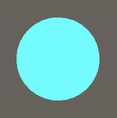
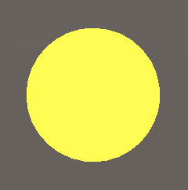
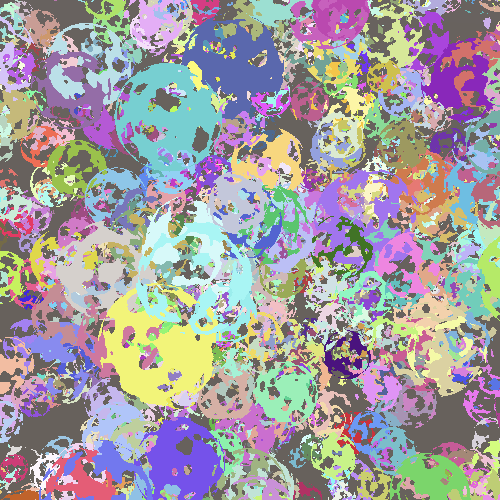

# Draw Calls

[原文地址](https://catlikecoding.com/unity/tutorials/custom-srp/draw-calls/)

[译文地址](https://zhuanlan.zhihu.com/p/334775155)

## 1. Shaders

要绘制物体，CPU需要告诉GPU应该绘制什么和如何绘制。通常我们用Mesh来决定绘制什么。而如何绘制是由着色器控制的，着色器实际上就是一组GPU的指令。除了Mesh之外，着色器还需要很多其他的信息来协同完成它的工作，比如对象的transform矩阵和材质属性等。

Unity的LW/Universal 和HD RPS允许你用Shader Graph设计着色器，它会自动生成着色器代码。但我们的定制RP不支持这个特性，所以需要自己编写着色代码。当然这也会让我们能够充分的控制和理解一个shader究竟做了什么。

### 1.1 Unlit Shader

我们的第一个着色器将简单地绘制一个纯色的网格，没有任何光照。 可以通过 Assets / Create / Shader 菜单中的选项之一创建着色器资产。 Unlit Shader 是最合适的，但我们将重新开始，从创建的着色器文件中删除所有默认代码。 将资产命名为 Unlit 并放入 Custom RP 下的新 Shaders 文件夹中。


<p align=center><font color=#B8B8B8 ><i>Unlit shader asset.</i></p>

Shader代码在很大程度上看起来像C#代码，但它包含了多种不同的方法，包括一些在以往很有用但是现在已经废弃的。

着色器的定义类似于一个类，但只有 Shader 关键字后跟一个字符串，该字符串用于在材质的着色器下拉菜单中为其创建条目。 让我们使用Custom RP/Unlit。 它后面是一个代码块，其中包含更多前面带有关键字的块。 有一个 Properties 块来定义材质属性，然后是一个 SubShader 块，它需要在其中有一个 Pass 块，它定义了一种渲染方式。 使用其他空块创建该结构。

```c
Shader "Custom RP/Unlit" {
	
	Properties {}
	
	SubShader {
		
		Pass {}
	}
}
```

刚才我们其实已经定义了一个最小的着色器，它能编译通过并允许我们创建一个使用它的材质。


<p align=center><font color=#B8B8B8 ><i>Custom unlit material.</i></p>

默认着色器实现将网格实体呈现为白色。该材质显示渲染队列的默认属性，该属性自动从着色器中获取，并设置为2000，这是不透明几何的默认设置。它还有一个开关，用来启用双面全局光照，但这与本次教程无关。

### 1.2 HLSL Programs

我们用来编写着色器代码的语言是高级着色语言（High-Level Shading Language），简称HLSL。它需要放在PASS块中，在HLSLPROGRAM和ENDHLSL关键字之间。必须要这样做才能正确编译，因为也可以将其他非HLSL代码放入PASS块中。

```cs
		Pass {
			HLSLPROGRAM
			ENDHLSL
		}
```

> CG程序怎么处理？
> Unity也支持编写CG而不仅仅是HLSL程序，但是我们将只使用HLSL，就像Unity推荐使用的现代RPs一样。

要绘制网格，GPU需要对所有三角形进行栅格化，将其转换为像素数据。它通过把顶点坐标从3D空间转换为2D可视化空间，然后填充所有被三角形覆盖的像素来实现这一点。这两个步骤由单独的着色器程序控制，我们需要对这两个程序步骤进行定义。第一个称为顶点内核/程序/着色器，第二个称为片段内核/程序/着色器。片段对应于显示像素或纹理纹素，但是它不代表最终的结果，因为当另外一些东西画在它上面的时候，它可能会被覆盖或者深度测试不通过的时候被丢弃。

我们需要给一个名称来标识这两个程序，这是通过pragma 指令完成的。这些指令是以#pragma 开头的单行语句，后面跟着顶点或片段加上相关的名称。我们将使用UnlitPassVertex和UnlitPassFragment。

```c
			HLSLPROGRAM
			#pragma vertex UnlitPassVertex
			#pragma fragment UnlitPassFragment
			ENDHLSL
```

> pragma 是什么意思？
> pragma 一词来自希腊语，指的是一种行动，或一些需要做的事情。在许多编程语言中都使用它来发出特殊的编译器指令。

着色器编译器现在会报错说它找不到已声明的着色器内核。所以必须用相同的名称编写HLSL函数来定义它们的实现。可以直接在pragma指令下面写，如果这样，就将把所有HLSL代码放在一个单独的文件中了。具体来说，如果我们在同一个asset 文件夹中使用UnlitPass.hlsl文件。可以通过添加带有文件相对路径的#include指令来指示着色器编译器插入该文件的内容。

```c
			HLSLPROGRAM
			#pragma vertex UnlitPassVertex
			#pragma fragment UnlitPassFragment
			#include "UnlitPass.hlsl"
			ENDHLSL
```

Unity 没有创建HLSL文件的便捷菜单选项，因此你需要复制着色器文件、将其重命名为UnlitPass、将其文件扩展名外部更改为hlsl并清除内容等系列操作。


<p align=center><font color=#B8B8B8 ><i>UnlitPass HLSL asset file.</i></p>

### 1.3 Include Guard

HLSL文件像C＃类一样用于对代码进行分组，尽管HLSL并没有类的概念。除了代码块的局部范围外，只有一个全局范围。因此，任何地方都可以访问所有内容。Including 文件也与使用namespace不同。它将在include指令的位置插入文件的全部内容，因此，如果多次包含同一文件，就会得到重复的代码，这很可能会导致编译器错误。为了防止这种情况，我们将在UnlitPass.hlsl中添加一个包含保护（Guard）。

可以使用#define指令来定义任何标识符，通常是大写的。我们将使用它在文件的头部定义CUSTOM_UNLIT_PASS_INCLUDED。

```c
#define CUSTOM_UNLIT_PASS_INCLUDED
```

这是一个简单宏的例子，它只定义了一个标识符。如果它存在，那么它就意味着我们的文件已经包含了。所以我们就不再包括它的内容了。简单来说就是，我们只想在它还没有被定义过的时候，插入代码。在定义宏之前使用#ifndef指令检查是否包含过。

```c
#ifndef CUSTOM_UNLIT_PASS_INCLUDED
#define CUSTOM_UNLIT_PASS_INCLUDED
```

如果宏已经定义，那么在#ifndef之后的所有代码都将被跳过。同时还要在文件末尾添加一个#endif指令来终止它的作用域。

```c
#ifndef CUSTOM_UNLIT_PASS_INCLUDED
#define CUSTOM_UNLIT_PASS_INCLUDED
#endif
```

现在不管我们包含多少次，都可以确保文件的所有相关代码不会被多次插入。

### 1.4 Shader Functions

我们在保护包含的范围内定义着色器函数。它们的编写就像C＃方法一样，但没有任何访问修饰符。现在从不做任何事情的简单void函数开始。

```c
#ifndef CUSTOM_UNLIT_PASS_INCLUDED
#define CUSTOM_UNLIT_PASS_INCLUDED

void UnlitPassVertex () {}

void UnlitPassFragment () {}

#endif
```

这已经能让着色器正常编译。结果是一个默认的青色着色器。



<p align=center><font color=#B8B8B8 ><i>Cyan sphere.</i></p>

我们可以用片段函数返回不同的颜色来改变w颜色。颜色定义为四个通道，用float4 vector表示，其中包含红色、绿色、蓝色和透明通道。比如Float 4(0.0、0.0、0.0、0.0)可以定义一个实心黑色，但其实也可以编写一个单一的零，因为单个值被自动展开为一个完整的向量。α值并不重要，因为我们正在创建一个不透明的着色器，所以零正好好。

```c
float4 UnlitPassFragment () {
	return 0.0;
}
```

> 为什么使用0.0而不是0？
> 0.0代表浮点数，0代表整数。虽然数值一样，但是对编译器来说不一样。

> 用float还是用half精度？
> 大多数移动 GPU 支持这两种精度类型，其中half更高效。 因此，如果您正在针对移动设备进行优化，那么尽可能使用half是有意义的。 经验法则是假如结果足够好，只对位置和纹理坐标使用float，对其他所有内容使用half。
> 当不针对移动平台时，精度不是问题，因为 GPU 总是使用浮点数，即使我们写了half。 在本教程系列中，我将始终使用 float。
> 还有固定类型，但只有旧硬件才真正支持，您不会针对现代应用程序。 通常相当于half。

此时，着色器编译器将会失败，因为我们的函数缺少语义。必须用返回的值表明我们的意思，因为我们可能会产生大量具有不同含义的数据。在这种情况下，我们提供渲染目标的默认系统值，方法是在UnlitPassFragment的参数列表之后写一个冒号，后跟SV_TARGET来表示。

```c
float4 UnlitPassFragment () : SV_TARGET {
	return 0.0;
}
```

UnlitPassVertex负责转换顶点位置，因此应返回一个位置。这也是一个float4向量，因为必须将其定义为相同的裁减空间位置，但是稍后我们将进行介绍。同样，我们从零向量开始，在这种情况下，我们需要指出其含义是SV_POSITION。

```c
float4 UnlitPassVertex () : SV_POSITION {
	return 0.0;
}
```

### 1.5 Space Transformation

当所有顶点都设置为零时，网格会折叠到一个点，并且不会渲染任何内容。 顶点函数的主要工作是将原始顶点位置转换为正确的空间。 调用时，如果我们需要，该函数将提供可用的顶点数据。 我们通过向 UnlitPassVertex 添加参数来做到这一点。 我们需要在对象空间中定义的顶点位置，因此我们将其命名为 positionOS，使用与 Unity 的新 RP 相同的约定。 该位置的类型是 float3，因为它是一个 3D 点。 让我们首先返回它，通过 float4(positionOS, 1.0) 添加 1 作为第四个必需的组件。

```c
float4 UnlitPassVertex (float3 positionOS) : SV_POSITION {
	return float4(positionOS, 1.0);
}
```

> 顶点的Position不是float4吗？
> 通常 3D 空间中的点是用 4D 向量定义的，它们的第四分量设置为 1，而方向向量则将其设置为零。 这使得可以使用相同的变换矩阵正确地变换位置和方向。 但是，只有在位置和方向混合时才需要这种技术，而通常情况并非如此。 相反，不同的代码用于需要较少计算的旋转变换。
>
> 位置最初是 3D 向量，但自动扩展为 4D 向量，第四分量设置为 1。因此我们可以将位置定义为 float4，但不需要。 此行为也适用于其他输入数据。 具体来说，缺失的 XYZ 值设置为零，而 W 始终设置为 1。

我们还需要在输入参数中添加语义，因为顶点数据可以包含的不仅仅是一个位置。在这种情况下，我们需要POSITION，在参数名称后面直接添加。

```c
float4 UnlitPassVertex (float3 positionOS : POSITION) : SV_POSITION {
	return float4(positionOS, 1.0);
}
```


<p align=center><font color=#B8B8B8 ><i>Using object-space position.</i></p>

网格再次显示出来了，但不正确，因为我们输出的位置在错误的空间中。空间转换需要矩阵，当绘制东西时，矩阵会被发送到GPU。我们需要将这些矩阵添加到我们的着色器中，但是由于它们总是相同的，所以我们将由Unity提供的标准输入放在一个单独的HLSL文件中，这样既可以保持代码的结构化，也可以将代码包含在其他着色器中。添加一个UnityInput.hlsl文件，并将其直接放在自定义RP下的ShaderLibrary文件夹中，以体现UnityRPS的文件夹结构。


<p align=center><font color=#B8B8B8 ><i>ShaderLibrary folder with UnityInput file.</i></p>

以 CUSTOM_UNITY_INPUT_INCLUDED 包含保护开始文件，然后在全局范围内定义一个名为 unity_ObjectToWorld 的 float4x4 矩阵。 在 C# 类中，这将定义一个字段，但在这里它被称为 uniform 值。 它在每次绘制时由 GPU 设置一次，uniform - 在该绘制期间对于顶点和片段函数的所有调用保持不变。

```c
#ifndef CUSTOM_UNITY_INPUT_INCLUDED
#define CUSTOM_UNITY_INPUT_INCLUDED

float4x4 unity_ObjectToWorld;

#endif
```

我们可以使用该矩阵从对象空间转换为世界空间。由于这是常用功能，因此我们为它创建一个函数并将其放入另一个文件中，这次将Common.hlsl放在同一ShaderLibrary文件夹中。我们在其中包含UnityInput，然后声明一个带有float3作为输入和输出的TransformObjectToWorld函数。

```c
#ifndef CUSTOM_COMMON_INCLUDED
#define CUSTOM_COMMON_INCLUDED

#include "UnityInput.hlsl"

float3 TransformObjectToWorld (float3 positionOS) {
	return 0.0;
}
	
#endif
```

通过使用矩阵和向量并调用mul函数来完成空间转换。在这种情况下，我们确实需要一个4D向量，但是由于它的第四个分量始终为1，因此我们可以使用float4（positionOS，1.0）将其自己添加。结果还是一个第四分量始终为1的4D。通过访问向量的xyz属性，我们可以从中提取前三个分量，这称为swizzle操作。

```c
float3 TransformObjectToWorld (float3 positionOS) {
	return mul(unity_ObjectToWorld, float4(positionOS, 1.0)).xyz;
}
```

现在，我们可以在UnlitPassVertex中转换到世界空间。首先在函数上方直接包含Common.hlsl。由于它存在于其他文件夹中，我们可以通过相对路径 ../ShaderLibrary/Common.hlsl进行访问。然后使用TransformObjectToWorld计算一个positionWS变量并返回它而不是现在直接对象空间位置。

```c
#include "../ShaderLibrary/Common.hlsl"

float4 UnlitPassVertex (float3 positionOS : POSITION) : SV_POSITION {
	float3 positionWS = TransformObjectToWorld(positionOS.xyz);
	return float4(positionWS, 1.0);
}
```

现在结果仍然是错误的，因为我们需要在均匀的剪辑空间中放置位置。该空间定义了一个立方体，其中包含摄像机所看到的所有内容，如果是透视摄像机，则它会变形为梯形。从世界空间到该空间的变换可以通过与视图投影矩阵相乘来完成，该视图投影矩阵考虑了相机的位置，方向，投影，视野和远近裁剪平面。它使unity_ObjectToWorld矩阵可用，因此将其添加到UnityInput.hlsl。

```c
float4x4 unity_ObjectToWorld;

float4x4 unity_MatrixVP;
```

将一个TransformWorldToHClip添加到Common.hlsl，其工作方式与TransformObjectToWorld相同，不同之处在于其输入位于世界空间中，使用其他矩阵并生成float4。

```c
float3 TransformObjectToWorld (float3 positionOS) {
	return mul(unity_ObjectToWorld, float4(positionOS, 1.0)).xyz;
}

float4 TransformWorldToHClip (float3 positionWS) {
	return mul(unity_MatrixVP, float4(positionWS, 1.0));
}
```

让UnlitPassvertex使用该函数返回正确空间中的位置。

```c
float4 UnlitPassVertex (float3 positionOS : POSITION) : SV_POSITION {
	float3 positionWS = TransformObjectToWorld(positionOS.xyz);
	return TransformWorldToHClip(positionWS);
}
```


<p align=center><font color=#B8B8B8 ><i>Correct black sphere.</i></p>

### 1.6 Core Library

我们刚刚定义的两个功能非常常用，以至于它们也包含在Core RP Pipeline软件包中。核心库定义了许多更有用和必要的内容，因此让我们安装该程序包，删除我们自己的定义，然后包含相关文件，在本例中为Packages / com.unity.render-pipelines.core / ShaderLibrary / SpaceTransforms.hlsl。

```c
//float3 TransformObjectToWorld (float3 positionOS) {
//	return mul(unity_ObjectToWorld, float4(positionOS, 1.0)).xyz;
//}

//float4 TransformWorldToHClip (float3 positionWS) {
//	return mul(unity_MatrixVP, float4(positionWS, 1.0));
//}

#include "Packages/com.unity.render-pipelines.core/ShaderLibrary/SpaceTransforms.hlsl"
```

这会导致编译失败，因为SpaceTransforms.hlsl中的代码不存在unity_ObjectToWorld。相反，它期望通过宏将相关矩阵定义为UNITY_MATRIX_M，因此在通过在单独的行上编写#define UNITY_MATRIX_M unity_ObjectToWorld来包含文件之前，先执行此操作。之后，所有UNITY_MATRIX_M出现都将被unity_ObjectToWorld取代。这是有原因的，我们稍后会看到。

```c
#define UNITY_MATRIX_M unity_ObjectToWorld

#include "Packages/com.unity.render-pipelines.core/ShaderLibrary/SpaceTransforms.hlsl"
```

逆矩阵unity_WorldToObject也是如此，应通过UNITY_MATRIX_I_M定义，通过UNITY_MATRIX_V定义的unity_MatrixV矩阵，以及通过UNITY_MATRIX_VP定义的unity_MatrixVP。最后，还有通过UNITY_MATRIX_P定义的投影矩阵，可以作为glstate_matrix_projection使用。我们不需要这些额外的矩阵，但是如果不包含它们，代码将不会编译。

```c
#define UNITY_MATRIX_M unity_ObjectToWorld
#define UNITY_MATRIX_I_M unity_WorldToObject
#define UNITY_MATRIX_V unity_MatrixV
#define UNITY_MATRIX_VP unity_MatrixVP
#define UNITY_MATRIX_P glstate_matrix_projection
```

将额外的矩阵添加到UnityInput中。

```c
float4x4 unity_ObjectToWorld;
float4x4 unity_WorldToObject;

float4x4 unity_MatrixVP;
float4x4 unity_MatrixV;
float4x4 glstate_matrix_projection;
```

最后缺少的是矩阵。它是unity_WorldTransformParams，其中包含一些我们不再需要的转换信息。它是一个定义为real4的向量，它本身不是有效的类型，而是取决于目标平台的float4或half4的别名。

```c
float4x4 unity_ObjectToWorld;
float4x4 unity_WorldToObject;
real4 unity_WorldTransformParams;
```

该别名和许多其他基本宏是为每个图形API定义的，我们可以通过包含Packages / com.unity.render-pipelines.core / ShaderLibrary / Common.hlsl来获得全部信息。在包含UnityInput.hlsl之前，请在我们的Common.hlsl文件中执行此操作。如果你对它们的内容感到好奇的话，也可以查看这些文件。

```c
#include "Packages/com.unity.render-pipelines.core/ShaderLibrary/Common.hlsl"
#include "UnityInput.hlsl"
```

### 1.7 Color

通过调整UnlitPassFragment，可以更改渲染对象的颜色。例如，我们可以通过返回Float 4(1.0、1.0、0.0、1.0)而不是零来让它变黄。

```c
float4 UnlitPassFragment () : SV_TARGET {
	return float4(1.0, 1.0, 0.0, 1.0);
}
```



<p align=center><font color=#B8B8B8 ><i>Yellow sphere.</i></p>

为了能够配置每种材质的颜色，我们必须将其定义为uniform 的值。在UnlitPassVertex函数之前，在include指令下执行此操作。我们需要一个float4并将其命名为_BaseColor。前划线是表明其代表材质属性的标准用法。返回此值，而不是UnlitPassFragment中的硬编码颜色。

```c
#include "../ShaderLibrary/Common.hlsl"

float4 _BaseColor;

float4 UnlitPassVertex (float3 positionOS : POSITION) : SV_POSITION {
	float3 positionWS = TransformObjectToWorld(positionOS);
	return TransformWorldToHClip(positionWS);
}

float4 UnlitPassFragment () : SV_TARGET {
	return _BaseColor;
}
```

球会重新变为黑色，因为默认值为零。要将其链接到材质，我们需要将_BaseColor添加到Unlit shader文件的Properties块中。

```c
	Properties {
		_BaseColor
	}
```

属性名称后面必须跟着一个字符串，以便在检查器中使用和一个颜色类型标识符，就像向方法提供参数一样。

```c
		_BaseColor("Color", Color)
```

最后，我们需要提供一个默认值，在这个示例中，我们为它分配一个由四个数字组成的列表，白色。

```c
		_BaseColor("Color", Color) = (1.0, 1.0, 1.0, 1.0)
```


<p align=center><font color=#B8B8B8 ><i>Unlit material with red color.</i></p>

现在可以用我们的着色器创建多种材质了，每个材质都可以有不同的颜色。

## 2. Batching

每个Draw Call都需要CPU和GPU之间的通信。如果需要将大量数据发送到GPU，则可能会由于等待而浪费时间。而且，当CPU忙于发送数据时，它无法做其他事情。这两个问题都会降低帧率。目前，我们的方法很简单：每个对象都有自己的Draw Call。尽管我们最终发送的数据很少，但这仍然是比较低效的事。

举个例子，我用76个球体制作了一个场景，每个球都使用四种材质中的一种：红色、绿色、黄色和蓝色。它需要78次DrawCall才能完成渲染，76次调用用于球体，一次调用用于Skybox，另一次调用用于清除呈现目标。


<p align=center><font color=#B8B8B8 ><i>76 spheres, 78 draw calls.</i></p>

如果打开Game窗口的statistics面板，则可以看到渲染帧所需内容的概述。这里有意思的是，它显示了77批次--因为忽略了Clear--其中saved by batching的数值是0。


<p align=center><font color=#B8B8B8 ><i>Game window statistics.</i></p>

### 2.1 SRP Batcher

批处理是组合Drawcall的过程，可减少CPU和GPU之间的通信时间。最简单的方法是启用SRP batcher。但是，这仅适用于兼容的着色器，而我们的Unlit着色器则无效。你可以通过在检查器中选择它来进行验证。有一个SRP Batcher行指示不兼容，并在下方给出了一个原因。


<p align=center><font color=#B8B8B8 ><i>Not compatible.</i></p>

SRP批次不会减少Draw Call的数量，而是使其更精简。它在GPU上缓存了材质属性，因此不必在每次绘制调用时都将其发送出去。这样既减少了需要传达的数据量，又减少了每个绘图调用CPU需要完成的工作。但这仅在着色器遵守用于uniform 数据的严格结构时才有效。

所有材质属性都需要在具体的存储缓冲区内定义，而不是在全局级别上定义。这是通过将_BaseColor声明包装在带有UnityPerMaterial名称的cbuffer块中来完成的。这就像一个结构声明，需要以分号终止。它通过将_BaseColor放入特定的常量内存缓冲区中来隔离它，尽管它仍可在全局级别访问。

```c
cbuffer UnityPerMaterial {
	float _BaseColor;
};
```

并非所有平台（例如OpenGL ES 2.0）都支持常量缓冲区，因此，我们可以使用核心RP库中包含的CBUFFER_START和CBUFFER_END宏，而不是直接使用cbuffer。第一个将缓冲区名称作为参数，就好像它是一个函数一样。在这种情况下，我们得到的结果与之前完全相同，只是不支持cbuffer的平台不存在cbuffer代码。

```c
CBUFFER_START(UnityPerMaterial)
	float4 _BaseColor;
CBUFFER_END
```

我们还需要对unity_ObjectToWorld，unity_WorldToObject和unity_WorldTransformParams执行此操作，它们必须分组在UnityPerDraw缓冲区中。

```c
CBUFFER_START(UnityPerDraw)
	float4x4 unity_ObjectToWorld;
	float4x4 unity_WorldToObject;
	real4 unity_WorldTransformParams;
CBUFFER_END
```

在这个示例中，如果我们使用特定的一组值，则需要全部定义它们。对于转换组，即使我们不使用它，我们也需要包括float4 unity_LODFade。顺序无关紧要，但是Unity会将其直接放在unity_WorldToObject之后，因此我们也要这样做。

```c
CBUFFER_START(UnityPerDraw)
	float4x4 unity_ObjectToWorld;
	float4x4 unity_WorldToObject;
	float4 unity_LODFade;
	real4 unity_WorldTransformParams;
CBUFFER_END
```


<p align=center><font color=#B8B8B8 ><i>Compatible with SRP batcher.</i></p>

在与我们的着色器兼容的情况下，下一步是启用SRP批处理程序，这是通过将GraphicsSettings.useScriptableRenderPipelineBatching设置为true来完成的。我们只需要执行一次，因此在创建管线实例时，通过向CustomRenderPipeline添加构造函数方法来执行此操作。

```c
	public CustomRenderPipeline () {
		GraphicsSettings.useScriptableRenderPipelineBatching = true;
	}
```


<p align=center><font color=#B8B8B8 ><i>Negative batches saved.</i></p>

“统计”面板显示已节省了76个批次，但是为负数。帧调试器现在也在RenderLoopNewBatcher.Draw下显示一个SRP Batch条目，但是请记住，它不是单个draw call，而是它们的优化序列。


<p align=center><font color=#B8B8B8 ><i>One SRP batch.</i></p>

### 2.2 Many Colors

即使我们使用四种材质，也可以得到一个批次。之所以可行，是因为它们的所有数据都缓存在GPU上，并且每个绘制调用仅需包含一个指向正确内存位置的偏移量。唯一的限制是每种材质的内存布局需要相同，这是因为我们对所有材质都使用相同的着色器，每个着色器仅包含一个颜色属性。Unity不会比较材质的确切内存布局，它只是仅批处理使用完全相同的着色器变体的绘制调用。

如果只需要几种不同的颜色，它可以很好地工作，但是如果要为每个球体赋予自己的颜色，那么就需要创建更多的材质。那么假如可以为动态每个对象设置颜色，是不是会更加方便？默认情况下这是不可能的，但是可以通过创建自定义组件类型来支持它。将其命名为PerObjectMaterialProperties。作为一个示例，将其放在“ Custom RP”下的“ Examples”文件夹中。

这个想法是，一个游戏对象可以附加一个PerObjectMaterialProperties组件，该组件具有“Base Color”配置选项，该选项将用于为其设置_BaseColor材质属性。它需要知道shader属性的标识符，可以通过Shader.PropertyToID检索该标识符并将其存储在静态变量中，就像在CameraRenderer中为shader pass标识符所做的那样，但这个例子里它是整数。

```cs
using UnityEngine;

[DisallowMultipleComponent]
public class PerObjectMaterialProperties : MonoBehaviour {
	
	static int baseColorId = Shader.PropertyToID("_BaseColor");
	
	[SerializeField]
	Color baseColor = Color.white;
}
```


<p align=center><font color=#B8B8B8 ><i>PerObjectMaterialProperties component.</i></p>

设置每个对象的材质属性是通过MaterialPropertyBlock对象完成的。我们只需要一个PerObjectMaterialProperties实例，并且它可以重用，所以为它声明一个 static 字段。

```c
	static MaterialPropertyBlock block;
```

如果还没有一个block ，就创建一个新block ，然后使用属性标识符和颜色在其上调用SetColor，然后通过SetPropertyBlock将block 应用于游戏对象的Renderer组件，该组件会复制其设置。在OnValidate中执行此操作，以便结果立即显示在编辑器中。

```c
	void OnValidate () {
		if (block == null) {
			block = new MaterialPropertyBlock();
		}
		block.SetColor(baseColorId, baseColor);
		GetComponent<Renderer>().SetPropertyBlock(block);
	}
```

>OnValidate什么时候调用？
>加载或更改组件后，将在Unity编辑器中调用OnValidate。因此，每次加载场景时以及编辑组件时。因此，各个颜色会立即显示并响应编辑。

把组件添加给24个球，并给它们不同的颜色。


<p align=center><font color=#B8B8B8 ><i>Many colors.</i></p>

很不幸，SRP批处理程序无法处理每个对象的材质属性。因此，这24个球体每个都有一次DrawCall，由于排序，也可能将其他球体分成多个批次。


<p align=center><font color=#B8B8B8 ><i>24 non-batched draw calls.</i></p>

另外，OnValidate不会在构建中被调用。为了使各个颜色在构建中出现，还需要在Awake中应用它们，可以通过简单地在此处调用OnValidate来实现。

```cs
	void Awake () {
		OnValidate();
	}
```

### 2.3 GPU Instancing

还有一种合并DrawCall的方法，该方法适用于逐对象的材质属性。这就是所谓的GPU实例化（GPUInstancing），其工作原理是一次对具有相同网格物体的多个对象发出一次绘图调用。CPU收集所有每个对象的变换和材质属性，并将它们放入数组中，然后发送给GPU。然后，GPU遍历所有条目，并按提供顺序对其进行渲染。

因为GPU实例需要通过数组提供数据，所以我们的着色器当前不支持该数据。进行此工作的第一步是在着色器的Pass块的顶点和片段编译片段上方添加#pragma multi_compile_instancing指令。

```c
			#pragma multi_compile_instancing
			#pragma vertex UnlitPassVertex
			#pragma fragment UnlitPassFragment
```

这将使Unity生成我们的着色器的两个变体，一个具有GPU实例化支持，一个不具有GPU实例化支持。材质检查器中还出现了一个切换选项，使我们可以选择每种材质要使用的版本。


<p align=center><font color=#B8B8B8 ><i>Material with GPU instancing enabled.</i></p>

支持 GPU 实例化需要改变方法，为此我们必须包含核心着色器库中的 UnityInstancing.hlsl 文件。 这必须在定义 UNITY_MATRIX_M 和其他宏之后以及在包含 SpaceTransforms.hlsl 之前完成。

```c
#define UNITY_MATRIX_P glstate_matrix_projection

#include "Packages/com.unity.render-pipelines.core/ShaderLibrary/UnityInstancing.hlsl"
#include "Packages/com.unity.render-pipelines.core/ShaderLibrary/SpaceTransforms.hlsl"
```

UnityInstancing.hlsl的作用是重新定义这些宏来访问实例数据数组。但是要进行这项工作，需要知道当前正在渲染的对象的索引。索引是通过顶点数据提供的，因此需要使其可用。UnityInstancing.hlsl定义了宏来简化此过程，但是它假定顶点函数具有struct参数。

可以声明一个结构（就像cbuffer一样）并将其用作函数的输入参数。我们还可以在结构内部定义语义。这种方法的优点是，它比长参数列表更清晰易读。因此，将UnlitPassVertex的positionOS参数包装在Attributes结构中，以表示顶点输入数据。

```c
struct Attributes {
	float3 positionOS : POSITION;
};

float4 UnlitPassVertex (Attributes input) : SV_POSITION {
	float3 positionWS = TransformObjectToWorld(input.positionOS);
	return TransformWorldToHClip(positionWS);
}
```

使用GPU实例化时，对象索引也可用作顶点属性。我们可以在适当的时候通过简单地将UNITY_VERTEX_INPUT_INSTANCE_ID放在属性中来添加它。

```c
struct Attributes {
	float3 positionOS : POSITION;
	UNITY_VERTEX_INPUT_INSTANCE_ID
};
```

接下来，添加UNITY_SETUP_INSTANCE_ID（input）; 在UnlitPassVertex的开头。这将从输入中提取索引，并将其存储在其他实例化宏所依赖的全局静态变量中。

```c
float4 UnlitPassVertex (Attributes input) : SV_POSITION {
	UNITY_SETUP_INSTANCE_ID(input);
	float3 positionWS = TransformObjectToWorld(input.positionOS);
	return TransformWorldToHClip(positionWS);
}
```

这足以使GPU实例化进行工作了，因为SRP批处理程序拥有优先权，所以我们现在还没有得到想要的结果。现在尚不支持逐实例的材质数据。如果要添加的话，需要在需要时用数组引用替换_BaseColor。通过用UNITY_INSTANCING_BUFFER_START替换CBUFFER_START以及用UNITY_INSTANCING_BUFFER_END替换CBUFFER_END来完成，它需要一个参数。这不必与开始时一样，但也没有什么别的理由把它设置为不同。

```c
//CBUFFER_START(UnityPerMaterial)
//	float4 _BaseColor;
//CBUFFER_END

UNITY_INSTANCING_BUFFER_START(UnityPerMaterial)
	float4 _BaseColor;
UNITY_INSTANCING_BUFFER_END(UnityPerMaterial)
```

然后，将_BaseColor的定义替换为UNITY_DEFINE_INSTANCED_PROP(Float 4，_BaseColor)。

```c
UNITY_INSTANCING_BUFFER_START(UnityPerMaterial)
	//	float4 _BaseColor;
	UNITY_DEFINE_INSTANCED_PROP(float4, _BaseColor)
UNITY_INSTANCING_BUFFER_END(UnityPerMaterial)
```

使用实例化时，我们现在还需要在UnlitPassFragment中提供实例索引。为了简单起见，我们将使用一个结构，通过UNITY_TRANSFER_INSTANCE_ID（input，output）使UnlitPassVertex输出位置和索引。复制索引（如果存在）。我们像Unity一样命名此结构Varying，因为它包含的数据在同一三角形的片段之间可能会有所不同。

```c
struct Varyings {
	float4 positionCS : SV_POSITION;
	UNITY_VERTEX_INPUT_INSTANCE_ID
};

Varyings UnlitPassVertex (Attributes input) { //: SV_POSITION {
	Varyings output;
	UNITY_SETUP_INSTANCE_ID(input);
	UNITY_TRANSFER_INSTANCE_ID(input, output);
	float3 positionWS = TransformObjectToWorld(input.positionOS);
	output.positionCS = TransformWorldToHClip(positionWS);
	return output;
}
```

将此结构作为参数添加到UnlitPassFragment。然后像以前一样使用UNITY_SETUP_INSTANCE_ID来使索引可用。现在需要通过UNITY_ACCESS_INSTANCED_PROP（UnityPerMaterial，_BaseColor）访问material属性。

```c
float4 UnlitPassFragment (Varyings input) : SV_TARGET {
	UNITY_SETUP_INSTANCE_ID(input);
	return UNITY_ACCESS_INSTANCED_PROP(UnityPerMaterial, _BaseColor);
}
```


<p align=center><font color=#B8B8B8 ><i>Instanced draw calls.</i></p>

请注意，根据目标平台和每个实例必须提供多少数据，批量大小是有限制的。 如果你超过这个限制，那么你最终会得到不止一批。 此外，如果使用多种材料，分类仍然可以拆分批次。

### 2.4 Drawing Many Instanced Meshes

当成百上千个对象可以在一次DC中合并时，GPU instancing 就成为了一个重要的优势。但是手动编辑场景中这么多的物体是不切合实际的。所以让我们随机产生他们吧。创建一个MeshBall的示例组件，当它Awake时会产生许多对象。让它缓存_BaseColor着色器属性，并为材质和Mesh添加支持instancing所需要的一些配置项。

```c
using UnityEngine;

public class MeshBall : MonoBehaviour {

	static int baseColorId = Shader.PropertyToID("_BaseColor");

	[SerializeField]
	Mesh mesh = default;

	[SerializeField]
	Material material = default;
}
```

使用此组件创建一个游戏对象。给它指定了默认的球体网格。


<p align=center><font color=#B8B8B8 ><i>Mesh ball component for spheres.</i></p>

我们可以生成很多新的游戏对象，但没必要这么做。相应的，只要填充变换矩阵和颜色的数组，并告诉GPU用它们渲染网格就好。这是GPU instancing 最有用的地方。最多可以一次提供1023个实例，因此让我们添加具有该长度的数组的字段，以及需要传递颜色数据的MaterialPropertyBlock。这时，颜色数组的元素类型必须为Vector4。

```c
	Matrix4x4[] matrices = new Matrix4x4[1023];
	Vector4[] baseColors = new Vector4[1023];

	MaterialPropertyBlock block;
```

创建一个Awake方法，使用半径10范围内的随机位置和随机RGB颜色数据填充数组。

```c
	void Awake () {
		for (int i = 0; i < matrices.Length; i++) {
			matrices[i] = Matrix4x4.TRS(
				Random.insideUnitSphere * 10f, Quaternion.identity, Vector3.one
			);
			baseColors[i] =
				new Vector4(Random.value, Random.value, Random.value, 1f);
		}
	}
```

在Update中，如果不存在block，则创建一个block，并在其上调用SetVectorArray来配置颜色。之后，以Mesh，sub-mesh的索引为零，材质，矩阵数组，元素数量和属性块作为参数调用Graphics.DrawMeshInstanced。我们在此处设置block，以便mesh ball能够支持热重载。

```c
	void Update () {
		if (block == null) {
			block = new MaterialPropertyBlock();
			block.SetVectorArray(baseColorId, baseColors);
		}
		Graphics.DrawMeshInstanced(mesh, 0, material, matrices, 1023, block);
	}
```


<p align=center><font color=#B8B8B8 ><i>1023 spheres, 3 draw calls.</i></p>

现在进入游戏模式将产生一个密集的用球体围成的球。由于每个DC的最大缓冲区大小不同，因此需要多少次DC取决于平台。我机器的情况，需要进行三个绘制调用才能进行渲染。

请注意，各个网格的绘制顺序与我们提供数据的顺序相同。除此之外，没有任何排序或剔除的方法，所以一旦某个批处理在视锥范围内消失，整个批处理都将消失。

### 2.5 Dynamic Batching

减少DC的第三种方法称为动态批处理。这是一种古老的技术，它将共享相同材质的多个小网格合并为一个较大的网格，而该网格被绘制。但如果使用逐对象材质属性（per-object material properties）时，会失效。

较大的网格一般按需生成，所以动态合批仅适用于较小的网格。球体还是太大了，但立方体可以使用。要跟踪查看它的过程，需要禁用GPU实例化，然后在CameraRenderer.DrawVisibleGeometry中将enableDynamicBatching设置为true。

```c
		var drawingSettings = new DrawingSettings(
			unlitShaderTagId, sortingSettings
		) {
			enableDynamicBatching = true,
			enableInstancing = false
		};
```

禁用SRP批处理程序，因为它优先更高。

```c
		GraphicsSettings.useScriptableRenderPipelineBatching = false;
```


<p align=center><font color=#B8B8B8 ><i>Drawing cubes instead.</i></p>

一般来说，GPU实例化优于动态批处理。该方法也有一些注意事项，例如，当涉及不同的比例时，不能保证较大网格的法线向量为单位长度。此外，绘制顺序也将更改，因为它现在是单个网格而不是多个。

还有静态批处理，它的工作原理类似，但是会提前标记为静态批处理的对象。除了需要更多的内存和存储空间之外，它没有任何注意事项。RP不关心这个，因此使用起来不用过多担心。

### 2.6 Configuring Batching

那种方式更好可能取决于很多因素，所以把它们处理成可配置的选项会更好。首先，添加布尔参数以控制是否将动态批处理和GUI实例化用于DrawVisibleGeometry，而不是对其进行硬编码。

```cs
	void DrawVisibleGeometry (bool useDynamicBatching, bool useGPUInstancing) {
		var sortingSettings = new SortingSettings(camera) {
			criteria = SortingCriteria.CommonOpaque
		};
		var drawingSettings = new DrawingSettings(
			unlitShaderTagId, sortingSettings
		) {
			enableDynamicBatching = useDynamicBatching,
			enableInstancing = useGPUInstancing
		};
		…
	}
```

现在，Render函数必须提供此配置，然后依靠RP来提供它。

```cs
	public void Render (
		ScriptableRenderContext context, Camera camera,
		bool useDynamicBatching, bool useGPUInstancing
	) {
		…
		DrawVisibleGeometry(useDynamicBatching, useGPUInstancing);
		…
	}
```

CustomRenderPipeline将通过字段跟踪选项，在其构造函数方法中进行设置，然后在Render中传递它们。还将SRP批处理程序的bool参数添加到构造函数中，而不是始终启用它。

```cs
	bool useDynamicBatching, useGPUInstancing;

	public CustomRenderPipeline (
		bool useDynamicBatching, bool useGPUInstancing, bool useSRPBatcher
	) {
		this.useDynamicBatching = useDynamicBatching;
		this.useGPUInstancing = useGPUInstancing;
		GraphicsSettings.useScriptableRenderPipelineBatching = useSRPBatcher;
	}

	protected override void Render (
		ScriptableRenderContext context, Camera[] cameras
	) {
		foreach (Camera camera in cameras) {
			renderer.Render(
				context, camera, useDynamicBatching, useGPUInstancing
			);
		}
	}
```

最后，将所有三个选项作为配置字段添加到CustomRenderPipelineAsset，并将它们传递给CreatePipeline中的构造函数调用。

```cs
	[SerializeField]
	bool useDynamicBatching = true, useGPUInstancing = true, useSRPBatcher = true;

	protected override RenderPipeline CreatePipeline () {
		return new CustomRenderPipeline(
			useDynamicBatching, useGPUInstancing, useSRPBatcher
		);
	}
```


<p align=center><font color=#B8B8B8 ><i>RP configuration.</i></p>

现在可以更改的RP使用的方法了。切换选项将立即生效，因为Unity编辑器在检测到资产已更改时会创建一个新的RP实例。

## 3. Transparency

着色器现在可以用来创建Unlit的不透明材质。颜色的alpha通道，通常表示透明度，但目前修改它不会有任何效果。可以将渲染队列设置为Transparent，但这只是在对象被绘制时，提供应该按什么顺序，而不是如何去绘制时。


<p align=center><font color=#B8B8B8 ><i>Reduced alpha and using transparent render queue.</i></p>

不需要编写单独的着色器来支持透明材质。只需略做修改，我Unlit着色器就可以兼容不透明和透明渲染。

### 3.1 Blend Modes

不透明渲染和透明渲染之间的主要区别是，我们是替换之前绘制的任何内容还是与之前的结果结合以产生透视效果。可以通过设置源和目标混合模式来控制。这里的源是指现在绘制的内容，目标是先前绘制的内容，以及最终产生的结果。为此添加两个着色器属性：_SrcBlend和_DstBlend。它们是blend modes的枚举，我们可以使用的最佳类型是Float，默认情况下将源设置为1，将目标设置为零。

```c
	Properties {
		_BaseColor("Color", Color) = (1.0, 1.0, 1.0, 1.0)
		_SrcBlend ("Src Blend", Float) = 1
		_DstBlend ("Dst Blend", Float) = 0
	}
```

为了简化编辑，我们可以将Enum添加到properties中，并使用完全限定的UnityEngine.Rendering.BlendMode枚举类型作为参数。

```c
		[Enum(UnityEngine.Rendering.BlendMode)] _SrcBlend ("Src Blend", Float) = 1
		[Enum(UnityEngine.Rendering.BlendMode)] _DstBlend ("Dst Blend", Float) = 0
```


<p align=center><font color=#B8B8B8 ><i>Opaque blend mode.</i></p>

默认值表示我们已经使用的不透明混合配置。源设置为1，表示完全添加，而目标设置为零，表示忽略。

标准透明度的源混合模式是SrcAlpha，这意味着渲染颜色的RGB分量乘以其alpha分量。因此，alpha值越低越弱。然后将目标混合模式设置为相反：OneMinusSrcAlpha，以达到总权重1。


<p align=center><font color=#B8B8B8 ><i>Transparent blend mode.</i></p>

可以在Pass块中使用Blend语句和两个模式来定义混合模式。想使用着色器属性，可以通过将其放在方括号内来访问它们。这是可编程着色器之前的远古语法。

```c
		Pass {
			Blend [_SrcBlend] [_DstBlend]

			HLSLPROGRAM
			…
			ENDHLSL
		}
```


<p align=center><font color=#B8B8B8 ><i>Semitransparent yellow spheres.</i></p>

### 3.2 Not Writing Depth

透明渲染通常不会写入深度缓冲区，因为它无法从中受益，甚至可能会产生不希望的结果。可以通过ZWrite语句控制是否写入深度。同样，我们可以使用着色器属性，这次使用_ZWrite。

```c
			Blend [_SrcBlend] [_DstBlend]
			ZWrite [_ZWrite]
```

使用自定义的Enum（Off，0，On，1）属性定义着色器属性，以创建默认值为on的on-off切换，其值为0和1。

```c
		[Enum(UnityEngine.Rendering.BlendMode)] _SrcBlend ("Src Blend", Float) = 1
		[Enum(UnityEngine.Rendering.BlendMode)] _DstBlend ("Dst Blend", Float) = 0
		[Enum(Off, 0, On, 1)] _ZWrite ("Z Write", Float) = 1
```


<p align=center><font color=#B8B8B8 ><i>Writing depth turned off.</i></p>

### 3.3 Texturing

之前，我们使用Alpha贴图来创建非均匀的半透明材质。通过向着色器添加_BaseMap纹理属性，现在也可以支持。在本例中，它的类型为2D，使用Unity的标准白色纹理作为默认设置，并以white 字符串表示。同样，也必须以空代码块结束texture属性定义。在很早很早以前，它就用来控制纹理设置，知道今天仍然能够使用，主要目的还是为了兼容，防止出现奇怪的错误。

```c
		_BaseMap("Texture", 2D) = "white" {}
		_BaseColor("Color", Color) = (1.0, 1.0, 1.0, 1.0)
```


<p align=center><font color=#B8B8B8 ><i>Material with texture.</i></p>

纹理需要上传到GPU的内存里，这一步Unity会为我们做。着色器需要一个相关纹理的句柄，我们可以像定义一个uniform 值那样定义它，只是我们使用名为TEXTURE2D的宏参数。我们还需要为纹理定义一个采样器状态，考虑到wrap 和filter的模式，该状态控制着色器应如何采样。通过SAMPLER宏实现，例如TEXTURE2D，但在名称前添加了sampler。用来匹配Unity自动提供的采样器状态。

纹理和采样器状态都是着色器资源。不能按实例提供，必须在全局范围内声明。在UnlitPass.hlsl中的着色器属性之前执行此操作。

```c
TEXTURE2D(_BaseMap);
SAMPLER(sampler_BaseMap);

UNITY_INSTANCING_BUFFER_START(UnityPerMaterial)
	UNITY_DEFINE_INSTANCED_PROP(float4, _BaseColor)
UNITY_INSTANCING_BUFFER_END(UnityPerMaterial)
```

除此之外，Unity还可以通过float4来提供纹理的平铺和偏移，该float4与texture属性具有相同的名称，但附加了_ST，代表缩放和平移等。该属性是UnityPerMaterial缓冲区的一部分，因此可以按实例设置。

```c
UNITY_INSTANCING_BUFFER_START(UnityPerMaterial)
	UNITY_DEFINE_INSTANCED_PROP(float4, _BaseMap_ST)
	UNITY_DEFINE_INSTANCED_PROP(float4, _BaseColor)
UNITY_INSTANCING_BUFFER_END(UnityPerMaterial)
```

要采样纹理，就需要纹理坐标，它是顶点属性的一部分。具体来说，我们需要第一对坐标，或者更多。这是通过将具有TEXCOORD0含义的float2字段添加到属性来完成的。由于它是用于base map的，纹理空间尺寸通常被命名为U和V，因此我们将其命名为baseUV。

```c
struct Attributes {
	float3 positionOS : POSITION;
	float2 baseUV : TEXCOORD0;
	UNITY_VERTEX_INPUT_INSTANCE_ID
};
```

要将坐标传递给片段函数，因为在会那里对纹理进行采样。因此也将float2 baseUV添加到Varyings中。这次我们不需要添加特殊含义，只是传递的数据并不需要让GPU关注。但是，基于语法，我们仍然必须赋予它一些含义。所以可以给它添加任何 unused 的标识符，这里就简单地使用VAR_BASE_UV。

```c
struct Varyings {
	float4 positionCS : SV_POSITION;
	float2 baseUV : VAR_BASE_UV;
	UNITY_VERTEX_INPUT_INSTANCE_ID
};
```

当我们在UnlitPassVertex中复制坐标时，还可以应用存储在_BaseMap_ST中的scale 和 offset 。这样，我们就可以按每个顶点而不是每个片段进行操作了。scale 存储在XY中，offset 存储在ZW中，我们可以通过swizzle属性访问。

```c
Varyings UnlitPassVertex (Attributes input) {
	…

	float4 baseST = UNITY_ACCESS_INSTANCED_PROP(UnityPerMaterial, _BaseMap_ST);
	output.baseUV = input.baseUV * baseST.xy + baseST.zw;
	return output;
}
```

现在，UV坐标可用于UnlitPassFragment，并在整个三角形内插值。在这里，通过使用SAMPLE_TEXTURE2D宏对纹理，采样器状态和坐标作为参数，对纹理进行采样。最终颜色是通过乘法相结合的纹理和单一颜色。将两个相同大小的向量相乘会导致所有匹配分量相乘，因此在这种情况下，红色乘以红色，绿色乘以绿色，依此类推。

```c
float4 UnlitPassFragment (Varyings input) : SV_TARGET {
	UNITY_SETUP_INSTANCE_ID(input);
	float4 baseMap = SAMPLE_TEXTURE2D(_BaseMap, sampler_BaseMap, input.baseUV);
	float4 baseColor = UNITY_ACCESS_INSTANCED_PROP(UnityPerMaterial, _BaseColor);
	return baseMap * baseColor;
}
```


<p align=center><font color=#B8B8B8 ><i>Textured yellow spheres.</i></p>

因为我们的纹理的RGB数据是均匀白色的，所以颜色不受影响。但阿尔法通道各不相同，因此透明度不再一致。

### 3.4 Alpha Clipping

透视表面的另一种用法是在表面上挖孔。着色器也可以通过丢弃通常会渲染的某些片段来做到这一点。但这会产生硬边，而不是我们当前看到的平滑过渡。这种技术称为alpha clip。完成此操作的通常方法是定义一个截止阈值。alpha值低于此阈值的片段将被丢弃，而所有其他片段将保留。添加一个_Cutoff属性，默认情况下将其设置为0.5。由于alpha始终位于零和1之间，因此我们可以使用Range（0.0，1.0）作为其类型。

```c
		_BaseColor("Color", Color) = (1.0, 1.0, 1.0, 1.0)
		_Cutoff ("Alpha Cutoff", Range(0.0, 1.0)) = 0.5
```

同样将其添加到UnlitPass.hlsl的材质属性中。

```c
	UNITY_DEFINE_INSTANCED_PROP(float4, _BaseColor)
	UNITY_DEFINE_INSTANCED_PROP(float, _Cutoff)
```

通过调用UnlitPassFragment中的clip函数来丢弃片段。如果我们传递的值为零或更小，它将中止并丢弃该片段。因此，将最终的alpha值（可通过a或w属性访问）减去截止阈值传递给它。

```c
	float4 baseMap = SAMPLE_TEXTURE2D(_BaseMap, sampler_BaseMap, input.baseUV);
	float4 baseColor = UNITY_ACCESS_INSTANCED_PROP(UnityPerMaterial, _BaseColor);
	float4 base = baseMap * baseColor;
	clip(base.a - UNITY_ACCESS_INSTANCED_PROP(UnityPerMaterial, _Cutoff));
	return base;
```


<p align=center><font color=#B8B8B8 ><i>Alpha cutoff set to 0.2.</i></p>

材质通常在透明混合或Alpha裁剪中二选一，而不是同时使用。除了丢弃的片段外，典型的clip 材质是完全不透明的，并且确实会写入深度缓冲区。它使用AlphaTest渲染队列，这意味着它将在所有完全不透明的对象之后渲染。这样做是因为丢弃片段使某些GPU优化无法实现，因为不会再假定三角形完全覆盖了它们后面的内容。首先，通过绘制完全不透明的对象，它们可能最终覆盖了部分alpha剪裁对象，可以节省处理一些隐藏片元。


<p align=center><font color=#B8B8B8 ><i>Alpha-clipped material.</i></p>

但是，要使此优化工作有效，必须确保仅在需要时才使用剪裁。通过添加功能切换着色器属性来实现。这是一个Float属性，默认情况下设置为零，具有一个控制着色器关键字的Toggle属性，我们将使用_CLIPPING。属性本身的名称无关紧要，因此只需使用_Clipping。

```c
		_Cutoff ("Alpha Cutoff", Range(0.0, 1.0)) = 0.5
		[Toggle(_CLIPPING)] _Clipping ("Alpha Clipping", Float) = 0
```


<p align=center><font color=#B8B8B8 ><i>Alpha clipping turned off, supposedly.</i></p>

### 3.5 Shader Features

启用切换功能会将_CLIPPING关键字添加到材质的激活的关键字列表中，而禁用则将其删除。但这并不会单独改变什么。必须告诉Unity根据关键字是否已定义来编译着色器的不同版本。为此，我们将#pragma shader_feature _CLIPPING添加到其Pass中的指令中。

```c
			#pragma shader_feature _CLIPPING
			#pragma multi_compile_instancing
```

现在，无论是否定义了_CLIPPING，Unity都将编译着色器代码。它将生成一个或两个变体，具体取决于我们如何配置材质。因此，我们可以使代码以定义为条件，就像包含保护一样，但是这个示例中，想在定义_CLIPPING时包括裁切。我们可以使用#ifdef _CLIPPING，但是我更喜欢#if defined（_CLIPPING）。

```c
	#if defined(_CLIPPING)
		clip(base.a - UNITY_ACCESS_INSTANCED_PROP(UnityPerMaterial, _Cutoff));
	#endif
```

### 3.6 Cutoff Per Object

由于cutoff 是UnityPerMaterial缓冲区的一部分，因此可以按实例进行配置。那就把该功能添加到PerObjectMaterialProperties中吧。除了需要在属性块上调用SetFloat而不是SetColor之外，它的作用与颜色相同。

```c
	static int baseColorId = Shader.PropertyToID("_BaseColor");
	static int cutoffId = Shader.PropertyToID("_Cutoff");

	static MaterialPropertyBlock block;

	[SerializeField]
	Color baseColor = Color.white;

	[SerializeField, Range(0f, 1f)]
	float cutoff = 0.5f;

	…

	void OnValidate () {
		…
		block.SetColor(baseColorId, baseColor);
		block.SetFloat(cutoffId, cutoff);
		GetComponent<Renderer>().SetPropertyBlock(block);
	}
```


<p align=center><font color=#B8B8B8 ><i>Alpha cutoff per instanced object.</i></p>

### 3.7 Ball of Alpha-Clipped Spheres

MeshBall也是如此。现在，我们可以使用带有裁切的材质了，但是所有实例最终都具有完全相同的孔。


<p align=center><font color=#B8B8B8 ><i>Alpha-clipped mesh ball up close.</i></p>

通过给每个实例一个随机的旋转，加上一个在0.5-1.5范围内的随机均匀比例，来增加一些变化。但是，与其设置每个实例的cut off ，不如将它们的颜色的Alpha通道更改为0.5–1范围。虽然这会带来不太精确的控制，但它可以表现出来随机。

```c
			matrices[i] = Matrix4x4.TRS(
				Random.insideUnitSphere * 10f,
				Quaternion.Euler(
					Random.value * 360f, Random.value * 360f, Random.value * 360f
				),
				Vector3.one * Random.Range(0.5f, 1.5f)
			);
			baseColors[i] =
				new Vector4(
					Random.value, Random.value, Random.value,
					Random.Range(0.5f, 1f)
				);
```



<p align=center><font color=#B8B8B8 ><i>More varied mesh ball.</i></p>

请注意，Unity仍然最终会向GPU发送一个Cut off的数组，每个实例一个，即便它们都相同。该值是材质的副本，因此，通过更改它可以一次更改所有球体的孔，更改后它们仍然不同。这个示例展示的Unlit着色器，为我们接下来在下一个教程中创建的更复杂的着色器提供良好的基础。
