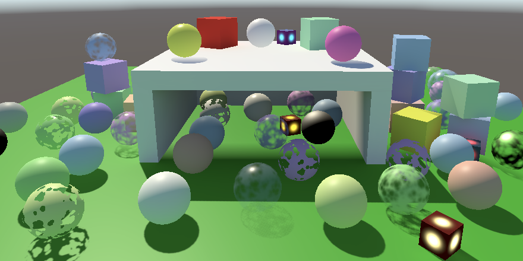
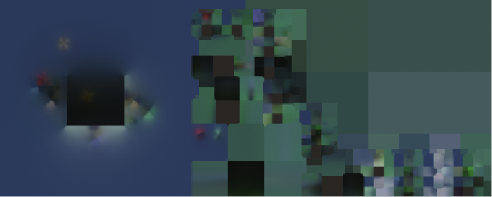
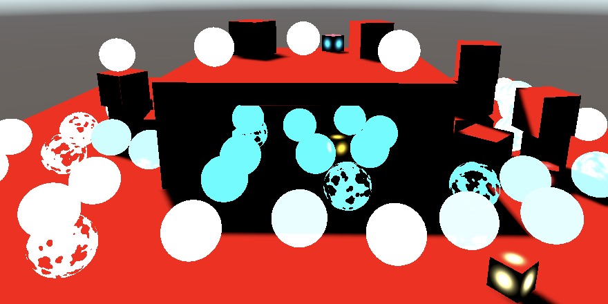
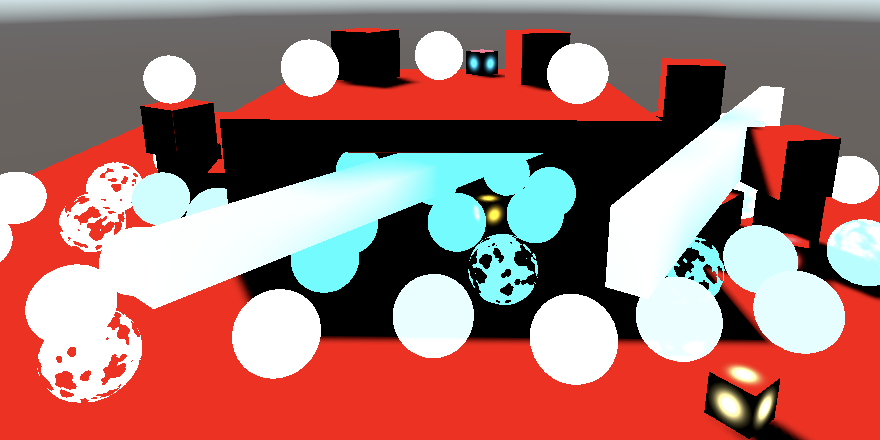

# **Shadow Masks**

[原文地址](https://catlikecoding.com/unity/tutorials/custom-srp/shadow-masks/)

## 1. Baking Shadows

使用光照图的好处是，我们不受限于最大的阴影距离。烘焙的阴影不会被剔除，但它们也不能改变。理想情况下，我们可以在最大阴影距离内使用实时阴影，超过这个距离则使用烘烤阴影。Unity的阴影遮罩混合照明模式使这成为可能。

### 1.1 Distance Shadow Mask

让我们考虑一下上一个教程中的同一个场景，但是减少了最大阴影距离，这样结构内部的一部分就不会有阴影了。这使得实时阴影的终点非常清楚。我们从只有一个光源开始。



<p align=center><font color=#B8B8B8 ><i>Baked indirect mixed lighting, max distance 11.</i></p>

将混合光照模式切换到Shadowmask。这将使光照数据失效，所以它必须再次被烘烤。


<p align=center><font color=#B8B8B8 ><i>Shadowmask mixed lighting mode.</i></p>

有两种方法可以使用阴影遮罩混合照明，可以通过质量项目设置进行配置。我们将使用Distance Shadowmask模式。另一种模式被称为只是Shadowmask，我们将在后面介绍。


<p align=center><font color=#B8B8B8 ><i>Shadow mask mode set to distance.</i></p>

两种阴影遮罩模式使用相同的烘焙光照数据。 在这两种情况下，光照贴图最终都包含间接光照，与 Baked Indirect 混合光照模式完全相同。 不同的是，现在还有一个烘焙阴影遮罩贴图，您可以通过烘焙光照贴图预览窗口对其进行检查。



<p align=center><font color=#B8B8B8 ><i>Baked indirect light and shadow mask.</i></p>

阴影遮罩贴图包含我们单个混合定向光的阴影衰减，表示所有有助于全局照明的静态对象投射的阴影。 数据存储在红色通道中，因此地图是黑色和红色的。

就像烘焙的间接光照一样，烘焙的阴影在运行时不能改变。 但是，无论光线的强度或颜色如何，阴影都将保持有效。 但是灯光不应该旋转，否则它的阴影将没有意义。 此外，如果间接照明是烘焙的，则不应过多地改变光线。 例如，如果在关闭灯后仍然保留间接照明，那显然是错误的。 如果灯光变化很大，那么您可以将其间接乘数设置为零，这样就不会为它烘焙间接光。

### 1.2 Detecting a Shadow Mask

要使用阴影遮罩，我们的管道必须首先知道它的存在。因为这都是关于阴影的，这是我们的Shadows类的工作。我们将使用着色器关键字来控制是否使用阴影遮罩。由于有两种模式，我们将引入另一个静态关键字数组，尽管它现在只包含一个关键字: *_SHADOW_MASK_DISTANCE*。

```cs
	static string[] shadowMaskKeywords = {
		"_SHADOW_MASK_DISTANCE"
	};
```

添加一个布尔字段来跟踪我们是否使用了阴影遮罩。我们每一帧都会重新评估，所以在设置中初始化为false。

```cs
	bool useShadowMask;

	public void Setup (…) {
		…
		useShadowMask = false;
	}
```

在Render的结尾处启用或取消关键字。即使我们最终没有渲染任何实时的阴影，我们也必须这样做，因为阴影遮罩不是实时的。

```cs
	public void Render () {
		…
		buffer.BeginSample(bufferName);
		SetKeywords(shadowMaskKeywords, useShadowMask ? 0 : -1);
		buffer.EndSample(bufferName);
		ExecuteBuffer();
	}
```

要知道是否需要阴影遮罩，我们必须检查是否有灯光使用它。我们将在ReserveDirectionalShadows中做这件事，当我们最后有一个有效的投射阴影的灯光时。

每个灯都包含关于它的烘烤数据的信息。它被存储在LightBakingOutput结构中，可以通过Light.bakingOutput属性来获取。如果我们遇到一个灯光，它的灯光贴图烘烤类型被设置为混合，并且它的混合照明模式被设置为阴影遮罩，那么我们就会使用阴影遮罩。

```cs
	public Vector3 ReserveDirectionalShadows (
		Light light, int visibleLightIndex
	) {
		if (…) {
			LightBakingOutput lightBaking = light.bakingOutput;
			if (
				lightBaking.lightmapBakeType == LightmapBakeType.Mixed &&
				lightBaking.mixedLightingMode == MixedLightingMode.Shadowmask
			) {
				useShadowMask = true;
			}

			…
		}
		return Vector3.zero;
	}
```

这在需要时可以启用着色器关键字。在Lit shader的CustomLit pass中为它添加相应的多编译指令。

```c
			#pragma multi_compile _ _CASCADE_BLEND_SOFT _CASCADE_BLEND_DITHER
			#pragma multi_compile _ _SHADOW_MASK_DISTANCE
			#pragma multi_compile _ LIGHTMAP_ON
```

### 1.3 Shadow Mask Data

在着色器方面，我们必须知道是否使用了阴影遮罩，如果使用了，那么烘烤的阴影是什么。让我们为Shadows添加一个ShadowMask结构来跟踪这两方面的信息，包括一个布尔值和一个浮点矢量域。给布尔值distance命名，以表明是否启用了距离阴影遮罩模式。然后将这个结构作为一个字段添加到全局ShadowData结构中。

```cs
struct ShadowMask {
	bool distance;
	float4 shadows;
};

struct ShadowData {
	int cascadeIndex;
	float cascadeBlend;
	float strength;
	ShadowMask shadowMask;
};
```

在GetShadowData中默认将阴影掩码初始化为不使用。

```cs
ShadowData GetShadowData (Surface surfaceWS) {
	ShadowData data;
	data.shadowMask.distance = false;
	data.shadowMask.shadows = 1.0;
	…
}
```

尽管阴影遮罩是用于阴影的，但它是场景的烘烤照明数据的一部分。因此，检索它是GI的责任。所以在GI结构中也添加一个阴影遮罩字段，并在GetGI中初始化为不使用。

```cs
struct GI {
	float3 diffuse;
	ShadowMask shadowMask;
};

…

GI GetGI (float2 lightMapUV, Surface surfaceWS) {
	GI gi;
	gi.diffuse = SampleLightMap(lightMapUV) + SampleLightProbe(surfaceWS);
	gi.shadowMask.distance = false;
	gi.shadowMask.shadows = 1.0;
	return gi;
}
```

Unity通过unity_ShadowMask纹理和相应的采样器状态使阴影遮罩图对着色器可用。在GI中与其他光照贴图纹理和采样器状态一起定义这些。

```c
TEXTURE2D(unity_Lightmap);
SAMPLER(samplerunity_Lightmap);

TEXTURE2D(unity_ShadowMask);
SAMPLER(samplerunity_ShadowMask);
```

然后添加一个SampleBakedShadows函数，使用光照地图的UV坐标对地图进行采样。就像普通的光照图一样，这只对光照图的几何体有意义，所以当LIGHTMAP_ON被定义时。否则就不会有烘烤的阴影，衰减总是1。

```c
float4 SampleBakedShadows (float2 lightMapUV) {
	#if defined(LIGHTMAP_ON)
		return SAMPLE_TEXTURE2D(
			unity_ShadowMask, samplerunity_ShadowMask, lightMapUV
		);
	#else
		return 1.0;
	#endif
}
```

现在我们可以调整GetGI，使其在定义了_SHADOW_MASK_DISTANCE的情况下启用距离阴影遮罩模式并对烘焙的阴影进行采样。注意，这使得距离布尔值成为编译时常量，所以它的使用不会导致动态分支。

```c
GI GetGI (float2 lightMapUV, Surface surfaceWS) {
	GI gi;
	gi.diffuse = SampleLightMap(lightMapUV) + SampleLightProbe(surfaceWS);
	gi.shadowMask.distance = false;
	gi.shadowMask.shadows = 1.0;

	#if defined(_SHADOW_MASK_DISTANCE)
		gi.shadowMask.distance = true;
		gi.shadowMask.shadows = SampleBakedShadows(lightMapUV);
	#endif
	return gi;
}
```

在GetLighting中，由Lighting将阴影遮罩数据从GI复制到ShadowData中，然后再通过灯光循环。在这一点上，我们也可以通过直接返回阴影遮罩数据作为最终的照明颜色来进行调试。

```c
float3 GetLighting (Surface surfaceWS, BRDF brdf, GI gi) {
	ShadowData shadowData = GetShadowData(surfaceWS);
	shadowData.shadowMask = gi.shadowMask;
	return gi.shadowMask.shadows.rgb;
	
	…
}
```

最初，它似乎并不奏效，因为一切都以白色结束。我们必须指示Unity向GPU发送相关数据，就像我们在前面的教程中为CameraRenderer.DrawVisibleGeometry中的光照图和探头所做的那样。在这种情况下，我们必须将PerObjectData.ShadowMask添加到每个物体的数据中。

```cs
			perObjectData =
				PerObjectData.Lightmaps | PerObjectData.ShadowMask |
				PerObjectData.LightProbe |
				PerObjectData.LightProbeProxyVolume
```


<p align=center><font color=#B8B8B8 ><i>Sampling shadow mask.</i></p>

>为什么每次我们改变着色器代码时，Unity都会烘烤照明？
>这发生在我们改变HLSL文件的时候，这些文件被元传递所包含。你可以通过暂时禁用自动生成来防止无谓的烘烤。

### 1.4 Occlusion Probes

我们可以看到，阴影遮罩被正确地应用于光绘对象。我们还看到，动态对象没有阴影遮罩数据，正如预期的那样。它们使用光探针而不是光照图。然而，Unity也将阴影遮罩数据纳入光探针，将其称为闭塞探针。我们可以通过在UnityInput的UnityPerDraw缓冲区中添加一个unity_ProbesOcclusion向量来访问这些数据。把它放在世界变换参数和光照图UV变换向量之间。

```c
	real4 unity_WorldTransformParams;

	float4 unity_ProbesOcclusion;

	float4 unity_LightmapST;
```

现在我们可以简单地在SampleBakedShadows中为动态对象返回该向量。

```c
float4 SampleBakedShadows (float2 lightMapUV) {
	#if defined(LIGHTMAP_ON)
		…
	#else
		return unity_ProbesOcclusion;
	#endif
}
```

再次，我们必须指示Unity将这些数据发送到GPU，这次是通过启用PerObjectData.OcclusionProbe标志。

```cs
			perObjectData =
				PerObjectData.Lightmaps | PerObjectData.ShadowMask |
				PerObjectData.LightProbe | PerObjectData.OcclusionProbe |
				PerObjectData.LightProbeProxyVolume
```



<p align=center><font color=#B8B8B8 ><i>Sampling occlusion probes.</i></p>

阴影遮罩中未使用的通道被设置为探针的白色，因此动态物体在完全发光时为白色，在完全阴影时为青色，而不是红色和黑色。

虽然这足以让阴影遮罩通过探针工作，但它破坏了GPU实例化。遮挡数据可以自动得到实例化，但是UnityInstancing只有在定义了SHADOWS_SHADOWMASK时才会这样做。所以在包括UnityInstancing之前，需要时在Common中定义它。这是唯一一个我们必须明确检查_SHADOW_MASK_DISTANCE是否被定义的地方。

### 1.5 LPPVs

光探针代理卷也可以与阴影遮罩一起工作。我们必须再次通过设置一个标志来启用它，这次是PerObjectData.OcclusionProbeProxyVolume。

```cs
			perObjectData =
				PerObjectData.Lightmaps | PerObjectData.ShadowMask |
				PerObjectData.LightProbe | PerObjectData.OcclusionProbe |
				PerObjectData.LightProbeProxyVolume |
				PerObjectData.OcclusionProbeProxyVolume
```

检索LPPV闭塞数据的工作原理与检索其光照数据相同，只是我们必须调用SampleProbeOcclusion而不是SampleProbeVolumeSH4。它存储在相同的纹理中，需要相同的参数，唯一的例外是不需要法线矢量。在SampleBakedShadows中添加一个分支，以及一个现在需要的世界位置的表面参数。

```c
float4 SampleBakedShadows (float2 lightMapUV, Surface surfaceWS) {
	#if defined(LIGHTMAP_ON)
		…
	#else
		if (unity_ProbeVolumeParams.x) {
			return SampleProbeOcclusion(
				TEXTURE3D_ARGS(unity_ProbeVolumeSH, samplerunity_ProbeVolumeSH),
				surfaceWS.position, unity_ProbeVolumeWorldToObject,
				unity_ProbeVolumeParams.y, unity_ProbeVolumeParams.z,
				unity_ProbeVolumeMin.xyz, unity_ProbeVolumeSizeInv.xyz
			);
		}
		else {
			return unity_ProbesOcclusion;
		}
	#endif
}
```

在GetGI中调用函数时添加新的表面参数。

```c
		gi.shadowMask.shadows = SampleBakedShadows(lightMapUV, surfaceWS);
```



<p align=center><font color=#B8B8B8 ><i>Sampling occlusion probes.</i></p>