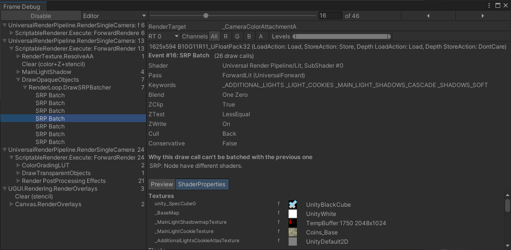

# Scriptable Render Pipeline Batcher

[原文地址](https://docs.unity3d.com/2019.4/Documentation/Manual/srp-using-scriptable-render-context.html)

**Render Pipeline** (SRP) Batcher 是一种绘图调用优化，可显着提高使用 SRP 的应用程序的性能。 SRP Batcher 减少了 Unity 为使用相同着色器变体的材质准备和调度绘制调用所需的 CPU 时间。


<p align=center><font color=#B8B8B8 ><i>The Scriptable Render Pipeline (SRP) Batcher reduces the CPU time Unity requires to render scenes with many materials that use the same shader variant.</i></p>

## Requirements and compatibility

本节包含有关 SRP Batcher 的渲染管线兼容性的信息。

### Render pipeline compatibility

| **Feature**     | **Built-in Render Pipeline** | **Universal Render Pipeline (URP)** | **High Definition Render Pipeline (HDRP)** | **Custom Scriptable Render Pipeline (SRP)** |
| :-------------- | :--------------------------- | :---------------------------------- | :----------------------------------------- | :------------------------------------------ |
| **SRP Batcher** | No                           | Yes                                 | Yes                                        | Yes                                         |

### GameObject compatibility

在任何给定的场景中, 一些游戏对象与 SRP Batcher 兼容，有些则不兼容。 兼容的游戏对象使用 SRP Batcher 代码路径，不兼容的游戏对象使用标准 SRP 代码路径。 有关详细信息，请参阅  [How the SRP Batcher works](https://docs.unity3d.com/2021.3/Documentation/Manual/SRPBatcher.html#how-the-srp-batcher-works)。

游戏对象必须满足以下要求才能与 SRP Batcher 代码路径兼容：

* 游戏对象必须包含一个网格或蒙皮网格。 它不能是一个粒子。
* GameObject 不得使用  [MaterialPropertyBlocks](https://docs.unity3d.com/2021.3/Documentation/ScriptReference/MaterialPropertyBlock.html)。
* GameObject 使用的着色器必须与 SRP Batcher 兼容。 有关详细信息，请参阅 [Shader compatibility](https://docs.unity3d.com/2021.3/Documentation/Manual/SRPBatcher.html#shader-compatibility)。

### Shader compatibility

高清渲染管线 (HDRP) 和通用渲染管线 (URP) 中的所有光照和非光照着色器都符合此要求（这些着色器的粒子版本除外）。

要使自定义着色器与 SRP Batcher 兼容，它必须满足以下要求：

* 着色器必须在名为 UnityPerDraw 的单个常量缓冲区中声明所有内置引擎属性。 例如，unity_ObjectToWorld 或 unity_SHAr。
* 着色器必须在名为 UnityPerMaterial 的单个常量缓冲区中声明所有材质属性。


您可以在 Inspector 面板中检查着色器的兼容性状态。


<p align=center><font color=#B8B8B8 ><i>You can check the compatibility of your shaders in the Inspector panel for the specific shader.</i></p>

## Using the SRP Batcher

本节包含有关如何在 Unity 的预构建脚本渲染管道中使用 SRP Batcher 的信息。

### Using the SRP Batcher in URP

要在 URP 中激活 SRP Batcher，请执行以下操作：

1. In the **Project window**, select the [URP Asset](https://docs.unity3d.com/Packages/com.unity.render-pipelines.universal@12.1/manual/universalrp-asset.html).
2. In the Inspector for the URP asset, enable **SRP Batcher**. If this option is not visible, follow the instructions below on [How to show Additional Properties for the URP Asset](https://docs.unity3d.com/2021.3/Documentation/Manual/SRPBatcher.html#how-to-show-additional-properties-for-the-urp-asset).

### How to show Additional Properties for the URP Asset

默认情况下，Unity 不会在 URP 资源中显示某些高级属性。 要查看所有可用属性：

* 在 URP 资产的任何部分中，单击垂直省略号图标 (⋮) 并选择显示附加属性。


Unity 显示当前部分中的所有可用属性。

要在所有部分中显示所有附加属性：

1. Click the vertical ellipsis icon and select **Show All Additional Properties**. Unity opens the **Core Render Pipeline** section in the **Preferences** window.
2. In the property **Additional Properties > Visibility**, select **All Visible**.


<p align=center><font color=#B8B8B8 ><i>Additional Properties > Visibility > All Visible</i></p>

### Using the SRP Batcher in HDRP

使用 HDRP 时，Unity 默认启用 SRP Batcher。 不建议禁用 SRP Batcher。 但是，您可以暂时禁用 SRP Batcher 以进行调试。

要在构建时使用编辑器启用和禁用 SRP Batcher：

1. In the Project window, select the [HDRP Asset](https://docs.unity3d.com/Packages/com.unity.render-pipelines.high-definition@latest/index.html?subfolder=/manual/HDRP-Asset.html).
2. In the Inspector for the asset, enter [Debug mode](https://docs.unity3d.com/2021.3/Documentation/Manual/InspectorOptions.html). In Debug mode, you can see the properties of the HDRP Asset, including the SRP Batcher property.
3. Select **Enable** **SRP Batcher** to enable or disable the SRP Batcher.

要在运行时启用或禁用 SRP Batcher，请在 C# 代码中切换以下全局变量：

```cs
GraphicsSettings.useScriptableRenderPipelineBatching = true;
```

## How the SRP Batcher works

优化绘图调用的传统方法是减少它们的数量。 相反，SRP Batcher 减少了绘制调用之间的渲染状态变化。 为此，SRP Batcher 结合了一系列绑定和绘制 GPU 命令。 每个命令序列称为一个 SRP 批处理。


<p align=center><font color=#B8B8B8 ><i>The batching of bind and draw commands reduces the GPU setup between draw calls.</i></p>

为了实现渲染的最佳性能，每个 SRP 批处理应包含尽可能多的绑定和绘制命令。 要实现这一点，请使用尽可能少的着色器变体。 您仍然可以根据需要使用具有相同着色器的尽可能多的不同材质。

当 Unity 在渲染循环期间检测到新材质时，CPU 会收集所有属性并将它们绑定到 GPU 的常量缓冲区中。 GPU 缓冲区的数量取决于着色器如何声明其常量缓冲区。

SRP Batcher 是一个底层渲染循环，可让材质数据持久保存在 GPU 内存中。 如果材质内容没有改变，SRP Batcher 不会进行任何渲染状态更改。 相反，SRP Batcher 使用专用代码路径来更新大型 GPU 缓冲区中的 Unity 引擎属性，如下所示：


<p align=center><font color=#B8B8B8 ><i>The SRP Batcher rendering workflow. The SRP Batcher uses a dedicated code path to update the Unity Engine properties in a large GPU buffer.</i></p>

在这里，CPU 只处理 Unity Engine 属性，在上图中标记为 Per Object large buffer。 所有材质都有位于 GPU 内存中的持久常量缓冲区，可以随时使用。 这加快了渲染速度，因为：

* 所有材质内容现在都保留在 GPU 内存中。
* 专用代码为所有每个对象属性管理一个大型的每个对象 GPU 常量缓冲区。

### Intentionally removing SRP Batcher compatibility for GameObjects

在极少数情况下，您可能希望有意使特定游戏对象与 SRP Batcher 不兼容。 例如，如果您想使用与 SRP Batcher 不兼容的 [GPU instancing](https://docs.unity3d.com/2021.3/Documentation/Manual/GPUInstancing.html)。 如果您想使用完全相同的材质渲染许多相同的网格，GPU 实例化可能比 SRP Batcher 更有效。 要使用 GPU 实例化，您必须：

- 使用 [Graphics.DrawMeshInstanced](https://docs.unity3d.com/2021.3/Documentation/ScriptReference/Graphics.DrawMeshInstanced.html).
- 手动移除 SRP Batcher 兼容性并为材质启用 GPU 实例化。

有两种方法可以从 GameObject 中删除与 SRP Batcher 的兼容性：

* 使着色器不兼容。
* 使渲染器不兼容。

提示：如果您使用 GPU 实例化而不是 SRP Batcher，请使用 Profiler确保 GPU 实例化对您的应用程序比 SRP Batcher 更有效。

#### Removing shader compatibility

您可以使手写和 Shader Graph 着色器与 SRP Batcher 不兼容。但是，对于 Shader Graph 着色器，如果您经常更改和重新编译 Shader Graph，则使[renderer incompatible](https://docs.unity3d.com/2021.3/Documentation/Manual/SRPBatcher.html#removing-renderer-compatibility)容会更简单。

要使 Unity 着色器与 SRP Batcher 不兼容，您需要更改着色器源文件：

1. 对于手写着色器，打开着色器源文件。对于 Shader Graph 着色器，将 Shader Graph 的编译着色器源代码复制到新的着色器源文件中。在您的应用程序中使用新的着色器源文件而不是 Shader Graph。
2. 将新的[material property](https://docs.unity3d.com/2021.3/Documentation/Manual/SL-Properties.html)声明添加到着色器的属性块中。不要在 UnityPerMaterial 常量缓冲区中声明新的材质属性。

material 属性不需要做任何事情；仅具有 UnityPerMaterial 常量缓冲区中不存在的材质属性会使着色器与 SRP Batcher 不兼容。

警告：如果您使用 Shader Graph，请注意每次编辑和重新编译 Shader Graph 时，都必须重复此过程。

#### Removing renderer compatibility

您可以使单个渲染器与 SRP Batcher 不兼容。 为此，请将 MaterialPropertyBlock 添加到渲染器。

## Profiling the SRP Batcher in the Unity Frame Debugger

您可以在 [Frame Debugger](https://docs.unity3d.com/2021.3/Documentation/Manual/FrameDebugger.html) 窗口中检查 SRP 批处理的状态。 每个 SRP Batch 显示 Unity 使用了多少次绘图调用，Unity 附加到着色器的关键字，以及 Unity 没有将之前的绘图调用批处理的原因。

要检查 SRP Batcher 批次的状态：

1. In the Editor, open the Frame Debugger (menu: **Window** > **Analysis** > **Frame Debugger**).
2. In the Frame Debugger, go to **Render Camera** > **Render Opaques**.
3. Expand the **RenderLoopNewBatcher. Draw** list.
4. Select on the **SRP Batch** you want to inspect.

在下面的例子中，原因是：节点有不同的着色器。 这意味着该 SRP 批次的着色器与前一个 SRP 批次中的着色器不同。 因为 SRP Batcher 使用了不同的着色器，所以 SRP Batcher 创建了一个新批次。 如果多个 SRP 批次的绘制调用数量较少，则通常意味着项目使用了太多着色器变体。



<p align=center><font color=#B8B8B8 ><i>In the Frame Debugger window, you can find details about individual SRP batches, including why the SRP Batcher created a new SRP batch instead of continuing the existing one.</i></p>

如果您编写自己的 Scriptable Render Pipeline，而不是使用 Universal Render Pipeline 或 High Definition Render Pipeline，请尝试使用最少的关键字编写通用多用途着色器。 这是最佳选择，因为您可以根据需要使用任意数量的材料属性。