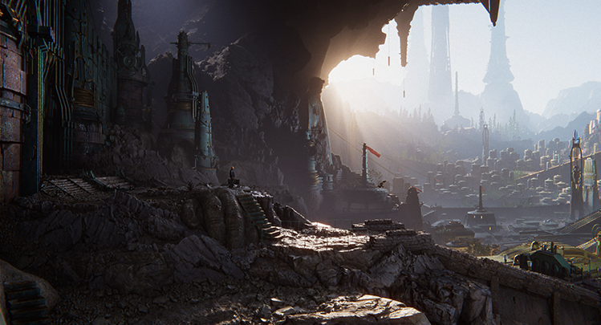

# Scriptable Render Pipeline fundamentals

[Unity版本2021.3 文档地址](https://docs.unity3d.com/2019.4/Documentation/Manual/ScriptableRenderPipeline.html)

Unity 的可编程渲染管线 (Scriptable Render Pipeline, SRP) 是一项可以通过 C# 脚本来控制渲染的功能。SRP 技术是通用渲染管线 (URP) 和高清渲染管线 (HDRP)的基础。

如果想了解 SRP 的工作原理，以及深入了解 URP 和 HDRP 的工作原理，请阅读此文档。

本节包含以下页面：

- [Scriptable Render Pipeline introduction](https://docs.unity3d.com/2019.4/Documentation/Manual/scriptable-render-pipeline-introduction.html)
- [Scheduling and executing rendering commands in the Scriptable Render Pipeline](https://docs.unity3d.com/2019.4/Documentation/Manual/srp-using-scriptable-render-context.html)
- [SRP Batcher](https://docs.unity3d.com/2019.4/Documentation/Manual/SRPBatcher.html)