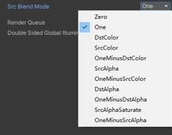
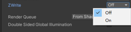
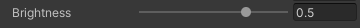
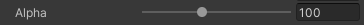
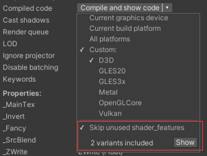
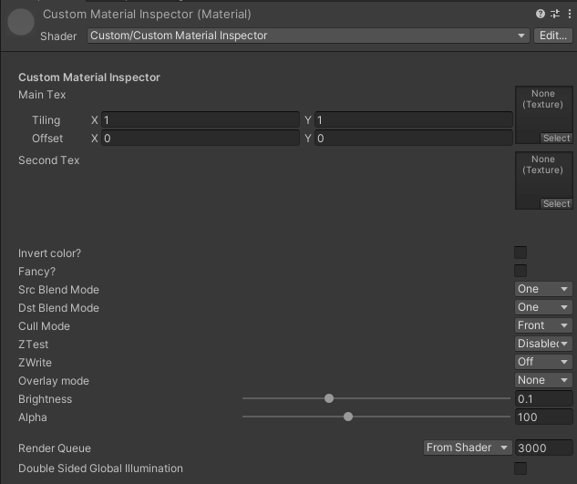

[原文地址](https://www.jianshu.com/p/a1f5ecb7706d)

## 1.0 不同类型的DrawerClass

| 类型              | 描述                                                         |
| ----------------- | ------------------------------------------------------------ |
| ToggleDrawer      | 将float类型数据显示为开关，数值只能是0（关闭）或1（开启）    |
| EnumDrawer        | 枚举会将float型数据显示为下拉列表，可以用于选择混合系数，比较方法等，也可以自定义 |
| KeywordEnumDrawer | 和EnumDrawer类似，但是需要先定义shader keyword才能使用       |
| PowerSliderDrawer | 指数对应关系的滑动条，滑动条上的数值不再按照线性关系进行对应 |
| IntRangeDrawer    | 将范围型的数据显示为只能设置整数的滑动条                     |

在编写Shader的时候，DrawerClass需要写在对应属性之前的“[]”中，类别的后缀名称“Drawer”不需要添加，因为Unity在编辑的时候会自动添加。

### 1.1 Toggle

将float类型的数据以开关的形式在材质属性面板上显示，数值只能设置为0或1，0为关闭，1为开启，Shader keyword会被Unity默认设置为“property name”+“_ON”，需要注意的一点是，关键词的所有字母必须大写。如：


```csharp
// Shader的关键词会被设置为_INVERT_ON
[Toggle] _Invert ("Invert color?", Float) = 0
```

除了使用Unity默认的关键词，也可以自定义一个特殊的关键词，如：


```csharp
// ENABLE_FANCY即为自定义的Shader关键词
[Toggle(ENABLE_FANCY)] _Fancy ("Fancy?", Float) = 0
```


### 1.2 Enum

Enum将float类型的数据以下拉列表的形式在材质面板上显示，Unity为用户提供了一些内置的枚举类，如BlendMode,CompareFunction。如：


```csharp
[Enum(UnityEngine.Rendering.BlendMode)] _SrcBlend("Src Blend Mode", Float)=1
```





用户也可以自定义枚举的名称/数值对，但是一个枚举最多只能自定义7个名称/数值对。如：


```csharp
[Enum(Off, 0, On, 1)] _ZWrite ("ZWrite", Float) = 0
```



### 1.3 KeywordEnum

KeywordEnum跟Enum类似，不过KeywordEnum会有与之对应的Shader keyword，在Shader中通过`# pragma shader_feature`或`# pragma multi_compile`指令可以或者关闭某一部分Shader代码。
 Shader keyword格式为：`property name_enum name，属性名称+"下划线"+枚举名称`，所有英文必须大写，并且最多支持9个关键词。如：


```csharp
// 对应的Shader keyword分别为：_OVERLAY_NONE，_OVERLAY_ADD，_OVERLAY_MULTIPLY
[KeywordEnum(None, Add, Multiply)] _Overlay ("Overlay mode", Float) = 0
```

### 1.4 PowerSlider

PowerSlider会将范围型数值的属性显示为非线性对应的滑动条。滑动条上的值不再按照线性关系进行对应，而是以指数的方式。如：


```csharp
 [PowerSlider(3.0)] _Brightness ("Brightness", Range (0.01, 1)) = 0.1
```

这是一个以3为指数对应关系的滑动条，括号内的数值为指数。
 曲线y=x^3，函数中的变量x就是滑动块所在位置，y就是属性的数值。



### 1.5 InRange

IntRange也是将数值以滑动条的形式在材质属性面板上显示，只不过数值不再是float类型，只能是整数型数值，如：


```csharp
[IntRange] _Alpha ("Alpha", Range (0, 255)) = 100
```

只能在滑动条上使用区间[0,255]之内的整数值。



## 2.0 在编译指令中定义Keyword

定义了ToggleDrawer或者KeywordEnumDrawer之后，如果想要正常使用，还需要在编译指令中声明Shader keyword。如：


```cpp
#pragma shader_feature _OVERLAY_NONE _OVERLAY_ADD _OVERLAY_MULTIPLY
```

或者


```cpp
#pragma multi_compile _OVERLAY_NONE _OVERLAY_ADD _OVERLAY_MULTIPLY
```

不同keyword之间需要用空格隔开。

虽然表面上看似通过一个Shader文件实现了不同种情况，但是Unity会自动将不同情况编译成不同版本的Shader文件，这些不同版本的Shader文件被称为Shader变体（Variants），上述编译指令中包含三个Shader变体。
 假设在添加一个指令：


```cpp
#pragma shader_feature _INVERT_ON
```

本指令包含Toggle的关闭与开启俩种情况，所以Unity最终会编译出2x3=6个Shader变体。

> 俩种不同编译指令之间的区别如下：
>  <1>shader_feature：只会为材质使用到的keyword生成变体，没有使用到的keyword不会生产变体，因此无法在运行的时候通过脚本切换效果。
>  <2>multi_compile：会为所有keyword生产变体，因此可以在运行的时候通过脚本切换效果。

在Shader文件的属性设置面板中可以查看到本Shader生成的变体数量。
 开启`Skip unused shader_features`选项可以只查看使用keyword的变体数量。
 关闭`Skip unused shader_features`选项查看所有keyword的变体数量。
 如果需要确定具体变体有哪些keyword组成，可以单击`Show`查看。




## 3.0 属性的特性和Drawer

如果需要对开放出来的属性进行一些限制，可以对属性的特性和Drawer进行修改，这些修改命令需要写在属性语句之前。

| 指令              | 描述                                                         |
| ----------------- | ------------------------------------------------------------ |
| [HideInInspector] | 可以添加到任何Property之前，使属性在材质面板上隐藏           |
| [NoScaleOffset]   | 添加在2D Property之前，可以在材质面板上隐藏纹理贴图的Tiling和Offset选项 |
| [Normal]          | 添加在2D Property之前，可以检测关联的纹理贴图是否为法线贴图，如果不是，则会弹出修复提示 |
| [HDR]             | 添加在2D或Color Property之前，可以是属性开启HDR效果，从而使数值突破1的限制，常用于自发光属性 |

## 4.0 装饰性 PropertyDrawer

装饰性的PropertyDrawer只起到界面美观作用，不会影响属性本身。

| 类型            | 描述                         |
| --------------- | ---------------------------- |
| SpaceDecorator  | 在材质属性面板上添加空白行   |
| HeaderDecorator | 在材质属性面板上添加标题文字 |

在编写Shader的时候，类别的后缀名称“Decorator”依然不需要添加，Unity在编译的时候会自动添加。

### 4.1 SpaceDecorator

SpaceDecorator可以在属性之前添加空白行，以起到分割属性的作用。如：


```csharp
[Space]_MainTex ("Main Tex", 2D) = "white" {}
```

可以在后边直接写上空白行的数量，如：


```csharp
[Space(30)]_MainTex ("Main Tex", 2D) = "white" {}
```

### 4.2 HeaderDecorator

当Shader开放了很多属性的时候，可以使用HeaderDecorator在属性前添加一个标题文字，从而对不同类别的属性进行区分。如：


```json
[Header(Custom Material Inspector)]
```


HeaderDecorator

## 5.0 完整PropertyDrawer示列


```csharp
Shader "Custom/Custom Material Inspector"
{
    Properties
    {
        // 在材质面板插入一行标题
        [Header(Custom Material Inspector)]

        // 在材质面板插入一行空白行，可以写在单独一行
        [Space]
        _MainTex ("Main Tex", 2D) = "white" {}

        // 在材质面板上隐藏Tiling和Offset
        [NoScaleOffset] _SecondTex ("Second Tex", 2D) = "white" {}

        // 在材质面板插入30行空白行，可以写在单独一行
        [Space(30)]

        // 开关
        [Toggle] _Invert ("Invert color?", Float) = 0

        // 自定义Shader关键词的开关
        [Toggle(ENABLE_FANCY)] _Fancy ("Fancy?", Float) = 0

        // Unity内置的枚举下拉菜单
        [Enum(UnityEngine.Rendering.BlendMode)] _SrcBlend("Src Blend Mode", Float)=1
        [Enum(UnityEngine.Rendering.BlendMode)] _DstBlend("Dst Blend Mode", Float)=1
        [Enum(UnityEngine.Rendering.CullMode)] _Cull ("Cull Mode", Float) = 1
        [Enum(UnityEngine.Rendering.CompareFunction)] _ZTest ("ZTest", Float) = 0

        // 自定义枚举下拉菜单
        [Enum(Off, 0, On, 1)] _ZWrite ("ZWrite", Float) = 0
        
        // 关键词枚举下拉菜单
        [KeywordEnum(None, Add, Multiply)] _Overlay ("Overlay mode", Float) = 0

        // 指数滑动条
        [PowerSlider(3.0)] _Brightness ("Brightness", Range (0.01, 1)) = 0.1
        // 整数滑动条
        [IntRange] _Alpha ("Alpha", Range (0, 255)) = 100
    }
    SubShader
    {
        Tags { "Queue"="Transparent" "RenderType"="Transparent" }
        Blend [_SrcBlend] [_DstBlend]
        Cull [_Cull]
        ZTest [_ZTest]
        ZWrite [_ZWrite]

        Pass
        {
            CGPROGRAM

            // 通过"#pragma shader_feature"定义 _INVERT_ON shader关键词
            #pragma shader_feature _INVERT_ON

            // 通过"#pragma shader_feature"定义 ENABLE_FANCY shader关键词
            #pragma shader_feature ENABLE_FANCY

            // 通过"#pragma multi_compile"定义关键词枚举的每一个shader关键词
            #pragma multi_compile _OVERLAY_NONE _OVERLAY_ADD _OVERLAY_MULTIPLY

            #pragma vertex vert
            #pragma fragment frag
            #include "UnityCG.cginc"

            sampler2D _MainTex;
            float4 _MainTex_ST;
            sampler2D _SecondTex;
            float4 _SecondTex_ST;
            float _Brightness;

            struct v2f
            {
                float4 uv : TEXCOORD0;
                float4 vertex : SV_POSITION;
            };

            v2f vert (appdata_base v)
            {
                v2f o;
                o.vertex = UnityObjectToClipPos(v.vertex);
                o.uv.xy = TRANSFORM_TEX(v.texcoord, _MainTex);
                o.uv.zw = TRANSFORM_TEX(v.texcoord, _SecondTex);
                return o;
            }

            fixed4 frag (v2f i) : SV_TARGET
            {
                fixed4 col = tex2D(_MainTex, i.uv.xy);

                // 通过 #if, #ifdef 或者 #if defined启用某一部分代码
                #if _INVERT_ON
                col = 1 - col;
                #endif

                #if ENABLE_FANCY
                col.r = 0.5;
                #endif

                fixed4 secCol = tex2D(_SecondTex, i.uv.zw);

                #if _OVERLAY_ADD
                col += secCol;
                #elif _OVERLAY_MULTIPLY
                col *= secCol;
                #endif

                col *= _Brightness;

                return col;
            }
            ENDCG
        }
    }
}
```


