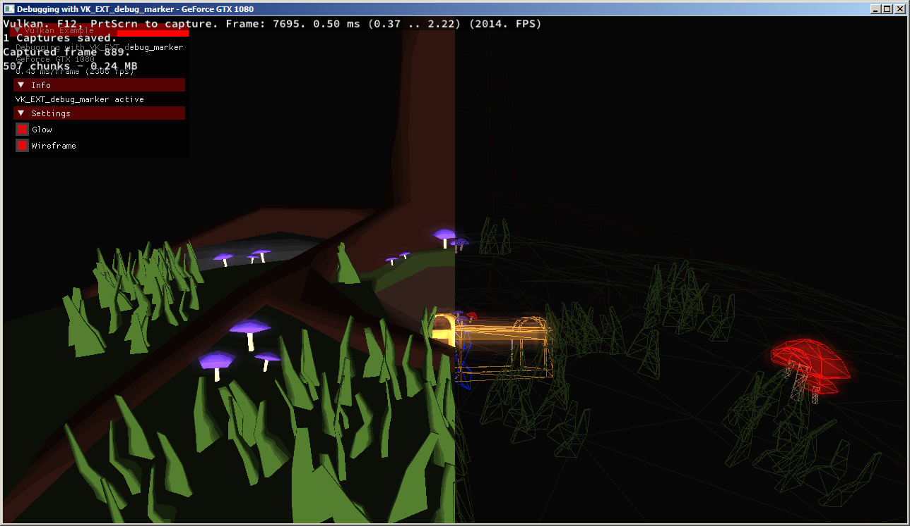
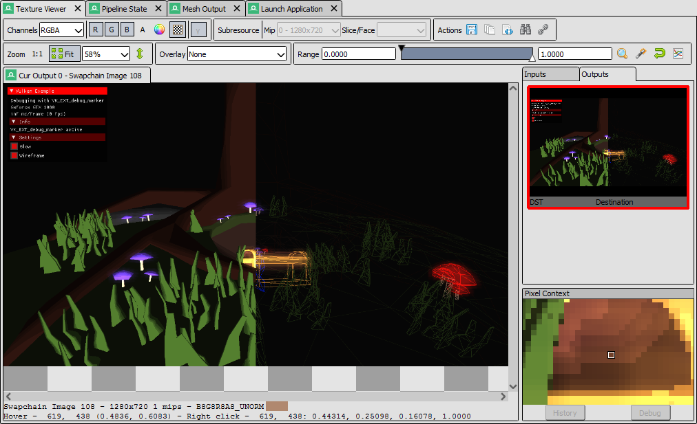
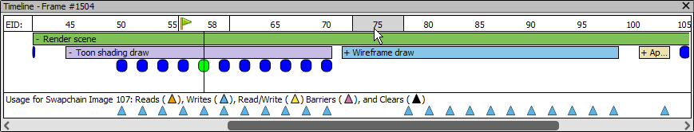
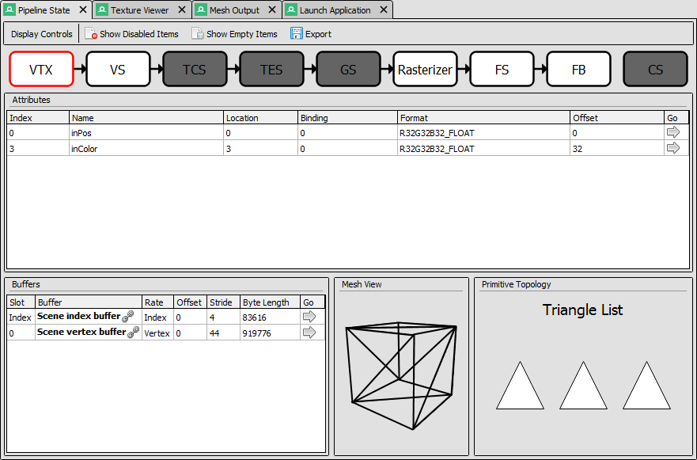
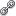
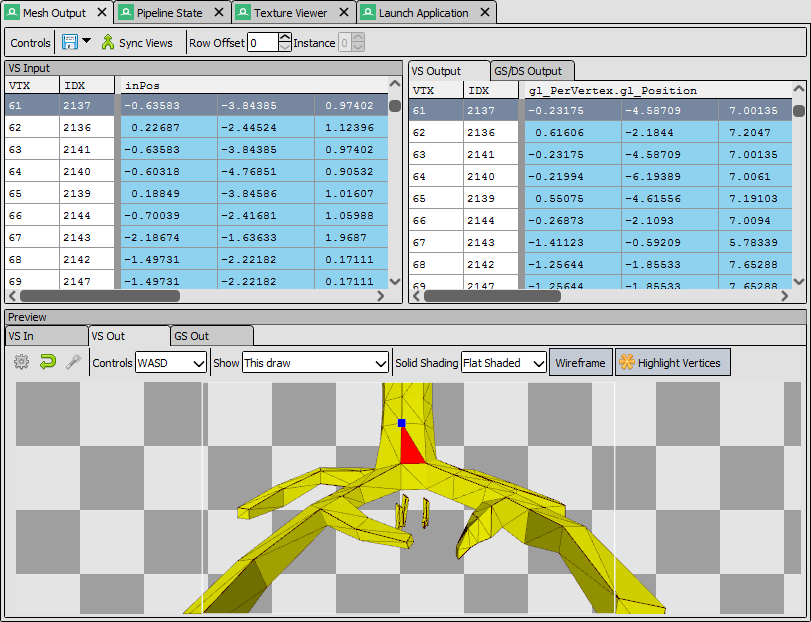

[Quick Start](https://renderdoc.org/docs/getting_started/quick_start.html)

# Quick Start

本文档简要介绍了如何使用 RenderDoc 来捕获和分析您的应用程序。它没有详细说明可用于挖掘事物的确切功能，因为这可以在其他地方找到。相反，它只关注从开始到结束的工作流程以及大致在哪里寻找不同的东西。

对于本教程，我们将使用 [Sascha Willems’ Vulkan samples repository](https://github.com/SaschaWillems/Vulkan)中的debugmarker示例。

## Capturing a frame

要捕获帧，首先选择**File** → **Launch Application**。默认情况下，这将打开一个新的停靠窗口，您可以在其中配置捕获时将使用的不同设置。您可能会发现此窗口已经可用。

<i>Launching an executable</i>

在大多数情况下，默认设置都可以很好地工作，因此您可以浏览到 exe 或将其拖入“可执行文件”框中。如果工作目录框为空，则将使用可执行文件的目录。输入您可能需要的任何命令行，然后单击 Launch 以使用 RenderDoc 启动应用程序。

可以在[Capture Dialog](https://renderdoc.org/docs/window/capture_attach.html)的详细信息页面中找到有关特定选项及其功能的更多详细信息。

> **Note**
>
> 您应该选择 RenderDoc 的构建以匹配您的操作系统 - Windows x64 为 64-bit，反之亦然
>
> 您只能使用 64 位版本的 RenderDoc 捕获 64 位进程。RenderDoc 的任一版本都可以捕获 32 位进程。

## RenderDoc in-app

RenderDoc 有一个相当少的应用内覆盖，只是为了表明 RenderDoc 已成功加载并准备捕获帧。

准备好后，按下捕捉键（F12或Print Screen），按键后的下一帧将被捕捉，这将显示在叠加层上，让您知道一帧已成功保存。

<i>The in-application RenderDoc Overlay</i>

当应用程序退出时，如果您捕获了一个帧，它将自动开始在 RenderDoc UI 中打开。如果您没有捕获帧，则不会发生任何事情，并且 RenderDoc UI 将恢复到您单击 Launch 时的状态。

如果您进行了多次捕获，您将看到一个缩略图列表，允许您打开（在当前实例或新实例中并排比较）、保存和删除它们。您还可以在程序仍在运行时访问此视图，有关获取多个帧捕获的更多信息，请参阅[Capture Connection](https://renderdoc.org/docs/window/capture_connection.html)。但是请注意，对于简单的用例，您无需担心这一点！

## RenderDoc layout

RenderDoc 的布局可以进行大量定制，因此本节将仅介绍默认布局。我们将介绍默认打开的窗口以及如何使用每个窗口来分析您的程序。

这些窗口中的每一个都有一个更深入的部分，并提供有关每个功能和特性的详细信息，对于更复杂的窗口（例如纹理查看器），您可能希望浏览这些窗口以了解可用的内容并使用它们作为以后的参考。

### Texture Viewer

<i>The Texture Viewer</i>

可以在[Texture Viewer](https://renderdoc.org/docs/window/texture_viewer.html)页面上找到更多详细信息。

纹理查看器几乎可以满足您的预期 - 它允许您检查应用程序中的纹理和渲染目标。

有各种可视化控件可让您选择不同的通道、mip 级别或纹理的其他方面，更多详细信息可在上面的页面中找到。在这里，我们将只涉及亮点：

- 缩略图条（默认在右侧）列出了当前绑定和使用的输出目标或着色器输入。当您浏览场景时，选择其中的每一个（缩略图上的红色轮廓指示哪个被选中）将跟随绑定到该插槽的任何资源。

    例如，如果您选择渲染目标 0，则纹理显示将更新以显示当前绑定的渲染目标 0，而不管是哪个纹理。如果您关注的插槽变为未绑定或未使用，则之前的纹理仍将显示，直到您选择不同的管道插槽，或再次绑定插槽。未绑定的纹理插槽显示在其缩略图下方列出的*未绑定。*

    要打开特定纹理并在其更改插槽或变为未绑定时观察它，您可以在新的锁定选项卡中打开它。双击它，右键单击它并“在新锁定的选项卡中打开”，或[按名称打开它](https://renderdoc.org/docs/how/how_view_texture.html)。

- 纹理的格式和尺寸显示在纹理显示本身下方的状态栏上。同样在此状态栏上，您可以看到当前悬停的像素坐标，以及可以通过右键单击纹理显示的任意位置来检查的“拾取”像素值。

- 除此之外，在纹理查看器窗口的右下角最后一个拾取的像素周围有一个小的上下文缩放部分。您还可以从这里启动像素历史记录或调试器，详见 [How do I debug a shader](https://renderdoc.org/docs/how/how_debug_shader.html).

- 我们要强调的最后一件事是范围控制。这是一个相当灵活的工具，可让您调整图像中的可见范围。*这在查看范围超出[0, 1]*的 HDR 图像时特别有用。

    要使用范围控制，您可以拖动白点和黑点进行微调或键入值来更改白点和黑点的值（默认分别为 0 和 1）。范围控件本身的右侧还有一些有用的控件，在[Texture Viewer](https://renderdoc.org/docs/window/texture_viewer.html) 页面中再次详细说明。

### Event Browser

<i>The Event Browser</i>

可以在[Event Browser](https://renderdoc.org/docs/window/event_browser.html) 页面上找到更多详细信息。

事件浏览器是逐步浏览帧并浏览其中发生的事件的主要方法。第一列 EID（Even ID）按时间顺序指示这是帧中的哪个事件或 API 调用。

默认情况下，此处列出的事件是那些称为行为的事件。绘制和调度是行为的示例，也是修改资源的事件，如清除和复制。状态设置和其他 CPU 更新调用（如地图）不包括在内，但在 API 调用视图中可用（见下文）。您可以根据需要使用过滤器字段来包含或排除事件，有关更多信息，请参阅[How do I filter visible events?](https://renderdoc.org/docs/how/how_filter_events.html).

列可以自定义和重新排序，选择列按钮（或右键单击)将允许您选择显示哪些列。

标准性能标记可用，并按照您的预期创建层次结构/标签。这些可以展开或折叠，并且可以通过普通控件进行键盘浏览 - 左右在层次结构中更高或更低，上下通过兄弟姐妹上下移动。有关这些标记的更多信息，请参阅 [How do I annotate a capture?](https://renderdoc.org/docs/how/how_annotate_capture.html).

“当前”事件 - 即我们正在检查图形状态的事件 - 用绿色标志突出显示，并且该行突出显示。当任何行被选中时，它立即成为新的当前事件。

选择事件浏览器后，您可以按快捷键CTRL-F来查找给定的事件或行为。您可以输入一个数字以跳转到给定的 EID。

书签按钮可让您为事件添加书签，快捷键是CTRL-B。

书签事件列表将显示在事件浏览器顶部的工具栏上，它们和快捷键CTRL-1到CTRL-0 将跳转到相应的书签 EID。这些快捷方式可以在应用程序的任何位置使用。

书签可以与捕获一起保存并与他人共享。有关这方面的更多信息，请参阅[How do I annotate a capture?](https://renderdoc.org/docs/how/how_annotate_capture.html) 页。

### API Inspector

<i>The API Calls + Callstack Panel</i>

可以在[API Inspector](https://renderdoc.org/docs/window/api_inspector.html)页面上找到更多详细信息。

API 调用窗口会随着新事件的选择而更新。它显示了各个 API 调用及其参数。如果选择了一个行为，列表会显示前一个行为和这个行为之间的所有 API 调用，并且这个列表中的最后一个条目总是对应于动作本身。每行都可以展开以显示传递给该 API 调用的参数。

窗口底部是一个可选的可扩展部分，它显示了从应用程序代码到 API 函数的调用堆栈（如果可用并已记录）。

为了查看这些调用堆栈，您必须首先解析随捕获记录的符号。为此，请单击**`Tools`**菜单下的**`Resolve Symbols`**。有关此过程的更多详细信息，请参阅指南：[How do I capture callstacks?](https://renderdoc.org/docs/how/how_capture_callstack.html).

### Timeline Bar

<i>The Timeline Bar</i>

更多详细信息可以在 [Timeline Bar](https://renderdoc.org/docs/window/timeline_bar.html) 页面上找到。

时间线栏本质上是帧的替代视图，水平轴是帧中的时间。水平轴由 API 调用均匀缩放，这样每个 API 调用在任何给定缩放级别都具有相同的宽度。

在这种情况下，帧标记层次结构是自上而下的，可以通过单击每个部分来展开或折叠。在此图像中，“Render Scene”和“Toon shading draw”均已展开，但其他部分仍处于折叠状态。每个操作都在其子级的层次结构部分下方呈现为一个蓝色点。当前行为（如果可见）呈现为绿色圆圈。

当前行为周围有一条垂直线，以及鼠标悬停的事件周围有一条灰色轮廓。

在帧中使用当前选定的纹理时，引用它的每个动作都会在条形下方绘制一个标记。标记的不同颜色表示该点的操作是否正在写入纹理、读取、同时读取和写入等。如果标记太靠近，它们将彼此隔开而无法读取，并且不一定会排成一行。除非您放大，否则执行特定操作。

这是一个非常有用的工具，可以通过帧跟踪数据，并在目标被写入不应写入的位置时突出显示潜在的冗余或错误。

### Pipeline State

<i>The Pipeline State Viewer</i>

更多详细信息可以在[Pipeline State](https://renderdoc.org/docs/window/pipeline_state.html)页面上找到。

Pipeline State 窗口可能是最详细但也最容易理解的。此窗口仅列出图形管道的每个有状态方面以及当前事件中存在的值或对象。

默认情况下，管道不会包含空的或未使用的条目 - 即，如果着色器仅从资源 0 和 1 读取，即使某些内容绑定到插槽 2，它也不会显示。同样，插槽 3-128 是空的 - 它们也不会显示。此行为可以通过工具栏上的**Show Unused Items**和**Show Empty Items**切换来修改。即使着色器未从中读取，Show Unused 也会显示插槽 2。Show Empty 将显示插槽 3-128。由于着色器绑定模型通常完全不同，因此此行为因 API 而异。

需要注意的重要一点是，每个流水线阶段的部分中的大多数内容都可以展开以更详细地查看。查找 Go 图标 ( ) 以指示更详细的视图可用。通常这意味着对于着色器，将打开着色器源/反汇编，对于纹理类型资源，纹理查看器将为该资源打开一个新选项卡，对于缓冲区，它将打开网格查看器窗口，该缓冲区的原始视图, 或带有常量内容的弹出窗口 - 取决于缓冲区的绑定位置。

另一个有用的约定是，在任何提到 API 对象的地方，其名称都以*粗体*书写，后跟. 这是 [Resource Inspector](https://renderdoc.org/docs/window/resource_inspector.html) 窗口的可点击链接，它允许您更详细地检查对象是如何定义的以及它链接到的其他 API 对象。

有关更多详细信息，请查看操作方法： [How do I view details of an object?](https://renderdoc.org/docs/how/how_object_details.html).

### Mesh Viewer

<i>Mesh Viewer</i>

更多详细信息可以在[Mesh Viewer](https://renderdoc.org/docs/window/mesh_viewer.html)页面上找到。

Mesh Viewer 允许您在几何数据通过管道时对其进行检查。网格视图中的原始数据和 3D 检查都是可能的。预览窗口中的选项卡允许您选择要在管道的哪个部分可视化数据。

默认情况下，预览会显示网格的线框渲染，但您可以选择实体着色选项。这可以是简单的阴影，也可以使用辅助属性作为颜色。右键单击任何列允许您选择要渲染的次要属性。

您还可以选择哪个属性是位置，以防自动检测失败或者您想在 3D 空间中可视化另一个属性，例如纹理坐标。

您可以在网格预览上按住或单击鼠标右键来选择网格数据表中的顶点。

最终顶点输出数据的默认视图（您可以使用重置按钮重置）显示相机在视图原点通过视口向外看。默认情况下，输出尝试从输出数据中猜测透视矩阵，但这可以通过打开选项并输入更准确或更正的值来改进或更改为正交视图。

## Closing Notes

显然，您在程序中完成的工作会因您需要调查的内容而有很大差异，但希望这能让您对可用功能有一个概述。有许多更详细的功能可用，此帮助的其余部分将帮助您找到这些功能。

查看[Tips & Tricks](https://renderdoc.org/docs/getting_started/tips_tricks.html)页面可能是个好主意，该页面列出了一些不明显但可能会为您节省大量时间的有用注释。