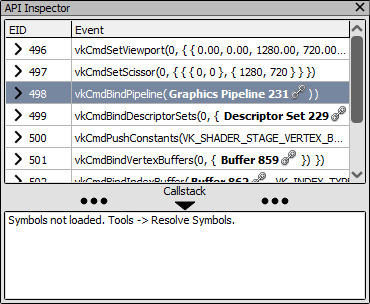

[原文地址](https://renderdoc.org/docs/how/how_debug_shader.html)

# How do I capture callstacks

此页面概述了 RenderDoc 中的调用堆栈捕获功能，以及有关如何启用此功能的详细信息和重要信息。

## Overview

在跟踪问题以了解每个 API 调用的来源时，它会很有用。在任何重要的程序中，每次调用的位置并不一定很明显，并且将代码端调用堆栈提供给 API 入口点可以查明导致问题的错误调用。

> **Warning**
>
> 在 Windows 上，调用堆栈收集使用`dbghelp.dll`. 如果您将此 dll 用于应用程序中的其他一些调试功能，强烈建议您禁用它，否则它可能会发生冲突并破坏 RenderDoc 的调用堆栈捕获。

> **Note**
>
> 调用堆栈收集在捕获期间具有合理的开销，并且会减慢速度并导致更多的内存开销。这可以通过仅列出每个操作的调用堆栈的“唯一操作调用堆栈”选项来缓解。

## Launching Capture

启动捕获时（如 [How do I capture a frame?](https://renderdoc.org/docs/how/how_capture_frame.html)），您应该启用**Collect callstacks**。这会将 RenderDoc 设置为在每个 API 入口点收集调用堆栈，这些入口点将被序列化到捕获文件中。

<i>Collect Callstacks: Option enabled on the capture dialog.</i>

如果您希望节省一些时间和开销，您可以启用**Only action stacks**。这只会在进行操作调用时收集调用堆栈。这可能是一个足够好的权衡，仍然可以以较低的成本为您提供所需的信息。在此之后，您可以像往常一样运行程序并进行捕获。

## Replaying the capture

当在 RenderDoc 中加载捕获时，调用堆栈将在 API 检查器中可用。对话框的底部是一个面板，可以展开以显示调用堆栈。最初，此部分将指示需要解析的符号。

<i>Callstack section: The callstack section expanded in API inspector.</i>

要解析捕获中引用的符号，请转到“**工具**”菜单并选择**“解析符号”**。如果此菜单选项不可用，则调用堆栈未成功收集到捕获文件中。

在您使用它的前几个实例中，解析符号过程可能需要一些时间，因为它可能必须从 Microsoft 符号服务器下载符号。捕获时在应用程序中加载的每个模块都将被保存并搜索其符号。

默认情况下，将使用符号服务器以及一些默认位置，例如 PE 元数据中指示的位置（即原始构建位置）。如果找不到 pdb，系统将提示您输入 pdb 的位置，然后将记住这个新位置以供后续 pdb 使用。

<i>PDB locate prompt: Prompt to locate a PDB that cannot be found.</i>

如果找不到 PDB，那么您可以选择永久忽略该 PDB。这对于没有 PDB 可用的第三方库很有用。如果您不忽略 PDB，下次打开引用它的捕获时，系统会提示您找到它。

成功解析符号后，API 检查器的调用堆栈部分将包含为给定操作或 API 调用收集的任何调用堆栈。如果您愿意，您可以选择和复制任何级别并将它们粘贴到其他位置。