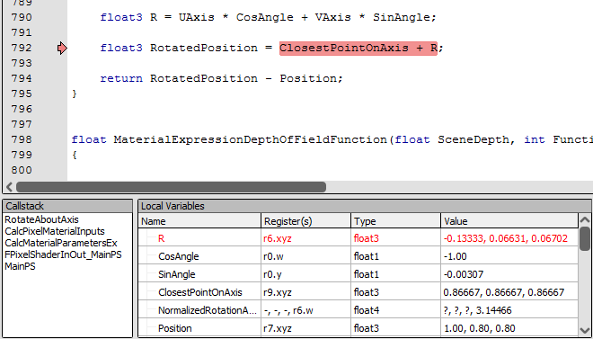
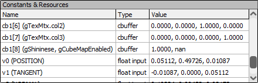
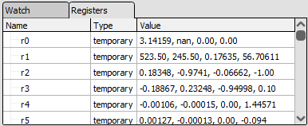

[原文地址](https://renderdoc.org/docs/how/how_debug_shader.html)

# How do I debug a shader

本页详细介绍了如何设置捕获以调试着色器，以及如何调试着色器以及可用的控件。

> **Warning**
>
> 目前仅 D3D11、D3D12 和 Vulkan 支持着色器调试。在其他 API 上，下面列出的调试选项将被隐藏或禁用。此外，并非这些 API 上的所有着色器都可以调试，例如，在 D3D12 上，只能调试 DXBC 着色器，而在 Vulkan 上，仅支持一些着色器扩展和功能。如果无法调试着色器，以下选项也将被禁用。

## Including debug info in shaders

在大多数情况下，至少一些调试信息包含在着色器中，除非它在某个时候被显式剥离。通常还可以选择包含其他调试信息 - 例如高级语言的原始源代码。确切的过程因 API 而异，但对于 D3D11 `/Zi`，fxc 的标志或等效标志`D3DCompile()`将包含额外的调试信息，`/Qstrip_debug`并将`/Qstrip_reflection`删除可能有用的反射信息 - 例如常量缓冲区中的变量名称。

对于着色器调试，建议您使用`/Od`或构建`D3DCOMPILE_SKIP_OPTIMIZATION`，因为这将默认启用 HLSL 调试。

有关如何将此未剥离的调试信息获取到 renderdoc 的更多信息，请参阅[How do I use shader debug information?](https://renderdoc.org/docs/how/how_shader_debug_info.html).

## Debugging a vertex

从网格查看器调用顶点调试。打开网格查看器后，您可以选择要调试的输入顶点。

当在网格数据中为顶点输入选择一个顶点时，如果显示处于顶点输入模式，它将与它所在的网格显示中的图元一起突出显示。

右键单击并从上下文菜单中选择调试顶点。

<i>Vertex Debugging: Launching vertex debugging from the mesh viewer.</i>

从这里调试器将使用着色器调试器中的顶点着色器打开。输入是从网格数据中自动填充的。

> **Note**
>
> 几何和曲面细分着色器尚不可调试。

## Debugging a Pixel

从纹理查看器启动像素调试。有关选择要调试的像素的更多详细信息，请参阅 [How do I inspect a pixel value?](https://renderdoc.org/docs/how/how_inspect_pixel.html).

选择给定像素后，您可以单击像素上下文下方的历史记录按钮。这将启动[Pixel History](https://renderdoc.org/docs/how/how_inspect_pixel.html#pixel-history)窗口，其中显示每个修改的选定像素。然后，您可以选择调试任何产生更改的三角形。

如果您已经选择了要调试的当前绘图，则可以单击调试按钮跳过像素历史记录并直接跳转到调试器。像素的输入将被自动填充。

像素调试时有几点需要注意：

- 如果选定的绘图未写入您突出显示的像素，则会打开像素历史记录窗口，让您选择要调试的绘图调用。
- 如果一次绘制多次重复绘制相同的像素，则调试结果将来自通过深度测试的最后一个片段。如果您希望从列表中选择特定片段，则首先启动像素历史记录并从那里的列表中选择要调试的片段。

## Debugging a Compute thread

要调试计算线程，只需转到管道状态查看器的计算着色器部分，然后输入要调试的线程的组和线程 ID。该线程将被隔离调试，组中没有其他线程在运行。

这意味着不能与任何其他正在运行的计算线程同步，并且调试将从头到尾运行，就像没有其他线程运行一样。

> **Warning**
>
> 此功能是**高度**实验性的，尚未提供任何保证！它可能适用于简单的着色器，这就是它可用的原因。

## Debugging Controls

调试时，目前控件是相当基本的。

<i>Shader controls: Controls for stepping through shaders.</i>

顶部的工具栏提供了通过着色器的程序流的控制。

Run 和Run Backward 只是分别从当前位置一直运行到程序的结尾或开始。这些控件的键盘快捷键分别是F5和。Shift-F5

您可以通过按下来设置断点F9（这也将删除已经存在的断点）。在每个方向或光标（见下文）运行时，如果执行遇到断点，它将停止。

将运行到下一个纹理加载、收集或采样操作，然后停止，就好像在该指令上放置了一个断点。

将运行到下一个生成 NaN 或无穷大值而不是浮点值的操作。这不适用于产生整数结果的操作，当解释为浮点数时可能是 NaN/infinity。

Step forward 将执行当前指令并继续下一条指令——这包括遵循任何流控制语句，例如跳转、循环等。

后退将跳回到通向当前指令的任何指令。这并不一定意味着程序中的前一条指令，因为它可能是跳转的目标。前进和后退总是会相互颠倒。

这些命令的快捷方式是F10和Shift-F10

将运行到光标处。这将以与“运行”命令类似的方式执行，但是当它到达光标突出显示的行时，它将停止并暂停执行。如果它到达着色器的末尾，它也会停止。这样做的捷径是Ctrl-F10

> **Note**
>
> 在任何给定点突出显示的指令表示要执行的*下一*条指令 - 而不是刚刚执行的指令。

将鼠标悬停在反汇编或视图窗口中的寄存器上将打开一个工具提示，以不同的解释显示该值。

还有一个切换可用于控制临时寄存器值的“默认”解释 - float 或 int。D3D 寄存器是无类型的，但通常它们被解释为浮点值。使用此切换，您可以将它们切换为默认解释为整数。

## HLSL Debugging

当着色器中的调试信息可用时，RenderDoc 允许在 HLSL 级别进行调试。如果着色器是在禁用优化的情况下构建的，则默认情况下会激活此功能，但只要调试信息可用，您就可以随时在程序集和 HLSL 调试之间切换。

当 HLSL 调试可用时，工具栏中将有一个“在 HLSL 中调试”按钮，类似地在反向时有一个“在程序集中调试”按钮。您也可以右键单击并选择“转到反汇编”或“转到源代码”。

在源代码调试时，相同的控件可用于设置断点、向前和向后运行等。请注意，在 HLSL 中单步执行和运行可能会同时跳过多个汇编指令。

调试信息还包括 HLSL 调用堆栈和局部映射，它允许 RenderDoc 显示当前指令处的函数调用堆栈以及范围内的任何局部变量的名称和值。它们分别显示在调用堆栈和本地窗口中。

<i>Callstack and Locals windows.</i>

> **Note**
>
> 调用堆栈和本地映射信息仅适用于 windows 8.0 和更高版本的 fxc。这对应于`D3DCompiler_47.dll`。

## Debugging Displays

有两个窗口显示不同类型的寄存器。常量窗口将显示在整个执行过程中不可变的输入和常量缓冲寄存器。这还将列出资源和采样器的寄存器（带有基本格式信息）。

<i>Constants window: Constant, input and resource registers.</i>

另一个窗口将包含变量/可变寄存器。这些包含通常预先分配的临时对象，并将在您逐步执行着色器时更新。该窗口还包含输出寄存器。

<i>Registers window: Variable registers - temporaries and outputs.</i>

最终窗口最初是空的，但可以根据需要填写。这显示了自定义监视表达式及其值。在这里，您可以编写任何涉及输入、临时或输出寄存器以及 swizzle 和 typecast 的表达式。当存在调试信息时，您还可以在此处包括本地人。

Swizzles 遵循标准的 hlsl 和 glsl 规则——`.[xyzw]`或者`.[rgba]`在任何排列或重复中都会显示这些通道。

自定义类型转换可以是任何一种`,u` `,i` `,f` `,x` `,o` `,b`，将寄存器分别显示为无符号整数、有符号整数、浮点数、十六进制、八进制或二进制。您还可以指定`,c`指定颜色值，并在具有有效颜色的浮点值旁边显示一个小的 RGB 色板。

<i>Watch window: Watch window - custom register expressions evaluated.</i>
