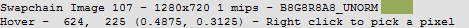
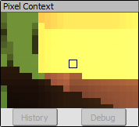

[原文地址](https://renderdoc.org/docs/how/how_inspect_pixel.html)

# How do I inspect a pixel value

在纹理查看器中，您可以检查像素值以获得纹理中任何像素的确切内容。

## Selecting appropriate subresource

可以在[Texture Viewer](https://renderdoc.org/docs/window/texture_viewer.html)页面中找到更多详细信息，但第一步是选择适当的子资源 - 数组元素、立方体贴图面或 mip 切片。

从纹理中选取的值始终是精确值，不会受到当前选择的通道或范围自适应控制的影响。

## Picking a Pixel Value

在将鼠标悬停在纹理上的任何时候，状态栏都包含光标悬停在的当前像素位置，以及用于指示您所在位置的基本色样。

<i>Hover Status Bar: The status bar showing position and color</i>

当按下鼠标右键时，当前悬停的像素值将与当前的浮点精度设置一起显示 - 有关如何调整这些的更多信息，请查看[Settings Window](https://renderdoc.org/docs/window/settings_window.html)的窗口参考。

对于深度纹理，深度和模板值将分别显示。模板值（与任何整数格式的纹理一样）将显示为整数。

<i>Picked Pixel: The value of a pixel that has been picked</i>

如果只是单击鼠标右键，则拾取的像素值将与鼠标移动时保持相同的值。如果您按住鼠标右键并拖动，它将随着鼠标移动而更新，以允许进行一定程度的细化。

要一次进行单个像素的微调，最简单的方法是使用键盘上的箭头键。按下这些将在每个方向上将拾取的位置移动一个像素。

## Pixel Context Display

每当拾取一个像素时，像素上下文显示就会更新为围绕当前选定的像素。 默认情况下，此对话框停靠在纹理查看器的右下角，靠近缩略图条。

<i>Pixel Context: The zoomed in context around the pixel currently selected</i>

此上下文显示显示您选择的区域周围的纹理的放大视图，以便更容易进行小的调整，而不会放大并失去整个纹理的感觉。

如果 API 支持，像素上下文查看器还可以让您启动像素调试。一旦选择了一个像素，上下文下方的按钮就会被激活，这将启动着色器调试器。有关此的更多信息可用： [How do I debug a shader?](https://renderdoc.org/docs/how/how_debug_shader.html).

如果支持，它还允许您启动像素历史视图，显示帧中此像素到当前点的所有修改。

## Pixel History

选择像素后，您可以单击“History”打开像素历史视图，显示从帧开始到当前选定事件对选定纹理的每次修改。

此显示将每个修改事件显示为自己的行，颜色表示是否从该事件发生任何修改 - 绿色表示通过了所有管道测试的片段，红色表示片段未通过某些测试，浅灰色表示任意着色器可写资源不知道有没有写。

您可以展开每个事件以查看是否有多个片段，并查看每个片段的着色器输出值。

右键单击将允许您在选定像素的给定事件处启动着色器调试器。如果您选择特定的片段或原语，这将是被调试的片段。

## See Also

- [Texture Viewer](https://renderdoc.org/docs/window/texture_viewer.html)