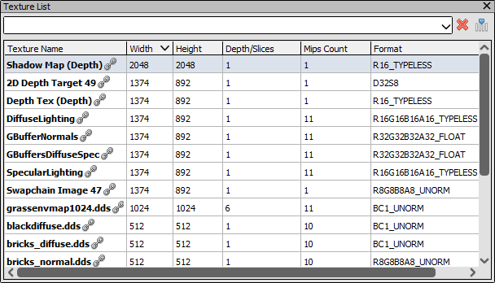
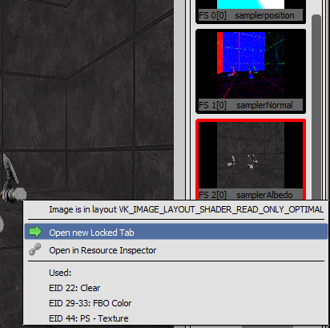

[原文地址](https://renderdoc.org/docs/how/how_view_texture.html)

# How do I view a specific texture

此页面记录了如何通过名称打开特定纹理，而无需通过当前资源绑定找到它。

## Texture list in Texture Viewer

在纹理查看器中，您可以打开捕获中所有纹理的可过滤列表。这可以用纹理列表图标 打开。单击此按钮时，将在纹理查看器上打开一个侧边栏，其中列出了所有纹理。

<i>Texture list: The sidebar showing the list of textures</i>

这个纹理列表可以通过自定义字符串过滤，这将缩小显示的纹理列表，或者简单地通过它们的创建标志作为渲染目标或纹理。

从此处选择并打开其中一个纹理时，会在该纹理后面的纹理查看器中打开一个新选项卡。

## Locked tab of a Texture

默认情况下，纹理查看器中打开的选项卡跟随当前选择的管道槽。选择新事件时，如果该插槽的内容已更改，则此选项卡可以显示新纹理。

如果您想跟随特定纹理，即使它变得未绑定或从输出移动到输入（反之亦然），您可以打开一个新的锁定选项卡，该选项卡将始终保持在此纹理上。

<i>Texture Tabs: Default tab following pipeline slot vs Locked tab.</i>

这可以通过如上所述按名称定位纹理，然后点击列表中的条目来完成。这将为此纹理打开一个新选项卡，无论当前管道状态或当前事件如何，该选项卡都不会改变。

从管道状态查看器打开纹理（[How do I view details of an object?](https://renderdoc.org/docs/how/how_object_details.html)）也将为相关纹理打开一个新的锁定选项卡。您还可以通过在当前绑定的纹理缩略图上单击鼠标右键来打开一个新的锁定选项卡。

<i>Opening new Tab: Opening a new locked tab for a texture.</i>

## See Also

- [How do I annotate a capture?](https://renderdoc.org/docs/how/how_annotate_capture.html)
- [Texture Viewer](https://renderdoc.org/docs/window/texture_viewer.html)