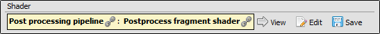
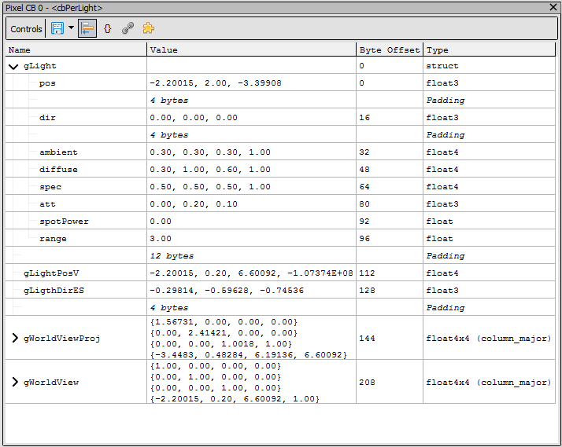

[原文地址](https://renderdoc.org/docs/how/how_object_details.html)

# How do I view details of an object

管道状态查看器允许您查看绑定到管道的给定资源的更多详细信息。go 箭头表示此资源的更多详细信息可用。

以**粗体文本**编写的带有 的资源是可点击的链接，这些链接可引导至[Resource Inspector](https://renderdoc.org/docs/window/resource_inspector.html) ，其中包含有关给定资源的更多信息。

## Viewing Shaders

可以扩展管道上处于活动状态的每个着色器阶段以查看高级着色器语言和低级反汇编。 在管道阶段的顶部有一个框显示当前绑定的着色器 - 如果已知，则显示其入口点。

<i>Bound Shader: Box showing the currently used shader.</i>

着色器提供的大部分信息仅在调试信息可用时才可用。[More details are available separately](https://renderdoc.org/docs/how/how_debug_shader.html)。

为此着色器传递给编译器的每个文件都以简单的语法高亮显示，以及从字节码本身生成的反汇编。

如果可用，来自着色器调试信息的反射数据将用于管线状态查看器的其他区域。它将用于命名纹理槽，显示绑定的资源将在着色器中使用，以及显示在着色器中使用的任何常量的名称。

当这个着色器反射信息可用时，它将被集成到反汇编中，以便于阅读。

请注意，您还可以通过单击编辑按钮来 [live-edit a shader](https://renderdoc.org/docs/how/how_edit_shader.html)。

## Viewing Textures

 [Texture Viewer](https://renderdoc.org/docs/window/texture_viewer.html)是查看纹理细节的主要方式，因此本节将关注纹理在 UI 其他部分的显示方式，以及如何在纹理查看器中打开纹理。更多详细信息可以在 [How do I view a specific texture?](https://renderdoc.org/docs/how/how_view_texture.html).

作为资源绑定到管道或输出管道相关部分的纹理将显示其尺寸和格式。在每个位置，前进箭头将指示可以在纹理查看器中打开一个新的锁定选项卡。

除了打开纹理的新视图外，时间线栏还会显示该纹理的使用情况——绿色三角形表示纹理写入的位置，绿色三角形表示读取操作。更多详细信息可在 [Timeline Bar](https://renderdoc.org/docs/window/timeline_bar.html)页面上找到。

## Viewing Buffers

当从顶点输入部分打开管道状态视图时，或从**Mesh Viewer**下的**Window**菜单中打开时，网格查看器将打开。这将显示所表示的网格的 3D 显示，以及查看管道中不同点的网格缓冲区。请参阅 [Mesh Viewer](https://renderdoc.org/docs/window/mesh_viewer.html)。

绑定到管道的缓冲区可以作为原始缓冲区查看器打开。这将打开类似于网格查看器的缓冲区视图，但具有可自定义的缓冲区格式。

默认情况下，如果缓冲区使用可以从着色器反映的预先存在的结构绑定到管道，那么这将是默认设置，否则默认布局将为每个元素 4 个 32 位无符号整数。

可以通过以简单样式输入格式来自定义此布局，该样式模仿定义概述缓冲区中单个元素的结构，有关更多信息，请参阅[How do I specify a buffer format?](https://renderdoc.org/docs/how/how_buffer_format.html).

 [Buffer Viewer](https://renderdoc.org/docs/window/buffer_viewer.html) 页面上提供了有关此部分的更多详细信息。

<i>Custom Buffer Layout: Customising the layout of the buffer by defining a structure.</i>

> **Note**
>
> 此窗口支持复制和粘贴，因此只需选择条目和 ctrl-c 即可复制到剪贴板

## Viewing Constant Buffers

可以通过单击它们的 Go Arrow 来查看常量缓冲区。这将在管道状态查看器的右侧打开一个新的停靠部分，用于跟踪该常量缓冲区。

每当此着色器插槽中有一个常量缓冲区时，都会显示常量名称和类型以及值。

<i>Constant Buffer: An updating preview of the contents of this constant buffer.</i>

> **Note**
>
> 此窗口支持复制和粘贴，因此只需选择条目和 ctrl-c 即可复制到剪贴板