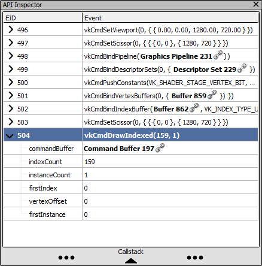

[原文地址](https://renderdoc.org/docs/window/api_inspector.html)

# API Inspector

虽然不是 RenderDoc UI 中最复杂的部分，但此页面详细介绍了 API Inspector 的特性和功能。

## UI Elements

API Inspector 分为两部分 - 顶部是最常见的部分，详细介绍了 API 调用及其所有参数。

如果当前在[Event Browser](https://renderdoc.org/docs/window/event_browser.html)中选择了一个动作，则将显示上一个动作和此动作之间的所有 API 调用 - 换句话说，如果您选择绘制，这可能会显示几个状态设置 API 调用绑定着色器或资源之前画。如果当前选择了单个事件，则将显示该事件的 API 调用。

底部不太常用，但会显示从用户代码到 API 入口点的调用堆栈（如果这样的调用堆栈可用并且符号已解析）。有关更多信息，请查看 [How do I capture callstacks?](https://renderdoc.org/docs/how/how_capture_callstack.html).

## API Calls

本节列出了在前面的操作和当前选定的操作之间进行的一系列 API 调用。当前操作始终是此列表中的最后一个元素，并以粗体突出显示。默认情况下，它也是选定元素。

可以扩展每个 API 调用以查看传递给它的参数，以它们被序列化到捕获的形式。

<i>API Calls: A list of API calls made up to the current action.</i>

## Callstack

调用堆栈部分可以通过双击分隔符展开并以相同的方式折叠。打开后，可以通过单击并拖动分隔符来调整其大小。

当调用堆栈尚未准备好显示时，此部分将酌情显示“没有可用的调用堆栈”或“需要解析符号”。

调用堆栈跟随另一部分中当前选定的 API 调用，并且将随着选定调用的更改和当前事件的更改而更新（因为这隐式地将选定的 API 调用更改为当前操作的任何一个）。

有关更多信息，请参阅 [How do I capture callstacks?](https://renderdoc.org/docs/how/how_capture_callstack.html)

<i>Callstack: The callstack in user code where this API call was made.</i>
