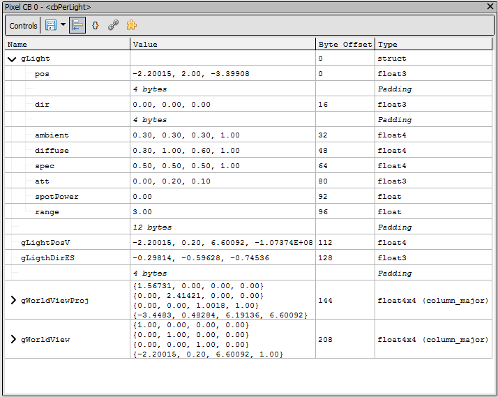

[原文地址](https://renderdoc.org/docs/window/buffer_viewer.html)

# Buffer Viewer

当打开一个缓冲区进行查看时，它可以显示固定的非重复“struct-of-arrays”（SoA）数据、重复的“array-of-structs”（AoS）数据，或者在 API 支持的情况下，它可以同时显示两者 - 固定数据作为重复数据的前缀。

> **Note**
>
> “struct-of-arrays”（SoA）仅用于与“array-of-structs”（AoS）进行比较。只有固定值而没有数组的简单情况也将被视为 SoA 数据，只是没有数组。

该格式最初由任何可用的反射数据定义。可以自定义格式，详见[How do I specify a buffer format?](https://renderdoc.org/docs/how/how_buffer_format.html).

在所有情况下，常量缓冲区都假定为 AoS 数据。通过非常量绑定（例如 UAV 和存储缓冲区）的缓冲区的其他视图，或直接从资源检查器的缓冲区打开的视图，将默认使用 SoA 数据，除非布局明确声明一组固定的 SoA 数据。

<i>The buffer being viewed as an array of structs (AoS).</i>

<i>The buffer being viewed as a struct of arrays (SoA).</i>

## Navigation

给定字节偏移和长度，缓冲区查看器可以指定要解释的可见范围。仅显示此范围内的字节，范围外的任何其他数据显示为`---`.

偏移量和长度的初始值将从相关绑定中获取，如果绑定没有引用子集，则默认为整个缓冲区。

除此之外，您可以指定一个行偏移量，这对于在观察不同事件之间缓冲区的变化时保持在同一行很有用。

## Exporting and display

如上所述显示固定 SoA 数据时，可以通过启用该选项来可视化填充。

缓冲区数据可以导出为 CSV 值，或者缓冲区由字节内存支持为原始字节。

## See Also

- [How do I specify a buffer format?](https://renderdoc.org/docs/how/how_buffer_format.html)