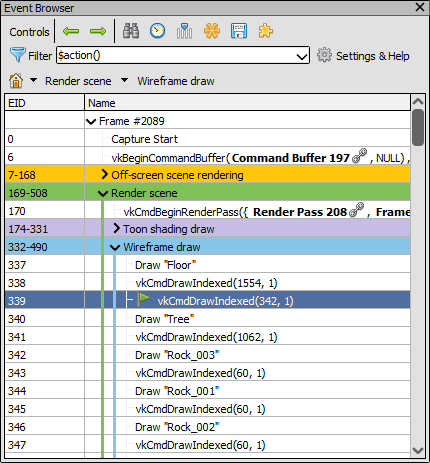
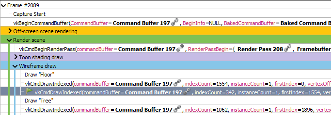
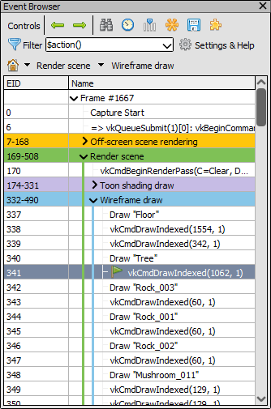
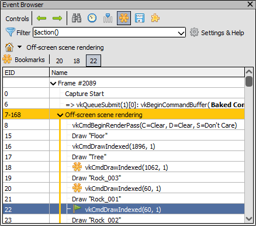
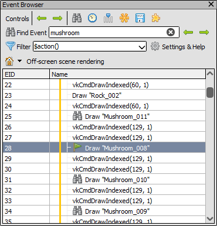

[原文地址](https://renderdoc.org/docs/window/event_browser.html)

# Event Browser

事件浏览器是浏览框架和选择不同动作的主要方法。它显示用户注释的部分分层显示。

## Annotating your frame

当应用程序具有用户定义的框架部分和子部分的注释时，事件浏览器变得最有用，以允许对框架进行更合乎逻辑和有序的浏览。

这样做是特定于 API 和平台的。有关如何执行此操作的更多信息，请参阅 [How do I annotate a capture?](https://renderdoc.org/docs/how/how_annotate_capture.html).

这些 API 函数提供的任何标记区域的颜色将用于标记该区域的行，并在树的左侧显示一个条形，显示事件所在的区域。

## Filtering displayed events

默认情况下，事件浏览器仅列出操作。操作是诸如绘制、调度、复制、清除、解析和其他调用等事件，它们会导致 GPU 工作或可能影响内存和资源（如纹理和缓冲区）。这有时被称为绘图调用，但与实际的光栅化绘图相比，术语动作的含义更明确。

通常这些是浏览框架时您需要查看的唯一事件，但在某些情况下，您可能希望查看一些状态设置调用以查看状态更改的位置。为此，您可以将事件浏览器上的过滤器从默认值更改为包含它们。

过滤器表达式可能非常复杂， [How do I filter visible events?](https://renderdoc.org/docs/how/how_filter_events.html).

过滤器表达式有一个下拉菜单，允许您选择任何预先保存的过滤器，您可以在设置窗口中保存新过滤器。

## Event display

事件浏览器中显示的事件通常源自 API 调用本身的参数。少数事件将具有自定义生成的名称 - 这些通常是例如间接绘制，其中查看使用的 GPU 绘制参数而不是原始 CPU 侧缓冲区更有用，或者对于可以显示加载和存储操作的渲染通道.

配置过滤器时，可以在**Settings & Help** 窗口下调整这些名称。

为了以示例的方式显示这些选项，以捕获帧的一部分的默认显示为例：

<i>Default Display: The Event browser with the default event naming.</i>

**Show custom action names** Default: `Enabled`

此选项控制自定义名称是否如上文详述用于间接绘制和渲染通道。请注意禁用它对渲染通道开始和命令缓冲区边界的影响。

<i>Disabled Custom Action Names: The Event browser with custom names disabled.</i>

**Show parameter names and values** Default: `Disabled`

此选项控制是否包含参数名称及其值。默认情况下，没有给出参数名称，只有值是可见的。

> **Note**
>
> 这对具有自定义名称的操作没有影响，如上面**显示自定义操作名称**中所控制。

<i>Parameter names: The Event browser with parameter names displayed as well as parameter values.</i>

**Show all parameters** Default: `Disabled`

此选项控制是显示所有参数，还是只包括最重要的参数。请注意，在显示所有参数后，很难做出任何判断，因为某些函数具有无趣的隐式参数，例如命令缓冲区。

> **Note**
>
> 这不会影响参数值，在结构的情况下，在许多情况下仍将仅显示省略的结构。同样与上面的**Show parameter names and values**一样，这对具有自定义名称的操作没有影响，如上面在**Show custom action names**中控制的那样。

<i>All Parameters: A snippet of the Event browser showing all function parameters.</i>

## Selecting available columns

默认情况下，事件浏览器中的列是 EID 和名称。名称无法删除，因为它包含树，但可以自定义列以隐藏/显示或重新排序和调整大小。

要选择应该可见的列，请右键单击标题或单击选择列按钮。要重新排列列，只需单击并拖动标题。

>**Note**
>
>请注意，当计时动作时，持续时间列将自动添加以显示数据。

## Timing actions

要对每个动作的 GPU 持续时间进行计时，请单击计时器按钮。

这将自动运行一个流程以获取每个操作的时间并将其显示在持续时间列中，如果需要，将添加该列。

[Settings Window](https://renderdoc.org/docs/window/settings_window.html)中动态配置用于持续时间列的时间单位。

要检查更多 GPU 计数器，而不仅仅是简单的持续时间，请参阅[Performance Counter Viewer](https://renderdoc.org/docs/window/performance_counter_viewer.html)。

## Browsing the frame

事件浏览器是浏览框架的主要方式。事件在浏览器中被列为条目，上面提到的分层标签成为树节点。

当前选定的事件将突出显示并用绿色标志指示。这是 RenderDoc 正在检查的事件，并反映在 UI 的所有其他窗口中。

<i>Current Event: The Event browser showing several sections and the current event.</i>

EID（事件 ID）列表示事件的 ID。事件 ID 从 1 开始分配，并在每次进行 API 调用时增加。由于这个原因，动作 EID 通常是不连续的，因为在它们之间也有 EID 的状态设置事件。

只需单击不同的事件将选择它作为当前事件，并且选择具有一些子事件的条目将如同选择了最后一个子事件一样 - 换句话说，选择具有多个子事件的节点将显示所有子事件的结果。

您还可以使用键盘快捷键浏览框架。按向上或向下箭头键将在可见元素中上下移动，跳过任何折叠的部分。之后，这些键将移入和移出子部分，进入下一个兄弟 - 本质上是直上直下，就好像没有树并且它是一个直列表一样。

左右箭头进出层级。在关卡内按左键将跳转到当前关卡的父节点。再次按左键将折叠该节点，依此类推。按右将（如果在有子节点的节点上）展开该节点。

> **Note**
>
> 此窗口支持复制和粘贴，因此只需选择条目和 ctrl-c 即可复制到剪贴板

## Bookmarks

书签按钮可让您为事件添加书签，快捷键是 Ctrl-B。

<i>Bookmarks bar: The bookmarks bar with several EIDs bookmarks.</i>

书签事件列表将显示在事件浏览器顶部的工具栏上，它们和快捷键Ctrl-1到Ctrl-0将跳转到相应的书签 EID。这些快捷方式可以在应用程序的任何位置使用。

有关更多信息，请参阅[How do I annotate a capture?](https://renderdoc.org/docs/how/how_annotate_capture.html).

## Searching and Jumping

事件浏览器中还有两个其他控件可用于帮助导航框架。

按下Ctrl-F将打开查找事件工具栏。此工具栏允许您输入部分文本过滤器，该过滤器将与标签和操作事件匹配。当您按下回车键时将执行查找，但您可以根据需要调整文本并重新搜索。

> **Tip**
>
> 如果您想参加特定活动，可以搜索其 EID。查找结果将仅显示匹配事件，而不显示可能通过子字符串匹配该数字的任何其他事件。

如果找到的事件位于未展开的部分内，则这些部分将被展开，直到匹配的事件可见。

匹配的事件将用查找图标突出显示，重复按 enter 将在匹配的事件之间跳转。

直到您在文本框中按返回键或再次单击查找事件工具按钮后，查找工具栏才会关闭。

您还可以使用上一个和下一个按钮在查找结果之间上下跳转。

<i>Highlighted Results: The results of a find are highlighted with an icon.</i>

## See Also

- [How do I annotate a capture?](https://renderdoc.org/docs/how/how_annotate_capture.html)