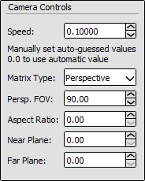
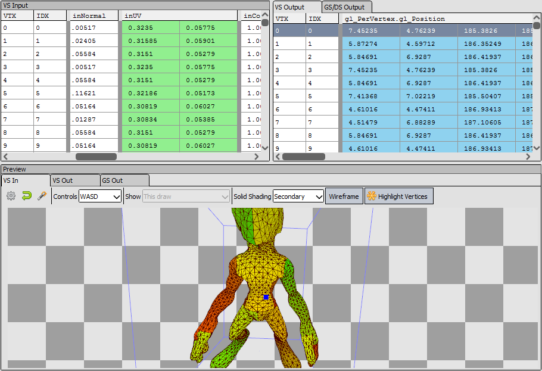

[原文地址](https://renderdoc.org/docs/window/mesh_viewer.html)

# Mesh Viewer

网格查看器显示网格数据以及网格在不同阶段的可视化表示 - VS 前、VS 后等。对于实例化绘制调用，您可以在顶部的工具栏中选择要查看的实例。

每个顶点都有一个显示网格数据的显示器，其格式是从管道的相关阶段提取的 - 着色器输入或输出，或顶点输入属性。您可以选择同步这些视图以及指定保持一致的偏移量，以便在不同事件之间移动时可以看到同一行。

下面是一个 3D 视图，它将在任何给定时间显示一个阶段，并且可以使用其上方的选项卡进行切换。查看 3D 网格有两种控制方案 - Arcball 是预变换（VS 输入）的默认值，Flycam 控件是后变换（VS 输出）的默认值。您可以随时使用网格视图上方工具栏上的下拉菜单在这些之间切换。

>**Note**
>
>当曲面细分处于活动状态时，VS out 的行为类似于 VS in，因为它们都被视为输入数据（而不是转换后的数据）。

您可以使用重置按钮将相机重置为默认位置。对于 VS 输入，这将重置为距离对象某个半径的轨迹球。对于 VS 输出，这将重置为来自投影眼睛的视图。

您还可以将相机自动拟合到 VS 输入网格的网格。自动适应按钮将使相机适应网格的轴对齐边界框。

为了能够在视图空间中查看转换后的网格，RenderDoc 尝试猜测投影矩阵并取消投影输出数据。

默认情况下，投影矩阵被猜测为标准透视矩阵。使用投影后的 w 和 z 值以及输出目标的纵横比可以估计出合理的近似值。但必须指定 FOV - 默认值为 90，但这可以通过打开选项来细化。

打开选项可以指定投影矩阵中使用的 FOV。如果您使用正交矩阵代替，您可以指定它 - 尽管这需要手动调整矩阵参数。

<i>Options: The options pop-out of the buffer viewer.</i>

选项中还提供了一个用于 Flycam 控件的简单速度倍增器，以微调它移动到网格尺寸的速度。

## Flycam controls

可用的 flycam 控件使用鼠标导航和“查看”，使用键盘“移动”。按住鼠标左键将围绕相机的当前位置旋转相机的方向。

箭头键将根据相机的当前方向向前、向后、向左和向右移动。相对于英文键盘，传统的 FPS 'WASD' 控件也将起作用。例如，在 AZERTY 键盘上，这将改为“ZQSD”。

Page up 和 Page down 将相对于相机垂直“向上”和“向下”移动。这也可以在带有“R”和“F”的主键盘上使用（同样相对于英文键盘）。

## Mesh Preview

在 3D 网格预览中，您可以选择使用一些实体着色模式来显示网格，而不仅仅是线框网格。实心着色时，您可以打开和关闭线框。

- 纯色只是为每个三角形显示一种纯色。
- Flat Shaded 将基于三角形法线执行基本的平面照明计算，以更好地了解网格的拓扑。
- 次要将显示选定的次要网格元素。

要选择将哪个元素显示为次要元素，只需右键单击要使用的列。这可以分别在输入和输出上完成，并且 4 分量列可以选择将 RGB 显示为颜色，或将 alpha 显示为灰度。

只要网格格式在动作之间保持一致，就会记住选择。

如果在您的输入中未检测到位置数据并且您想选择哪个元素包含位置，或者如果您想将一些其他数据（例如 UV 坐标）可视化为位置数据（在在 uv 空间中渲染网格的效果）。

<i>Preview: Previewing the uv co-ordinates as color on the mesh.</i>

在显示投影后输出时——通常是 VS 输出，但也可能是曲面细分/几何输出——您可以选择要显示的数据量。

网格视图上方的下拉菜单将让您选择显示**this draw**、**previous instances**、drawcall 中的**all instances**，或**whole pass**到这一点。

这些使您可以缩小或扩展显示的网格输出。至少你会看到当前的绘制——一个特定的实例，如果绘制调用是一个实例化的绘制。您还可以在同一个 drawcall 中显示其他实例（直到所选实例，或所选实例之前或之后的所有实例）。最后，您可以选择在同一个名义渲染通道中显示当前绘制的所有其他网格。

当前绘制始终是深色的，同一绘制中的实例具有较浅的红色，并且该过程中的其他绘制调用将是浅灰色的。