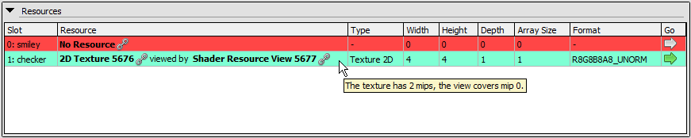
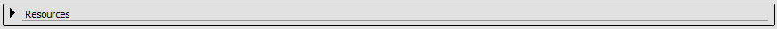

[原文地址](https://renderdoc.org/docs/window/pipeline_state.html)

# Pipeline State

Pipeline Viewer 是 RenderDoc 中一个信息密集但简单的窗口。它显示了图形管线的所有状态设置，包括绑定资源、光栅化设置等。

## Pipeline flowchart

Pipeline Viewer 的顶部是流水线流程图——它显示了图形流水线的高级块级图。

每个块都是一个单独的页面，其中包含该图形管道的相关状态和内容，具体细节因 API 和要显示的数据类型而异。

当前选定的块用红色勾勒出来，视图中的页面反映了该管道部分的内容。管道的浅灰色部分是当前处于活动状态并参与此操作的部分。管道的深灰色部分未启用，可以视为直通/无操作。

<i>Pipeline: Pictured here, the high-level parts of the Vulkan Pipeline.</i>

> **Note**
>
> 在 D3D11 和 OpenGL 中，流输出/变换反馈阶段位于几何着色器块下，其中显示了用于流输出的缓冲区。

## Pipeline Section Display

管道状态查看器始终显示操作执行*后*的管道状态，与 RenderDoc 中的其他查看器一样。

任何绑定到管道的资源都可以在更详细的查看器中打开，例如顶点缓冲区、常量缓冲区和纹理。有关此过程的更多详细信息，请参阅页面[How do I view details of an object?](https://renderdoc.org/docs/how/how_object_details.html).

管道视图试图只显示相关的数据，而不是所有可能的有状态数据。为此（如果可用），它使用着色器反射数据仅显示着色器实际使用的插槽，并忽略任何未使用的插槽。这可以用 Show Unused Items按钮覆盖。

在像 Vulkan 这样的一些 API 上，使用“无绑定”方法可能很常见，其中绑定了大量资源并且在任何时候只访问少量资源。在这些情况下，RenderDoc 使用动态反馈来尝试确定访问的资源集并仅显示它们。这可以类似地被 Show Unused Items按钮覆盖。

当显示禁用/未使用的绑定时，它们将以*斜体*列出。

在某些情况下，除非有任何设置，否则整个部分将被省略 - 这主要用于未使用或很少使用的功能，如着色器子例程/类链接和读/写绑定（图像加载存储或 UAV）。

<i>Pipeline: Pictured here, texture bindings in a D3D11 pixel shader.</i>

当绑定为空时，将以红色背景显示。默认情况下，仅显示着色器可以引用的绑定，因此空绑定表示着色器可能正在从未绑定的资源中读取。使用上面的 Show Unused Items按钮，为了便于阅读，仍然省略了未使用但为空的绑定。要覆盖它，您可以使用 Show Empty Items按钮，该按钮将显示空绑定。

如果绑定以蓝色/绿色背景列出，这表明该绑定在底层资源之上具有特殊参数。例如，这可能是具有许多 mip 或切片的图像，其中并非所有这些都绑定到图像视图中的管道，或者视图将图像转换为不同的兼容格式。

> **Note**
>
> 在 OpenGL 上，不完整的纹理也会以红色背景显示。将鼠标悬停在条目上时，工具提示中将包含对它们不完整的解释。

<i>Pipeline: The above pipeline section, collapsed to save space.</i>

可以通过单击它们上方的标题文本将它们切换为折叠状态来展开和折叠。这可用于暂时关闭一些您不需要的部分，以便在您确实需要的部分中为更多的垂直空间腾出空间。

您还可以通过单击导出按钮导出管道状态，这会将整个管道状态详细导出到 HTML 文件中，这样您就可以更轻松地比较不同的日志和不同的事件。

## See Also

- [How do I view details of an object?](https://renderdoc.org/docs/how/how_object_details.html)