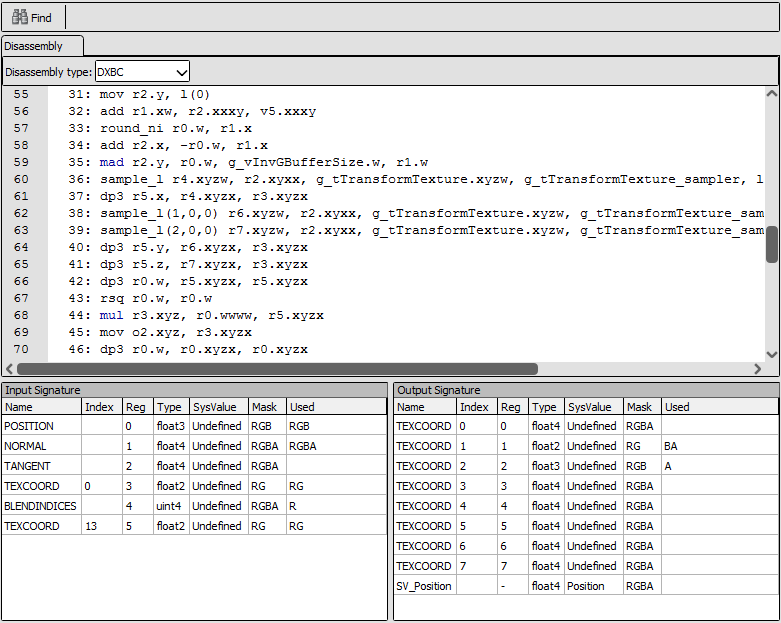
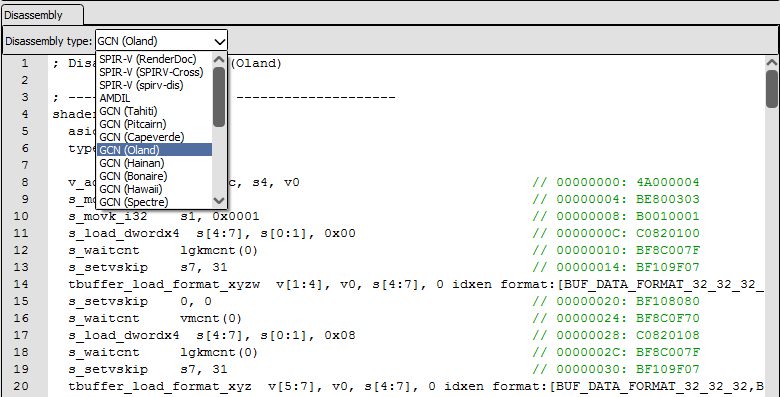

[原文地址](https://renderdoc.org/docs/window/shader_viewer.html)

# Shader Viewer

Shader Viewer 用于显示、编辑和调试着色器。

有关编辑着色器的信息可以在其他文档中找到，例如 [How do I edit a shader?](https://renderdoc.org/docs/how/how_edit_shader.html) 以及 [How do I use a custom visualisation shader?](https://renderdoc.org/docs/how/how_custom_visualisation.html).

 [How do I debug a shader?](https://renderdoc.org/docs/how/how_debug_shader.html)中记录了调试着色器？.

## Overview

<i>The shader viewer displaying a D3D11 shader</i>

当从给定着色器阶段的[Pipeline State](https://renderdoc.org/docs/window/pipeline_state.html)打开时，着色器查看器显示着色器本身以及输入和输出签名。这些签名形成了此着色器阶段与渲染管道的前一个和下一个部分之间的接口。例如，顶点着色器将列出固定函数顶点输入，以及传递到下一阶段的插值。

着色器查看器以可用格式显示源代码。嵌入调试信息后，每个原始源文件都会有选项卡。对于使用字节码 IR 的 API，该字节码的反汇编也将显示在单独的选项卡中。

根据 API 和可用的插件和硬件支持，有几种不同的反汇编形式是可能的。反汇编选项卡上方将是一个下拉列表，其中列出了可能的表示形式，包括特定于硬件的 ISA 格式，如 AMD GCN。

 [in the settings window](https://renderdoc.org/docs/window/settings_window.html#shader-processing-tools-config)中配置着色器处理工具，该窗口允许各种自定义反汇编程序，例如用于 SPIR-V 的 SPIRV-Cross 和 spirv-dis。

<i>The disassembly options for a Vulkan SPIR-V shader</i>
