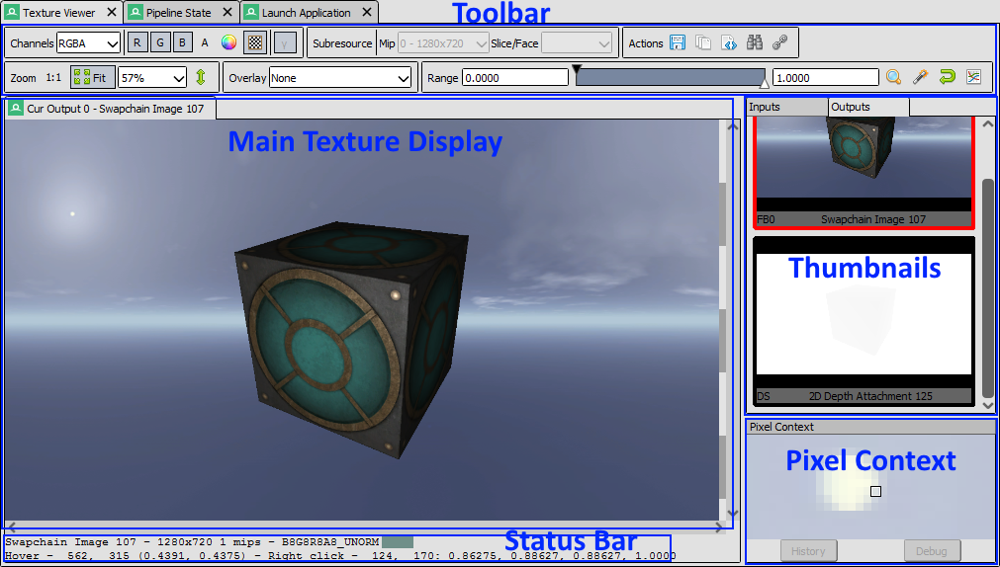
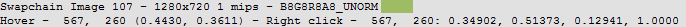
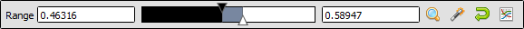
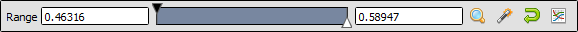
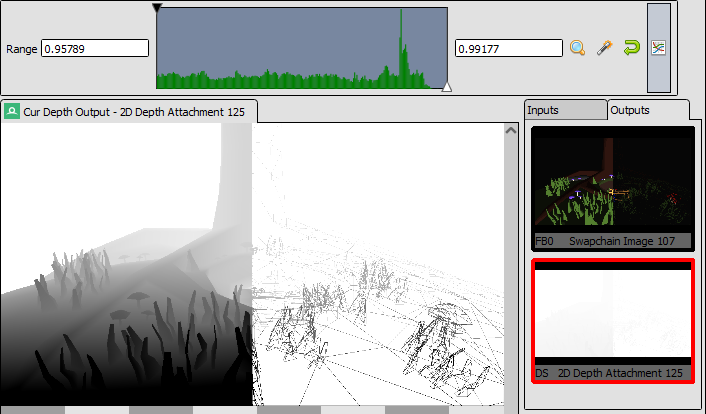
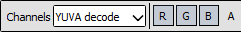
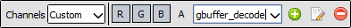
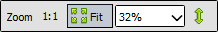
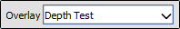

[原文地址](https://renderdoc.org/docs/window/texture_viewer.html)

# Texture Viewer

纹理查看器可能是 RenderDoc 中最直观的窗口，也是最常用的窗口。它在给定事件中显示处于当前状态的任何纹理的内容，并提供控件以以不同方式调整和检查它。

## Overview

纹理查看器由几个不同的部分组成，将在此处进行概述。

纹理查看器中使用的一些特定技术或功能有自己的单独页面，可以更详细地介绍。如果它们涵盖了您正在寻找的内容，您可能会在那里找到更多有用的信息：

- [How do I view a specific texture?](https://renderdoc.org/docs/how/how_view_texture.html)
- [How do I inspect a pixel value?](https://renderdoc.org/docs/how/how_inspect_pixel.html)
- [How do I use a custom visualisation shader?](https://renderdoc.org/docs/how/how_custom_visualisation.html)

<i>Texture Viewer: A labelled diagram showing the different parts of the texture viewer.</i>

## Main Texture Display

主纹理显示占据了窗口的最大部分，并且只是用于显示纹理的容器。

它是一个选项卡式控件，第一个选项卡始终显示当前管道状态上的特定纹理槽，例如输入纹理或颜色/深度输出。可以打开其他锁定的选项卡以显示单个资源。页面上提供了更多详细信息 [How do I view a specific texture?](https://renderdoc.org/docs/how/how_view_texture.html).

鼠标滚轮可用于放大和缩小纹理。放大时，按住鼠标左键并拖动将左右平移图像。

在图像上方时，状态栏将显示鼠标所在的当前像素。单击或按住鼠标右键将选择该像素并在状态栏中显示其信息。页面上提供了更多信息 [How do I inspect a pixel value?](https://renderdoc.org/docs/how/how_inspect_pixel.html).

## Information Status Bar

主纹理显示下方的状态栏包含有关当前可见纹理的信息。

- The name (if available - if not an auto-generated name will be used).
- Dimensions - Width, height, depth and array size as applicable.
- Mip Count.
- MSAA sample count and quality, if applicable.
- Format - e.g. `RGBA8_UNORM`.

在此信息之后，有一些基于像素的显示。光标下的像素显示为色样，后跟其坐标。然后显示任何[拾取的像素](https://renderdoc.org/docs/how/how_inspect_pixel.html)，并显示其数值。

<i>Picked Pixels: Detailed information about the current pixel.</i>

## Thumbnail Strips

有几个可用的缩略图条面板，默认情况下它们停靠在同一位置，以便它们被标签在一起，但它们可以并排显示。

这些条显示绑定到管道各自部分的资源的缩略图，以提供一些上下文并允许快速预览，而无需在这些纹理之间切换主显示。

以下选项卡当前显示的纹理以红色突出显示，每个缩略图都显示插槽号和该点绑定的纹理名称。 要关注给定的插槽，只需左键单击它即可。 如果当前跟随的纹理槽是空的（即它跟随纹理，然后该槽在不同的操作中变得未绑定），它将显示为简单地命名为“未绑定”并且没有名称或槽号。

每个缩略图都有一个右键单击可用的上下文菜单。此菜单允许您打开一个锁定的选项卡（[How do I view a specific texture?](https://renderdoc.org/docs/how/how_view_texture.html)），跳转到[resource inspector](https://renderdoc.org/docs/window/resource_inspector.html)器，以及包含此纹理的所有用途的列表 - 作为只读资源和可写输出。这类似于[Timeline Bar](https://renderdoc.org/docs/window/timeline_bar.html)上的资源显示条。单击这些条目中的任何一个将跳转到列出的事件范围中的第一个事件。

<i>Thumbnail Menu: Thumbnail context menu with several options.</i>

## Pixel Context Display

默认情况下，像素上下文显示是一个小面板，位于纹理查看器的右下角。

每当一个像素被拾取时，它周围的一小块纹理区域就会以最大缩放比例渲染到该面板。这为您选择的像素附近的像素提供了一些背景信息，并允许进行精细细化，而无需放大并失去您在整个图像中的位置。

选择后，您可以使用键盘上的箭头键调整所选像素，使用此上下文来指导您的选择。

<i>Pixel context: Pixel context displaying the surrounds of the picked pixel.</i>

从这里，一旦您选择了一个像素，如果您选择了要调试的绘图，您还可以启动[pixel debugger](https://renderdoc.org/docs/how/how_debug_shader.html)。 您还可以启动[Pixel History](https://renderdoc.org/docs/how/how_inspect_pixel.html#pixel-history) 视图，该视图显示从帧开始到当前选定事件的纹理发生的所有修改。

## Visible Range Control

可见范围或范围自适应控制在简化显示和检查具有非常窄值范围的图像时非常有用，并且对于查看任何 HDR 图像是必需的，因为它可用于将更大范围映射到 LDR 以进行显示。

<i>Range control: The range control narrowing the visible range mapped to [0,1] on output.</i>

主要控制是黑点和白点。这些显示在主范围控件两侧的两个文本框中。这些是当前的绝对黑白值 - 输入纹理中的这些值在输出时分别映射到 0 和 1。

范围控件本身有一个黑点和一个白点，只需单击和拖动即可进行调整。这些允许更精细和更具交互性的调整。这些句柄只允许您在文本框中的绝对黑点和白点定义的范围内调整极值。

还有四个其他按钮可用于控制范围：

 **放大**- 此按钮会将极值放大到可拖动手柄选择的任何精细值。

这主要在从某个大范围开始并使用手柄向下拖动到更合理的范围时很有用，您可以单击缩放以将范围缩小到仅选定的范围，这样您就可以再次获得良好的控制。

<i>Before: The range control before zooming.</i>

<i>After: The range control after zooming.</i>

-  **Autofit** - 此按钮自动将范围控制调整为纹理中任何可见通道中的最小值和最大值。通常这是一个范围的一个很好的起点，尽管对于一些极端的纹理它可能会调整得很糟糕。

    右键单击此按钮将使其始终自动适应，直到您禁用它为止。即当您移动到另一个事件或另一个纹理时，范围将再次自动调整。如果在可见范围非常不同的事件或纹理之间跳转，这很有用。

-  **重置**- 只需将范围重置回默认值 [0, 1] - 在更改为范围设置不适用的新纹理后重置很有用。

-  **直方图**- 这是一个拨动开关。启用后，它将范围控件的细条更改为包含范围值直方图的粗条，显示值的分布。

    直方图基于所有可见通道的直接数值平均值，并将随着白点和黑点的移动而更新。

<i>Values Histogram: A histogram showing the range distribution of values in the image.</i>

## Toolbar

工具栏包含用于选择要查看的纹理的哪个 mip、切片、面以及如何显示它以及是否应应用任何转换或覆盖的大多数工具。

>**Note**
>
>默认情况下，通道选择和 mip/slice 选择存储为每个纹理状态。换句话说，如果您显示的渲染目标只有 alpha 通道可见，那么切换到查看另一个纹理将默认返回 RGB - 并且切换回该渲染目标将再次查看 alpha。
>
>可见范围/范围自适应控制在上面的部分中进行了详细说明，此处不再赘述。

### Channels selector

 Default RGBA channels

 RGBM mode

 YUVA Decode to RGBA

 [Custom Shader mode](https://renderdoc.org/docs/how/how_custom_visualisation.html)

此选择器在显示标准 RGBA 通道、使用自定义乘数的 RGBM 编码和使用自定义可视化着色器之间切换。

在**RGBA**模式下，默认情况下仅显示 RGB 通道，并且 alpha 被强制完全不透明。每个通道都可以独立关闭，并且可以使用任何组合。任何被禁用的 RGB 通道都将在输出中强制为全黑。启用 Alpha 时，背景将以纯色或棋盘图案呈现，以指示半透明区域。

另请注意，当单独显示单个通道时，图像在该通道中呈现为灰度，而不是显示单色彩色图像。

如果纹理是 YUV 格式的纹理，这将显示为`YUVA`并允许以类似于 RGBA 的方式选择亮度和色度通道。

> **Tip**
>
> 右键单击纹理查看器中的一个通道按钮（R、G、B、A）将仅选择该通道，或者如果它已经是唯一选择的通道，它将选择所有其他通道。这很有用，例如在查看 RGB 和 alpha 之间切换，或查看打包纹理或渲染目标中的各个通道。

请注意，这些通道选择默认保存为每个纹理状态，因此切换到不同的纹理将恢复为默认 RGB，但返回到第一个纹理会记住您正在查看的通道。 请参阅[Settings Window](https://renderdoc.org/docs/window/settings_window.html)中的选项。

**选择RGBM**时，RGB值将乘以指定的乘数，然后乘以Alpha值。这是一种常用编码，用于通过使用 Alpha 通道作为缩放因子将 HDR 值打包到 8 位 RGBA 图像中。

**选择YUVA 解码**时，YUVA 数据将使用 Rec. 进行默认全范围转换。709 个转换值。

选择“**Custom** ”后，将使用可用于解码和显示纹理的任何自定义着色器填充下拉列表。选择自定义着色器时，原始图像将通过此着色器，然后使用主显示器上的常用控件显示。有关更多信息，请参阅[How do I use a custom visualisation shader?](https://renderdoc.org/docs/how/how_custom_visualisation.html).

您可以使用按钮创建新的自定义着色器，使用按钮编辑着色器，并使用按钮删除着色器。

### Gamma display of Linear Data

​		γ Gamma display

 [FAQ](https://renderdoc.org/docs/getting_started/faq.html#gamma-linear-display)中提供了对此的正确解释。简而言之，线性数据被“过度校正”以使其看起来符合预期，但可以通过关闭此选项来覆盖此行为。

### Alpha background

​		 Choose background color

​		 Checkerboard background

当显示带有 Alpha 通道的纹理时，主显示的背景会发生变化，以使半透明部分更加明显。使用这两个控件，您可以选择棋盘图案或打开颜色选择器来选择纯色。

当前启用的模式将突出显示。

### Subresource selection

纹理查看器的主显示一次最多只能显示一个图像的单个 2D 子资源。

对于带有 mip 贴图的纹理，此控件允许您选择要显示的 mip 级别 - 图像的整体大小将保持不变，但将从给定的 mip 级别进行点采样。

对于 3D 纹理和 2D 数组，您可以从下拉列表中选择要在此处显示的切片，对于立方体贴图，您可以选择面。对于立方体贴图数组，这两个控件组合在一起以显示第一个立方体贴图的面列表，然后是第二个等等。

对于多重采样纹理，这将允许您选择单个样本以查看整个图像，或查看默认解析的图像。

请注意，这些选择默认保存为每个纹理状态，因此切换到不同的纹理将恢复为默认的第一个切片或面，以及顶部 mip。回到第一个纹理虽然会记住您正在查看的子资源。请参阅[Settings Window](https://renderdoc.org/docs/window/settings_window.html)中的选项。

### Save Texture

​		 Save Texture

这允许您保存当前可见的纹理。支持多种格式，包括`.dds`、`.exr`，并且可以使用选项将复杂格式（例如多重采样或 3D 纹理）映射到不支持它们的格式，例如`.png`或`.jpg`。

### View Texture as Buffer

 Open Texture data in Buffer Viewer

此按钮在[raw buffer viewer](https://renderdoc.org/docs/window/buffer_viewer.html)中打开纹理。这使您可以查看底层纹理的原始数据，并在数据表示比在纹理查看器中容易显示的更复杂的数据时根据需要对其进行格式化。

### Goto Location

​		 Goto pixel location

此按钮会在主纹理视图上方打开一个小弹出窗口，让您键入要跳转到的像素位置。如果您正在调查某个特定问题，并且您知道问题将出现在哪个像素上，这将非常有用。

> Note
>
> This popup is also available with the keyboard shortcut Ctrl-G.

### Open Resource Inspector

​		 Open resource inspector

此按钮在 [resource inspector](https://renderdoc.org/docs/window/resource_inspector.html)器中打开当前可见的纹理，使您可以查看有关如何创建对象以及可能与之相关的任何其他资源的更多详细信息。

### Zoom Controls

缩放控件是不言自明的 - 可以从下拉列表中选择预先存在的缩放值，或者可以以百分比形式输入自定义值（限制为最小和最大缩放）。单击该`1:1`按钮可缩放到确切大小。

要使纹理自动适应窗口中的可用空间，无论其尺寸如何，您都可以单击“适应”按钮。当显示不同的纹理时，这将打开并调整适合度。

### Flip Y

 Flip Y

此按钮切换翻转 Y 坐标系，将 y=0 更改为位于窗口底部而不是顶部。

### Render Overlay

这是一个用于快速诊断问题的强大工具，对于查找您要查找的内容非常有用。有几个覆盖可以在任何纹理上渲染，尽管它们中的大多数只对当前绑定的渲染目标有意义。

这些叠加仅在当前选择的操作是光栅化绘制时才相关，对于其他操作，叠加将为空。

- `Highlight Drawcall`会显示drawcall覆盖的区域。它使除当前绘制调用以外的所有内容都变暗，该绘制调用以纯色突出显示。这使得正在绘制的任何内容都脱颖而出，并且对于查看当前对象在屏幕上的位置很有用，尤其是在快速浏览帧时。

- `Wireframe Mesh`将在图像顶部渲染当前绘制调用的线框网格。

- `Depth Test`将在drawcall上渲染一个覆盖，红色部分覆盖drawcall中从未通过深度测试的任何部分，绿色部分覆盖通过深度测试的区域。请注意，如果 drawcall 自身过度绘制，那么只要至少有一个像素通过深度测试，那么该像素将是绿色的。

- `Stencil Test`执行类似于深度测试，但用于模板测试。

- `Backface Cull`像上面一样工作，但有背面剔除。

- `Viewport/Scissor`在图像上显示与视口和剪刀区域相对应的彩色叠加层。

- `NaN/Inf/-ve display`将以灰度渲染图像（使用典型的亮度计算 - ），红色像素突出显示找到的任何 NaN，绿色像素突出显示任何无穷大，蓝色像素表示任何负值。请注意，在多通道纹理中只有一个或一些通道通过的任何情况下，该像素仍将突出显示（因此突出显示蓝色）。`dot(col.xyz, float3(0.2126, 0.7152, 0.0722)).xxx``{0.5, -1.0, 0.0}`

- `Clipping`将简单地以红色突出显示低于当前黑点的任何值（由范围控件定义 - 见上文），并以绿色突出显示高于白点的任何值。如果正确调整了范围控件，或者与自定义着色器可视化器结合使用，这对于识别无效范围很有用。

- `Clear before Pass`将表现得好像当前目标在当前通行证之前已被清除。这有时可以更容易地查看平局的结果，特别是如果它正在混合并且只进行细微的更改。如果当前 API 没有 pass 的概念，则定义为所有具有相同渲染目标集的 drawcall。

    > - 如果当前目标是渲染目标，则将其清除为[Alpha 背景](https://renderdoc.org/docs/window/texture_viewer.html#alpha-background)色。
    > - 如果当前目标是深度/模板目标，则行为取决于当前绘制的深度函数。如果是`EQUAL`、或，则不清除目标。如果是或，则清除为 1。如果是或，则清除为 0。Stencil 永远不会被清除。`NOT EQUAL``ALWAYS``LESS``LESS EQUAL``GREATER``GREATER EQUAL`

- `Clear before Draw`与上面的叠加层类似，但在选定的绘制之前立即清除。

- `Quad Overdraw (Pass)`将在“传递”中显示 2x2 四边形透支水平的可视化，直至选定的绘制。如果当前 API 没有 pass 的概念，则定义为所有具有相同渲染目标集的 drawcall。

- `Quad Overdraw (Draw)`将显示与上述选项类似的可视化，但仅限于当前的drawcall。

- `Triangle Size (Pass)`将显示网格中三角形在“传递”中覆盖多少像素区域的可视化，最多可达 4x4 像素（16 平方像素）。如果当前 API 没有 pass 的概念，则定义为所有具有相同渲染目标集的 drawcall。

- `Triangle Size (Draw)`将显示与上述选项类似的可视化，但仅限于当前的drawcall。