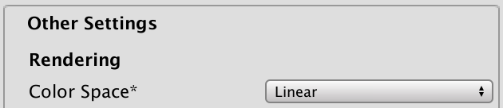

# Unity可编程渲染管线（SRP）系列（一）——自定义管线（控制渲染）

[原文地址](https://catlikecoding.com/unity/tutorials/scriptable-render-pipeline/custom-pipeline/)

[译文地址](https://zhuanlan.zhihu.com/p/165140042)


>本文重点：
>
>1、创建管线资产和实例
>2、剔除、过滤、排序、渲染
>3、保持内存干净
>4、提供良好的编辑体验


## **1 创建一个管线**

要渲染任何物体，Unity必须确定要绘制哪些形状，在何时何地以及使用什么设置。这可能会变得非常复杂，具体取决于所涉及的效果。灯光，阴影，透明度，图像效果，体积效果等都必须以正确的顺序处理，以得到最终的图像。此过程称为渲染管线。

Unity 2017支持两个预定义的渲染管线，一个用于正向渲染，一个用于延迟渲染。它还支持Unity 5中引入的较旧的延迟渲染方法。这些管线是固定的。你可以启用，禁用或覆盖管线的某些部分，但是不可能完全偏离其设计。

Unity 2018增加了对可脚本化渲染管线的支持，尽管你仍然必须依靠Unity进行许多单独步骤（例如剔除），但仍可以从头开始设计管线。Unity 2018引入了两种使用这种新方法制作的新管线，即轻量级管线和高清管线。这两个管线仍处于预览阶段，可编写脚本的渲染管线API仍被标记为实验技术。但现在，它足以让我们继续创建自己的管线。

在本教程中，我们将设置一个最小的渲染管线来绘制不受光的形状。一旦可行的话，我们可以在以后的教程中扩展我们的管线，添加照明，阴影等更多高级功能。

### **1.1 项目设置**

打开Unity 2018并创建一个新项目。我正在使用Unity 2018.2.9f1，但任何2018.2版本或更高版本也适用。创建一个禁用分析功能的标准3D项目。我们将创建自己的管线，因此请不要选择任何管线选项。

打开项目后，通过Window / Package Manager进入软件包管理器，并删除默认情况下包含的所有软件包，因为我们不需要它们。只保留无法删除的Package Manager UI。


我们将在线性色彩空间中工作，但Unity 2018仍将gamma空间用作默认值。因此，请通过“Edit/ Project Settings / Player”转到播放器设置，然后将“Other Settings”部分中的“Color Space”切换为“Linear”。



我们需要一些简单的材质来测试我们的管线。我创建了四种材质。首先，默认的标准不透明材质具有红色反照率。其次，相同的材质，但“渲染模式”（Rendering Mode）设置为“Transparent ”（透明），蓝色反照率，透明度降低。第三，使用使用“Unlit/Color”着色器的材质，其颜色设置为黄色。最后，使用“Unlit/Transparent”着色器的材质没有任何更改，因此显示为纯白色。


用所有四种材质，在场景中实例化一些对象。

### **1.2 管线Asset**

当前，Unity使用默认的前向渲染管线。要使用自定义管线，我们必须在图形设置中选择一个，可以通过“Edit/ Project Settings / Graphics.”找到。


要设置自己的管线，必须将管线资产分配给“Scriptable Render Pipeline Settings”字段。这些资产必须继承自RenderPipelineAsset，它是ScriptableObject类型。

为我们的自定义管线资产创建一个新脚本。将管线命名为My Pipeline。因此，其资产类型将为MyPipelineAsset，并且必须继承自RenderPipelineAsset，该属性在UnityEngine.Experimental.Rendering命名空间中定义。

```cs
using UnityEngine;
using UnityEngine.Experimental.Rendering;

public class MyPipelineAsset : RenderPipelineAsset {}
```


> 它将始终处于试验性名称空间中吗？
> 它将在某个时候移出实验性名称空间，移至UnityEngine.Rendering或另一个名称空间。发生这种情况时，除非API也被更改，否则只需更新using语句即可。

管线资产的主要目的是为Unity提供一种获取负责渲染的管线对象实例的方法。资产本身只是句柄和存储管线设置的地方。我们还没有任何设置，因此我们要做的就是为Unity提供一种获取管线对象实例的方法。这是通过重写InternalCreatePipeline方法来完成的。但是我们还没有定义管线对象类型，因此现在只返回null。

InternalCreatePipeline的返回类型为IRenderPipeline。类型名称的I前缀表示它是接口类型。

```cs
public class MyPipelineAsset : RenderPipelineAsset {

	protected override IRenderPipeline InternalCreatePipeline () {
		return null;
	}
}
```


现在，我们需要将这种类型的资产添加到项目中。为此，请将CreateAssetMenu属性添加到MyPipelineAsset。

```cs
[CreateAssetMenu]
public class MyPipelineAsset : RenderPipelineAsset {}
```

这在“Asset / Create menu”菜单中放置一个条目。让我们保持整洁并将其放在“Rendering”子菜单中。为此，我们将属性的menuName属性设置为“Rendering/My Pipeline”。可以在属性类型之后直接在圆括号中设置属性。

```cs
[CreateAssetMenu(menuName = "Rendering/My Pipeline")]
public class MyPipelineAsset : RenderPipelineAsset {}
```

使用新菜单项将资产添加到项目中，将其命名为“My Pipeline”。


然后将其分配给可脚本化的渲染管线设置。


现在，我们替换了默认管线，该管线更改了一些内容。首先，图形设置中消失了很多选项，Unity在信息面板中也提到了这些选项。其次，由于我们绕过默认管线而没有提供有效的替换，因此不再呈现任何内容。游戏窗口，场景窗口和材质预览不再起作用，尽管场景窗口仍显示出天空盒。如果你通过“Window/ Analysis / Frame Debugger”打开帧调试器并启用它的话，你将看到在游戏窗口中确实没有绘制任何内容。

### **1.3** **管线实例**

要创建有效的管线，我们必须提供一个实现IRenderPipeline并负责渲染过程的对象实例。因此，创建一个类，将其命名为MyPipeline。

```cs
using UnityEngine;
using UnityEngine.Experimental.Rendering;

public class MyPipeline : IRenderPipeline {}
```

尽管我们可以自己实现IRenderPipeline，但扩展抽象RenderPipeline类更为方便。该类型已经提供了我们可以建立的IRenderPipeline的基本实现。

```cs
public class MyPipeline : RenderPipeline {}
```

现在，我们可以在InternalCreatePipeline中返回MyPipeline的新实例。这意味着我们在技术上拥有有效的管线，尽管它仍然不呈现任何内容。

```cs
protected override IRenderPipeline InternalCreatePipeline () {
		return new MyPipeline();
	}
```

## **2 渲染**

管线对象负责渲染每个帧。Unity所做的全部工作就是使用上下文和活动的摄像机调用管线的Render方法。这是针对游戏窗口完成的，也适用于场景窗口和编辑器中的材质预览。我们需要适当地配置事物，找出需要渲染的内容，并按照正确的顺序进行所有操作。

### **2.1 上下文**

RenderPipeline包含IRenderPipeline接口中定义的Render方法的实现。它的第一个参数是渲染上下文，它是ScriptableRenderContext结构，充当本机代码的外观。它的第二个参数是一个数组，其中包含所有需要渲染的相机。

RenderPipeline.Render不会绘制任何内容，但会检查管线对象是否有效用于渲染。如果没有，它将引发异常。我们将重写此方法并调用基本实现，以保留此检查。

```cs
public class MyPipeline : RenderPipeline {
	public override void Render ( ScriptableRenderContext renderContext, Camera[] cameras) {
		base.Render(renderContext, cameras);
	}
}
```

通过渲染上下文，我们向Unity引擎发出命令以渲染事物并控制渲染状态。最简单的示例之一是绘制天空盒，可以通过调用DrawSkyBox方法来完成。

```cs
base.Render(renderContext, cameras);
renderContext.DrawSkybox();
```

DrawSkybox需要使用相机作为参数。我们将仅使用相机的第一个元素。

```cs
renderContext.DrawSkybox(cameras[0]);
```

我们仍然没有看到天空盒出现在游戏窗口中。那是因为我们对上下文发出的命令是缓冲的。实际的工作在我们通过Submit方法将其提交执行后发生。

```cs
renderContext.DrawSkybox(cameras[0]);
renderContext.Submit();
```

天空盒最终出现在游戏窗口中，你也可以看到它出现在帧调试器中。


### **2.2 相机**

我们提供了一系列摄像机，因为场景中可能存在多个必须全部渲染的摄像机。多相机设置的示例用法是分屏多人游戏，迷你地图和后视镜。每个摄像机都需要单独处理。

现在不需要担心我们的管线是否支持多相机渲染。我们将简单创建一个作用于单个摄像机的替代Render方法。让它绘制天空盒，然后提交。因此，我们按摄像机提交。

```cs
void Render (ScriptableRenderContext context, Camera camera) {
	context.DrawSkybox(camera);
	context.Submit();
}
```

对相机阵列的每个元素调用新方法。在这种情况下，我使用一个foreach循环，因为Unity的管道也使用这种方法来循环摄像机。

```cs
public override void Render (ScriptableRenderContext renderContext, Camera[] cameras) {
    base.Render(renderContext, cameras);

    //renderContext.DrawSkybox(cameras[0]);
    //renderContext.Submit();

    foreach (var camera in cameras) {
        Render(renderContext, camera);
    }
}
```

> foreach如何工作？
>
> **foreach** ( **var** e **in** a) { … }就像**for** ( **int** i = 0; i < a.Length; a++) { **var** e = a[i]; … } 只不过假定A是数组。唯一的功能差异是我们无法访问迭代器变量i
> 当a不是数组而是可枚举的其他对象时，迭代器就会起作用，你最终可能会创建临时对象，最好不要这样做。将foreach与数组一起使用是安全的。
> 使用var定义元素变量很常见，因此我也使用它。它的类型是a的元素类型。

请注意，相机的设置目前不影响天空盒的渲染。我们将相机传递给DrawSkybox，但这仅用于确定是否需要绘制天空盒，但真正是否绘制是通过相机清除标志控制的。

为了正确渲染天空盒以及整个场景，必须设置视图投影矩阵。该转换矩阵将摄像机的位置和方向（视图矩阵）与摄像机的透视或正投影（投影矩阵）结合在一起。你可以在帧调试器中看到此矩阵。它是unity_MatrixVP，是绘制物体时使用的着色器属性之一。

目前，unity_MatrixVP矩阵始终相同。我们必须通过SetupCameraProperties方法将摄像机的属性应用于上下文。这将设置矩阵以及其他一些属性。

```cs
void Render (ScriptableRenderContext context, Camera camera) {
    context.SetupCameraProperties(camera);
    context.DrawSkybox(camera);
    context.Submit();
}
```

现在，在游戏窗口和场景窗口中，考虑到摄影机属性，即可正确渲染天空盒。

### **2.3 命令缓冲（Command Buffers）**

上下文会延迟实际渲染，直到我们提交它为止。在此之前，我们对其进行配置并向其添加命令以供以后执行。某些任务（例如绘制天空盒）可以通过专用方法发出，而其他命令则必须通过单独的命令缓冲区间接发出。

可以通过实例化一个新的CommandBuffer对象来创建命令缓冲区，该对象在UnityEngine.Rendering命名空间中定义。在添加可编写脚本的渲染管线之前，命令缓冲区已经存在，因此它们不是实验性的。在绘制天空盒之前，请创建此类缓冲区。

```cs
using UnityEngine;
using UnityEngine.Rendering;
using UnityEngine.Experimental.Rendering;

public class MyPipeline : RenderPipeline {

	…

	void Render (ScriptableRenderContext context, Camera camera) {
		context.SetupCameraProperties(camera);
		var buffer = new CommandBuffer();
		context.DrawSkybox(camera);
		context.Submit();
	}
}
```

可以通过其ExecuteCommandBuffer方法指示上下文执行缓冲区。再强调一次，这不会立即执行命令，而是将它们复制到上下文的内部缓冲区。

```cs
var buffer = new CommandBuffer();
context.ExecuteCommandBuffer(buffer);
```

命令缓冲区要求资源以将其命令存储在Unity引擎的本机级别。如果我们不再需要这些资源，则最好立即释放它们。这可以通过在调用ExecuteCommandBuffer之后直接调用缓冲区的Release方法来完成

```cs
var buffer = new CommandBuffer();
context.ExecuteCommandBuffer(buffer);
buffer.Release();
```

执行一个空的命令缓冲区不会执行任何操作。我们添加它，以便我们可以清除渲染目标，以确保渲染不受早期绘制内容的影响。这可以通过命令缓冲区来实现，但不能直接通过上下文来实现。

可以通过调用ClearRenderTarget将clear命令添加到缓冲区。它需要三个参数：两个布尔值和一个颜色。第一个参数控制是否清除深度信息，第二个参数控制是否清除颜色，第三个参数是清除颜色（如果使用）。例如，让我们清除深度数据，忽略颜色数据，然后使用Color.clear作为清除颜色。

```cs
var buffer = new CommandBuffer();
buffer.ClearRenderTarget(true, false, Color.clear);
context.ExecuteCommandBuffer(buffer);
buffer.Release();
```

帧调试器现在将向我们显示命令缓冲区已执行，这将清除渲染目标。在这种情况下，它表示清除了Z和模板。Z表示深度缓冲区，并且模板缓冲区始终被清除。


通过相机的清除标志和背景颜色配置清除的内容。我们可以使用这些方法而不是硬编码来清除渲染目标。

```cs
CameraClearFlags clearFlags = camera.clearFlags;
buffer.ClearRenderTarget(
    (clearFlags & CameraClearFlags.Depth) != 0,
    (clearFlags & CameraClearFlags.Color) != 0,
    camera.backgroundColor
);
```

> 清除标志如何工作？
>
> CameraClearFlags是可以用作一组位标志的枚举。该值的每一位都用于指示某个功能是否启用。
>
> 要从整个值中提取位标志，请使用按位AND运算符＆将值与所需标志组合。如果结果不为零，则设置标志。

因为我们没有给命令缓冲区命名，所以调试器将显示默认名称，即未命名的命令缓冲区。通过将摄像机的名称分配给缓冲区的name属性，可以使用它的名称。我们将使用对象初始值设定项语法执行此操作。

```cs
var buffer = new CommandBuffer {
			name = camera.name
		};
```


> 对象初始值设定项语法如何工作？
>
> 我们还可以编写buffer.name = camera.name; 作为调用构造函数后的单独语句。但是，在创建新对象时，可以将代码块附加到构造函数的调用中。然后，你可以在块中设置对象的字段和属性，而不必显式引用对象实例。同样，它明确规定了仅在设置了这些字段和属性之后才可以使用实例。除此之外，它还允许在仅允许单个语句的情况下进行初始化，而无需具有许多参数变量的构造函数。

请注意，我们省略了构造函数调用的空参数列表，该列表在使用对象初始化程序语法时是允许的。

### **2.4 剔除**

我们能够渲染天空盒，但是还不能渲染场景中放置的任何对象。并不是每个对象都会渲染，我们只会渲染摄像机可以看到的对象。我们首先从场景中的所有渲染器开始，然后剔除那些在摄像机视锥范围之外的渲染器。

> 什么是渲染器？
>
> 它是附着在游戏对象上的组件，可将它们转变为可以渲染的东西。通常，是MeshRenderer组件。

找出可以剔除的内容需要我们跟踪多个相机设置和矩阵，为此我们可以使用ScriptableCullingParameters结构。它无需自己填充，我们可以将工作委托给静态CullResults.GetCullingParameters方法。它以摄像机作为输入，并生成剔除参数作为输出。但是，它不返回参数struct。相反，我们必须将其作为第二个输出参数提供，并在其前面写出。

```cs
void Render (ScriptableRenderContext context, Camera camera) {
    ScriptableCullingParameters cullingParameters;
    CullResults.GetCullingParameters(camera, out cullingParameters);

    …
}
```

> 为什么我们要写out？
>
> 结构是值类型，因此它们被视为简单值。它们不是具有标识的对象，变量和字段仅保留对其在内存中位置的引用。因此，将struct作为参数传递给方法提供了该值的副本。该方法可以更改副本，但是对复制的值没有影响。
>
> 将struct参数定义为输出参数时，它的作用类似于对象引用，但指向该参数所驻留的内存堆栈中的位置。当方法更改该参数时，它将影响该值，而不是副本。
>
> out关键字告诉我们该方法负责正确设置参数，替换先前的值。
>
> 除了Out参数外，GetCullingParameters还返回是否能够创建有效参数。并非所有相机设置都有效， 因此，如果失败，我们将没有任何渲染，可以退出渲染。

```cs
if (!CullResults.GetCullingParameters(camera, out cullingParameters)) {
			return;
		}
```

一旦有了剔除参数，就可以使用它们进行剔除。这是通过调用静态CullResults.Cull方法（将剔除参数和上下文作为参数）来完成的。结果是一个CullResults结构，其中包含有关可见内容的信息。

在这种情况下，我们必须通过在其前面写入ref来提供剔除参数作为参考参数。

```cs
if (!CullResults.GetCullingParameters(camera, out cullingParameters)) {
    return;
}

CullResults cull = CullResults.Cull(ref cullingParameters, context);
```

> 为什么我们必须写ref？
>
> 它的工作原理与Out之类似，只是在这种情况下，不需要该方法为该值分配某些内容。谁调用该方法，谁先负责正确初始化值。因此它可以用于输入，也可以用于输出。
> 为什么ScriptableCullingParameters是结构？
>
> 这可能是一种优化尝试，其想法是你可以创建多个参数结构而不必担心内存分配。但是，对于结构而言，ScriptableCullingParameters非常大，这也是出于性能原因而在此处使用引用参数的原因。也许它开始时很小，但是随着时间的推移，它发展成为一个庞大的结构。可重用对象实例现在可能是一种更好的方法，但是我们必须与Unity Technologies决定使用的任何对象一起工作。

### **2.5 绘制**

一旦知道可见的内容，就可以继续渲染这些形状。这是通过在上下文上调用DrawRenderers并使用cull.visibleRenderers作为参数来完成的，告诉它要使用哪些渲染器。除此之外，我们还必须提供绘图设置和过滤器设置。两者都是结构（DrawRendererSettings和FilterRenderersSettings），我们将首先使用它们的默认值。绘图设置必须作为引用传递。

```cs
buffer.Release();
var drawSettings = new DrawRendererSettings();
var filterSettings = new FilterRenderersSettings();
context.DrawRenderers(
    cull.visibleRenderers, ref drawSettings, filterSettings
);
context.DrawSkybox(camera);
```

我们还没有看到任何对象，因为默认的过滤器设置不包含任何内容。相反，我们可以通过提供true作为FilterRenderersSettings构造函数的参数来包含所有内容。这告诉它初始化自己，以便包括所有内容。

```cs
var filterSettings = new FilterRenderersSettings(true);
```

另外，我们必须通过为其构造函数提供相机和着色器通道作为参数来配置绘制设置。相机用于设置排序和剔除层，而通道控制使用哪个着色器通道进行渲染。

着色器通道通过字符串标识，该字符串必须包装在ShaderPassName结构中。由于我们仅在管线中支持不发光的材质，因此我们将使用Unity的默认Unlit通道，该通道由SRPDefaultUnlit标识。

```cs
var drawSettings = new DrawRendererSettings(
			camera, new ShaderPassName("SRPDefaultUnlit")
		);
```


我们看到出现了不透明的不发光形状，但是没看到带有透明的。但是，帧调试器指出Unlit的形状也会被绘制。


它们确实会被绘制了，但是由于透明着色器通道不写入深度缓冲区，因此最终被天空盒绘制遮挡。解决方案是将透明渲染器的绘制延迟到天空盒之后。

首先，将天空盒之前的绘制限制为仅不透明的渲染器。这是通过将过滤器设置的renderQueueRange设置为RenderQueueRange.opaque来完成的，它覆盖从0到2500（包括2500）之间的渲染队列。

```cs
var filterSettings = new FilterRenderersSettings(true) {
			renderQueueRange = RenderQueueRange.opaque
		};
```


接下来，在渲染天空盒之后，将队列范围更改为RenderQueueRange.transparent（从2501到5000，包括5000），然后再次渲染。

```cs
var filterSettings = new FilterRenderersSettings(true) {
    renderQueueRange = RenderQueueRange.opaque
};

context.DrawRenderers(
    cull.visibleRenderers, ref drawSettings, filterSettings
);

context.DrawSkybox(camera);

filterSettings.renderQueueRange = RenderQueueRange.transparent;
context.DrawRenderers(
    cull.visibleRenderers, ref drawSettings, filterSettings
);
```


我们在天空盒之前绘制不透明的渲染器，以防止过度绘制（overdraw）。由于这些形状将始终位于天空盒的前面，因此，我们首先绘制它们可以避免工作。这是因为不透明的着色器通道将写入深度缓冲区，该深度缓冲区用于跳过以后绘制的任何内容，直到结束为止。

除了覆盖天空的一部分之外，不透明的渲染器也可能最终彼此遮挡。理想情况下，对于帧缓冲区的每个片段，只绘制最接近摄像机的一个。因此，为了尽可能减少过度绘制，我们应该首先绘制最近的形状。可以在绘制之前对渲染器进行排序来完成，通过排序标志来控制。

绘制设置包含类型为DrawRendererSortSettings的排序结构，该结构包含排序标志。在绘制不透明形状之前，将其设置为SortFlags.CommonOpaque。这指示Unity按从前到后的距离以及其他一些条件对渲染器进行排序。

```cs
var drawSettings = new DrawRendererSettings(
    camera, new ShaderPassName("SRPDefaultUnlit")
);
drawSettings.sorting.flags = SortFlags.CommonOpaque;
```

但是，透明渲染的工作原理有所不同。它结合了正在绘制的颜色和之前绘制的颜色，因此结果看起来是透明的。这需要从后到前的反向绘制顺序。我们可以为此使用SortFlags.CommonTransparent。

```cs
context.DrawSkybox(camera);
drawSettings.sorting.flags = SortFlags.CommonTransparent;
filterSettings.renderQueueRange = RenderQueueRange.transparent;
context.DrawRenderers(
    cull.visibleRenderers, ref drawSettings, filterSettings
);
```

现在，我们的管线能够正确渲染不透明和透明的Unlit对象。

## **3 抛光**

能够正确渲染只是具有功能管线的一部分。还需要考虑其他事项，例如它是否足够快，是否不分配不需要的临时对象以及是否与Unity编辑器很好地集成。

### **3.1 内存分配**

让我们检查一下我们的管线在内存管理方面是否表现良好，或者它是否每帧分配内存，这决定是否触发频繁的内存垃圾回收运行。通过“Window/ Analysis / Profiler ”打开探查器并在“Hierarchy”模式下检查CPU使用率数据来完成的。虽然你可以在编辑器中的播放模式下执行此操作，但如果你创建的是development 版本并将其自动附加到Profiler上，也是一种较好的分析手段，但这种情况下无法进行深度剖析 。

按GC分配进行排序，你将看到每个帧都分配了内存。其中有些是我们无法控制的，但是在管线的Render 方法中分配了相当多的字节。

事实证明，剔除分配了最多的内存。产生的原因是，尽管CullResults是一个结构，但它包含三个作为对象的列表。每次我们请求新的CullResults时，最终都会为新List分配内存。因此，将CullResults用作结构并没有太多好处。

幸运的是，CullResults有一个替代的Cull方法，该方法接受一个结构作为参考参数，而不是返回一个新的结构。这样就可以重用列表。我们要做的就是将cull变成一个字段，并将其作为CullResults.Cull的附加参数提供，而不是分配给它。

```cs
CullResults cull;

	…

	void Render (ScriptableRenderContext context, Camera camera) {
		…

		//CullResults cull = CullResults.Cull(ref cullingParameters, context);
		CullResults.Cull(ref cullingParameters, context, ref cull);
		
		…
	}
```

连续内存分配的另一个来源是我们对相机的name属性的使用。每次获取其值时，它都会从本机代码中获取名称数据，这需要创建一个新的字符串（即对象）。因此，我们在命令缓冲区始终将其命名为“Render Camera”。

```cs
var buffer = new CommandBuffer() {
			name = "Render Camera"
		};
```


最后，命令缓冲区本身也是一个对象。幸运的是，我们可以一次创建一个命令缓冲区并重新使用它。将局部变量替换为cameraBuffer字段。由于对象初始化语法，我们可以创建一个命名命令缓冲区作为其默认值。唯一的其他变化是我们必须清除命令缓冲区而不是释放它，为此我们可以使用其Clear方法。

```cs
CommandBuffer cameraBuffer = new CommandBuffer {
		name = "Render Camera"
	};

	…

	void Render (ScriptableRenderContext context, Camera camera) {
		…

		//var buffer = new CommandBuffer() {
		//	name = "Render Camera"
		//};
		cameraBuffer.ClearRenderTarget(true, false, Color.clear);
		context.ExecuteCommandBuffer(cameraBuffer);
		//buffer.Release();
		cameraBuffer.Clear();

		…
	}
```

这些更改之后，我们的管线将不会再在每个帧中创建临时对象。

### **3.2 帧调试器采样**

我们可以做的另一件事是改善帧调试器显示的数据。Unity的管线可以显示嵌套的事件层次结构，但我们的所有层次结构都在根级别。我们可以通过使用命令缓冲区来开始和结束探查器样本来构建层次结构。

让我们首先在ClearRenderTarget之前调用BeginSample，然后立即调用EndSample。每个样本都必须有一个开始和结尾，并且都必须提供完全相同的名称。除此之外，我发现最好使用与定义采样的命令缓冲区相同的名称。不过怎么说，使用命令缓冲区的名字经常会需要用到。

```cs
cameraBuffer.BeginSample("Render Camera");
cameraBuffer.ClearRenderTarget(true, false, Color.clear);
cameraBuffer.EndSample("Render Camera");
context.ExecuteCommandBuffer(cameraBuffer);
cameraBuffer.Clear();
```


现在，我们看到一个嵌套在命令缓冲区原始“Render Camera ”中的“Render Camera ”级别，该缓冲区又包含清除操作。但是可以更进一步，将与相机有关的所有其他动作也嵌套在其中。这要求我们将样本的结束时间推迟到提交上下文之前。因此，我们必须在此时插入一个额外的ExecuteCommandBuffer，仅包含结束样本的指令。为此使用相同的命令缓冲区，完成后再次清除它。

```cs
cameraBuffer.BeginSample("Render Camera");
		cameraBuffer.ClearRenderTarget(true, false, Color.clear);
		//cameraBuffer.EndSample("Render Camera");
		context.ExecuteCommandBuffer(cameraBuffer);
		cameraBuffer.Clear();

		…

		cameraBuffer.EndSample("Render Camera");
		context.ExecuteCommandBuffer(cameraBuffer);
		cameraBuffer.Clear();

		context.Submit();
```


除了清除动作嵌套在冗余“Render Camera”级别内，而所有其他动作都直接位于根级别之下之外，这看起来不错。我不清楚为什么会这样，但是可以通过清除后再开始采样来避免。

```cs
//cameraBuffer.BeginSample("Render Camera");
cameraBuffer.ClearRenderTarget(true, false, Color.clear);
cameraBuffer.BeginSample("Render Camera");
context.ExecuteCommandBuffer(cameraBuffer);
cameraBuffer.Clear();
```


### **3.3 渲染默认管线**

由于我们的管线仅支持Unlit的着色器，因此不会渲染使用不同着色器的对象，从而导致它们不可见。尽管这是正确的，但它掩盖了某些对象使用错误着色器的事实。如果我们使用Unity的错误着色器可视化这些对象，那会很好，比如它们显示为明显不正确的洋红色形状。让我们为此添加一个专用的DrawDefaultPipeline方法，其中包含一个上下文和一个camera参数。在绘制透明形状之后，我们将在最后调用它。

```cs
void Render (ScriptableRenderContext context, Camera camera) {
    …

        drawSettings.sorting.flags = SortFlags.CommonTransparent;
    filterSettings.renderQueueRange = RenderQueueRange.transparent;
    context.DrawRenderers(
        cull.visibleRenderers, ref drawSettings, filterSettings
    );

    DrawDefaultPipeline(context, camera);

    cameraBuffer.EndSample("Render Camera");
    context.ExecuteCommandBuffer(cameraBuffer);
    cameraBuffer.Clear();

    context.Submit();
}

void DrawDefaultPipeline(ScriptableRenderContext context, Camera camera) {}
```

Unity的默认表面着色器具有ForwardBase通道，该通道用作第一个正向渲染通道。我们可以使用它来识别具有与默认管线一起使用的材质的对象。通过新的绘图设置选择该通道，并将其与新的默认滤镜设置一起用于渲染。我们不在乎排序或分离不透明渲染器和透明渲染器，因为它们都是无效的。

```cs
void DrawDefaultPipeline(ScriptableRenderContext context, Camera camera) {
    var drawSettings = new DrawRendererSettings(
        camera, new ShaderPassName("ForwardBase")
    );

    var filterSettings = new FilterRenderersSettings(true);

    context.DrawRenderers(
        cull.visibleRenderers, ref drawSettings, filterSettings
    );
}
```


现在将显示使用默认着色器的对象。它们在帧调试器中也可见。


由于我们的管线不支持正向Base通道，因此无法正确呈现它们。没有设置必要的数据，因此所有依赖于灯光的物体最终都变成了黑色。但这是不对的，我们应该使用错误着色器渲染它们。为此，我们需要一个错误材质。添加一个字段，然后，在DrawDefaultPipeline的开始处，创建错误材质（如果尚不存在）。这是通过Shader.Find检索Hidden / InternalErrorShader，然后使用该着色器创建新材质来完成的。另外，将材质的隐藏标志设置为HideFlags.HideAndDontSave，使其不会显示在项目窗口中，并且不会与所有其他资产一起保存。

```cs
Material errorMaterial;

…
    
void DrawDefaultPipeline(ScriptableRenderContext context, Camera camera) {
    if (errorMaterial == null) {
        Shader errorShader = Shader.Find("Hidden/InternalErrorShader");
        errorMaterial = new Material(errorShader) {
            hideFlags = HideFlags.HideAndDontSave
        };
    }
    …
}
```

绘制设置的一种选择是通过调用SetOverrideMaterial来覆盖渲染时使用的材质。它的第一个参数是要使用的材质。它的第二个参数是用于渲染的材质着色器的通道索引。由于错误着色器只有一个通道，因此使用零。

```cs
var drawSettings = new DrawRendererSettings(
    camera, new ShaderPassName("ForwardBase")
);
drawSettings.SetOverrideMaterial(errorMaterial, 0);
```


现在，使用不受支持的材质的对象会显示不正确。但这仅适用于Unity默认管线的材质，其着色器具有ForwardBase 通道。我们还可以使用其他通道来识别其他内置着色器，比如PrepassBase，Always，Vertex，VertexLMRGBM和VertexLM。

幸运的是，可以通过调用SetShaderPassName将多个Pass添加到绘图设置中。名称是此方法的第二个参数。它的第一个参数是控制通道绘制顺序的索引。我们不在乎，所以任何顺序都可以。通过构造函数提供的通道始终具有零索引，只需增加索引即可获得更多通道。

```cs
var drawSettings = new DrawRendererSettings(
			camera, new ShaderPassName("ForwardBase")
		);
drawSettings.SetShaderPassName(1, new ShaderPassName("PrepassBase"));
drawSettings.SetShaderPassName(2, new ShaderPassName("Always"));
drawSettings.SetShaderPassName(3, new ShaderPassName("Vertex"));
drawSettings.SetShaderPassName(4, new ShaderPassName("VertexLMRGBM"));
drawSettings.SetShaderPassName(5, new ShaderPassName("VertexLM"));
drawSettings.SetOverrideMaterial(errorMaterial, 0);
```

现在，这已经涵盖了Unity提供的所有着色器，这应该足以帮助指出在创建场景时是否使用了不正确的材质。但是我们只需要在开发过程中（而不是在构建过程中）这样做即可。我们仅在编辑器中调用DrawDefaultPipeline。方法是通过向该方法添加Conditional属性。

### **3.4 有条件的执行代码**

Conditional属性在System.Diagnostics命名空间中定义。我们可以使用该名称空间，但不幸的是，它还包含一个Debug类型，该类型与UnityEngine.Debug冲突。因为我们只需要属性，所以可以通过使用别名来避免冲突，使用特定的类型并将其分配给有效的类型名称。这时候，我们将Conditional定义为System.Diagnostics.ConditionalAttribute的别名。

```cs
using UnityEngine;
using UnityEngine.Rendering;
using UnityEngine.Experimental.Rendering;
using Conditional = System.Diagnostics.ConditionalAttribute;
```

将属性添加到我们的方法中。它需要一个用于指定符号的字符串参数。如果符号是在编译期间定义的，则将正常包含方法调用。但是，如果未定义符号，则将忽略此方法的调用（包括其所有参数）。就像DrawDefaultPipeline（context，camera）; 代码在编译期间不存在。

为了只在为Unity编辑器编译时包括调用，我们必须依赖UNITY_EDITOR符号。

```cs
[Conditional("UNITY_EDITOR")]
void DrawDefaultPipeline(ScriptableRenderContext context, Camera camera) {
    …
}
```

我们可以更进一步，还可以将调用包括在开发版本中，仅将其从发行版本中排除。为此，请使用DEVELOPMENT_BUILD符号添加一个额外的Conditional。

```cs
[Conditional("DEVELOPMENT_BUILD"), Conditional("UNITY_EDITOR")]
void DrawDefaultPipeline(ScriptableRenderContext context, Camera camera) {
    …
}
```

### **3.5 使用场景窗口**

到目前为止，我们尚未考虑的一件事，就是Unity的游戏内UI。要对其进行测试，请通过GameObject/ UI / Button将UI元素添加到场景中，例如单个按钮。这将创建一个带有按钮的画布以及一个事件系统。

事实证明，UI可以在游戏窗口中呈现，而无需我们做任何事情。Unity为我们照顾它。帧调试器显示UI是作为覆盖层单独呈现的。


至少在将画布设置为在屏幕空间中渲染的情况下是这种情况。设置为在世界空间中渲染时，UI会与其他透明对象一起渲染。


尽管UI在游戏窗口中可用，但不会显示场景窗口。UI始终存在于场景窗口中的世界空间中，我们必须手动将其注入场景中。通过调用静态ScriptableRenderContext.EmitWorldGeometryForSceneView方法（以当前相机为参数）来添加UI。需要在剔除之前完成此操作。

```cs
if (!CullResults.GetCullingParameters(camera, out cullingParameters)) {
			return;
		}

ScriptableRenderContext.EmitWorldGeometryForSceneView(camera);
CullResults.Cull(ref cullingParameters, context, ref cull);
```

但这还会在游戏窗口中第二次添加UI。为避免这种情况，我们仅在渲染场景窗口时才发出UI几何。当摄像机的cameraType等于CameraType.SceneView时就是这种情况。

```cs
if (camera.cameraType == CameraType.SceneView) {
    ScriptableRenderContext.EmitWorldGeometryForSceneView(camera);
}
```

有效，但仅在编辑器中有效。条件编译可确保在为构建进行编译时EmitWorldGeometryForSceneView不存在，这意味着我们现在在尝试进行构建时会遇到编译器错误。为了使其再次正常工作，我们还必须使调用EmitWorldGeometryForSceneView的代码也有条件。这是通过将代码放在#if和#endif语句之间来完成的。#if语句需要一个符号，就像Conditional属性一样。通过使用UNITY_EDITOR，仅在为编辑器编译时才包含代码。

```cs
void Render (ScriptableRenderContext context, Camera camera) {
    ScriptableCullingParameters cullingParameters;
    if (!CullResults.GetCullingParameters(camera, out cullingParameters)) {
        return;
    }

    #if UNITY_EDITOR
        if (camera.cameraType == CameraType.SceneView) {
            ScriptableRenderContext.EmitWorldGeometryForSceneView(camera);
        }
    #endif

        CullResults.Cull(ref cullingParameters, context, ref cull);

    …
}
```

