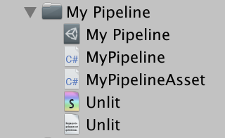
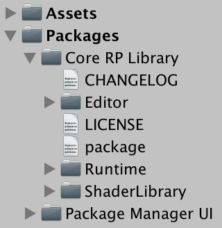
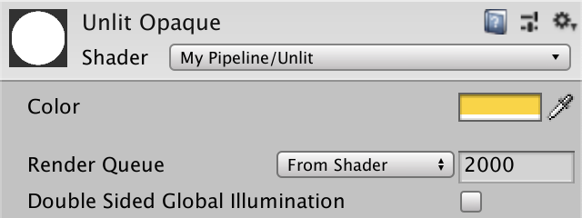
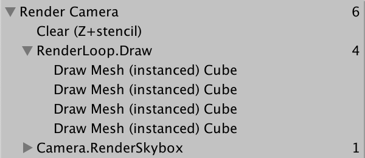

# Unity可编程渲染管线（SRP）系列（二）——自定义着色器（HLSL和核心库）

[原文地址](https://catlikecoding.com/unity/tutorials/scriptable-render-pipeline/custom-shaders/)

[译文地址](https://zhuanlan.zhihu.com/p/166334724)

> 本文重点：
>
>1、写一个HLSL着色器
>2、定义常量缓冲区
>3、使用渲染管线的核心库
>4、支持动态批处理和GPU实例

## **1 自定义不受光着色器**

之前我们使用默认的不受光着色器来测试管线，但是要充分利用非正常的自定义管线，则需要创建自定义着色器才能使用它。因此，我们将创建自己的着色器，以替换Unity的默认Unlit着色器。

### **1.1 创建一个着色器**

可以通过“Assets/ Create / Shader ”菜单中的选项之一创建着色器资产。Unlit Shader最合适，但是我们将通过从创建的着色器文件中删除所有默认代码来重新开始。将资产命名为Unlit。


着色器文件的基本原理在[Rendering 2, Shader Fundamentals](https://catlikecoding.com/unity/tutorials/rendering/part-2/)中进行了说明。如果你不熟悉编写着色器，请阅读一下，以便了解基本知识。要获得可用的着色器，最低要求是定义一个包含“ **Properties** ”块的**Shader** 块以及一个内部带有“**Pass** ”块的SubShader块。Unity会将其变成默认的白色Unlit着色器。在Shader关键字之后是一个字符串，该字符串将在材质的shader下拉菜单中使用。我们使用“My Pipeline/Unlit ”。

```hlsl
Shader "My Pipeline/Unlit" {
	
	Properties {}
	
	SubShader {
		
		Pass {}
	}
}
```

调整Unlit不透明材质，使其使用我们的新着色器，如果尚未着色，则将其变为白色。


### **1.2 HLSL**

要编写自己的着色器，我们必须在其Pass块中放入一个程序。Unity支持GLSL或HLSL程序。虽然GLSL用于默认着色器以及[Rendering 2, Shader Fundamentals](https://catlikecoding.com/unity/tutorials/rendering/part-2/)，但Unity的新渲染管线着色器使用HLSL，因此我们也将其用于管线。这意味着我们必须将所有代码放在HLSLPROGRAM和ENDHLSL语句之间。

```hlsl
Pass {
			HLSLPROGRAM
			
			ENDHLSL
		}
```


>GLSL和HLSL程序有什么区别？
>
>二者在Unity上实际上使用了相同的语法，并需要按照每个构建目标转换为适当的着色器代码。最大的不同是GLSL程序默认包含一些代码。HLSL程序不会隐式执行任何操作，要求我们明确包含任何需要的内容。这很好，因为旧的GLSL包含文件受旧的和过时的代码影响。我们将依靠较新的HLSL包含文件。

至少，Unity着色器需要一个顶点程序和一个片段程序函数，每个函数均使用pragma编译器指令定义。我们将对顶点函数使用UnlitPassVertex，对其他函数使用UnlitPassFragment。但是，我们不会将这些功能的代码直接放入着色器文件中。相反，我们将HLSL代码放在一个单独的包含文件中，我们也将其命名为Unlit，但带有hlsl扩展名。将其放在Unlit.shader所在的文件夹中，然后在pragma指令之后将其包括在HLSL程序中。

```hlsl
HLSLPROGRAM		
#pragma vertex UnlitPassVertex
#pragma fragment UnlitPassFragment
#include "Unlit.hlsl"
ENDHLSL
```

不过，Unity没有用于创建HLSL包含文件资产的便捷菜单项。你必须自己创建它，例如，复制Unlit.shader文件，将其文件扩展名更改为hlsl，然后从其中删除着色器代码。



在包含文件内部，从包含保护开始，以防止在文件被包含一次以上的情况下导致代码重复。即使永远不会发生这种情况，但对每个包含文件都执行此操作是个好习惯。

```
#ifndef MYRP_UNLIT_INCLUDED
#define MYRP_UNLIT_INCLUDED

#endif // MYRP_UNLIT_INCLUDED
```

至少，我们必须知道顶点程序中的顶点位置，该程序必须输出均匀的裁剪空间位置。因此，我们将为顶点程序定义一个输入和一个输出结构，它们都具有一个float4位置。

```
#ifndef MYRP_UNLIT_INCLUDED
#define MYRP_UNLIT_INCLUDED

struct VertexInput {
	float4 pos : POSITION;
};

struct VertexOutput {
	float4 clipPos : SV_POSITION;
};

#endif // MYRP_UNLIT_INCLUDED
```

接下来，我们将定义顶点程序函数UnlitPassVertex。现在，直接使用对象空间顶点位置作为剪辑空间位置。这是不正确的，但是是获取编译着色器的最快方法。稍后我们将添加正确的空间转换。

```hlsl
struct VertexOutput {
	float4 clipPos : SV_POSITION;
};

VertexOutput UnlitPassVertex (VertexInput input) {
	VertexOutput output;
	output.clipPos = input.pos;
	return output;
}

#endif // MYRP_UNLIT_INCLUDED
```

现在保留默认的白色，因此我们的片段程序函数可以简单地将1作为float4返回。它接收插值顶点输出作为输入，因此即使我们不使用它，也将其添加为参数。

```hlsl
VertexOutput UnlitPassVertex (VertexInput input) {
	VertexOutput output;
	output.clipPos = input.pos;
	return output;
}

float4 UnlitPassFragment (VertexOutput input) : SV_TARGET {
	return 1;
}

#endif // MYRP_UNLIT_INCLUDED
```

> 我们应该使用half还是float？
>
> 大多数移动GPU支持这两种精度类型，其中half效率更高。因此，如果你要针对移动设备进行优化，则应尽可能多地使用half。规则是仅将float用于位置和纹理坐标，将half用于其他所有条件，前提是结果可以接受。
> 当不针对移动平台时，精度不是问题，因为即使我们写了half，GPU始终使用浮点数。在本教程系列中，我将始终使用float。
> 也有fixed类型，但是只有真正的旧硬件才真正支持，而现代应用程序不会使用它。通常等于half。


### **1.3 转置矩阵**

至此，我们有了一个编译着色器，虽然它暂时还无法产生想要的结果。下一步是将顶点位置转换为正确的空间。如果我们有一个模型-视图-投影（model-view-projection）矩阵，那么就可以直接从对象空间转换为剪辑空间，但是Unity不会为我们创建这样的矩阵。但它有一个模型矩阵可用，我们可以用来将对象空间转换为世界空间。Unity希望我们的着色器有一个float4x4 unity_ObjectToWorld变量来存储矩阵。在使用HLSL时，必须自己定义该变量。然后使用它在顶点函数中转换为世界空间，并将其用于输出。

```
float4x4 unity_ObjectToWorld;

struct VertexInput {
	float4 pos : POSITION;
};

struct VertexOutput {
	float4 clipPos : SV_POSITION;
};

VertexOutput UnlitPassVertex (VertexInput input) {
	VertexOutput output;
	float4 worldPos = mul(unity_ObjectToWorld, input.pos);
	output.clipPos = worldPos;
	return output;
}
```

接下来，我们需要从世界空间转换为剪辑空间。这是通过视图投影矩阵完成的，Unity通过float4x4 unity_MatrixVP变量提供了该视图投影矩阵。添加它，然后完成转换。

```
float4x4 unity_MatrixVP;
float4x4 unity_ObjectToWorld;

…

VertexOutput UnlitPassVertex (VertexInput input) {
	VertexOutput output;
	float4 worldPos = mul(unity_ObjectToWorld, input.pos);
	output.clipPos = mul(unity_MatrixVP, worldPos);
	return output;
}
```

> 为什么我改了代码，但无法正常工作？
>
> 编辑包含文件时，Unity并不总是响应更改并且刷新着色器。发生这种情况时，请再次保存该文件，然后再试一次，如有必要，请稍作更改，稍后可以撤消。


现在，我们的着色器可以正常工作了。所有使用不受光材质的物体都再次可见，全白色。但是我们的转换效率不高，因为它执行的是4D位置矢量的全矩阵乘法。该位置的第四部分始终为1。如果明确表示的话，编译器其实可以优化计算。

```
float4 worldPos = mul(unity_ObjectToWorld, float4(input.pos.xyz, 1.0));
```

> ### 优化有意义吗？
>
> 这是Unity自己进行的一项优化，推荐每个人写着色器的时候都考虑它。是否有明显的差异取决于平台。是mad指令和add指令之间的区别。无论如何，它只会更快，永远不会更慢。
>
> 这是未经优化的空间转换生成的D3D11代码：
>
> ```
>    0: mul r0.xyzw, v0.yyyy, cb1[1].xyzw
>    1: mad r0.xyzw, cb1[0].xyzw, v0.xxxx, r0.xyzw
>    2: mad r0.xyzw, cb1[2].xyzw, v0.zzzz, r0.xyzw
>    3: mad r0.xyzw, cb1[3].xyzw, v0.wwww, r0.xyzw
>    4: mul r1.xyzw, r0.yyyy, cb0[1].xyzw
>    5: mad r1.xyzw, cb0[0].xyzw, r0.xxxx, r1.xyzw
>    6: mad r1.xyzw, cb0[2].xyzw, r0.zzzz, r1.xyzw
>    7: mad o0.xyzw, cb0[3].xyzw, r0.wwww, r1.xyzw
> ```
>
> 这是经过优化的转换：
>
> ```
>    0: mul r0.xyzw, v0.yyyy, cb1[1].xyzw
>    1: mad r0.xyzw, cb1[0].xyzw, v0.xxxx, r0.xyzw
>    2: mad r0.xyzw, cb1[2].xyzw, v0.zzzz, r0.xyzw
>    3: add r0.xyzw, r0.xyzw, cb1[3].xyzw
>    4: mul r1.xyzw, r0.yyyy, cb0[1].xyzw
>    5: mad r1.xyzw, cb0[0].xyzw, r0.xxxx, r1.xyzw
>    6: mad r1.xyzw, cb0[2].xyzw, r0.zzzz, r1.xyzw
>    7: mad o0.xyzw, cb0[3].xyzw, r0.wwww, r1.xyzw
> ```

### **1.4 常量缓冲区**

Unity没有为我们提供模型-视图-投影（MVP）矩阵，因为那样可以避免M和VP矩阵的矩阵乘法。除此之外，VP矩阵还可用于同一帧中同一台摄像机绘制的所有内容。Unity的着色器利用了这一点，并将矩阵放在不同的常量缓冲区中。尽管我们将它们定义为变量，但是它们的数据只是在绘制单个形状期间保持不变，并且通常比这个时间更长。VP矩阵放入每帧（per-frame）缓冲区，而M矩阵放入每次绘制（per-draw）缓冲区。

虽然不严格要求将着色器变量放在恒定缓冲区中，但这样做可以使更有效地更改同一缓冲区中的所有数据。至少在图形API支持的情况下就是这种情况。但OpenGL不是。

为了尽可能提高效率，我们还将使用常量缓冲区。Unity将VP矩阵放入UnityPerFrame缓冲区，将M矩阵放入UnityPerDraw缓冲区。这些缓冲区中放入了更多数据，但是我们还暂时不需要它，因此没有必要包含它。除了使用cbuffer关键字之外，常量缓冲区的定义类似于struct，并且变量仍然像以前一样可访问。

```
cbuffer UnityPerFrame {
	float4x4 unity_MatrixVP;
};

cbuffer UnityPerDraw {
	float4x4 unity_ObjectToWorld;
}
```

### **1.5 核心库**

由于常量缓冲区并不能使所有平台受益，因此Unity的着色器依赖于宏仅在需要时使用它们。使用带有名称参数的CBUFFER_START宏而不是直接写cbuffer，并且随附的CBUFFER_END宏替换了缓冲区的末尾。让我们也使用这种方法。

```
CBUFFER_START(UnityPerFrame)
	float4x4 unity_MatrixVP;
CBUFFER_END

CBUFFER_START(UnityPerDraw)
	float4x4 unity_ObjectToWorld;
CBUFFER_END
```

这会导致编译器错误，因为未定义这两个宏。我们不需要弄清楚什么时候应该使用常量缓冲区并自己定义宏，而是将Unity的核心库用于渲染管线。通过package manager window将其添加到我们的项目中。切换到“All Packages ”列表，并启用“Advanced”下的“显示预览软件包”，选择“ Render-pipelines.core”并安装。我正在使用4.6.0-preview版本，这是在Unity 2018.3中工作的最高版本。



现在，我们可以包括公共库功能，可以通过Packages/ com.unity.render-pipelines.core/ ShaderLibrary / Common.hlsl进行访问。它定义了多个有用的函数和宏以及常量缓冲区宏，因此请在使用它们之前将其包括在内。

```
#include "Packages/com.unity.render-pipelines.core/ShaderLibrary/Common.hlsl"

CBUFFER_START(UnityPerFrame)
float4x4 unity_MatrixVP;
CBUFFER_END
```

> 这些宏究竟是如何工作的？
>
> 你可以通过在核心库包中打开Common.hlsl文件来看到。最后，它包含来自其API子文件夹的特定于API的包含文件，该文件定义了宏。


### **1.6 编译目标级别**

我们的着色器至少需要在大多数平台上都可以使用。但包含库之后，我们的着色器无法针对OpenGL ES 2进行编译。之所以发生这种情况，是因为默认情况下，Unity使用的OpenGL ES 2着色器编译器无法与核心库一起使用。可以通过在着色器中添加#pragma preferred_hlslcc gles来解决此问题，这是Unity在Lightweight渲染管线中为其着色器所做的工作。但是，与其这么做，倒不如完全不支持OpenGL ES 2，因为它仅在定位旧移动设备时才需要。通过使用#pragma target指令将着色器级别设置为3.5，而不是默认级别为2.5，可以实现此目的。

```
#pragma target 3.5		
#pragma vertex UnlitPassVertex
#pragma fragment UnlitPassFragment
```

### **1.7 目录结构**

请注意，核心库的所有HLSL包含文件都位于ShaderLibrary文件夹中。我们也这样做，因此将Unlit.hlsl放在“My Pipeline”中的新ShaderLibrary文件夹中。将着色器放在单独的“ Shader”文件夹中。


为了保持着色器的一致性，同时仍然依赖于相对包含路径，将包含语句从Unlit.hlsl更改为../ShaderLibrary/Unlit.hlsl。

```
#include "../ShaderLibrary/Unlit.hlsl"
```

## **2 动态批处理**

现在我们有了最小的自定义着色器，可以使用它来进一步研究管线如何渲染事物。一个大问题是它的渲染效率如何。通过使用一堆使用unlit材质的球体填充场景来进行测试。你可以使用数千个，但也可以使用几十个来传达信息。它们可以具有不同的transform，但是要保持其比例一致，这意味着每个比例的X，Y和Z分量始终相等。


在研究如何通过帧调试器绘制场景时，你会注意到每个球体都需要单独的DC。这不是很有效率，每次绘制调用都会引入开销，因为CPU和GPU需要进行通信。理想情况下，一次DC即可将多个球体绘制在一起。尽管这是可行的，但目前不会发生。当你选择一个DC时，帧调试器会向我们提供有关此提示。


### **2.1 启用合批**

帧调试器告诉我们不使用动态批处理，因为它要么被关闭，要么是由于深度排序对其造成干扰。如果检查播放器设置，则会看到确实禁用了“Dynamic Batching”选项。但是，启用它也是无效的。因为播放器设置只适用于Unity的默认管线，而不是我们的自定义管线。

要为我们的管线启用动态批处理，必须要指出在MyPipeline.Render中进行绘制时是允许的。绘制设置包含一个标志字段，我们必须将其设置为DrawRendererFlags.EnableDynamicBatching。

```cs
var drawSettings = new DrawRendererSettings(
	camera, new ShaderPassName("SRPDefaultUnlit")
);
drawSettings.flags = DrawRendererFlags.EnableDynamicBatching;
drawSettings.sorting.flags = SortFlags.CommonOpaque;
```

更改之后，我们仍然无法获得动态批处理，但原因已更改。动态批处理意味着Unity在绘制对象之前将它们合并到单个网格中。这需要每帧占用CPU时间，并且要保持检查时间仅限于小网格。


球体网格太大了，但立方体比较小，可以使用。因此，调整所有对象以使用立方体网格代替。你可以全部选择它们，并一次性调整其网格过滤器。


### **2.2 颜色**

动态批处理适用于全部使用相同材质绘制的小网格。但是，当涉及多种材质时，事情变得更加复杂。为了说明这一点，我们将可以更改Unlit着色器的颜色。将颜色属性添加到名为_Color的Properties块中，并使用Color作为标签，默认使用白色。

```
Properties {
		_Color ("Color", Color) = (1, 1, 1, 1)
	}
```



现在我们可以调整材质的颜色，但是它不会影响绘制的内容。在包含文件中添加一个float4 _Color变量，并返回该变量而不是UnlitPassFragment中的固定值。颜色是根据每种材质定义的，因此可以放入一个恒定的缓冲区中，仅在切换材质时才需要更改。就像Unity一样，我们将缓冲区命名为UnityPerMaterial。

```
CBUFFER_START(UnityPerDraw)
	float4x4 unity_ObjectToWorld;
CBUFFER_END

CBUFFER_START(UnityPerMaterial)
	float4 _Color;
CBUFFER_END

struct VertexInput {
	float4 pos : POSITION;
};

…

float4 UnlitPassFragment (VertexOutput input) : SV_TARGET {
	return _Color;
}
```

复制我们的材质并将两者都设置为使用不同的颜色，以便我们可以区分它们。选择一些对象，并让它们使用新的材质，因此最终会得到一个混合的场景。


动态批处理仍在进行，但最终会出现多个批处理。每种材质至少有一个批次，因为每种材质需要不同的材质数据。但是通常会有更多的批处理，因为Unity倾向于在空间上对对象进行分组以减少过度绘制（overdraw）。

### **2.3 可选合批**

动态批处理可能是一个优势，但最终也可能没有太大的作用，甚至减慢速度。如果场景中不包含共享相同材质的多个小网格，则禁用动态批处理可能更有意义，因为Unity不必弄清楚是否在每个帧中都判断并且使用它。因此，我们将添加一个选项以对管线启用动态批处理进行控制。不能依赖播放器设置，相反，向MyPipelineAsset添加一个切换配置选项，因此我们可以通过编辑器中的管线资产对其进行配置。

```
[SerializeField]
bool dynamicBatching;
```


创建MyPipeline实例后，必须告诉它是否使用了动态批处理。调用其构造函数时，将提供此信息作为参数。

```cs
protected override IRenderPipeline InternalCreatePipeline () {
	return new MyPipeline(dynamicBatching);
}
```

现在，我们不能再依赖MyPipeline的默认构造函数。需要给它一个公共的构造函数方法，它带有一个布尔参数来控制动态批处理。在构造函数中设置一次绘制的标志，并在字段中跟踪它们。

```cs
DrawRendererFlags drawFlags;

	public MyPipeline (bool dynamicBatching) {
		if (dynamicBatching) {
			drawFlags = DrawRendererFlags.EnableDynamicBatching;
		}
	}
```

将标记复制到“Render”中的绘制设置。

```cs
drawSettings.flags = drawFlags;
```

请注意，当我们在编辑器中切换资产的“Dynamic Batching”选项时，Unity的批次行为将立即更改。每次调整资产时，都会创建一个新的管线实例。

## **3 GPU实例**

动态批处理不是减少每帧绘制调用次数的唯一方法。另一种方法是使用GPU实例化。在实例化的情况下，CPU告诉GPU通过一个绘制调用多次绘制特定的网格材质组合。这样就可以对使用相同网格和材质的对象进行分组，而不必构造新的网格。这也消除了对网格尺寸的限制。

### **3.1 可选实例化**

默认情况下，GPU实例化处于启用状态，但是我们使用自定义绘制标志来覆盖它。将GPU实例化也设置为可选，这样可以轻松比较带有和不带有GPU实例化的结果。将另一个开关添加到MyPipelineAsset并将其传递给构造函数调用。

```cs
[SerializeField]
bool instancing;

protected override IRenderPipeline InternalCreatePipeline () {
    return new MyPipeline(dynamicBatching, instancing);
}
```

在MyPipeline构造函数方法中，还为动态批处理设置实例化后的标记。在这种情况下，标志值是DrawRendererFlags.EnableInstancing，我们对标志进行布尔或运算，因此可以同时启用动态批处理和实例化。两者都启用后，Unity首选实例化而非批处理。

```cs
public MyPipeline (bool dynamicBatching, bool instancing) {
    if (dynamicBatching) {
        drawFlags = DrawRendererFlags.EnableDynamicBatching;
    }
    if (instancing) {
        drawFlags |= DrawRendererFlags.EnableInstancing;
    }
}
```


### **3.2 材质支持**

为我们的管线启用了GPU实例化并不意味着对象被自动实例化。还需要由他们使用的材质来支持才行。由于并非总是需要实例化，因此它是可选的，它需要两种着色器变体：一种支持实例化，而另一种不支持。可以通过将#pragma multi_compile_instancing指令添加到着色器中来创建所有必需的变体。在我们的示例中，这会生成两个着色器变体，一个具有，一个没有 INSTANCING_ON关键字的着色器。

```
#pragma target 3.5
#pragma multi_compile_instancing
#pragma vertex UnlitPassVertex
#pragma fragment UnlitPassFragment
```

所做的更改还会使我们的材质器上出现一个新的材质配置选项：Enable GPU Instancing。


### **3.3 着色器支持**

启用实例化后，将告知GPU使用相同的常量数据多次绘制相同的网格。但是M矩阵是该数据的一部分。这意味着我们最终以相同的方式多次渲染相同的网格。为了解决该问题，必须将包含所有对象的M矩阵的数组放入常量缓冲区中。每个实例都有自己的索引绘制，该索引可用于从数组中检索正确的M矩阵。

现在，我们必须在不启用实例化时使用unity_ObjectToWorld，或者在实例化时使用矩阵数组。为了使两种情况下的UnlitPassVertex中的代码保持相同，我们将为矩阵定义一个宏，特别是UNITY_MATRIX_M。我们使用该宏名称，因为核心库有一个包含文件，该文件定义了宏以支持我们的实例化，并且还重新定义了UNITY_MATRIX_M以在需要时使用矩阵数组。

```
CBUFFER_START(UnityPerDraw)
	float4x4 unity_ObjectToWorld;
CBUFFER_END

#define UNITY_MATRIX_M unity_ObjectToWorld

…

VertexOutput UnlitPassVertex (VertexInput input) {
	VertexOutput output;
	float4 worldPos = mul(UNITY_MATRIX_M, float4(input.pos.xyz, 1.0));
	output.clipPos = mul(unity_MatrixVP, worldPos);
	return output;
}
```

包含文件是UnityInstancing.hlsl，由于它可能会重新定义UNITY_MATRIX_M，因此我们必须在自己定义该宏之后将其包括在内。

```
#define UNITY_MATRIX_M unity_ObjectToWorld

#include "Packages/com.unity.render-pipelines.core/ShaderLibrary/UnityInstancing.hlsl"
```

使用实例化时，GPU将当前正在绘制的对象的索引与其顶点数据相加。UNITY_MATRIX_M依赖于索引，因此我们必须将其添加到VertexInput结构中。我们可以为此使用UNITY_VERTEX_INPUT_INSTANCE_ID宏。

```
struct VertexInput {
	float4 pos : POSITION;
	UNITY_VERTEX_INPUT_INSTANCE_ID
};
```

最后，通过UNITY_SETUP_INSTANCE_ID宏在UnlitPassVertex中使用UNITY_MATRIX_M之前，使索引可用，并提供输入作为参数。

```
VertexOutput UnlitPassVertex (VertexInput input) {
	VertexOutput output;
	UNITY_SETUP_INSTANCE_ID(input);
	float4 worldPos = mul(UNITY_MATRIX_M, float4(input.pos.xyz, 1.0));
	output.clipPos = mul(unity_MatrixVP, worldPos);
	return output;
}
```

现在，我们的立方体已经启用实例化。就像动态批处理一样，由于使用不同的材质，我们最终要进行多个批处理。确保所有使用的材质都启用了GPU实例化。



除了对象-世界（object-to-world）矩阵之外，默认情况下，世界-对象（world-to-object）矩阵也放置在实例化缓冲区中。他们是M矩阵的逆，当使用非均匀缩放时，是法向向量所必需的。但是我们只使用统一的缩放比例，因此不需要那些额外的矩阵。通过在着色器中添加#pragma instancing_options假定uniformscaling指令来通知Unity。

```
#pragma multi_compile_instancing
#pragma instancing_options assumeuniformscaling
```

如果确实需要支持非均匀缩放，就必须使用不启用此选项的着色器。

### **3.4 很多颜色**

如果我们想在场景中包含更多颜色，我们将需要制作更多材质，这意味着最终会有更多批次。但是，如果矩阵可以放置在数组中，是否也可以对颜色进行相同的处理？然后，我们可以将具有不同颜色的对象组合在一起了。稍微做一些修改，就可以实现。

支持每个对象唯一的颜色的第一步是可以为每个对象单独设置颜色。我们不能通过材质来做，因为那是所有对象共享的资产。让我们为其创建一个组件，将其命名为InstancedColor，并为其指定一个可配置的颜色字段。由于它不是特定于我们的管线的，因此请将其脚本文件保留在“My Pipeline”文件夹之外。

```cs
using UnityEngine;
public class InstancedColor : MonoBehaviour {
	[SerializeField]
	Color color = Color.white;
}
```

要覆盖材质的颜色，必须为对象的渲染器组件提供一个材质属性块。为此，可以创建一个新的MaterialPropertyBlock对象实例，通过其SetColor方法为其提供_Color属性，然后通过调用其SetPropertyBlock方法将其传递给对象的MeshRenderer组件。我们假设在播放模式下颜色保持不变，因此请在我们类的Awake方法中进行操作。

```cs
void Awake () {
    var propertyBlock = new MaterialPropertyBlock();
    propertyBlock.SetColor("_Color", color);
    GetComponent<MeshRenderer>().SetPropertyBlock(propertyBlock);
}
```

将我们的组件添加到场景中的某个对象上。你会看到它的颜色发生变化，但是只有在我们进入播放模式后才能看到。


若要在编辑模式下立即查看场景中的颜色变化，请将将颜色设置为OnValidate方法的代码进行移动。然后，Awake方法可以简单地调用OnValidate，因此我们不需要重复代码。

```cs
void Awake () {
    OnValidate();
}

void OnValidate () {
    var propertyBlock = new MaterialPropertyBlock();
    propertyBlock.SetColor("_Color", color);
    GetComponent<MeshRenderer>().SetPropertyBlock(propertyBlock);
}
```

> 什么时候调用OnValidate？
>
> OnValidate是一种特殊的Unity消息方法。在组件加载或更改时，在编辑模式下调用它。因此，每次加载场景时以及编辑组件时。因此，各个颜色立即出现。


通过选择所有形状并将其添加一次，可以将其添加到所有形状中，但是请确保不要再次将其添加到已经具有该形状的对象中。让它们全部使用相同的材质。因为我们逐物体的配置颜色，所以可以删除其他材质。


请注意，每次设置颜色替代时，我们都会创建一个新的MaterialPropertyBlock实例。这是没有必要的，因为每个网格渲染器都会在内部跟踪覆盖的属性，并从属性块中复制它们。这意味着我们可以重用它，因此请跟踪单个静态块，仅在需要时创建它。

```cs
static MaterialPropertyBlock propertyBlock;

…

void OnValidate () {
    if (propertyBlock == null) {
        propertyBlock = new MaterialPropertyBlock();
    }
    propertyBlock.SetColor("_Color", color);
    GetComponent<MeshRenderer>().SetPropertyBlock(propertyBlock);
}
```

另外，我们可以通过Shader.PropertyToID方法预取其颜色ID，从而略微加快颜色属性的匹配速度。每个着色器属性名称都获得一个全局标识符整数。这些标识符可能会更改，但在单个会话（即播放和编译之间）期间始终保持不变。因此，我们一次获取它，可以将其作为静态字段的默认值。

```
static int colorID = Shader.PropertyToID("_Color");

	…
	
void OnValidate () {
    if (propertyBlock == null) {
    	propertyBlock = new MaterialPropertyBlock();
    }
    propertyBlock.SetColor(colorID, color);
    GetComponent<MeshRenderer>().SetPropertyBlock(propertyBlock);
}
```

### **3.5 逐实例颜色**

覆盖每个对象的颜色会导致GPU实例化中断。尽管我们使用的是同一个材质，但重要的是用于渲染的数据。由于我们覆盖了每个对象的颜色，因此我们迫使它们分别绘制。


解决办法是将颜色数据放入一个数组中，这将使实例化再次起作用。为_Color属性提供与M矩阵相同的处理。现在，我们必须要知道，核心库不会为任意属性重新定义宏。取而代之的是，我们通过UNITY_INSTANCING_BUFFER_START和随附的结尾宏手动创建一个常量缓冲区，以进行实例化，将其命名为PerInstance，以保持命名方案的一致性。在缓冲区内部，我们将颜色定义为UNITY_DEFINE_INSTANCED_PROP（float4，_Color）。如果不使用实例化，则最终等于float4 _Color，使用的话，我们最终得到一个实例数据数组。

```
//CBUFFER_START(UnityPerMaterial)
	//float4 _Color;
//CBUFFER_END

UNITY_INSTANCING_BUFFER_START(PerInstance)
	UNITY_DEFINE_INSTANCED_PROP(float4, _Color)
UNITY_INSTANCING_BUFFER_END(PerInstance)
```

为了处理现在可以定义颜色的两种可能方法，我们必须通过UNITY_ACCESS_INSTANCED_PROP宏对其进行访问，并将其传递给我们的缓冲区和属性名称。

```
float4 UnlitPassFragment (VertexOutput input) : SV_TARGET {
	return UNITY_ACCESS_INSTANCED_PROP(PerInstance, _Color);
}
```

现在，实例索引也必须在UnlitPassFragment中可用。因此，将UNITY_VERTEX_INPUT_INSTANCE_ID添加到VertexOutput，然后像在UnlitPassVertex中一样在UnlitPassFragment中使用UNITY_SETUP_INSTANCE_ID。为此，我们必须将索引从顶点输入复制到顶点输出，为此我们可以使用UNITY_TRANSFER_INSTANCE_ID宏。

```c
struct VertexInput {
	float4 pos : POSITION;
	UNITY_VERTEX_INPUT_INSTANCE_ID
};

struct VertexOutput {
	float4 clipPos : SV_POSITION;
	UNITY_VERTEX_INPUT_INSTANCE_ID
};

VertexOutput UnlitPassVertex (VertexInput input) {
	VertexOutput output;
	UNITY_SETUP_INSTANCE_ID(input);
	UNITY_TRANSFER_INSTANCE_ID(input, output);
	float4 worldPos = mul(UNITY_MATRIX_M, float4(input.pos.xyz, 1.0));
	output.clipPos = mul(unity_MatrixVP, worldPos);
	return output;
}

float4 UnlitPassFragment (VertexOutput input) : SV_TARGET {
	UNITY_SETUP_INSTANCE_ID(input);
	return UNITY_ACCESS_INSTANCED_PROP(PerInstance, _Color);
}
```


现在，即使所有对象都使用不同的颜色，最终也只在单个绘制调用中组合在一起。但是，在常量缓冲区中可以放入多少数据是有限制的。实例的最大批处理大小取决于每个实例的数据量。除此之外，每个平台的缓冲区最大值也有所不同。而且我们仍然限于使用相同的网格和材质。例如，将立方体和球体混合会打断批次。


至此，我们有了一个最小的着色器，可用于尽可能高效地绘制许多对象。将来，我们将在此基础上创建更多高级着色器。