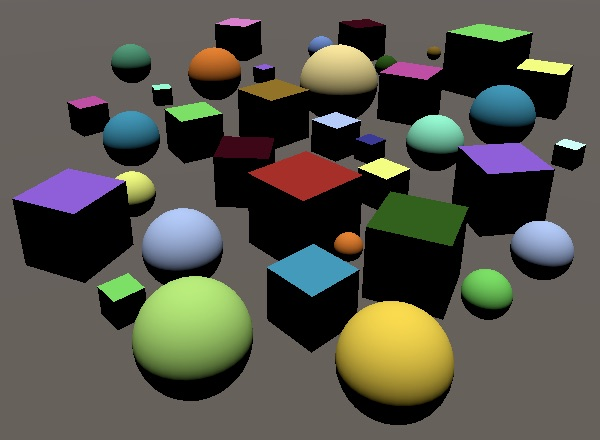
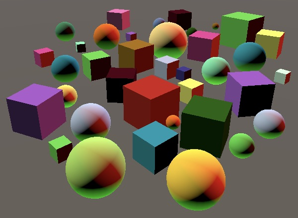

# Unity可编程渲染管线系列（三）光照（单通道 正向渲染）

[原文地址](https://catlikecoding.com/unity/tutorials/scriptable-render-pipeline/lights/)

[译文地址](https://mp.weixin.qq.com/s/rGG_wnDaH--gcj7lmsbwjQ)


> 本文重点:
>
> 1、漫反射着色
> 2、支持方向光、点光源和聚光灯
> 3、每帧允许16个可见光源
> 4、每个对象最多计算四个像素光和四个顶点光

## **1 受光的着色器**

为了支持灯光，我们必须在管线中添加一个照明着色器。照明的复杂性可以从非常简单的（仅包括漫射光）到非常复杂的成熟的基于物理的阴影。或者像卡通渲染一样，它也可以是不真实的。我们将从最小的照明着色器开始，该着色器可用于计算没有阴影的漫反射的定向光。

### **1.1 Lit 着色器**

复制Unlit.hlsl并将其重命名为Lit.hlsl。将新文件中所有unlit的地方替换为Lit，特别是包含定义以及顶点和片段函数名称。

```c
#ifndef MYRP_LIT_INCLUDED
#define MYRP_LIT_INCLUDED

…

VertexOutput LitPassVertex (VertexInput input) {
	…
}

float4 LitPassFragment (VertexOutput input) : SV_TARGET {
	…
}

#endif // MYRP_LIT_INCLUDED
```

复制Unlit.shader并将其重命名为Lit.shader，在新文件中再次将Unlit替换为lit。

```C
Shader "My Pipeline/Lit" {
	
	Properties {
		_Color ("Color", Color) = (1, 1, 1, 1)
	}
	
	SubShader {
		
		Pass {
			HLSLPROGRAM
			
			#pragma target 3.5
			
			#pragma multi_compile_instancing
			#pragma instancing_options assumeuniformscaling
			
			#pragma vertex LitPassVertex
			#pragma fragment LitPassFragment
			
			#include "../ShaderLibrary/Lit.hlsl"
			
			ENDHLSL
		}
	}
}
```

> 不应该要使用一个lit的通道（pass）吗？
>
> 因为我们的管线仍然非常的基础，所以先不管。

现在，我们可以使用新的着色器创建一个受光的不透明材质，尽管它仍然与不受光的变体完全一样。


### **1.2 法线向量**

为了计算定向光的贡献，我们需要知道表面法线。因此，我们必须向顶点输入和输出结构都添加法线向量。有关如何计算照明的详细说明，请参见[Rendering 4, The First Light](https://catlikecoding.com/unity/tutorials/rendering/part-4/)。

```C
struct VertexInput {
	float4 pos : POSITION;
	float3 normal : NORMAL;
	UNITY_VERTEX_INPUT_INSTANCE_ID
};

struct VertexOutput {
	float4 clipPos : SV_POSITION;
	float3 normal : TEXCOORD0;
	UNITY_VERTEX_INPUT_INSTANCE_ID
};
```

在LitPassVertex中将法线从对象空间转换为世界空间。因为我们假设仅使用统一的比例尺，所以我们可以简单地使用模型矩阵的3×3部分，然后在LitPassFragment中对每个片段进行归一化。对非均匀比例尺的支持会需要我们使用转置的世界到对象矩阵。

```C
VertexOutput LitPassVertex (VertexInput input) {
	…
	output.normal = mul((float3x3)UNITY_MATRIX_M, input.normal);
	return output;
}

float4 LitPassFragment (VertexOutput input) : SV_TARGET {
	UNITY_SETUP_INSTANCE_ID(input);
	input.normal = normalize(input.normal);
	…
}
```

为了验证我们最终得到正确的法向矢量，请将它们用作最终颜色。但是仍然要跟踪该材质，因为我们稍后将其用于反照率。

```C
float4 LitPassFragment (VertexOutput input) : SV_TARGET {
	UNITY_SETUP_INSTANCE_ID(input);
	input.normal = normalize(input.normal);
	float3 albedo = UNITY_ACCESS_INSTANCED_PROP(PerInstance, _Color).rgb;
	
	float3 color = input.normal;
	return float4(color, 1);
}
```


### **1.3 漫反射光**

漫射光的贡献取决于光入射到表面的角度，该角度是通过计算表面法线的点积与光的出射方向得出的，从而消除了负的结果。在定向光的情况下，光矢量是恒定的。现在让我们使用一个硬编码的方向，笔直向上。将漫射光与反照率相乘以获得最终颜色。


```C
float4 LitPassFragment (VertexOutput input) : SV_TARGET {
	UNITY_SETUP_INSTANCE_ID(input);
	input.normal = normalize(input.normal);
	float3 albedo = UNITY_ACCESS_INSTANCED_PROP(PerInstance, _Color).rgb;
	
	float3 diffuseLight = saturate(dot(input.normal, float3(0, 1, 0)));
	float3 color = diffuseLight * albedo;
	return float4(color, 1);
}
```



## **2 可见光**

为了能够使用场景中定义的灯光，我们的管线必须将灯光数据发送到GPU。一个场景中可能有多个灯光，因此我们也应该支持多个灯光。有多种方法可以做到这一点。Unity的默认管线针对每个对象在单独的通道中渲染每个灯光。轻量级管线针对每个对象在一次通道中渲染所有灯光。HD管线使用延迟渲染，该渲染将渲染所有对象的表面数据，然后每光源渲染一遍。

我们将使用与“轻量级”管线相同的方法，因此每个对象都要渲染一次，并考虑所有光照。通过发送GPU当前可见的所有灯光的数据来实现。场景中不影响渲染的任何灯光都会被忽略。

### **2.1 光缓冲**

一次渲染所有灯光意味着所有灯光数据必须同时可用。目前仅限于定向光，这意味着我们需要知道每种光的颜色和方向。为了支持任意数量的灯光，我们将使用数组存储此数据，并将其放入一个单独的缓冲区中，该缓冲区名为_LightBuffer。像在C＃中一样，在着色器中定义数组，但方括号在变量名称之后而不是类型后面。

```C
CBUFFER_START(UnityPerDraw)
	float4x4 unity_ObjectToWorld;
CBUFFER_END

CBUFFER_START(_LightBuffer)
	float4 _VisibleLightColors[];
	float4 _VisibleLightDirections[];
CBUFFER_END
```

但是，我们不能任意定义数组的大小。数组定义必须立即声明其大小。让我们使用4的数组长度。这意味着我们可以一次支持多达四个可见光。使用宏定义此限制，以方便参考。

```
#define MAX_VISIBLE_LIGHTS 4

CBUFFER_START(_LightBuffer)
	float4 _VisibleLightColors[MAX_VISIBLE_LIGHTS];
	float4 _VisibleLightDirections[MAX_VISIBLE_LIGHTS];
CBUFFER_END
```

在灯光缓冲区下方，添加一个DiffuseLight函数，该函数使用灯光数据来进行光照计算。它需要一个光索引和法线向量作为参数，从数组中提取相关数据，然后执行漫射照明计算并将其返回，并由光的颜色进行调制。

```C
CBUFFER_START(_LightBuffer)
	float4 _VisibleLightColors[MAX_VISIBLE_LIGHTS];
	float4 _VisibleLightDirections[MAX_VISIBLE_LIGHTS];
CBUFFER_END

float3 DiffuseLight (int index, float3 normal) {
	float3 lightColor = _VisibleLightColors[index].rgb;
	float3 lightDirection = _VisibleLightDirections[index].xyz;
	float diffuse = saturate(dot(normal, lightDirection));
	return diffuse * lightColor;
}
```

在LitPassFragment中，使用for循环对每个光调用一次新函数，从而累积影响片段的总漫射光。

```C
float4 LitPassFragment (VertexOutput input) : SV_TARGET {
	…
	
	float3 diffuseLight = 0;
	for (int i = 0; i < MAX_VISIBLE_LIGHTS; i++) {
		diffuseLight += DiffuseLight(i, input.normal);
	}
	float3 color = diffuseLight * albedo;
	return float4(color, 1);
}
```

请注意，即使使用循环，着色器编译器也可能会将其展开。随着我们的着色器变得越来越复杂，在某些时候编译器将切换为使用实际循环。

### **2.2 填充缓冲区**

现在，我们最终得到了全黑的形状，因为我们还没有将任何灯光数据传递给GPU。向MyPipeline添加相同大小的相同数组。同样，使用静态Shader.PropertyToID方法查找相关着色器属性的标识符。着色器ID在每个会话中都是恒定的，因此可以存储在静态变量中。

```CS
const int maxVisibleLights = 4;

static int visibleLightColorsId = Shader.PropertyToID("_VisibleLightColors");
static int visibleLightDirectionsId = Shader.PropertyToID("_VisibleLightDirections");

Vector4[] visibleLightColors = new Vector4[maxVisibleLights];
Vector4[] visibleLightDirections = new Vector4[maxVisibleLights];
```

通过在命令缓冲区上调用SetGlobalVectorArray方法，然后执行该数组，可以将其复制到GPU。因为我们已经有了cameraBuffer，所以在开始渲染相机示例的同时，使用该缓冲区。

```cs
cameraBuffer.BeginSample("Render Camera");
cameraBuffer.SetGlobalVectorArray(
    visibleLightColorsId, visibleLightColors
);
cameraBuffer.SetGlobalVectorArray(
    visibleLightDirectionsId, visibleLightDirections
);
context.ExecuteCommandBuffer(cameraBuffer);
cameraBuffer.Clear();
```

### **2.3 配置灯光**

现在，我们每帧将光数据发送到GPU，但它仍然是默认数据，因此对象保持黑色。复制矢量之前，我们必须配置灯光。将此责任委托给新的ConfigureLights方法。

```cs
cameraBuffer.ClearRenderTarget(
    (clearFlags & CameraClearFlags.Depth) != 0,
    (clearFlags & CameraClearFlags.Color) != 0,
    camera.backgroundColor
);

ConfigureLights();

cameraBuffer.BeginSample("Render Camera");
```

在剔除期间，Unity还会找出可见的灯光。该信息可通过作为剔除结果一部分的visibleLights列表获得。该列表的元素是VisibleLight结构，其中包含我们需要的所有数据。创建所需的ConfigureLights方法，并使其遍历列表。

```cs
void ConfigureLights () {
    for (int i = 0; i < cull.visibleLights.Count; i++) {
        VisibleLight light = cull.visibleLights[i];
    }
}
```

VisibleLight.finalColor字段保存灯光的颜色。它是灯光的颜色乘以其强度，并转换为正确的色彩空间。因此，我们可以将其直接复制到具有相同索引的visibleLightColors中。

```cs
VisibleLight light = cull.visibleLights[i];
visibleLightColors[i] = light.finalColor;
```

但是，默认情况下，即使我们是在线性空间中工作，Unity也会认为光线的强度是在伽玛空间中定义的。这是Unity默认渲染管线的残留。新管线将其视为线性值。此行为是通过布尔GraphicsSettings.lightsUseLinearIntensity属性控制的。这是一个项目设置，但只能通过代码进行调整。我们只需要设置一次，所以让我们在MyPipeline的构造方法中进行设置。

```cs
public MyPipeline (bool dynamicBatching, bool instancing) {
    GraphicsSettings.lightsUseLinearIntensity = true;
    …
}
```

更改此设置仅会在重新应用其图形设置时影响编辑器，该设置不会自动发生。进入和退出播放模式将应用它。

除此之外，定向光的方向由其旋转确定。光线沿其局部Z轴发光。我们可以通过VisibleLight.localtoWorld矩阵字段在世界空间中找到此向量。该矩阵的第三列定义了转换后的局部Z方向矢量，我们可以通过Matrix4x4.GetColumn方法将索引2作为参数来获取。

这给了我们发出光的方向，但是在着色器中，我们使用了从表面到光源的方向。因此，在将向量分配给visibleLightDirections之前，必须对其求反。由于方向向量的第四个分量始终为零，因此我们只需要取反X，Y和Z。

```cs
VisibleLight light = cull.visibleLights[i];
visibleLightColors[i] = light.finalColor;
Vector4 v = light.localToWorld.GetColumn(2);
v.x = -v.x;
v.y = -v.y;
v.z = -v.z;
visibleLightDirections[i] = v;
```

现在，假设场景中没有其他灯光，我们的对象将使用主方向灯的颜色和方向进行着色。如果场景中没有光源，则只需添加一个定向光即可。


但是，即使场景中只有一个光源，我们的着色器也总是计算四个光源的照明贡献。因此，你可以再添加三盏定向光，并且不会降低GPU的速度。



可以检查通过帧调试器发送到GPU的灯光数据。选择一个使用我们的着色器的DC，然后展开向量数组以查看其内容。


### **2.4 可变的灯光数量**

恰好使用四个定向灯时，一切都按预期工作。其实可以支持更多。但是，当有四个以上的可见光时，我们的管线将发生索引超出范围异常而失败。我们设置最多能支持四个可见光，但是Unity在选择时并未考虑到这一点。因此，visibleLights最终可以包含比数组更多的元素。当我们超过最大值时，必须中止循环。这意味着我们需要忽略一些可见光。

```cs
for (int i = 0; i < cull.visibleLights.Count; i++) {
    if (i == maxVisibleLights) {
        break;
    }
    VisibleLight light = cull.visibleLights[i];
    …
}
```

> 哪些灯会被忽略？
>
> 我们简单地跳过visibleLights列表中的最后一个。根据各种标准对灯光进行排序，包括灯光类型，强度以及是否启用了阴影。可以假设灯光的顺序是从最重要到最不重要。例如，具有最高强度和阴影的定向光将是第一个元素。

当可见光的数量减少时，会发生另一件事。它们会保持可见状态，因为我们没有重置其数据。可以通过在可见光结束后继续循环遍历数组，清除所有未使用的光的颜色来解决此问题。

```cs
int i = 0;
for (; i < cull.visibleLights.Count; i++) {
	…
}
for (; i < maxVisibleLights; i++) {
	visibleLightColors[i] = Color.clear;
}
```

## **3 点光源**

目前，我们仅支持定向光，但是通常场景中只有一个定向光加上其他点光源。尽管我们可以将点光源添加到场景中，但目前Unity仍然将它们解释为定向光。我们现在将解决此问题。


[Rendering 5, Multiple Lights](https://catlikecoding.com/unity/tutorials/rendering/part-5/)描述了点光源和聚光灯，但是使用了Unity默认管线的旧方法。我们将使用与轻量级管线相同的方法。

### **3.1 灯光位置**

与定向光源不同，点光源的位置很重要。与其添加单独的位置数组，不如将方向和位置数据存储在同一数组中，每个元素都包含方向或位置。相应地在MyPipeline中重命名变量。

```cs
static int visibleLightColorsId = Shader.PropertyToID("_VisibleLightColors");
static int visibleLightDirectionsOrPositionsId = Shader.PropertyToID("_VisibleLightDirectionsOrPositions");

Vector4[] visibleLightColors = new Vector4[maxVisibleLights];
Vector4[] visibleLightDirectionsOrPositions = new Vector4[maxVisibleLights];
```

ConfigureLights可以使用VisibleLight.lightType来检查每个灯光的类型。如果是方向灯，则存储方向是正确的。否则，请改为存储灯光的世界位置，该位置可以从其本地到世界矩阵的第四列中提取。

```cs
if (light.lightType == LightType.Directional) {
    Vector4 v = light.localToWorld.GetColumn(2);
    v.x = -v.x;
    v.y = -v.y;
    v.z = -v.z;
	visibleLightDirectionsOrPositions[i] = v;
}
else {
    visibleLightDirectionsOrPositions[i] =
    light.localToWorld.GetColumn(3);
}
```

在着色器中也重命名数组。在DiffuseLight中，首先假设我们仍在处理定向光。

```c
CBUFFER_START(_LightBuffer)
	float4 _VisibleLightColors[MAX_VISIBLE_LIGHTS];
	float4 _VisibleLightDirectionsOrPositions[MAX_VISIBLE_LIGHTS];
CBUFFER_END

float3 DiffuseLight (int index, float3 normal) {
	float3 lightColor = _VisibleLightColors[index].rgb;
	float4 lightPositionOrDirection = _VisibleLightDirectionsOrPositions[index];
	float3 lightDirection = lightPositionOrDirection.xyz;
	float diffuse = saturate(dot(normal, lightDirection));
	return diffuse * lightColor;
}
```

但是，如果要处理点光源，则必须自己计算光源的方向。首先，我们从光照位置减去表面位置，这需要我们向函数添加一个附加参数。它为我们提供了世界空间中的光向量，通过对其进行归一化将其转换为方向。

```c
float3 DiffuseLight (int index, float3 normal, float3 worldPos) {
	float3 lightColor = _VisibleLightColors[index].rgb;
	float4 lightPositionOrDirection = _VisibleLightDirectionsOrPositions[index];
	float3 lightVector =
		lightPositionOrDirection.xyz - worldPos;
	float3 lightDirection = normalize(lightVector);
	float diffuse = saturate(dot(normal, lightDirection));
	return diffuse * lightColor;
}
```

这适用于点光源，但对于定向光源则毫无意义。通过将世界位置乘以灯光方向或位置矢量的W分量，我们可以用相同的计算来支持这两种方法。如果它是位置向量，则W为1，计算不变。但是，如果它是方向矢量，则W为0，并且消除了相减。因此，我们最终对原始方向矢量进行了归一化，这没有什么区别。它确实为定向光引入了不必要的归一化，但是用分支去规避的话是不值得的。

```c
lightPositionOrDirection.xyz - worldPos * lightPositionOrDirection.w;
```

为了完成这项工作，我们需要知道片段在LitPassFragment中的世界空间位置。我们已经在LitPassVertex中拥有它，因此将其添加为附加输出并传递。

```c
struct VertexOutput {
	float4 clipPos : SV_POSITION;
	float3 normal : TEXCOORD0;
	float3 worldPos : TEXCOORD1;
	UNITY_VERTEX_INPUT_INSTANCE_ID
};

VertexOutput LitPassVertex (VertexInput input) {
	…
	output.worldPos = worldPos.xyz;
	return output;
}

float4 LitPassFragment (VertexOutput input) : SV_TARGET {
	…
	
	float3 diffuseLight = 0;
	for (int i = 0; i < MAX_VISIBLE_LIGHTS; i++) {
		diffuseLight += DiffuseLight(i, input.normal, input.worldPos);
	}
	float3 color = diffuseLight * albedo;
	return float4(color, 1);
}
```


### **3.2 距离衰减**

除了定向光（假定无限远）以外，光的强度随距离而减小。关系为 $$\frac{i}{d^2}$$，其中i是光的规定强度，d是光源与表面之间的距离。这被称为平方反比定律。因此，我们必须将最终的漫反射贡献除以光矢量的平方。为了避免被零除，我们对所使用的平方距离强制执行一个极小的最小值。

```c
float diffuse = saturate(dot(normal, lightDirection));
float distanceSqr = max(dot(lightVector, lightVector), 0.00001);
diffuse /= distanceSqr;
return diffuse * lightColor;
```

> 这不是在非常接近点光源的情况下增加强度吗？
>
> 确实，当 d 小于1，光的强度上升。什么时候 d 接近其最小值，强度变得巨大。
>
> Unity的默认管线使用$$\frac{i}{1 + d^2}$$来避免增加亮度，但是不太真实，并且在靠近光线的地方产生的结果太暗。轻量级管线最初使用相同的衰减，但从版本3.3.0开始，它使用正确的平方衰减。
>
> 


由于光矢量与定向光的方向矢量相同，因此平方距离最终为1。这意味着定向光不受距离衰减的影响，这是正确的。

### **3.3 灯光范围**

点光源还具有配置的范围，这限制了它们的影响范围。如果超出此范围，就不会受到光照的影响，但是现在它仍然可以照亮对象。这是不现实的，但可以更好地控制照明并限制受光影响的对象数量。如果没有此范围限制，每盏灯将始终被视为可见光。

范围限制不是突然中断。取而代之的是，光的强度根据平方距离平滑地淡出。轻量级管线和光照贴图器使用$$(1 - (\frac{d^2}{r^2})^2)^2$$，其中r 是灯光的范围。我们将使用相同的渐变曲线。


光照范围是场景数据的一部分，因此我们必须根据灯光的配置将其发送到GPU。我们将为衰减数据使用另一个数组。尽管我们可以使用浮点数组满足要求，但我们将再次使用向量数组，因为稍后需要包含更多数据。

```cs
static int visibleLightColorsId = Shader.PropertyToID("_VisibleLightColors");
static int visibleLightDirectionsOrPositionsId = Shader.PropertyToID("_VisibleLightDirectionsOrPositions");
static int visibleLightAttenuationsId = Shader.PropertyToID("_VisibleLightAttenuations");

Vector4[] visibleLightColors = new Vector4[maxVisibleLights];
Vector4[] visibleLightDirectionsOrPositions = new Vector4[maxVisibleLights];
Vector4[] visibleLightAttenuations = new Vector4[maxVisibleLights];
```

将新向量数组复制到Render中的GPU。

```
cameraBuffer.SetGlobalVectorArray(visibleLightDirectionsOrPositionsId, visibleLightDirectionsOrPositions);
cameraBuffer.SetGlobalVectorArray(visibleLightAttenuationsId, visibleLightAttenuations);
```

并将其填充到ConfigureLights中。定向光没有范围限制，因此可以使用零向量。对于点光源，我们将其范围放在向量的X分量中。但是，我们不直接存储范围，而是通过存储并避免除以零来减少着色器要做的工作。

```cs
Vector4 attenuation = Vector4.zero;
if (light.lightType == LightType.Directional) {
	…
}
else {
    visibleLightDirectionsOrPositions[i] =
    light.localToWorld.GetColumn(3);
    attenuation.x = 1f /
    Mathf.Max(light.range * light.range, 0.00001f);
}
visibleLightAttenuations[i] = attenuation;
```

将新数组添加到着色器，计算由范围引起的渐变，并将其分解为最终的漫反射贡献。

```c
CBUFFER_START(_LightBuffer)
	float4 _VisibleLightColors[MAX_VISIBLE_LIGHTS];
	float4 _VisibleLightDirectionsOrPositions[MAX_VISIBLE_LIGHTS];
	float4 _VisibleLightAttenuations[MAX_VISIBLE_LIGHTS];
CBUFFER_END

float3 DiffuseLight (int index, float3 normal, float3 worldPos) {
	float3 lightColor = _VisibleLightColors[index].rgb;
	float4 lightPositionOrDirection = _VisibleLightDirectionsOrPositions[index];
	float4 lightAttenuation = _VisibleLightAttenuations[index];
	
	float3 lightVector =
		lightPositionOrDirection.xyz - worldPos * lightPositionOrDirection.w;
	float3 lightDirection = normalize(lightVector);
	float diffuse = saturate(dot(normal, lightDirection));
	
	float rangeFade = dot(lightVector, lightVector) * lightAttenuation.x;
	rangeFade = saturate(1.0 - rangeFade * rangeFade);
	rangeFade *= rangeFade;
	
	float distanceSqr = max(dot(lightVector, lightVector), 0.00001);
	diffuse *= rangeFade / distanceSqr;
	
	return diffuse * lightColor;
}
```


再一次，定向光不会受到影响，因为在这种情况下，lightAttenuation.x始终为0，因此rangeFade始终为1。

## **4 聚光灯**

轻量级管线还支持聚光灯，因此我们也将其添加。聚光灯的工作方式类似于点光源，但仅限于圆锥形而不是向各个方向发光。

### **4.1 聚光方向**

像定向光一样，聚光灯沿其局部Z轴发光，但呈圆锥形。而且它还有一个位置，这意味着我们必须同时提供二者数据给聚光灯。因此，向MyPipeline添加一个用于点方向的附加数组。

```cs
static int visibleLightAttenuationsId = Shader.PropertyToID("_VisibleLightAttenuations");
static int visibleLightSpotDirectionsId = Shader.PropertyToID("_VisibleLightSpotDirections");

Vector4[] visibleLightColors = new Vector4[maxVisibleLights];
Vector4[] visibleLightDirectionsOrPositions = new Vector4[maxVisibleLights];
Vector4[] visibleLightAttenuations = new Vector4[maxVisibleLights];
Vector4[] visibleLightSpotDirections = new Vector4[maxVisibleLights];
	
	…
	
void Render (ScriptableRenderContext context, Camera camera) {
        …
            cameraBuffer.SetGlobalVectorArray(
            visibleLightAttenuationsId, visibleLightAttenuations
        );
        cameraBuffer.SetGlobalVectorArray(
            visibleLightSpotDirectionsId, visibleLightSpotDirections
        );
        …
}
```

在ConfigureLights中，当不处理定向光源时，还请检查该光源是否为聚光灯。如果是这样，请像设置定向光一样设置方向矢量，而是将其分配给visibleLightSpotDirections。

```cs
if (light.lightType == LightType.Directional) {
    Vector4 v = light.localToWorld.GetColumn(2);
    v.x = -v.x;
    v.y = -v.y;
    v.z = -v.z;
    visibleLightDirectionsOrPositions[i] = v;
}
else {
    visibleLightDirectionsOrPositions[i] =
        light.localToWorld.GetColumn(3);
    attenuation.x = 1f /
        Mathf.Max(light.range * light.range, 0.00001f);

    if (light.lightType == LightType.Spot) {
        Vector4 v = light.localToWorld.GetColumn(2);
        v.x = -v.x;
        v.y = -v.y;
        v.z = -v.z;
        visibleLightSpotDirections[i] = v;
    }
}
```

也将新数据添加到着色器。

```cs
CBUFFER_START(_LightBuffer)
	float4 _VisibleLightColors[MAX_VISIBLE_LIGHTS];
	float4 _VisibleLightDirectionsOrPositions[MAX_VISIBLE_LIGHTS];
	float4 _VisibleLightAttenuations[MAX_VISIBLE_LIGHTS];
	float4 _VisibleLightSpotDirections[MAX_VISIBLE_LIGHTS];
CBUFFER_END

float3 DiffuseLight (int index, float3 normal, float3 worldPos) {
	float3 lightColor = _VisibleLightColors[index].rgb;
	float4 lightPositionOrDirection = _VisibleLightDirectionsOrPositions[index];
	float4 lightAttenuation = _VisibleLightAttenuations[index];
	float3 spotDirection = _VisibleLightSpotDirections[index].xyz;
	
	…
}
```

### **4.2 角度衰减**

指定聚光灯的圆锥的正角小于180°。我们可以通过获取光点方向和光方向的点积来确定表面点是否位于圆锥内。如果结果最多是配置点角的一半的余弦，则片段受光影响。

圆锥的边缘没有即时截止。取而代之的是，有一个过渡范围，其中光线逐渐消失。该范围可以由开始衰落的内点角和光强度达到零的外点角定义。但是，Unity的聚光灯仅允许我们设置外角。Unity的默认管线使用光cookie来确定衰减，而轻量管线使用平滑函数来计算衰减，该函数假定内角和外角之间具有固定关系。

要确定衰减，请先将聚光灯角度的一半从度转换为弧度，然后计算其余弦。可通过VisibleLight.spotAngle使用已配置的角度。

```cs
if (light.lightType == LightType.Spot) {
    …
    float outerRad = Mathf.Deg2Rad * 0.5f * light.spotAngle;
    float outerCos = Mathf.Cos(outerRad);
}
```

轻量级管线和光映射器通过以下关系定义内角$$tan(r_i)=\frac{46}{64}tan(r_o)$$，其中 ri和 ro是弧度的内，外点角的一半。我们需要使用内角的余弦，所以完整的关系是$$cos(r_i)=cos(arctan(\frac{46}{64}tan(r_o)))$$。

```cs
float outerRad = Mathf.Deg2Rad * 0.5f * light.spotAngle;
float outerCos = Mathf.Cos(outerRad);
float outerTan = Mathf.Tan(outerRad);
float innerCos = Mathf.Cos(Mathf.Atan(((46f / 64f) * outerTan));
```

基于角度的衰减定义为 $$\frac{D_s*D_l - cos(r_o)}{cos(r_i)-cos(r_o)}$$钳位为0–1，然后平方，$$D_s*D_l$$是聚光角度方向和光方向的点积。


该表达式可以简化为$$(D_s * D_l)a+b$$，其中$$a=\frac{1}{cos(r_i) - cos(r_o)}$$，$$b=-cos(r_o)a$$。这使我们可以计算 a 和 b在ConfigureLights中并将它们存储在衰减数据矢量的最后两个分量中。

```cs
float outerRad = Mathf.Deg2Rad * 0.5f * light.spotAngle;
float outerCos = Mathf.Cos(outerRad);
float outerTan = Mathf.Tan(outerRad);
float innerCos = Mathf.Cos(Mathf.Atan(((64f - 18f) / 64f) * outerTan));
float angleRange = Mathf.Max(innerCos - outerCos, 0.001f);
attenuation.z = 1f / angleRange;
attenuation.w = -outerCos * attenuation.z;
```

然后，在着色器中，可以使用点积，乘法，加法，饱和度以及最后的平方来计算点淡入淡出因子。然后使用结果调制漫射光。

```c
float rangeFade = dot(lightVector, lightVector) * lightAttenuation.x;
rangeFade = saturate(1.0 - rangeFade * rangeFade);
rangeFade *= rangeFade;

float spotFade = dot(spotDirection, lightDirection);
spotFade = saturate(spotFade * lightAttenuation.z + lightAttenuation.w);
spotFade *= spotFade;

float distanceSqr = max(dot(lightVector, lightVector), 0.00001);
diffuse *= spotFade * rangeFade / distanceSqr;
```


为了防止点衰减计算影响其他光类型，请将其衰减矢量的W分量设置为1。

> 那区域灯呢？
>
>Unity的轻量级管线和默认管线不支持实时区域照明，我们也不支持。区域灯光仅用于光照贴图，稍后我们将提供支持。

## **5 逐物体光照**


目前，我们每个对象最多支持四盏灯。实际上，即使没有必要，也始终会为每个对象计算四个光源的照明。例如，考虑一个由81个球体构成的9×9网格，在其拐角处有四个点光源。如果设置了这些灯光的范围，以使它们每个都覆盖大约四分之一的网格，那么大多数球体最终只会受到单个灯光的影响，有些受到两个的影响，而有些则没有。


目前，通过一次DC就渲染了这81个球体（假设启用了GPU实例化），但每个球体片段的光贡献计算为四次。如果我们能够以某种方式仅计算每个对象所需的灯光，那会更好。这将使我们还可以增加支持的可见光数量。

### **5.1 灯光索引**

在剔除期间，Unity会确定可见的光，这还涉及找出哪些光会影响哪个对象。我们可以要求Unity以光索引列表的形式将此信息发送到GPU。

Unity当前为light索引支持两种格式。第一种方法是在每个对象设置的两个float4变量中最多存储八个索引。第二种方法是将所有对象的光照索引列表放在单个缓冲区中，类似于存储GPU实例化数据的方式。但是，第二种方法在Unity 2018.3中被禁用，仅支持第一个选项。因此，尽管并不是最好选择，但现在我们也将它限制在第一个选项上。

我们指示Unity通过将绘制设置的rendererConfiguration字段设置为RendererConfiguration.PerObjectLightIndices8来通过float4字段设置灯光索引。

```cs
var drawSettings = new DrawRendererSettings(
	camera, new ShaderPassName("SRPDefaultUnlit")
) {
    flags = drawFlags,
    rendererConfiguration = RendererConfiguration.PerObjectLightIndices8
};
//drawSettings.flags = drawFlags;
drawSettings.sorting.flags = SortFlags.CommonOpaque;
```

现在，Unity必须为每个对象设置其他GPU数据，这会影响GPU实例化。Unity尝试对受相同灯光影响的对象进行分组，但更喜欢根据距离进行分组。同样，根据每个对象的相对光照重要性对光照索引进行排序，这可以进一步拆分批次。在网格示例中，我以30次DC结束，这比1多很多，但仍然比81小得多。

可通过unity_4LightIndices0和unity_4LightIndices1向量使索引可用，它们应该是UnityPerDraw缓冲区的一部分。除此之外，还有unity_LightIndicesOffsetAndCount，另一个float4向量。它的Y分量包含影响对象的灯光数量。它的X分量包含使用第二种方法时的偏移量，因此我们可以忽略它。

```c
CBUFFER_START(UnityPerDraw)
	float4x4 unity_ObjectToWorld;
	float4 unity_LightIndicesOffsetAndCount;
	float4 unity_4LightIndices0, unity_4LightIndices1;
CBUFFER_END
```

现在，我们可以根据需要将自己限制为仅调用DiffuseLight。但是我们必须检索正确的光照指数。由于我们目前最多支持四个可见光，因此我们需要的是unity_4LightIndices0，我们可以将其索引为数组以检索其适当的组件。

```c
for (int i = 0; i < unity_LightIndicesOffsetAndCount.y; i++) {
    int lightIndex = unity_4LightIndices0[i];
    diffuseLight +=
        DiffuseLight(lightIndex, input.normal, input.worldPos);

}
```

尽管应该没有可见的变化（假设最多只有四个可见光），但是GPU现在要做的工作更少了，因为它仅计算相关光的光贡献。你可以使用帧调试器来检查每个绘制调用最终使用了多少灯。着色器确实变得更加复杂，因为我们现在使用的是可变循环而不是固定循环。性能会变的更好还是更差取决于可变数量。我们支持的可见光越多，这种新方法就越好。


请注意，由于我们不再遍历最大可见光，因此不再需要清除最终未使用的光数据。

```cs
void ConfigureLights () {
		//int i = 0;
		for (int i = 0; i < cull.visibleLights.Count; i++) {
			…
		}
		//for (; i < maxVisibleLights; i++) {
		//	visibleLightColors[i] = Color.clear;
		//}
	}
```

### **5.2 多可见光**

我们的新方法可以支持更多可见光，而无需自动增加GPU要做的工作。让我们将限制增加到16，这与轻量级管线使用的限制相同。这就要求我们每帧向GPU发送更多数据，但是大多数对象只会受到少量灯光的影响。在着色器中调整MAX_VISIBLE_LIGHTS。

```c
#define MAX_VISIBLE_LIGHTS 16
```

以及MyPipeline中的maxVisibleLights。

```cs
const int maxVisibleLights = 16;
```

重新编译后，Unity将警告我们我们已经超出了先前的数组大小。不幸的是，不可能仅在着色器中更改固定数组的大小。那是图形API的限制，不是我们可以做的事情。使用新大小之前，必须重新启动应用程序，因此你必须重新启动Unity编辑器。

在继续向场景中添加更多灯光之前，我们必须意识到unity_4LightIndices0最多最多包含四个索引，即使一个对象现在可以受四个以上灯光的影响。为了防止出现错误的结果，我们必须确保灯光循环不超过四个。

```cs
for (int i = 0; i < min(unity_LightIndicesOffsetAndCount.y, 4); i++) {
		int lightIndex = unity_4LightIndices0[i];
		diffuseLight +=
			DiffuseLight(lightIndex, input.normal, input.worldPos);
	}
```


但是我们不必将自己限制在每个对象最多四个光源。还有unity_4LightIndices1，它可以包含另外四个光照索引。让我们简单地在第一个循环之后添加第二个循环，从索引4开始并从unity_4LightIndices1检索光照索引。这样可以将每个对象的最大灯光数量增加到八个。但是，我们应确保不要超过8个，因为物体可能会受到场景中更多灯光的影响。

```cs
for (int i = 0; i < min(unity_LightIndicesOffsetAndCount.y, 4); i++) {
    int lightIndex = unity_4LightIndices0[i];
    diffuseLight +=
        DiffuseLight(lightIndex, input.normal, input.worldPos);
}
for (int i = 4; i < min(unity_LightIndicesOffsetAndCount.y, 8); i++) {
    int lightIndex = unity_4LightIndices1[i - 4];
    diffuseLight +=
        DiffuseLight(lightIndex, input.normal, input.worldPos);
}
```


由于灯光指标是根据相对重要性进行排序的，因此第二个四循环常不如第一个四循环明显。而且，大多数物体不会受到那么多灯光的影响。要查看额外的四个指示灯的区别，可以暂时禁用第一个循环。


### **5.3 顶点光**

由于第二个四重奏在视觉上的重要性可能远小于第一个四重奏，因此我们可以通过计算每个顶点而不是每个光的贡献来降低它们的成本。光的贡献将在顶点之间线性插值，虽然精度不高，但是对于细微的漫射照明是可以接受的，只要光距离与三角形边缘长度相比是相当大的即可。

可以微调我们支持的像素和顶点光的数量，但是我们只需将第二个光照循环移至LitPassVertex，这仅需要调整使用的变量即可。这意味着我们最多支持四个像素灯和四个顶点灯。顶点照明必须添加到VertexOutput中，并用作LitPassFragment中的diffuseLight的初始值。

```c
struct VertexOutput {
	float4 clipPos : SV_POSITION;
	float3 normal : TEXCOORD0;
	float3 worldPos : TEXCOORD1;
	float3 vertexLighting : TEXCOORD2;
	UNITY_VERTEX_INPUT_INSTANCE_ID
};

VertexOutput LitPassVertex (VertexInput input) {
	VertexOutput output;
	UNITY_SETUP_INSTANCE_ID(input);
	UNITY_TRANSFER_INSTANCE_ID(input, output);
	float4 worldPos = mul(UNITY_MATRIX_M, float4(input.pos.xyz, 1.0));
	output.clipPos = mul(unity_MatrixVP, worldPos);
	output.normal = mul((float3x3)UNITY_MATRIX_M, input.normal);
	output.worldPos = worldPos.xyz;
	
	output.vertexLighting = 0;
	for (int i = 4; i < min(unity_LightIndicesOffsetAndCount.y, 8); i++) {
		int lightIndex = unity_4LightIndices1[i - 4];
		output.vertexLighting +=
			DiffuseLight(lightIndex, output.normal, output.worldPos);
	}

	return output;
}

float4 LitPassFragment (VertexOutput input) : SV_TARGET {
	UNITY_SETUP_INSTANCE_ID(input);
	input.normal = normalize(input.normal);
	float3 albedo = UNITY_ACCESS_INSTANCED_PROP(PerInstance, _Color).rgb;
	
	float3 diffuseLight = input.vertexLighting;
	for (int i = 0; i < min(unity_LightIndicesOffsetAndCount.y, 4); i++) {
		…
	}
	//for (int i = 4; i < min(unity_LightIndicesOffsetAndCount.y, 8); i++) {
	//	…
	//}
	float3 color = diffuseLight * albedo;
	return float4(color, 1);
}
```

### **5.4 过多的可见光**

尽管我们现在支持多达16个可见光，但如果场景中有足够的光，我们仍然可以超过该限制。发生这种情况时，渲染时会忽略总体上最不重要的灯光。但是，这仅仅是因为我们没有将其数据复制到着色器。Unity对此一无所知，也没有从每个对象的灯光索引列表中消除这些灯光。因此，我们最终可能会遇到超出范围的光索引。为了防止这种情况，我们必须告诉Unity某些灯已被淘汰。

通过在剔除结果上调用GetLightIndexMap，我们可以获得所有可见光的索引列表。Unity允许我们修改此映射，然后通过SetLightIndexMap将其分配回剔除结果。这样做的目的是Unity将跳过索引已更改为-1的所有灯光。对于超出最大值的所有灯光，请在ConfigureLights末尾执行此操作。

```cs
void ConfigureLights () {
    for (int i = 0; i < cull.visibleLights.Count; i++) {
        …
    }

    int[] lightIndices = cull.GetLightIndexMap();
    for (int i = maxVisibleLights; i < cull.visibleLights.Count; i++) {
        lightIndices[i] = -1;
    }
    cull.SetLightIndexMap(lightIndices);
}
```

当我们最终看到太多可见光时，我们才真正需要这样做，而这并不是所有时间都应该发生的。

```cs
if (cull.visibleLights.Count > maxVisibleLights) {
    int[] lightIndices = cull.GetLightIndexMap();
    for (int i = maxVisibleLights; i < cull.visibleLights.Count; i++) {
        lightIndices[i] = -1;
    }
    cull.SetLightIndexMap(lightIndices);
}
```

不幸的是，GetLightIndexMap在每次调用时都会创建一个新的数组，因此我们的管线现在会在每个帧中分配可见的光，从而分配内存。目前，我们对此无能为力，但是将来的Unity版本将使我们能够使用GetLightIndexMap的无分配替代方案。

### **5.5 0可见光**

另一种可能性是可见光为零。这应该可以正常工作，但是不幸的是，在这种情况下，尝试设置灯光索引时Unity会崩溃。当我们至少有一个可见光时，我们可以通过仅使用每个对象的光索引来避免崩溃。

```cs
var drawSettings = new DrawRendererSettings(
    camera, new ShaderPassName("SRPDefaultUnlit")
) {
    flags = drawFlags//,
        //rendererConfiguration = RendererConfiguration.PerObjectLightIndices8
};
if (cull.visibleLights.Count > 0) {
    drawSettings.rendererConfiguration =
        RendererConfiguration.PerObjectLightIndices8;
}
```

如果没有灯光，我们也可以完全跳过调用ConfigureLights。

```cs
if (cull.visibleLights.Count > 0) {
    ConfigureLights();
}
```

没有由Unity设置灯光数据的副作用是它们保留为最后一个对象设置的值。因此，我们可以得出所有对象的光计数不为零。为了避免这种情况，我们将unity_LightIndicesOffsetAndCount手动设置为零。

```cs
static int lightIndicesOffsetAndCountID =
		Shader.PropertyToID("unity_LightIndicesOffsetAndCount");
	
	…
	
	void Render (ScriptableRenderContext context, Camera camera) {
		…
		
		if (cull.visibleLights.Count > 0) {
			ConfigureLights();
		}
		else {
			cameraBuffer.SetGlobalVector(
				lightIndicesOffsetAndCountID, Vector4.zero
			);
		}

		…
	}
```
