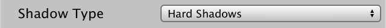
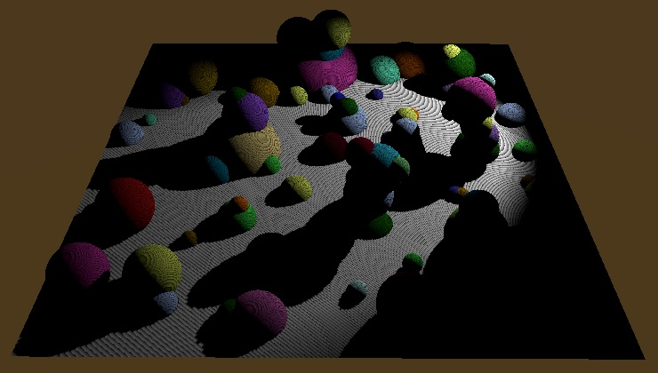
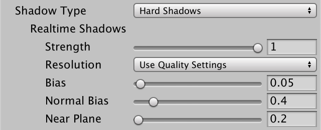
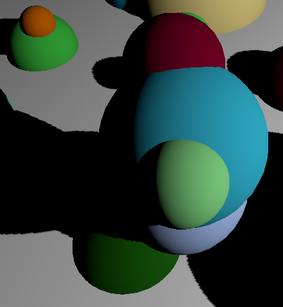

# Unity可编程渲染管线系列（四）聚光灯阴影（阴影贴图）

[原文地址](https://catlikecoding.com/unity/tutorials/scriptable-render-pipeline/spotlight-shadows/)

[译文地址](https://mp.weixin.qq.com/s/lp0airQqIKdxff4p1EZ3VA)


>本文重点：
>
>1、渲染到纹理并从纹理中读取。
>
>2、从灯光角度渲染。
>
>3、为阴影投射器添加着色器通道。
>
>4、采样阴影贴图。
>
>5、支持硬阴影和软阴影的混合。
>
>6、在一个图集中合并多达十六个阴影贴图。

## **1 一个带有阴影的聚光灯**

阴影非常重要，既可以增加真实感，又可以使对象之间的空间关系更加明显。没有阴影，很难分辨是物体漂浮在表面上还是在表面上。

[Rendering 7, Shadows](https://catlikecoding.com/unity/tutorials/rendering/part-7/)教程说明了阴影如何在Unity的默认渲染管线中工作，但是对于我们的单通道正向渲染器，这种完全相同的方法不起作用。但返回阅读以获取阴影贴图的相关知识仍然很有用。在本教程中，我们将仅限于聚光灯的阴影，因为阴影是最不复杂的。

我们首先要一个支持阴影的光，因此要创建一个包含几个对象和一个聚光灯的场景。平面对象对于接收阴影很有用。所有物体都使用我们的不透明Lit材质。


### **1.1 阴影贴图**

有不少处理阴影的方法，但是我们将继续使用阴影贴图的默认方法。这意味着我们将从灯光的角度渲染场景。我们仅对此次渲染的深度信息感兴趣，因为它告诉我们光线在撞击表面之前到达的距离。任何更远的地方都在阴影中。

要使用阴影贴图，我们必须先创建阴影贴图，然后再使用普通相机进行渲染。为了以后能够对阴影贴图进行采样，我们必须渲染为单独的渲染纹理，而不是通常的帧缓冲区。向MyPipeline添加一个RenderTexture字段以保留对阴影贴图纹理的引用。

```cs
RenderTexture shadowMap;
```

使用上下文作为参数，创建一个单独的方法来渲染阴影。它要做的第一件事就是控制渲染纹理。我们将通过调用静态RenderTexture.GetTemporary方法来实现。要么创建新的渲染纹理，要么重新使用尚未清理的旧纹理。因为我们很可能在每帧都需要阴影贴图，所以它会一直重复使用。

向RenderTexture.GetTemporary提供地图的宽度和高度，用于深度通道的位数，最后是纹理格式。我们将从512×512的固定大小开始。深度通道将使用16位，因此它是高精度的。在创建阴影贴图时，请使用RenderTextureFormat.Shadowmap格式。

```cs
void RenderShadows (ScriptableRenderContext context) {
		shadowMap = RenderTexture.GetTemporary(
			512, 512, 16, RenderTextureFormat.Shadowmap
		);
	}
```

确保将纹理的滤镜模式设置为双线性，并将其环绕模式设置为钳制。

```cs
shadowMap = RenderTexture.GetTemporary(
			512, 512, 16, RenderTextureFormat.Shadowmap
		);
shadowMap.filterMode = FilterMode.Bilinear;
shadowMap.wrapMode = TextureWrapMode.Clamp;
```

阴影贴图将在常规场景之前渲染，因此在设置常规摄影机之前但在剔除之后在Render中调用RenderShadows。

```cs
void Render (ScriptableRenderContext context, Camera camera) {
    …
    CullResults.Cull(ref cullingParameters, context, ref cull);
    RenderShadows(context);
    context.SetupCameraProperties(camera);
    …
}
```

另外，请确保在提交上下文后释放渲染纹理。如果此时有阴影贴图，则将其传递到RenderTexture.ReleaseTemporary方法并清除我们的字段。

```cs
void Render (ScriptableRenderContext context, Camera camera) {
    …
    context.Submit();
    if (shadowMap) {
        RenderTexture.ReleaseTemporary(shadowMap);
        shadowMap = null;
    }
}
```

### **1.2 阴影命令缓冲区**

我们将为所有阴影工作使用单独的命令缓冲区，因此我们可以在帧调试器的单独部分中看到阴影和常规渲染。

```cs
CommandBuffer cameraBuffer = new CommandBuffer {
    name = "Render Camera"
};

CommandBuffer shadowBuffer = new CommandBuffer {
    name = "Render Shadows"
};
```

就像我们进行常规渲染一样，阴影渲染将在BeginSample和EndSample命令之间进行。

```cs
void RenderShadows (ScriptableRenderContext context) {
    shadowMap = RenderTexture.GetTemporary(
        512, 512, 16, RenderTextureFormat.Shadowmap
    );
    shadowMap.filterMode = FilterMode.Bilinear;
    shadowMap.wrapMode = TextureWrapMode.Clamp;

    shadowBuffer.BeginSample("Render Shadows");
    context.ExecuteCommandBuffer(shadowBuffer);
    shadowBuffer.Clear();

    shadowBuffer.EndSample("Render Shadows");
    context.ExecuteCommandBuffer(shadowBuffer);
    shadowBuffer.Clear();
}
```

### **1.3 设置 渲染目标**

在渲染阴影之前，我们首先要告诉GPU渲染到阴影贴图。一种方便的方法是通过使用命令缓冲区和阴影贴图作为参数调用CoreUtils.SetRenderTarget。从清除贴图开始，请在BeginSample之前调用它，以便不显示帧调试器和额外的嵌套渲染阴影级别。

```cs
CoreUtils.SetRenderTarget(shadowBuffer, shadowMap);
shadowBuffer.BeginSample("Render Shadows");
context.ExecuteCommandBuffer(shadowBuffer);
shadowBuffer.Clear();
```

我们只关心深度通道，因此仅需要清除该通道。通过将ClearFlag.Depth添加为SetRenderTarget的第三个参数来表明这一点。

```cs
CoreUtils.SetRenderTarget(shadowBuffer, shadowMap,ClearFlag.Depth);
```

尽管不是必需的，但我们也可以更精确地了解纹理的负载和存储要求。我们不在乎它的来源，因为无论如何我们都可以清除它，我们可以使用RenderBufferLoadAction.DontCare指出。这使得基于图块的GPU变得更有效率。而且我们需要稍后从纹理中采样，因此需要将其保存在内存中，我们将使用RenderBufferStoreAction.Store进行指示。将它们添加为第三个和第四个参数。

```cs
CoreUtils.SetRenderTarget(shadowBuffer, shadowMap, RenderBufferLoadAction.DontCare, RenderBufferStoreAction.Store, ClearFlag.Depth);
```

现在，在常规摄影机渲染之前，阴影映射的清除动作会显示在帧调试器中。


### **1.4 配置视图和投影矩阵**

我们的想法是从光源的角度进行渲染，这意味着我们将聚光灯当作照相机使用。因此，必须提供适当的视图和投影矩阵。我们可以通过使用灯光索引作为参数，在剔除结果上调用ComputeSpotShadowMatricesAndCullingPrimitives来检索这些矩阵。由于场景中只有一个聚光灯，因此我们只需提供零即可。视图和投影矩阵可通过两个输出参数使用。除此之外，还有第三个ShadowSplitData输出参数。我们不需要它，必须提供输出参数。

```cs
shadowBuffer.BeginSample("Render Shadows");
context.ExecuteCommandBuffer(shadowBuffer);
shadowBuffer.Clear();

Matrix4x4 viewMatrix, projectionMatrix;
ShadowSplitData splitData;
cull.ComputeSpotShadowMatricesAndCullingPrimitives(
    0, out viewMatrix, out projectionMatrix, out splitData
);
```

一旦有了矩阵，就可以通过调用阴影命令缓冲区上的SetViewProjectionMatrices来设置它们，执行并清除它。

```cs
cull.ComputeSpotShadowMatricesAndCullingPrimitives(0, out viewMatrix, out projectionMatrix, out splitData);
shadowBuffer.SetViewProjectionMatrices(viewMatrix, projectionMatrix);
context.ExecuteCommandBuffer(shadowBuffer);
shadowBuffer.Clear();
```

### **1.5 渲染阴影投射器**

有了正确的矩阵，我们可以继续渲染所有的阴影对象。我们通过在上下文上调用DrawShadows来实现。该方法具有DrawShadowsSettings参考参数，我们可以通过构造函数方法创建该参数，该方法将剔除结果和光照索引作为参数。

```cs
shadowBuffer.SetViewProjectionMatrices(viewMatrix, projectionMatrix);
context.ExecuteCommandBuffer(shadowBuffer);
shadowBuffer.Clear();

var shadowSettings = new DrawShadowsSettings(cull, 0);
context.DrawShadows(ref shadowSettings);
```

仅当我们的聚光灯的阴影类型设置为硬或软时，此方法才有效。如果将其设置为none，则Unity将报错，说它不是有效的阴影投射灯。



## **2 阴影投射器通道**

此时，受光照影响的所有对象都应渲染到阴影贴图中，但是帧调试器告诉我们这没有发生。这是因为DrawShadows使用ShadowCaster着色器通道，而我们的着色器当前没有这样的通道。

### **2.1 阴影包含文件**

要创建阴影投射器通道，请复制Lit.hlsl文件并将其重命名为ShadowCaster.hlsl。我们只关心深度信息，因此请从新文件中删除与片段位置无关的所有内容。片段程序的输出仅为零。还重命名其传递函数，并包括防护定义。

```c
#ifndef MYRP_SHADOWCASTER_INCLUDED
#define MYRP_SHADOWCASTER_INCLUDED

#include "Packages/com.unity.render-pipelines.core/ShaderLibrary/Common.hlsl"

CBUFFER_START(UnityPerFrame)
	float4x4 unity_MatrixVP;
CBUFFER_END

CBUFFER_START(UnityPerDraw)
	float4x4 unity_ObjectToWorld;
CBUFFER_END

#define UNITY_MATRIX_M unity_ObjectToWorld

#include "Packages/com.unity.render-pipelines.core/ShaderLibrary/UnityInstancing.hlsl"

struct VertexInput {
	float4 pos : POSITION;
	UNITY_VERTEX_INPUT_INSTANCE_ID
};

struct VertexOutput {
	float4 clipPos : SV_POSITION;
};

VertexOutput ShadowCasterPassVertex (VertexInput input) {
	VertexOutput output;
	UNITY_SETUP_INSTANCE_ID(input);
	float4 worldPos = mul(UNITY_MATRIX_M, float4(input.pos.xyz, 1.0));
	output.clipPos = mul(unity_MatrixVP, worldPos);
	return output;
}

float4 ShadowCasterPassFragment (VertexOutput input) : SV_TARGET {
	return 0;
}

#endif // MYRP_SHADOWCASTER_INCLUDED
```

这足以渲染阴影，但是阴影投射者有可能与附近的地方相交，从而导致阴影中出现孔洞。为了防止这种情况，我们必须将顶点钳位到顶点程序中的附近。这是通过获取剪辑空间位置的Z坐标和W坐标的最大值来完成的。

```c
output.clipPos = mul(unity_MatrixVP, worldPos);
output.clipPos.z = max(output.clipPos.z, output.clipPos.w);
return output;
```

然而，这由于剪辑空间的细节而变得复杂。最直观的方式是将近裁剪平面处的深度值视为零，并随着距离的增加而增加。但这实际上是除OpenGL API以外的所有方法的反函数，在近平面处该值为1。对于OpenGL，近平面值为-1。我们可以依靠通过Common.hlsl包含的UNITY_REVERSED_Z和UNITY_NEAR_CLIP_VALUE宏来处理所有情况。

```c
//output.clipPos.z = max(output.clipPos.z, output.clipPos.w);
#if UNITY_REVERSED_Z
output.clipPos.z = min(output.clipPos.z, output.clipPos.w * UNITY_NEAR_CLIP_VALUE);
#else
output.clipPos.z = max(output.clipPos.z, output.clipPos.w * UNITY_NEAR_CLIP_VALUE);
#endif
```

### **2.2 第二个通道**

要将ShadowCaster传递添加到我们的Lit着色器中，我们复制它的通道块，并给第二个通道一个Tag块，在其中将LightMode设置为ShadowCaster。然后，使其包含ShadowCaster.hlsl而不是Lit.hlsl，并使用适当的顶点和片段函数。

```c
Pass {
    HLSLPROGRAM

        #pragma target 3.5

        #pragma multi_compile_instancing
        #pragma instancing_options assumeuniformscaling

        #pragma vertex LitPassVertex
        #pragma fragment LitPassFragment

        #include "../ShaderLibrary/Lit.hlsl"

        ENDHLSL
}

Pass {
    Tags {
        "LightMode" = "ShadowCaster"
    }

    HLSLPROGRAM

        #pragma target 3.5

        #pragma multi_compile_instancing
        #pragma instancing_options assumeuniformscaling

        #pragma vertex ShadowCasterPassVertex
        #pragma fragment ShadowCasterPassFragment

        #include "../ShaderLibrary/ShadowCaster.hlsl"

        ENDHLSL
}
```

现在，我们的对象被渲染到阴影贴图中。由于此时对象不受多重光照的影响，因此GPU实例化非常有效。


通过选择Shadows.Draw条目，你可以看到阴影贴图的最终内容。由于它是仅深度的纹理，因此帧调试器将向我们显示深度信息，白色代表近距离而黑色代表远距离。


因为阴影贴图是用聚光灯作为相机渲染的，所以其方向与灯光的方向匹配。如果光线已旋转，因此其局部向上方向在世界空间中指向下方，则阴影贴图也将上下颠倒。

## **3 采样阴影贴图**

此时，我们已经有了一个阴影贴图，其中包含我们需要的所有数据，但是我们尚未使用它。下一步是在以正常方式渲染对象时对阴影贴图进行采样

### **3.1 从世界坐标到阴影坐标**

阴影贴图中存储的深度信息对于渲染贴图时使用的剪辑空间有效。我们将其称为阴影空间。它与我们正常渲染对象时使用的空间不匹配。要知道片段相对于我们存储的阴影深度的位置，我们必须将片段的位置转换为阴影空间。

第一步是使阴影贴图本身可用于我们的着色器。我们通过一个着色器纹理变量来做到这一点，我们将其命名为_ShadowMap。在MyPipeline中跟踪其标识符。

```cs
static int shadowMapId = Shader.PropertyToID("_ShadowMap");
```

通过在最后一次执行阴影命令缓冲区之前调用SetGlobalTexture，在RenderShadows的末尾将阴影映射全局绑定到此变量。

```cs
shadowBuffer.SetGlobalTexture(shadowMapId, shadowMap);
shadowBuffer.EndSample("Render Shadows");
```

接下来，我们将添加一个着色器矩阵变量以将其从世界空间转换为阴影空间，名为_WorldToShadowMatrix。也要跟踪其标识符。

```cs
static int worldToShadowMatrixId = Shader.PropertyToID("_WorldToShadowMatrix");
```

通过将我们在渲染阴影时使用的视图和投影矩阵相乘，然后通过SetGlobalMatrix将其传递到GPU，可以找到此矩阵。

```cs
Matrix4x4 worldToShadowMatrix = projectionMatrix * viewMatrix;
shadowBuffer.SetGlobalMatrix(worldToShadowMatrixId, worldToShadowMatrix);
shadowBuffer.SetGlobalTexture(shadowMapId, shadowMap);
```

但是，基于剪辑空间Z的尺寸是否反转，仍然存在差异，我们可以通过SystemInfo.usesReversedZBuffer进行检查。如果是这样，我们必须在相乘之前否定投影矩阵的Z分量行（索引为2的行）。我们可以通过直接调整矩阵的m20至m23字段来做到这一点。

```cs
if (SystemInfo.usesReversedZBuffer) {
    projectionMatrix.m20 = -projectionMatrix.m20;
    projectionMatrix.m21 = -projectionMatrix.m21;
    projectionMatrix.m22 = -projectionMatrix.m22;
    projectionMatrix.m23 = -projectionMatrix.m23;
}
Matrix4x4 worldToShadowMatrix = projectionMatrix * viewMatrix;
```

现在，我们有了从世界空间到阴影剪辑空间的转换矩阵。但是剪辑空间从-1变为1，而纹理坐标和深度从0变为1。我们可以通过将矩阵与矩阵进行额外的乘法运算，将矩阵范围和维度在所有维度上缩放和偏移一半，从而将变换转换为矩阵。我们可以使用Matrix4x4.TRS方法通过提供偏移，旋转和缩放来获得这样的矩阵。

```cs
var scaleOffset = Matrix4x4.TRS(Vector3.one * 0.5f, Quaternion.identity, Vector3.one * 0.5f);
Matrix4x4 worldToShadowMatrix = scaleOffset * (projectionMatrix * viewMatrix);
```

但是由于它是一个简单的矩阵，所以我们也可以简单地从单位矩阵开始并设置适当的字段。

```cs
var scaleOffset = Matrix4x4.identity;
scaleOffset.m00 = scaleOffset.m11 = scaleOffset.m22 = 0.5f;
scaleOffset.m03 = scaleOffset.m13 = scaleOffset.m23 = 0.5f;
```

### **3.2 采样深度**

在Lit.hlsl中，为灯光数据添加一个缓冲区，并在其中定义float4x4 _WorldToShadowMatrix。

```c
CBUFFER_START(_LightBuffer)
	…
CBUFFER_END

CBUFFER_START(_ShadowBuffer)
	float4x4 _WorldToShadowMatrix;
CBUFFER_END
```

纹理资源不是缓冲区的一部分。相反，它们是分别定义的。在这种情况下，我们可以使用TEXTURE2D_SHADOW宏定义_ShadowMap。

```c
CBUFFER_START(_ShadowBuffer)
	float4x4 _WorldToShadowMatrix;
CBUFFER_END

TEXTURE2D_SHADOW(_ShadowMap);
```

> TEXTURE2D和TEXTURE2D_SHADOW有什么区别？
>
> 仅在OpenGL ES 2.0存在差异，因为它不支持阴影贴图的深度比较。但是我们不支持OpenGL ES 2.0，因此我们可以使用TEXTURE2D。但是可以使用TEXTURE2D_SHADOW来明确表明我们正在处理阴影数据。

这些宏是通过Core库中单独的API包含文件（根据我们通过Common.hlsl包含）在每个目标平台上定义的。

接下来，我们还必须定义用于对纹理进行采样的采样器状态。通常，这是通过SAMPLER宏完成的，但是我们将使用特殊的比较采样器，因此请使用SAMPLER_CMP。为了获得正确的采样器状态，我们必须给它起纹理的名称，并在其前面写上采样器。

```
TEXTURE2D_SHADOW(_ShadowMap);
SAMPLER_CMP(sampler_ShadowMap);
```

> 什么是纹理Sampler？
>
> 在旧的GLSL代码中，我们使用sampler2D一起定义纹理和采样器状态。但是它们是两个独立的事物，并且都占用资源。采样器状态与纹理分开存在，这使得可以混合使用它们，通常重用同一采样器状态从多个纹理中采样。

在本例中，我们通过MyPipeline将采样器状态设置为使用钳位和双线性过滤。

在双线性插值发生之前，我们使用的比较采样器将为我们执行深度比较。与首先插值然后进行比较相比，这产生了更好的结果。

创建一个以世界位置为参数的ShadowAttenuation函数。它将返回光阴影的衰减因子。它需要做的第一件事是将世界位置转换为阴影位置。

```c
TEXTURE2D_SHADOW(_ShadowMap);
SAMPLER_CMP(sampler_ShadowMap);

float ShadowAttenuation (float3 worldPos) {
	float4 shadowPos = mul(_WorldToShadowMatrix, float4(worldPos, 1.0));
}
```

所产生的位置由齐次坐标定义，就像我们转换为剪辑空间时一样。但是我们需要规则的坐标，因此将XYZ分量除以其W分量。

```c
float4 shadowPos = mul(_WorldToShadowMatrix, float4(worldPos, 1.0));
shadowPos.xyz /= shadowPos.w;
```

现在，我们可以使用SAMPLE_TEXTURE2D_SHADOW宏对阴影贴图进行采样。它需要纹理，采样器状态和阴影位置作为参数。当位置的Z值小于阴影贴图中存储的值时，结果为1，这意味着该位置比投射阴影的对象更接近光。否则，它在阴影投射器后面，结果为零。因为采样器在双线性插值之前执行比较，所以阴影的边缘将在阴影贴图纹理之间混合。

```c
shadowPos.xyz /= shadowPos.w;
return SAMPLE_TEXTURE2D_SHADOW(_ShadowMap, sampler_ShadowMap, shadowPos.xyz);
```

### **3.3 阴影淡化**

要影响照明，请在DiffuseLight函数中添加阴影衰减参数。将其与其他淡入淡出因子一起分解为漫射强度。

```c
float3 DiffuseLight (int index, float3 normal, float3 worldPos, float shadowAttenuation) {
	…
	diffuse *= shadowAttenuation * spotFade * rangeFade / distanceSqr;
	return diffuse * lightColor;
}
```

阴影不适用于顶点照明，因此在LitPassVertex中使用1进行阴影衰减。

```c
VertexOutput LitPassVertex (VertexInput input) {
	…
	
	output.vertexLighting = 0;
	for (int i = 4; i < min(unity_LightIndicesOffsetAndCount.y, 8); i++) {
		int lightIndex = unity_4LightIndices1[i - 4];
		output.vertexLighting += 
			DiffuseLight(lightIndex, output.normal, output.worldPos, 1);
	}

	return output;
}
```

在LitPassFragment中，以世界位置作为参数调用ShadowAttenuation，并将结果传递给DiffuseLight。

```c
float4 LitPassFragment (VertexOutput input) : SV_TARGET {
	…
	
	float3 diffuseLight = input.vertexLighting;
	for (int i = 0; i < min(unity_LightIndicesOffsetAndCount.y, 4); i++) {
		int lightIndex = unity_4LightIndices0[i];
		float shadowAttenuation = ShadowAttenuation(input.worldPos);
		diffuseLight += DiffuseLight(lightIndex, input.normal, input.worldPos, shadowAttenuation);
	}
	float3 color = diffuseLight * albedo;
	return float4(color, 1);
}
```



阴影终于出现了，但伴有严重的尖刺。

## **4 阴影设置**

有多种方法可以控制阴影的质量和外观。我们将添加一些支持，特别是阴影分辨率，深度偏差，强度和柔和阴影。这些和更多功能可以通过每个灯的检查器进行配置。



**4.1 阴影贴图大小**

尽管灯光检查器可以选择其阴影分辨率，但这仅间接控制了阴影贴图的大小。实际尺寸至少通过Unity的默认管线通过质量设置来设置。我们使用自己的管线，因此将阴影映射大小配置选项添加到MyPipelineAsset。

阴影贴图是正方形纹理，我们将允许从256×256到4096×.4096的2幂次方大小。若要仅使这些选项可用，请在MyPipelineAsset中定义一个ShadowMapSize枚举，并使用元素256、512、1024、2048和4096。数字不能用于枚举标签，因此请在每个数字前加上下划线。显示枚举的选项时，Unity编辑器将省略下划线。然后使用枚举为阴影贴图大小添加一个配置字段。

```cs
public enum ShadowMapSize {
    _256,
    _512,
    _1024,
    _2048,
    _4096
}

[SerializeField]
ShadowMapSize shadowMapSize;
```

默认情况下，枚举代表整数并从零开始。如果我们的枚举选项直接映射到相同的整数，则可以更加方便，这可以通过为它们分配显式值来实现。

```cs
public enum ShadowMapSize {
    _256 = 256,
    _512 = 512,
    _1024 = 1024,
    _2048 = 2048,
    _4096 = 4096
}
```

这意味着零不是有效的默认值，因此请将默认值设置为其他值。

```cs
ShadowMapSize shadowMapSize = ShadowMapSize._1024;
```


将阴影贴图的大小传递给管线的构造方法，并转换为整数。

```cs
protected override IRenderPipeline InternalCreatePipeline () {
    return new MyPipeline(
        dynamicBatching, instancing, (int)shadowMapSize
    );
}
```

并添加一个字段以跟踪MyPipeline的大小，并在构造函数中对其进行初始化。

```cs
int shadowMapSize;
public MyPipeline (bool dynamicBatching, bool instancing, int shadowMapSize) {
    …
   this.shadowMapSize = shadowMapSize;
}
```

现在，在RenderShadows中获取渲染纹理时，我们将使用可变的阴影贴图大小。

```cs
void RenderShadows (ScriptableRenderContext context) {
    shadowMap = RenderTexture.GetTemporary(shadowMapSize, shadowMapSize, 16, RenderTextureFormat.Shadowmap);
    …
}
```


*Shadow map size 256 and 4096.*

### **4.2 阴影偏差**

阴影尖刺是由阴影贴图的纹理表面凸出引起的。有关更详细的说明，请参见 [Rendering 7, Shadows](https://catlikecoding.com/unity/tutorials/rendering/part-7/)。我们将支持减轻尖刺的最简单方法，即在渲染到阴影贴图时添加一个小的深度偏移。此阴影偏差是针对每个光源配置的，因此我们必须将其发送到GPU。通过_ShadowBias着色器属性进行此操作，因此请跟踪其标识符。

```cs
static int shadowBiasId = Shader.PropertyToID("_ShadowBias");
```

在RenderShadows中设置视图和投影矩阵时，还应设置阴影偏差。VisibleLight结构不包含此信息，但是它确实具有一个光场，该场保存对具有阴影偏差的Light组件的引用。

```cs
shadowBuffer.SetViewProjectionMatrices(viewMatrix, projectionMatrix);
shadowBuffer.SetGlobalFloat(
    shadowBiasId, cull.visibleLights[0].light.shadowBias
);
context.ExecuteCommandBuffer(shadowBuffer);

shadowBuffer.Clear();
```

在阴影投射器缓冲区中，将相应的变量添加到ShadowCaster.hlsl。clamping之前，使用它偏移剪辑空间位置的Z分量。如果Z反转，则应减去偏置，否则将其相加。

```c
CBUFFER_START(_ShadowCasterBuffer)
	float _ShadowBias;
CBUFFER_END

…

VertexOutput ShadowCasterPassVertex (VertexInput input) {
	…
	output.clipPos = mul(unity_MatrixVP, worldPos);
	
	#if UNITY_REVERSED_Z
		output.clipPos.z -= _ShadowBias;
		output.clipPos.z =
			min(output.clipPos.z, output.clipPos.w * UNITY_NEAR_CLIP_VALUE);
	#else
		output.clipPos.z += _ShadowBias;
		output.clipPos.z =
			max(output.clipPos.z, output.clipPos.w * UNITY_NEAR_CLIP_VALUE);
	#endif
	return output;
}
```

阴影偏差应尽可能小，以防止阴影移得太远而导致平移。



*Shadow bias 0.05 and 0.01.*

### **4.3 阴影强度**

由于我们仅使用单个光源并且没有任何环境照明，因此我们的阴影是完全黑色的。但是我们可以调低阴影衰减的强度，使其仅部分减弱光的贡献。就像所有阴影投射器都是半透明的一样。我们将通过_ShadowStrength属性将阴影强度发送到着色器，因此请跟踪其标识符。

```cs
static int shadowStrengthId = Shader.PropertyToID("_ShadowStrength");
```

在对阴影贴图进行采样时会使用阴影强度，因此将其与世界到阴影矩阵和阴影贴图本身一起设置。像深度偏差一样，我们可以从Light组件中检索它。

```cs
shadowBuffer.SetGlobalMatrix(worldToShadowMatrixId, worldToShadowMatrix);
shadowBuffer.SetGlobalTexture(shadowMapId, shadowMap);
shadowBuffer.SetGlobalFloat(
    shadowStrengthId, cull.visibleLights[0].light.shadowStrength
);
shadowBuffer.EndSample("Render Shadows");
```

将阴影强度添加到阴影缓冲区，然后使用它在1和ShadowAttenuation中的采样衰减之间进行插值。

```c
CBUFFER_START(_ShadowBuffer)
	float4x4 _WorldToShadowMatrix;
	float _ShadowStrength;
CBUFFER_END

TEXTURE2D_SHADOW(_ShadowMap);
SAMPLER_CMP(sampler_ShadowMap);

float ShadowAttenuation (float3 worldPos) {
	float4 shadowPos = mul(_WorldToShadowMatrix, float4(worldPos, 1.0));
	shadowPos.xyz /= shadowPos.w;
	float attenuation =
		SAMPLE_TEXTURE2D_SHADOW(_ShadowMap, sampler_ShadowMap, shadowPos.xyz);
	return lerp(1, attenuation, _ShadowStrength);
}
```


*Shadow strength set to 0.5.*

### **4.4 软阴影**

我们将支持的最终设置是在硬阴影和软阴影之间切换。目前正在使用硬阴影，这意味着阴影边缘的唯一平滑是由对阴影贴图进行采样时的双线性插值引起的。启用平滑阴影后，阴影过渡将模糊，表示阴影具有更大的半影。但是，与现实生活不同，半影是均匀的，而不是取决于光源，阴影投射器和阴影接收器之间的空间关系。

通过对阴影贴图进行多次采样来制作柔和的阴影，而距离原始样本位置较远的样本对最终值的贡献较小。我们将使用5×5Tent滤镜，需要9个纹理样本。为此，我们可以使用在核心库的Shadow / ShadowSamplingTent.hlsl包含文件中定义的函数。将其包含在Lit.hlsl中。

```c
#include "Packages/com.unity.render-pipelines.core/ShaderLibrary/Common.hlsl"
#include "Packages/com.unity.render-pipelines.core/ShaderLibrary/Shadow/ShadowSamplingTent.hlsl"
```

>  tent 过滤器如何工作？
>
> Bloom教程涵盖了利用双线性纹理采样的滤镜内核，而Depth of Field教程则包含了一个3×3 tent 滤镜的示例。

 tent 过滤器要求我们知道阴影图的大小。我们将要使用的函数特别需要一个向量，该向量的四个分量中的地图的反转为和高度，正则反转为和高度。因此，将其添加到阴影缓冲区。

```c
CBUFFER_START(_ShadowBuffer)
	float4x4 _WorldToShadowMatrix;
	float _ShadowStrength;
	float4 _ShadowMapSize;
CBUFFER_END
```

跟踪MyPipeline中的相应标识符。

```c
static int shadowMapSizeId = Shader.PropertyToID("_ShadowMapSize");
```

并将其设置在RenderShadows的末尾。

```cs
float invShadowMapSize = 1f / shadowMapSize;
shadowBuffer.SetGlobalVector(shadowMapSizeId, new Vector4(invShadowMapSize, invShadowMapSize, shadowMapSize, shadowMapSize));
shadowBuffer.EndSample("Render Shadows");
```

当定义_SHADOWS_SOFT shader关键字时，我们将用 tent过滤器替换ShadowAttenuation函数中的阴影贴图的常规采样。

```cs
float attenuation = SAMPLE_TEXTURE2D_SHADOW(_ShadowMap, sampler_ShadowMap, shadowPos.xyz);
	
#if defined(_SHADOWS_SOFT)
#endif

return lerp(1, attenuation, _ShadowStrength);
```

我们用累积九个样本来创建5×5 tent 过滤器，来代替一个样本。SampleShadow_ComputeSamples_Tent_5x5函数通过传递阴影贴图大小和阴影位置的XY坐标作为参数，为我们提供了要使用的权重和UV坐标。权重和UV是通过两个输出参数（float数组和float2数组）提供的，两个参数均具有9个元素。

```c
#if defined(_SHADOWS_SOFT)
float tentWeights[9];
float2 tentUVs[9];
SampleShadow_ComputeSamples_Tent_5x5(_ShadowMapSize, shadowPos.xy, tentWeights, tentUVs);
#endif
```

但是，该函数的输出参数使用real而不是float定义。那不是实际的数字类型，而是一个根据需要用于创建浮点数或half变体的宏。我们通常可以忽略这一点，但是为了防止某些平台出现编译器错误，最好也对输出参数使用real。

```c
real tentWeights[9];
real2 tentUVs[9];
```

现在，我们可以使用循环使用数组中的权重和UV坐标对阴影贴图进行九次采样。这是一个紧密的固定循环，因此着色器编译器将展开它。我们仍然需要阴影位置的Z坐标，因此可以使用它为每个阴影样本构造一个float3。

```c
#if defined(_SHADOWS_SOFT)
real tentWeights[9];
real2 tentUVs[9];
SampleShadow_ComputeSamples_Tent_5x5(
    _ShadowMapSize, shadowPos.xy, tentWeights, tentUVs
);
attenuation = 0;
for (int i = 0; i < 9; i++) {
    attenuation += tentWeights[i] * SAMPLE_TEXTURE2D_SHADOW(
        _ShadowMap, sampler_ShadowMap, float3(tentUVs[i].xy, shadowPos.z)
    );
}
#endif
```

要启用柔和阴影，我们必须为定义_SHADOWS_SOFT关键字时创建一个着色器通过变量。这是通过在我们的Lit着色器的默认通道中添加一个多编译编译指示来完成的。我们希望它生成两个变体，一个不带，另一个带定义的关键字。为此，我们编写了一个下划线来表示不带关键字的变体，后跟_SHADOWS_SOFT关键字。

```c
#pragma multi_compile_instancing
#pragma instancing_options assumeuniformscaling

#pragma multi_compile _ _SHADOWS_SOFT
```

最后，我们必须在RenderShadows的结尾根据灯光的shadows属性的值切换关键字。如果将其设置为LightShadows.Soft，则在阴影缓冲区上调用EnableShaderKeyword方法。否则，请调用DisableShaderKeyword。Unity使用关键字state来决定渲染时使用哪个pass变量。

```cs
const string shadowsSoftKeyword = "_SHADOWS_SOFT";

…

    void RenderShadows (ScriptableRenderContext context) {
    …

        if (cull.visibleLights[0].light.shadows == LightShadows.Soft) {
            shadowBuffer.EnableShaderKeyword(shadowsSoftKeyword);
        }
    else {
        shadowBuffer.DisableShaderKeyword(shadowsSoftKeyword);
    }
    shadowBuffer.EndSample("Render Shadows");
    context.ExecuteCommandBuffer(shadowBuffer);
    shadowBuffer.Clear();
}
```

由于基于布尔值切换关键字是很常见的，因此我们也可以使用CoreUtils.SetKeyword方法执行相同的操作。

```cs
//if (cull.visibleLights[0].light.shadows == LightShadows.Soft) {
//	shadowBuffer.EnableShaderKeyword(shadowsSoftKeyword);
//}
//else {
//	shadowBuffer.DisableShaderKeyword(shadowsSoftKeyword);
//}
CoreUtils.SetKeyword(
    shadowBuffer, shadowsSoftKeyword,
    cull.visibleLights[0].light.shadows == LightShadows.Soft
);
```

.png)

*Hard and soft shadows.*

## **5 更多带有阴影的灯光**

到目前为止，我们只使用了一个聚光灯，但是我们的管线最多支持16个灯。我们还应该支持多达16个同时投射阴影的聚光灯。

### **5.1 逐灯光的阴影数据**

如果我们支持多个阴影灯，同时仍要在一次通道中进行所有照明，则必须同时提供所有阴影数据（例如阴影强度）。我们在ConfigureLights中收集此数据，同时也在其中设置其他与灯光相关的数据。因此，将if的调用移到调用RenderShadows之前，并且仅在有可见光的情况下才调用RenderShadows。

```cs
CullResults.Cull(ref cullingParameters, context, ref cull);
if (cull.visibleLights.Count > 0) {
    ConfigureLights();
    RenderShadows(context);
}
else {
    cameraBuffer.SetGlobalVector(
        lightIndicesOffsetAndCountID, Vector4.zero
    );
}
ConfigureLights();

context.SetupCameraProperties(camera);

CameraClearFlags clearFlags = camera.clearFlags;
cameraBuffer.ClearRenderTarget(
    (clearFlags & CameraClearFlags.Depth) != 0,
    (clearFlags & CameraClearFlags.Color) != 0,
    camera.backgroundColor
);

//if (cull.visibleLights.Count > 0) {
//	ConfigureLights();
//}
//else {
//	cameraBuffer.SetGlobalVector(
//		lightIndicesOffsetAndCountID, Vector4.zero
//	);
//}
```

我们将使用4D向量数组来存储阴影数据，每个光源一个元素。像在衰减数据中那样，通过ConfigureLights中的灯光循环时，将每个元素初始化为零。

```cs
Vector4[] shadowData = new Vector4[maxVisibleLights];
	
	…
	
void ConfigureLights () {
        for (int i = 0; i < cull.visibleLights.Count; i++) {
            if (i == maxVisibleLights) {
                break;
            }
            VisibleLight light = cull.visibleLights[i];
            visibleLightColors[i] = light.finalColor;
            Vector4 attenuation = Vector4.zero;
            attenuation.w = 1f;
            Vector4 shadow = Vector4.zero;

            …

                visibleLightAttenuations[i] = attenuation;
            shadowData[i] = shadow;
        }

        …
    }
```

当我们有一个聚光灯时，请获取其Light组件的引用。如果未将其shadows属性设置为LightShadows.None，则将其阴影强度存储在向量的X分量中。

```cs
if (light.lightType == LightType.Spot) {
	…

    Light shadowLight = light.light;
    if (shadowLight.shadows != LightShadows.None) {
    shadow.x = shadowLight.shadowStrength;
    }
}
```

由于每种光源都可以使用硬阴影或软阴影，因此我们将其存储在矢量的Y分量中。柔和阴影使用1，否则使用零。

```cs
if (shadowLight.shadows != LightShadows.None) {
    shadow.x = shadowLight.shadowStrength;
    shadow.y = shadowLight.shadows == LightShadows.Soft ? 1f : 0f;
}
```

### **5.2 包含灯光**

可见光并启用了阴影并不能保证它需要阴影贴图。可能没有阴影投射器或接收器。我们可以通过以光索引为参数在剔除结果上调用GetShadowCasterBounds来检查此情况。它返回是否找到了光源阴影体积的有效边界。如果没有，我们可以跳过设置阴影数据。它还通过输出参数提供阴影边界，即使我们在这里不使用它，我们也必须提供它。

```cs
Light shadowLight = light.light;
Bounds shadowBounds;
if (shadowLight.shadows != LightShadows.None && cull.GetShadowCasterBounds(i, out shadowBounds)) {
    shadow.x = shadowLight.shadowStrength;
    shadow.y = shadowLight.shadows == LightShadows.Soft ? 1f : 0f;
}
```

### **5.3 渲染所有的阴影贴图**

转到RenderShadows，在首次执行阴影缓冲区与设置阴影贴图纹理之间的代码周围添加一个循环。再次，我们遍历所有可见光，超过我们支持的最大光强度则终止。用迭代器变量替换循环中所有硬编码零索引的用法。

```cs
shadowBuffer.BeginSample("Render Shadows");
context.ExecuteCommandBuffer(shadowBuffer);
shadowBuffer.Clear();

for (int i = 0; i < cull.visibleLights.Count; i++) {
    if (i == maxVisibleLights) {
        break;
    }

    Matrix4x4 viewMatrix, projectionMatrix;
    ShadowSplitData splitData;
    cull.ComputeSpotShadowMatricesAndCullingPrimitives(
        i, out viewMatrix, out projectionMatrix, out splitData
    );
    shadowBuffer.SetViewProjectionMatrices(viewMatrix, projectionMatrix);
    shadowBuffer.SetGlobalFloat(
        shadowBiasId, cull.visibleLights[i].light.shadowBias
    );
    context.ExecuteCommandBuffer(shadowBuffer);
    shadowBuffer.Clear();

    var shadowSettings = new DrawShadowsSettings(cull, i);
    context.DrawShadows(ref shadowSettings);

    …
        shadowBuffer.SetGlobalMatrix(
        worldToShadowMatrixId, worldToShadowMatrix
    );
}

shadowBuffer.SetGlobalTexture(shadowMapId, shadowMap);
```

不需要阴影贴图的每个光都应跳过。我们可以使用放置在阴影数据中的阴影强度来确定这一点。如果它等于或小于零（因为那是原始强度，或者我们将其保留为零），则可以使用continue语句直接进入循环的下一个迭代。

```cs
if (i == maxVisibleLights) {
    break;
}
if (shadowData[i].x <= 0f) {
    continue;
}
```

ComputeSpotShadowMatricesAndCullingPrimitives方法返回是否能够生成有用的矩阵。它应该与GetShadowCasterBounds的结果一致，但是要确保将强度设置为零，并在失败时跳过灯光。

```cs
Matrix4x4 viewMatrix, projectionMatrix;
ShadowSplitData splitData;
if (!cull.ComputeSpotShadowMatricesAndCullingPrimitives(i, out viewMatrix, out projectionMatrix, out splitData)) {
    shadowData[i].x = 0f;
    continue;
}
```

当使用不止一个阴影光源时（假设它们的位置能够产生可见的阴影），帧调试器将向我们展示确实确实多次渲染了阴影贴图。


但是，产生的阴影现在是混乱的。我们还有一些事情要做。

### **5.4 使用正确的阴影数据**

现在，我们必须将阴影数据数组发送到GPU，而不是单个阴影强度。在MyPipeline中进行必要的更改。

```cs
//static int shadowStrengthId = Shader.PropertyToID("_ShadowStrength");
static int shadowDataId = Shader.PropertyToID("_ShadowData");

…

    void RenderShadows (ScriptableRenderContext context) {
    …
        //shadowBuffer.SetGlobalFloat(
        //	shadowStrengthId, cull.visibleLights[0].light.shadowStrength
        //);
        shadowBuffer.SetGlobalVectorArray(shadowDataId, shadowData);
    …
}
```

同样，我们需要一个数组来代替一个单一的世界阴影矩阵。将数组填充到RenderShadows中的循环中，然后将数组发送到GPU。

```cs
//static int worldToShadowMatrixId =
//	Shader.PropertyToID("_WorldToShadowMatrix");
static int worldToShadowMatricesId =
    Shader.PropertyToID("_WorldToShadowMatrices");

…

    void RenderShadows (ScriptableRenderContext context) {
    …

        for (int i = 0; i < cull.visibleLights.Count; i++) {
            …
                //Matrix4x4 worldToShadowMatrix =
                //	scaleOffset * (projectionMatrix * viewMatrix);
                //shadowBuffer.SetGlobalMatrix(
                //	worldToShadowMatrixId, worldToShadowMatrix
                //);
                worldToShadowMatrices[i] =
                scaleOffset * (projectionMatrix * viewMatrix);
        }
    shadowBuffer.SetGlobalTexture(shadowMapId, shadowMap);
    shadowBuffer.SetGlobalMatrixArray(
        worldToShadowMatricesId, worldToShadowMatrices
    );
    shadowBuffer.SetGlobalVectorArray(shadowDataId, shadowData);
    …
}
```

在着色器侧，调整阴影缓冲区的内容以匹配。

```c
CBUFFER_START(_ShadowBuffer)
	//float4x4 _WorldToShadowMatrix;
	//float _ShadowStrength;
	float4x4 _WorldToShadowMatrices[MAX_VISIBLE_LIGHTS];
	float4 _ShadowData[MAX_VISIBLE_LIGHTS];
	float4 _ShadowMapSize;
CBUFFER_END
```

ShadowAttenuation函数现在需要一个light index参数，以便可以检索正确的数组元素。另外，请先检查阴影强度是否为正。如果不是，则没有阴影，并立即返回衰减值1。并且，不依赖于_SHADOWS_SOFT关键字，而是基于阴影数据的Y分量进行分支。

```c
float ShadowAttenuation (int index, float3 worldPos) {
	if (_ShadowData[index].x <= 0) {
		return 1.0;
	}
	float4 shadowPos = mul(_WorldToShadowMatrices[index], float4(worldPos, 1.0));
	shadowPos.xyz /= shadowPos.w;
	float attenuation;
	
	if (_ShadowData[index].y == 0) {
		attenuation =
			SAMPLE_TEXTURE2D_SHADOW(_ShadowMap, sampler_ShadowMap, shadowPos.xyz);
	}
	//#if defined(_SHADOWS_SOFT)
	else {
		real tentWeights[9];
		real2 tentUVs[9];
		SampleShadow_ComputeSamples_Tent_5x5(
			_ShadowMapSize, shadowPos.xy, tentWeights, tentUVs
		);
		attenuation = 0;
		for (int i = 0; i < 9; i++) {
			attenuation += tentWeights[i] * SAMPLE_TEXTURE2D_SHADOW(
				_ShadowMap, sampler_ShadowMap, float3(tentUVs[i].xy, shadowPos.z)
			);
		}
	}
	//#endif
	
	return lerp(1, attenuation, _ShadowData[index].x);
}
```

最后，在LitPassFragment中调用ShadowAttenuation时提供灯光索引。

```c
float shadowAttenuation = ShadowAttenuation(lightIndex, input.worldPos);
```

### **5.5 阴影贴图集**

尽管我们现在使用的是正确的阴影数据和矩阵，但是当使用多个阴影光源时，仍然会得出错误的结果。那是因为所有阴影贴图都渲染为相同的纹理，从而产生了没有意义的合并结果。Unity的轻量级管线通过使用阴影贴图集解决了此问题，将渲染纹理划分为正方形平铺，每个带阴影的平铺。我们将使用相同的方法。

> 为什么不使用纹理数组？
>
> 这是可能的，但是不幸的是，对于阴影投射器渲染纹理数组的支持还不够普及。例如，当前它对于Metal可以正常工作，但是OpenGL Core需要将着色器级别定为4.6，并且即使起作用，也会导致Unity记录连续的断言错误流。因此，我们将我们的限制为单个渲染纹理。

当我们支持多达16盏灯时，我们将把单个阴影贴图视为4×4的平铺网格。因此，每个图块的大小等于阴影图的大小除以四。我们必须将渲染限制为该大小的视口，因此必须在RenderShadows的开头以适当的大小创建Rect结构值。

```c
void RenderShadows (ScriptableRenderContext context) {
    float tileSize = shadowMapSize / 4;
    Rect tileViewport = new Rect(0f, 0f, tileSize, tileSize);

    …
}
```

当我们还设置视图和投影矩阵时，通过在阴影命令缓冲区上调用SetViewport来告诉GPU使用视口。

```cs
shadowBuffer.SetViewport(tileViewport);
shadowBuffer.SetViewProjectionMatrices(viewMatrix, projectionMatrix);
```


现在，所有阴影贴图都将渲染到渲染纹理一角的单个图块。下一步是更改每个光源的视口偏移。我们可以从每个图块的X和Y索引得出视口位置。通过使用整数除法将光指数除以四可以找到Y偏移指数。而是通过整数余数运算找到X偏移索引。视口的最终X和Y位置等于这些索引乘以图块大小。

```cs
float tileOffsetX = i % 4;
float tileOffsetY = i / 4;
tileViewport.x = tileOffsetX * tileSize;
tileViewport.y = tileOffsetY * tileSize;

shadowBuffer.SetViewport(tileViewport);
```


使用图集的不利之处在于，在图块边缘进行采样可能会导致两个图块之间的数据插值，这是不正确的。当使用柔和阴影时，情况会变得更糟，因为 tent滤镜会从原始采样位置采样多达四个纹理像素。淡出阴影比混合相邻图块中的数据更好。我们可以通过在图块周围添加一个空边框，指示GPU将数据写入范围限制在比视口小一点的区域来做到这一点。这被称为裁减（scissoring），我们可以通过使用比视口小一点的矩形来调用shadowBuffer.EnableScissorRect来做到这一点。需要四个纹理元素的边界，因此创建另一个矩形，将四个添加到视口的位置，并从其大小中减去八个。

```cs
shadowBuffer.SetViewport(tileViewport);
shadowBuffer.EnableScissorRect(new Rect(
    tileViewport.x + 4f, tileViewport.y + 4f,
    tileSize - 8f, tileSize - 8f
));
```


完成渲染阴影后，我们必须通过调用DisableScissorRect禁用裁减矩形，否则常规渲染也会受到影响。

```cs
shadowBuffer.DisableScissorRect();
shadowBuffer.SetGlobalTexture(shadowMapId, shadowMap);
```

我们要做的最后一件事是调整世界阴影矩阵，以便最终从正确的图块进行采样。这是通过将它们乘以适当缩放和偏移X和Y的矩阵来完成的。着色器不需要知道我们正在使用图集。

```cs
var scaleOffset = Matrix4x4.identity;
scaleOffset.m00 = scaleOffset.m11 = scaleOffset.m22 = 0.5f;
scaleOffset.m03 = scaleOffset.m13 = scaleOffset.m23 = 0.5f;
worldToShadowMatrices[i] =scaleOffset * (projectionMatrix * viewMatrix);

var tileMatrix = Matrix4x4.identity;
tileMatrix.m00 = tileMatrix.m11 = 0.25f;
tileMatrix.m03 = tileOffsetX * 0.25f;
tileMatrix.m13 = tileOffsetY * 0.25f;
worldToShadowMatrices[i] = tileMatrix * worldToShadowMatrices[i];
```


请记住，我们仍然每个对象最多支持四个像素的光源。如果要在平面上照亮第五个聚光灯，则其中一个会变成顶点光，因此平面不会从那里收到阴影。

## **6 动态平铺**

使用阴影贴图集的一个优点是，无论渲染多少阴影贴图，我们始终使用相同的渲染纹理。因此，纹理内存的使用情况是固定的。缩小尺寸是每个光仅使用纹理的一部分，因此最终得到的阴影贴图的有效分辨率低于我们指定的分辨率。我们最终可能会使用大部分纹理。


但如果不是总将纹理分割成十六个图块，我们可以更好地利用它。使用可变的图块大小，具体取决于需要多少个图块。这样，我们可以确保始终至少使用一半的纹理。

### **6.1 计数** **阴影 平铺**

首先，我们需要确定需要多少块瓷砖。可以通过计算在ConfigureLights中遇到多少阴影聚光灯来做到这一点。跟踪字段中的总数，以便以后使用。

```cs
int shadowTileCount;

…

	void ConfigureLights () {
		shadowTileCount = 0;
		for (int i = 0; i < cull.visibleLights.Count; i++) {
			…
			else {
				…

				if (light.lightType == LightType.Spot) {
					…
					if (
						shadowLight.shadows != LightShadows.None &&
						cull.GetShadowCasterBounds(i, out shadowBounds)
					) {
						shadowTileCount += 1;
						shadow.x = shadowLight.shadowStrength;
						shadow.y =
							shadowLight.shadows == LightShadows.Soft ? 1f : 0f;
					}
				}
			}
			…
		}
		…
	}
```

### **6.2 分隔阴影贴图**

接下来，我们将确定如何在RenderShadows的开头拆分阴影贴图。使用整数变量对此进行跟踪。如果我们最多只有一个图块，则根本不需要拆分，因此拆分数量为1。否则，如果我们最多有四个图块，则拆分为2。下一步是最多9个图块 ，分割为3。只有在使用十个或更多图块时，才需要使用分割为4。

```
void RenderShadows (ScriptableRenderContext context) {
		int split;
		if (shadowTileCount <= 1) {
			split = 1;
		}
		else if (shadowTileCount <= 4) {
			split = 2;
		}
		else if (shadowTileCount <= 9) {
			split = 3;
		}
		else {
			split = 4;
		}
		…
	}
```

可以通过将阴影贴图大小除以分割量来找到图块大小。请注意，这是整数除法。在被三除的情况下，这意味着我们最终放弃了预期的分数纹理像素。然后，在这种情况下，使用浮动除法将图块比例变成一个除以分割量。然后，在确定平铺偏移时使用拆分量，在调整世界阴影矩阵时使用平铺比例。

```cs
float tileSize = shadowMapSize / split;
		float tileScale = 1f / split;
		…

		for (int i = 0; i < cull.visibleLights.Count; i++) {
			…

			float tileOffsetX = i % split;
			float tileOffsetY = i / split;
			…
			
			tileMatrix.m00 = tileMatrix.m11 = tileScale;
			tileMatrix.m03 = tileOffsetX * tileScale;
			tileMatrix.m13 = tileOffsetY * tileScale;
			…
		}
```

要将所有阴影贴图打包在可用空间中，仅在用完图块时才必须增加图块索引。因此，请使用单独的变量来跟踪它，而不要依赖于灯光索引。在我们没有跳过的每次迭代结束时增加它。

```cs
int tileIndex = 0;
		for (int i = 0; i < cull.visibleLights.Count; i++) {
			…

			float tileOffsetX = tileIndex % split;
			float tileOffsetY = tileIndex / split;
			…
			tileIndex += 1;
		}
```


### **6.3 平铺为1就相当于没有**

最后，如果最后只剩下一个图块，则根本不需要设置视口和更改剪刀状态。因此，只有在有多个图块时才这样做。

```cs
for (int i = 0; i < cull.visibleLights.Count; i++) {
			…

			if (split > 1) {
				shadowBuffer.SetViewport(tileViewport);
				shadowBuffer.EnableScissorRect(new Rect(
					tileViewport.x + 4f, tileViewport.y + 4f,
					tileSize - 8f, tileSize - 8f
				));
			}
			shadowBuffer.SetViewProjectionMatrices(viewMatrix, projectionMatrix);
			…

			if (split > 1) {
				var tileMatrix = Matrix4x4.identity;
				tileMatrix.m00 = tileMatrix.m11 = tileScale;
				tileMatrix.m03 = tileOffsetX * tileScale;
				tileMatrix.m13 = tileOffsetY * tileScale;
				worldToShadowMatrices[i] = tileMatrix * worldToShadowMatrices[i];
			}
			tileIndex += 1;
		}

		if (split > 1) {
			shadowBuffer.DisableScissorRect();
		}
```

### **6.4 着色器关键字**

现在，我们可以对每个片段最多采样四次阴影，这可以是硬阴影和软阴影的组合。在最坏的情况下，我们有四个柔和的阴影，需要36个阴影样本。但是，我们的着色器中有分支，仅在需要时才对阴影进行采样，这很有效，因为来自同一对象的片段最终以相同的方式分支。但是，我们可以通过区分阴影的不同组合来切换到不太复杂的着色器替代方法。

有四种可能的配置。第一种情况是根本没有阴影。第二种情况是只有硬阴影。第三，只有柔和的阴影。最复杂的情况是硬阴影和软阴影的组合。我们可以使用独立的_SHADOWS_HARD和_SHADOWS_SOFT关键字为所有情况创建着色器变体。

在RenderShadows中，根据阴影数据的Y分量设置为0或1，使用两个布尔变量分别跟踪我们是硬阴影还是软阴影。在循环后使用这些布尔值切换shader关键字。

```
const string shadowsHardKeyword = "_SHADOWS_HARD";
	…
	
	void RenderShadows (ScriptableRenderContext context) {
		…
		
		int tileIndex = 0;
		bool hardShadows = false;
		bool softShadows = false;
		for (int i = 0; i < cull.visibleLights.Count; i++) {
			…
			
			if (shadowData[i].y <= 0f) {
				hardShadows = true;
			}
			else {
				softShadows = true;
			}
		}

		…
		CoreUtils.SetKeyword(shadowBuffer, shadowsHardKeyword, hardShadows);
		CoreUtils.SetKeyword(shadowBuffer, shadowsSoftKeyword, softShadows);
		…
	}
```

现在为_SHADOWS_HARD添加另一个多编译指令到着色器。

```
#pragma multi_compile _ _SHADOWS_HARD
#pragma multi_compile _ _SHADOWS_SOFT
```

在ShadowAttenuation函数中，如果两个关键字均未定义，则从返回1开始。这样可以切断其余功能，从而完全消除阴影。

```c
float ShadowAttenuation (int index, float3 worldPos) {
	#if !defined(_SHADOWS_HARD) && !defined(_SHADOWS_SOFT)
		return 1.0;
	#endif
	if (_ShadowData[index].x <= 0) {
		return 1.0;
	}
	…
}
```

为了使代码更清晰易懂，请将硬阴影和软阴影的采样代码移至其各自的功能。

```c
float HardShadowAttenuation (float4 shadowPos) {
	return SAMPLE_TEXTURE2D_SHADOW(_ShadowMap, sampler_ShadowMap, shadowPos.xyz);
}

float SoftShadowAttenuation (float4 shadowPos) {
	real tentWeights[9];
	real2 tentUVs[9];
	SampleShadow_ComputeSamples_Tent_5x5(
		_ShadowMapSize, shadowPos.xy, tentWeights, tentUVs
	);
	float attenuation = 0;
	for (int i = 0; i < 9; i++) {
		attenuation += tentWeights[i] * SAMPLE_TEXTURE2D_SHADOW(
			_ShadowMap, sampler_ShadowMap, float3(tentUVs[i].xy, shadowPos.z)
		);
	}
	return attenuation;
}

float ShadowAttenuation (int index, float3 worldPos) {
	…
	float attenuation;
	
	if (_ShadowData[index].y == 0) {
		attenuation = HardShadowAttenuation(shadowPos);
	}
	else {
		attenuation = SoftShadowAttenuation(shadowPos);
	}
	
	return lerp(1, attenuation, _ShadowData[index].x);
}
```

现在，我们可以使用关键字为其他三种情况创建代码。只有同时定义了两个关键字，才需要原始分支。

```c
#if defined(_SHADOWS_HARD)
		#if defined(_SHADOWS_SOFT)
			if (_ShadowData[index].y == 0) {
				attenuation = HardShadowAttenuation(shadowPos);
			}
			else {
				attenuation = SoftShadowAttenuation(shadowPos);
			}
		#else
			attenuation = HardShadowAttenuation(shadowPos);
		#endif
	#else
		attenuation = SoftShadowAttenuation(shadowPos);
	#endif
```

最后，如果我们根本不需要阴影图块，则可以完全跳过在MyPipeline.Render中调用RenderShadows。我们甚至不会清除阴影贴图。如果我们跳过它，则必须确保两个影子关键字都被禁用。当没有可见光时，也可以禁用它们。

```c
if (cull.visibleLights.Count > 0) {
			ConfigureLights();
			if (shadowTileCount > 0) {
				RenderShadows(context);
			}
			else {
				cameraBuffer.DisableShaderKeyword(shadowsHardKeyword);
				cameraBuffer.DisableShaderKeyword(shadowsSoftKeyword);
			}
		}
		else {
			cameraBuffer.SetGlobalVector(
				lightIndicesOffsetAndCountID, Vector4.zero
			);
			cameraBuffer.DisableShaderKeyword(shadowsHardKeyword);
			cameraBuffer.DisableShaderKeyword(shadowsSoftKeyword);
		}
```