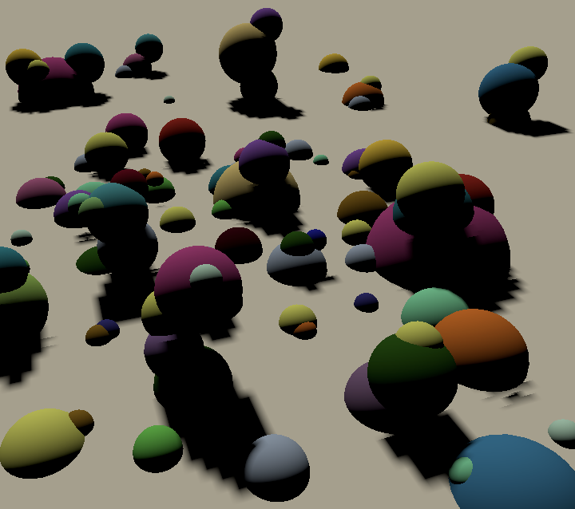
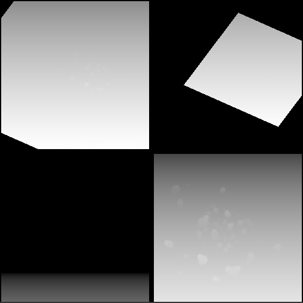
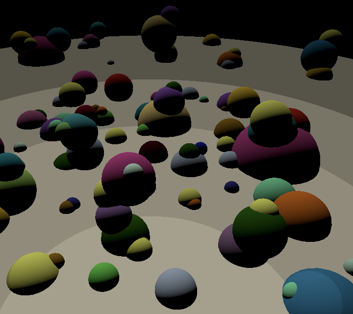

# Unity可编程渲染管线系列（五）方向阴影（级联贴图 Cascaded Maps）

[原文地址](https://catlikecoding.com/unity/tutorials/scriptable-render-pipeline/directional-shadows/)

[译文地址](https://mp.weixin.qq.com/s/mcnaYYGRMM-LGh2Ehr0erQ)

> 本文重点：
>
> 1、支持多个定向光阴影
>
> 2、控制阴影距离
>
> 3、定义分离的主光源
>
> 4、渲染和采样一个级联阴影贴图
>
> 5、让剔除球体生效

## **1 方向光阴影**

从概念上讲，定向灯与聚光灯没有什么不同。它们是相同的，只是无限远。我们对聚光灯阴影使用的方法也适用于它们，但进行了一些调整。我们将增强管线，使其支持可以投射阴影的定向光和聚光灯的混合。

### **1.1 配置阴影**

当前，ConfigureLights仅在聚光灯下处理阴影数据。但是当我们也支持定向阴影时，同一段代码需要使用两次。因此，将相关代码复制到一个单独的方法中，根据灯光索引和阴影灯光进行工作，然后返回阴影数据。

```cs
Vector4 ConfigureShadows (int lightIndex, Light shadowLight) {
		Vector4 shadow = Vector4.zero;
		Bounds shadowBounds;
		if (
			shadowLight.shadows != LightShadows.None &&
			cull.GetShadowCasterBounds(lightIndex, out shadowBounds)
		) {
			shadowTileCount += 1;
			shadow.x = shadowLight.shadowStrength;
			shadow.y =
				shadowLight.shadows == LightShadows.Soft ? 1f : 0f;
		}
		return shadow;
	}
```

在ConfigureLights中为聚光灯使用新方法。

```cs
if (light.lightType == LightType.Spot) {
    …

        //Light shadowLight = light.light;
        //Bounds shadowBounds;
        //if (
        //	shadowLight.shadows != LightShadows.None &&
        //	cull.GetShadowCasterBounds(i, out shadowBounds)
        //) {
        //	…
        //}
        shadow = ConfigureShadows(i, light.light);
}
```

并将其用于定向灯。

```cs
if (light.lightType == LightType.Directional) {
    Vector4 v = light.localToWorld.GetColumn(2);
    v.x = -v.x;
    v.y = -v.y;
    v.z = -v.z;
    visibleLightDirectionsOrPositions[i] = v;
    shadow = ConfigureShadows(i, light.light);
}
```

由于渲染定向阴影贴图时存在一些差异，因此，我们在此处表示正在处理定向光。可以通过将阴影数据的Z分量用作标志来做到这一点。

```cs
shadow = ConfigureShadows(i, light.light);
shadow.z = 1f;
```

### **1.2 渲染阴影**

此时，我们在阴影贴图中为定向光保留了图块，但它仍然没有用，因为RenderShadows正在为聚光灯计算其矩阵。我们只能将ComputeSpotShadowMatricesAndCullingPrimitives用于聚光灯，而必须使用其他方法来计算定向光的矩阵。

首先，从检查是否有有效阴影中拉出对ComputeSpotShadowMatricesAndCullingPrimitives的调用。这样可以更轻松地对定向光进行不同的处理。

```cs
//if (!cull.ComputeSpotShadowMatricesAndCullingPrimitives(
//	i, out viewMatrix, out projectionMatrix, out splitData
//)) {
//	shadowData[i].x = 0f;
//	continue;
//}
bool validShadows;
validShadows = cull.ComputeSpotShadowMatricesAndCullingPrimitives(i, out viewMatrix, out projectionMatrix, out splitData);
if (!validShadows) {
    shadowData[i].x = 0f;
    continue;
}
```

接下来，如果阴影数据指示我们有定向光，则改为调用ComputeDirectionalShadowMatricesAndCullingPrimitives。该方法具有更多参数，因为它允许我们使用阴影级联，在此我们不再做。我们提供的第一个参数是光指数，其次是级联指数和级联数量。现在不使用级联，索引为零，计数为1。之后是一个三分量向量来定义级联拆分，我们将使用（1，0，0）。接下来是图块大小（整数），然后是靠近平面的阴影值，最后是矩阵和拆分数据输出。

```cs
bool validShadows;
if (shadowData[i].z > 0f) {
    validShadows = cull.ComputeDirectionalShadowMatricesAndCullingPrimitives(
        i, 0, 1, Vector3.right, (int)tileSize,
        cull.visibleLights[i].light.shadowNearPlane,
        out viewMatrix, out projectionMatrix, out splitData
    );
}
else {
    validShadows =
        cull.ComputeSpotShadowMatricesAndCullingPrimitives(
        i, out viewMatrix, out projectionMatrix, out splitData
    );
}
if (!validShadows) {
    shadowData[i].x = 0f;
    continue;
}
```

这为我们提供了正确的方向阴影矩阵。除此之外，分割数据还包含有效的剔除范围。这是一个包围所有需要渲染以创建有效方向阴影贴图的对象的球体。这对于定向阴影很有用，与聚光灯不同，它们会影响一切。通过将剔除球分配给阴影设置的分割数据，我们可以使用剔除球来减少必须渲染到阴影贴图中的形状数量。

```cs
var shadowSettings = new DrawShadowsSettings(cull, i);
shadowSettings.splitData.cullingSphere = splitData.cullingSphere;
context.DrawShadows(ref shadowSettings);
```

聚光灯没有有效的剔除球体，但是由于没有效果，我们仍然可以对其进行分配。因此，我们不必在此处区分光源类型。

### **1.3 阴影距离**

现在，我们应该为定向光指定有效的阴影贴图，但是它们似乎是空的，除了可能有一个小点之外。这是因为贴图必须覆盖摄像机可以看到的所有内容，默认情况下，最多可以看到1000个单位，并且由摄像机的远平面控制。无论是否实际存在几何图形，都需要覆盖该区域，因此贴图会拥有一个非常大的比例尺。大幅减少相机的远平面距离将最终使阴影出现。

阴影的渲染距离与相机的远平面无关，这只是默认行为。存在一个阴影距离参数，该距离控制渲染阴影的距离。阴影距离通常比相机的远平面小得多。这既限制了必须渲染的阴影数量，又使定向阴影贴图覆盖较小的区域。

向MyPipeline添加shadow distance字段，该字段是通过其构造函数设置的。从相机中将其提取后，再将其分配给剔除参数。由于渲染阴影超出相机可见的范围没有意义，因此请使用阴影距离和相机远平面中的最小值。

```cs
float shadowDistance;

	public MyPipeline (
		bool dynamicBatching, bool instancing,
		int shadowMapSize, float shadowDistance
	) {
		…
		this.shadowDistance = shadowDistance;
	}

	…

	void Render (ScriptableRenderContext context, Camera camera) {
		ScriptableCullingParameters cullingParameters;
		if (!CullResults.GetCullingParameters(camera, out cullingParameters)) {
			return;
		}
		cullingParameters.shadowDistance =
			Mathf.Min(shadowDistance, camera.farClipPlane);

		…
	}
```

将阴影距离的配置选项添加到MyPipelineAsset，并为其指定一个合理的默认值，例如100。

```cs
[SerializeField]
	float shadowDistance = 100f;

	…
	
	protected override IRenderPipeline InternalCreatePipeline () {
		return new MyPipeline(
			dynamicBatching, instancing, (int)shadowMapSize, shadowDistance
		);
	}
```


### **1.4 调查阴影**

一旦阴影距离已充分减小，定向阴影就会出现了。现在，让我们以很小的距离（例如10）工作。要获得对贴图所覆盖内容的良好印象，请将灯光的阴影偏差设置为零，并使用大平面作为地面。从单个定向灯开始。


*Directional shadows, bias set to zero.*

由于零偏差，以及地面上的自阴影，我们可以大致看到阴影贴图覆盖的区域。与聚光灯阴影不同，定向阴影贴图随摄影机一起移动。同样，阴影贴图的边缘仍然可以超出其范围来影响场景。发生这种情况是因为我们最终采样超出了地图的边缘，从而有效地将其边缘扩展到无穷大。当我们有一个以上的阴影光时，这种拉伸就消失了，因为然后使用剪切清理每个瓦片的边缘。


*Two shadow map tiles, one directional and one spotlight.*

但是，当有多个图块时，我们可能最终会超出定向图块的边界进行采样，并最终从错误的图块进行采样。瓦片越多，效果越差。


*Two directional and one spotlight produce shadow soup.*

### **1.5 钳位阴影平铺**

定向阴影贴图很麻烦，因为无论覆盖什么区域，都需要在各处采样。解决方案是将阴影采样固定在图块上。这是通过将阴影位置转换为0–1范围，缩放并偏移到正确的图块之前，将其阴影位置钳位来完成的。不用钳位的话，可以在MyPipeline中计算整个变换矩阵，但是现在我们必须将图块变换步骤移至着色器。

切片缩放需要切片比例，因此我们必须将其发送到着色器。让我们为此添加一个全局阴影数据向量，也可以使用它稍后存储更多的东西。将其命名为_GlobalShadowData并跟踪其着色器标识符。

```cs
static int globalShadowDataId = Shader.PropertyToID("_GlobalShadowData");
```

将平铺比例尺放在此向量的第一个分量中，并将其设置在RenderShadows中。

```cs
shadowBuffer.BeginSample("Render Shadows");
shadowBuffer.SetGlobalVector(
    globalShadowDataId, new Vector4(tileScale, 0f)
);
context.ExecuteCommandBuffer(shadowBuffer);
shadowBuffer.Clear();
```

着色器还需要知道所有图块的偏移量。我们可以将它们存储在阴影数据向量的ZW分量中。

```cs
float tileOffsetX = tileIndex % split;
float tileOffsetY = tileIndex / split;
tileViewport.x = tileOffsetX * tileSize;
tileViewport.y = tileOffsetY * tileSize;
shadowData[i].z = tileOffsetX * tileScale;
shadowData[i].w = tileOffsetY * tileScale;
```

之后，删除与图块矩阵的乘法。

```cs
worldToShadowMatrices[i] = scaleOffset * (projectionMatrix * viewMatrix);

//if (split > 1) {
//	var tileMatrix = Matrix4x4.identity;
//	tileMatrix.m00 = tileMatrix.m11 = tileScale;
//	tileMatrix.m03 = tileOffsetX * tileScale;
//	tileMatrix.m13 = tileOffsetY * tileScale;
//	worldToShadowMatrices[i] = tileMatrix * worldToShadowMatrices[i];
//}
tileIndex += 1;
```

在着色器端，将全局阴影数据矢量添加到阴影缓冲区。

```c
CBUFFER_START(_ShadowBuffer)
	float4x4 _WorldToShadowMatrices[MAX_VISIBLE_LIGHTS];
	float4 _ShadowData[MAX_VISIBLE_LIGHTS];
	float4 _ShadowMapSize;
	float4 _GlobalShadowData;
CBUFFER_END
```

在ShadowAttenuation中，在透视分割后钳制阴影位置的XY坐标。之后，应用平铺转换。

```c
float4 shadowPos = mul(_WorldToShadowMatrices[index], float4(worldPos, 1.0));
shadowPos.xyz /= shadowPos.w;
shadowPos.xy = saturate(shadowPos.xy);
shadowPos.xy = shadowPos.xy * _GlobalShadowData.x + _ShadowData[index].zw;
```


*No more soup.*

> 透视分区对方向阴影是否有效？
>
> 不需要，因为定向阴影贴图使用正交投影。阴影位置的W分量始终为1。但是，由于我们混合了方向灯贴图和聚光灯贴图，因此我们总是执行除法。

### **1.6 总是使用裁**

当使用多个图块时，我们解决了阴影问题，但是当只有一个方向性阴影贴图处于活动状态时，我们仍然得到了拉伸的阴影贴图边缘。通过始终在RenderShadows中进行裁切来解决该问题。

```cs
for (int i = 0; i < cull.visibleLights.Count; i++) {
    …
        //if (split > 1) {
        shadowBuffer.SetViewport(tileViewport);
    shadowBuffer.EnableScissorRect(new Rect(
        tileViewport.x + 4f, tileViewport.y + 4f,
        tileSize - 8f, tileSize - 8f
    ));
    //}
    …
}

//if (split > 1) {
shadowBuffer.DisableScissorRect();
//}
```


*Single directional light with scissoring.*

### **1.7 基于距离进行阴影裁减**

尽管阴影距离是基于视距的，但阴影超出范围并不会立即消失。这是因为阴影贴图覆盖了拉伸的立方区域。如果部分区域落在阴影距离内，则将完全渲染它们。方向阴影贴图随相机移动，并且其形状最适合阴影距离，因此它们的匹配度非常好。相反，聚光灯阴影体积固定在其光线上。如果即使它们的体积的一小部分都在范围内，则将完全渲染它。结果是单个聚光灯的所有阴影一起出现和消失。

> 有时我会得到聚光灯下阴影的奇怪剪裁？
>
> Unity 2018.3中存在一个错误，该错误会导致阴影距离边缘处的聚光灯阴影发生奇怪的阴影修剪。当使用非常短的阴影距离时，这可能会很严重。在照相机移动过程中，这表现为闪烁或不正确的裁剪。

通过在配置的阴影距离处修剪阴影，可以使阴影的消失更加均匀。为此，我们必须将阴影距离传递给着色器。我们可以将其放在全局阴影数据向量的第二个分量中。当我们使用它进行裁剪时，我们可以通过比较平方距离就足够了，因此可以存储平方距离。

```cs
shadowBuffer.SetGlobalVector(
			globalShadowDataId, new Vector4(
				tileScale, shadowDistance * shadowDistance
			)
		);
```

为了在场景中只有主光源时也可以使用此功能，请在RenderCascadedShadows中设置距离。

```
shadowBuffer.BeginSample("Render Shadows");
		shadowBuffer.SetGlobalVector(
			globalShadowDataId, new Vector4(0f, shadowDistance * shadowDistance)
		);
		context.ExecuteCommandBuffer(shadowBuffer);
```

我们还需要知道相机在着色器中的位置。设置摄像机时，Unity已经提供了此信息。我们要做的就是添加一个带有float3 _WorldSpaceCameraPos变量的UnityPerCamera缓冲区。

```
CBUFFER_START(UnityPerCamera)
	float3 _WorldSpaceCameraPos;
CBUFFER_END
```

创建一个方便的DistanceToCameraSqr函数，该函数会占据世界位置并将距离的平方返回给相机。

```cs
float DistanceToCameraSqr (float3 worldPos) {
	float3 cameraToFragment = worldPos - _WorldSpaceCameraPos;
	return dot(cameraToFragment, cameraToFragment);
}
```

在ShadowAttenuation中调用此功能，检查我们是否超出阴影距离，如果是，则跳过采样阴影。在现有的检查中使用它作为附加条件，这样我们就不会得到额外的分支。

```cs
if (
		_ShadowData[index].x <= 0 ||
		DistanceToCameraSqr(worldPos) > _GlobalShadowData.y
	) {
		return 1.0;
	}
```

现在，所有阴影都在相同距离处被切除，而不仅仅是突然出现或消失。


*Distance clamp, shadow distance 15, without and with bias.*

> 我们不能使阴影平滑消失吗？
>
> 可以通过添加渐变范围并使用线性插值，平滑步长或其他转换函数来实现。

## **2 级联阴影贴图**

阴影贴图的局限性在于它们是纹理，因此具有纹理像素密度。如果纹理像素在视觉上最终过大，则可以增加阴影贴图的分辨率，但这是有限制的。对于仅覆盖较小区域的聚光灯，它可以很好地工作，但是定向灯具有无限的范围。你可能得到这样一个视图，其中远处的阴影看起来很好，但是附近的阴影太块状了。这称为透视锯齿。



我们需要较高分辨率的附近阴影，但是距离较远的阴影很好。理想情况下，我们可以根据距离使用不同的分辨率。该问题的解决方案是为同一定向光渲染多个阴影贴图。每个贴图具有相同的大小，但使用不同的阴影距离。然后，我们将为每个片段选择最佳的贴图。这样，就可以在附近获得更高的分辨率，而在更远的地方获得更低的分辨率，这是对像素的更明智的使用。这些贴图中的每一个都称为阴影级联。

### **2.1 级联数量**

对于阴影级联的数量，Unity始终提供三个选项：零，两个或四个。我们将支持相同的选项。将自定义ShadowCascades枚举配置选项添加到MyPipelineAsset以使其可配置，默认值为4。

```cs
	public enum ShadowCascades {
		Zero = 0,
		Two = 2,
		Four = 4
	}
	
	…
	
	[SerializeField]
	ShadowCascades shadowCascades = ShadowCascades.Four;
```

将阴影选项移至批处理和实例化选项下方，以备将来添加。


### **2.2 级联分割**

Unity还允许你指定级联相对于阴影距离的分布方式。通过将整个阴影范围分为两部分或四部分来完成。对于两个级联，单个值控制拆分发生的位置。在四个级联的情况下，三个分割值存储在一个向量中。我们将再次使用与Unity相同的方法，并使用与轻量级渲染管线相同的默认值。

```cs
	[SerializeField]
	float twoCascadesSplit = 0.25f;

	[SerializeField]
	Vector3 fourCascadesSplit = new Vector3(0.067f, 0.2f, 0.467f);
```

但是Unity不会直接公开这些值。而是显示了一个特殊的GUI控件，使您可以调整级联区域。我们将使用相同的GUI，因此通过将HideInInspector属性附加到拆分字段来隐藏拆分字段。

```cs
	[SerializeField, HideInInspector]
	float twoCascadesSplit = 0.25f;

	[SerializeField, HideInInspector]
	Vector3 fourCascadesSplit = new Vector3(0.067f, 0.2f, 0.467f);
```

创建一个自定义编辑器以显示级联拆分GUI。我们将创建一个非常基本的示例。将其脚本的资产文件放在Editor文件夹中，使其跟踪三个相关属性，并绘制默认检查器。我们还需要使用UnityEditor.Experimental.Rendering命名空间，因为它包含级联拆分GUI的代码。

```cs
using UnityEditor;
using UnityEditor.Experimental.Rendering;
using UnityEngine;

[CustomEditor(typeof(MyPipelineAsset))]
public class MyPipelineAssetEditor : Editor {

	SerializedProperty shadowCascades;
	SerializedProperty twoCascadesSplit;
	SerializedProperty fourCascadesSplit;

	void OnEnable () {
		shadowCascades = serializedObject.FindProperty("shadowCascades");
		twoCascadesSplit = serializedObject.FindProperty("twoCascadesSplit");
		fourCascadesSplit = serializedObject.FindProperty("fourCascadesSplit");
	}

	public override void OnInspectorGUI () {
		DrawDefaultInspector();
	}
}
```

> 自定义编辑器如何工作？
>
> 简而言之，你可以将脚本放在“Editor”文件夹中，使用UnityEditor命名空间，并使它继承自Editor 。为其提供CustomEditor属性，以指示应使用哪种类型。然后，重写OnInspectorGUI方法以绘制其检查器。可以通过调用DrawDefaultInspector来绘制默认检查器。

每个Editor都有一个serializedObject属性，该属性表示正在编辑的内容。可以通过在其上调用FindProperty来从中提取字段，这将返回SerializedProperty引用。这通常是在OnEnable方法中完成的。

使用CoreEditorUtils.DrawCascadeSplitGUI方法绘制所需的内容。它的设计有点怪异。这是一种通用方法，可以在浮点数或向量上使用。第一个用于两分割，第二个用于四分割。相关的序列化属性必须作为参考参数传递。

绘制默认检查器后，使用开关确定我们必须显示的GUI。我们可以为此访问shadowCascades属性的enumValueIndex。它为我们提供了所选枚举选项的索引，而不是实际的枚举值。所以它是0、1或2，而不是0、2或4。在第一种情况下，我们可以停止，而在另外两种情况下，我们可以调用适当的方法。之后，我们必须在序列化的对象上调用ApplyModifiedProperties，以便将用户的更改应用于我们的资产。

```cs
	public override void OnInspectorGUI () {
		DrawDefaultInspector();

		switch (shadowCascades.enumValueIndex) {
			case 0: return;
			case 1:
				CoreEditorUtils.DrawCascadeSplitGUI<float>(ref twoCascadesSplit);
				break;
			case 2:
				CoreEditorUtils.DrawCascadeSplitGUI<Vector3>(
					ref fourCascadesSplit
				);
				break;
		}
		serializedObject.ApplyModifiedProperties();
```


> 当我编辑Split时，为什么天空盒在场景窗口中消失了？
>
> 这是视觉BUG。在编辑器中执行其他操作后刷新场景窗口时，它会自行修复。

MyPipeline只需要知道要使用多少级联以及拆分值是多少。我们可以使用单个3D向量存储两个和四个级联的拆分数据。添加必填字段和构造函数参数。

```cs
	int shadowCascades;
	Vector3 shadowCascadeSplit;

	public MyPipeline (
		bool dynamicBatching, bool instancing,
		int shadowMapSize, float shadowDistance,
		int shadowCascades, Vector3 shadowCascadeSplit
	) {
		…
		this.shadowCascades = shadowCascades;
		this.shadowCascadeSplit = shadowCascadeSplit;
	}
```

当MyPipelineAsset调用管线的构造函数时，哪怕只有两个级联，也必须提供一个分割向量。在两个级联的情况下，单个分割值成为第一个，而其他两个保持零。

```cs
	protected override IRenderPipeline InternalCreatePipeline () {
		Vector3 shadowCascadeSplit = shadowCascades == ShadowCascades.Four ?
			fourCascadesSplit : new Vector3(twoCascadesSplit, 0f);
		return new MyPipeline(
			dynamicBatching, instancing, (int)shadowMapSize, shadowDistance,
			(int)shadowCascades, shadowCascadeSplit
		);
	}
```

### **2.3 只对主方向光使用级联**

我们不支持所有定向光的级联阴影贴图。每盏灯绘制多张贴图并找出要采样的东西并不便宜。因此，我们将自身限制为具有级联阴影贴图的单个定向光。这将是场景中阴影最明亮的定向光。我们将其称为主要光源。所有其他定向光仅获得一个阴影贴图。

主方向灯始终是可见光列表中的第一个元素。我们可以确定第一个光源是否符合ConfigureLights中的条件。如果它是定向的，具有阴影，具有正的阴影强度并且启用了阴影级联，则我们有一个主光源。使用布尔字段跟踪此事实。

```cs
	bool mainLightExists;
	
	…
	
	void ConfigureLights () {
		mainLightExists = false;
		shadowTileCount = 0;
		for (int i = 0; i < cull.visibleLights.Count; i++) {
			…

			if (light.lightType == LightType.Directional) {
				…
				shadow = ConfigureShadows(i, light.light);
				shadow.z = 1f;
				if (i == 0 && shadow.x > 0f && shadowCascades > 0) {
					mainLightExists = true;
				}
			}
			…
		}

		…
	}
```

我们不会尝试将阴影级联贴图与所有其他阴影贴图配合在同一纹理中。如果存在带阴影的多个灯光，那会使它们太小。因此，当遇到主光源时，请减少阴影图块的数量。

```cs
				if (i == 0 && shadow.x > 0f && shadowCascades > 0) {
					mainLightExists = true;
					shadowTileCount -= 1;
				}
```

因此，如果存在主光源，则必须跳过RenderShadows中的第一个光源。

```cs
		for (int i = mainLightExists ? 1 : 0; i < cull.visibleLights.Count; i++) {
			…
		}
```

我们将阴影级联渲染为平铺到单独的阴影贴图，将其命名为_CascadedShadowMap。为其添加标识符和字段，并确保将其与其他阴影贴图一起释放。

```
	static int cascadedShadowMapId = Shader.PropertyToID("_CascadedShadowMap");
	…
	
	RenderTexture shadowMap, cascadedShadowMap;
	
	…
	
	void Render (ScriptableRenderContext context, Camera camera) {
		…

		if (shadowMap) {
			RenderTexture.ReleaseTemporary(shadowMap);
			shadowMap = null;
		}
		if (cascadedShadowMap) {
			RenderTexture.ReleaseTemporary(cascadedShadowMap);
			cascadedShadowMap = null;
		}
	}
```

### **2.4 重用代码**

渲染级联阴影贴图的渲染与我们已经在做的阴影渲染相似，但差异很大，需要使用自己的方法。但是，这两种方法的许多代码都是相同的，因此让我们将这些位移到单独的方法中。

首先是设置阴影的渲染目标。两种方法都相同，我们只需要跟踪具有不同字段的渲染纹理即可。因此，将该代码放在返回对纹理的引用的方法中。无需添加其他阴影配置选项，我们将对两个贴图使用相同的大小。如果要为级联阴影贴图的大小包括一个单独的控件，则可以在此方法中添加一个size参数。

```cs
	RenderTexture SetShadowRenderTarget () {
		RenderTexture texture = RenderTexture.GetTemporary(
			shadowMapSize, shadowMapSize, 16, RenderTextureFormat.Shadowmap
		);
		texture.filterMode = FilterMode.Bilinear;
		texture.wrapMode = TextureWrapMode.Clamp;

		CoreUtils.SetRenderTarget(
			shadowBuffer, texture,
			RenderBufferLoadAction.DontCare, RenderBufferStoreAction.Store,
			ClearFlag.Depth
		);
		return texture;
	}
```

其次是配置阴影图块。确定偏移量，设置视口和进行剪裁都可以放在一起。瓦片偏移可以作为2D向量返回。

```cs
	Vector2 ConfigureShadowTile (int tileIndex, int split, float tileSize) {
		Vector2 tileOffset;
		tileOffset.x = tileIndex % split;
		tileOffset.y = tileIndex / split;
		var tileViewport = new Rect(
			tileOffset.x * tileSize, tileOffset.y * tileSize, tileSize, tileSize
		);
		shadowBuffer.SetViewport(tileViewport);
		shadowBuffer.EnableScissorRect(new Rect(
			tileViewport.x + 4f, tileViewport.y + 4f,
			tileSize - 8f, tileSize - 8f
		));
		return tileOffset;
	}
```

第三，计算阴影世界矩阵也可以采用其自己的方法。将视图和投影矩阵定义为参考参数，因此不需要复制它们。同样，将世界阴影矩阵作为输出参数。

```cs
	void CalculateWorldToShadowMatrix (
		ref Matrix4x4 viewMatrix, ref Matrix4x4 projectionMatrix,
		out Matrix4x4 worldToShadowMatrix
	) {
		if (SystemInfo.usesReversedZBuffer) {
			projectionMatrix.m20 = -projectionMatrix.m20;
			projectionMatrix.m21 = -projectionMatrix.m21;
			projectionMatrix.m22 = -projectionMatrix.m22;
			projectionMatrix.m23 = -projectionMatrix.m23;
		}
		var scaleOffset = Matrix4x4.identity;
		scaleOffset.m00 = scaleOffset.m11 = scaleOffset.m22 = 0.5f;
		scaleOffset.m03 = scaleOffset.m13 = scaleOffset.m23 = 0.5f;
		worldToShadowMatrix =
			scaleOffset * (projectionMatrix * viewMatrix);
	}
```

最后，调整RenderShadows，以便利用这些新方法。

```cs
	void RenderShadows (ScriptableRenderContext context) {
		…
		//Rect tileViewport = new Rect(0f, 0f, tileSize, tileSize);

		//shadowMap = RenderTexture.GetTemporary(
		//	shadowMapSize, shadowMapSize, 16, RenderTextureFormat.Shadowmap
		//);
		//shadowMap.filterMode = FilterMode.Bilinear;
		//shadowMap.wrapMode = TextureWrapMode.Clamp;

		//CoreUtils.SetRenderTarget(
		//	…
		//);
		shadowMap = SetShadowRenderTarget();
		shadowBuffer.BeginSample("Render Shadows");
		…
		for (int i = mainLightExists ? 1 : 0; i < cull.visibleLights.Count; i++) {
			…

			Vector2 tileOffset = ConfigureShadowTile(tileIndex, split, tileSize);
			//float tileOffsetX = tileIndex % split;
			//float tileOffsetY = tileIndex / split;
			//tileViewport.x = tileOffsetX * tileSize;
			//tileViewport.y = tileOffsetY * tileSize;
			shadowData[i].z = tileOffset.x * tileScale;
			shadowData[i].w = tileOffset.y * tileScale;
			//shadowBuffer.SetViewport(tileViewport);
			//shadowBuffer.EnableScissorRect(new Rect(
			…
			//));
			shadowBuffer.SetViewProjectionMatrices(viewMatrix, projectionMatrix);
			…
			context.DrawShadows(ref shadowSettings);

			//if (SystemInfo.usesReversedZBuffer) {
			//	…
			//}
			//…
			//worldToShadowMatrices[i] =
			//	scaleOffset * (projectionMatrix * viewMatrix);
			CalculateWorldToShadowMatrix(
				ref viewMatrix, ref projectionMatrix, out worldToShadowMatrices[i]
			);

			…
		}
```

### **2.5 渲染级联**

级联的世界阴影矩阵需要存储在它们自己的数组中，因此要为其添加标识符和字段。由于我们最多有四个级联，因此数组的长度为四个。

```cs
	static int worldToShadowCascadeMatricesId =
		Shader.PropertyToID("_WorldToShadowCascadeMatrices");
	…
	Matrix4x4[] worldToShadowCascadeMatrices = new Matrix4x4[4];
```

创建一个新的RenderCascadedShadows，它可以作为RenderShadows的副本开始。最终变得更简单，因为我们不必担心聚光灯，只需要使用第一个灯光即可。我们不必处理每个光的阴影数据，并且级联始终有效。我们有两个或四个级联，因此总是将地图切成四个图块。

现在，当调用ComputeDirectionalShadowMatricesAndCullingPrimitives时，我们将0用作灯光索引，将插值器用作级联索引。我们还为它提供了实际的级联数量和拆分向量。

最后，我们将再次烘焙世界到阴影矩阵中的图块转换。确保我们留在图块边界内是在着色器中选择正确的层叠的一部分。

```cs
	void RenderCascadedShadows (ScriptableRenderContext context) {
		float tileSize = shadowMapSize / 2;
		cascadedShadowMap = SetShadowRenderTarget();
		shadowBuffer.BeginSample("Render Shadows");
		context.ExecuteCommandBuffer(shadowBuffer);
		shadowBuffer.Clear();
		Light shadowLight = cull.visibleLights[0].light;
		shadowBuffer.SetGlobalFloat(
			shadowBiasId, shadowLight.shadowBias
		);
		var shadowSettings = new DrawShadowsSettings(cull, 0);
		var tileMatrix = Matrix4x4.identity;
		tileMatrix.m00 = tileMatrix.m11 = 0.5f;

		for (int i = 0; i < shadowCascades; i++) {
			Matrix4x4 viewMatrix, projectionMatrix;
			ShadowSplitData splitData;
			cull.ComputeDirectionalShadowMatricesAndCullingPrimitives(
				0, i, shadowCascades, shadowCascadeSplit, (int)tileSize,
				shadowLight.shadowNearPlane,
				out viewMatrix, out projectionMatrix, out splitData
			);

			Vector2 tileOffset = ConfigureShadowTile(i, 2, tileSize);
			shadowBuffer.SetViewProjectionMatrices(viewMatrix, projectionMatrix);
			context.ExecuteCommandBuffer(shadowBuffer);
			shadowBuffer.Clear();
			
			shadowSettings.splitData.cullingSphere = splitData.cullingSphere;
			context.DrawShadows(ref shadowSettings);
			CalculateWorldToShadowMatrix(
				ref viewMatrix, ref projectionMatrix
				out worldToShadowCascadeMatrices[i]
			);
			tileMatrix.m03 = tileOffset.x * 0.5f;
			tileMatrix.m13 = tileOffset.y * 0.5f;
			worldToShadowCascadeMatrices[i] =
				tileMatrix * worldToShadowCascadeMatrices[i];
		}

		shadowBuffer.DisableScissorRect();
		shadowBuffer.SetGlobalTexture(cascadedShadowMapId, cascadedShadowMap);
		shadowBuffer.SetGlobalMatrixArray(
			worldToShadowCascadeMatricesId, worldToShadowCascadeMatrices
		);
		shadowBuffer.EndSample("Render Shadows");
		context.ExecuteCommandBuffer(shadowBuffer);
		shadowBuffer.Clear();
	}
```

如果有主光源，请在ConfigureLights之后调用此方法。

```cs
		if (cull.visibleLights.Count > 0) {
			ConfigureLights();
			if (mainLightExists) {
				RenderCascadedShadows(context);
			}
			if (shadowTileCount > 0) {
				RenderShadows(context);
			}
			else {
				cameraBuffer.DisableShaderKeyword(shadowsHardKeyword);
				cameraBuffer.DisableShaderKeyword(shadowsSoftKeyword);
			}
		}
```

现在，我们可以使用1，2或0个渲染纹理结束。如果只有主光源，则我们仅渲染到级联阴影贴图。如果还有带有阴影的其他光源，那么我们也将渲染到常规阴影贴图。或者我们有阴影但没有主光源，在这种情况下，我们仅渲染到常规阴影贴图。帧调试器会将两个“Render Shadows”部分合并为一个。


如果通过帧调试器检查级联阴影贴图，你会看到它包含四个图块。瓦片中可见的内容取决于阴影距离和级联拆分。在默认的四个级联拆分的情况下，需要大的阴影距离，以便任何东西出现在第一个级联中



### **2.6 采样阴影贴图**

要使用着色器中的级联阴影贴图，我们需要做一些事情。首先，我们必须知道贴图正在使用中，可以通过着色器关键字进行控制。我们使用两个来区分硬和软级联阴影，避免在着色器中出现分支。

```cs
	const string cascadedShadowsHardKeyword = "_CASCADED_SHADOWS_HARD";
	const string cascadedShadowsSoftKeyword = "_CASCADED_SHADOWS_SOFT";
```

接下来，我们还需要知道贴图的大小和阴影强度。虽然我们可以使用_ShadowMapSize，但还是使用单独的_CascadedShadowMapSize向量，以便着色器支持单独的大小。

```cs
	static int cascadedShadowMapSizeId =
		Shader.PropertyToID("_CascadedShadowMapSize");
	static int cascadedShadoStrengthId =
		Shader.PropertyToID("_CascadedShadowStrength");
```

在RenderCascadedShadows的末尾设置这些值和关键字。

```cs
		shadowBuffer.SetGlobalMatrixArray(
			worldToShadowCascadeMatricesId, worldToShadowCascadeMatrices
		);
		float invShadowMapSize = 1f / shadowMapSize;
		shadowBuffer.SetGlobalVector(
			cascadedShadowMapSizeId, new Vector4(
				invShadowMapSize, invShadowMapSize, shadowMapSize, shadowMapSize
			)
		);
		shadowBuffer.SetGlobalFloat(
			cascadedShadoStrengthId, shadowLight.shadowStrength
		);
		bool hard = shadowLight.shadows == LightShadows.Hard;
		CoreUtils.SetKeyword(shadowBuffer, cascadedShadowsHardKeyword, hard);
		CoreUtils.SetKeyword(shadowBuffer, cascadedShadowsSoftKeyword, !hard);
		shadowBuffer.EndSample("Render Shadows");
```

当未调用RenderCascadedShadow时，也请禁用级联的阴影关键字。

```cs
		if (cull.visibleLights.Count > 0) {
			ConfigureLights();
			if (mainLightExists) {
				RenderCascadedShadows(context);
			}
			else {
				cameraBuffer.DisableShaderKeyword(cascadedShadowsHardKeyword);
				cameraBuffer.DisableShaderKeyword(cascadedShadowsSoftKeyword);
			}
			if (shadowTileCount > 0) {
				RenderShadows(context);
			}
			else {
				cameraBuffer.DisableShaderKeyword(shadowsHardKeyword);
				cameraBuffer.DisableShaderKeyword(shadowsSoftKeyword);
			}
		}
		else {
			cameraBuffer.SetGlobalVector(
				lightIndicesOffsetAndCountID, Vector4.zero
			);
			cameraBuffer.DisableShaderKeyword(cascadedShadowsHardKeyword);
			cameraBuffer.DisableShaderKeyword(cascadedShadowsSoftKeyword);
			cameraBuffer.DisableShaderKeyword(shadowsHardKeyword);
			cameraBuffer.DisableShaderKeyword(shadowsSoftKeyword);
		}
```

为级联的shadow关键字向Lit着色器添加单个multi-compile指令。共有三个选项：no, hard, soft 级联阴影。

```c
			#pragma multi_compile _ _CASCADED_SHADOWS_HARD _CASCADED_SHADOWS_SOFT
			#pragma multi_compile _ _SHADOWS_HARD
			#pragma multi_compile _ _SHADOWS_SOFT
```

之后，将所需的变量添加到阴影缓冲区，并定义级联的阴影贴图纹理和采样器。

```c
CBUFFER_START(_ShadowBuffer)
	float4x4 _WorldToShadowMatrices[MAX_VISIBLE_LIGHTS];
	float4x4 _WorldToShadowCascadeMatrices[4];
	float4 _ShadowData[MAX_VISIBLE_LIGHTS];
	float4 _ShadowMapSize;
	float4 _CascadedShadowMapSize;
	float4 _GlobalShadowData;
	float _CascadedShadowStrength;
CBUFFER_END

TEXTURE2D_SHADOW(_ShadowMap);
SAMPLER_CMP(sampler_ShadowMap);

TEXTURE2D_SHADOW(_CascadedShadowMap);
SAMPLER_CMP(sampler_CascadedShadowMap);
```

让我们通过添加一个布尔参数来指示是否要对级联进行采样，使HardShadowAttenuation与两个贴图一起使用，默认值为false。使用它来决定使用哪种纹理和采样器。我们将对级联参数进行硬编码，因此它不会导致着色器分支。

```c
float HardShadowAttenuation (float4 shadowPos, bool cascade = false) {
	if (cascade) {
		return SAMPLE_TEXTURE2D_SHADOW(
			_CascadedShadowMap, sampler_CascadedShadowMap, shadowPos.xyz
		);
	}
	else {
		return SAMPLE_TEXTURE2D_SHADOW(
			_ShadowMap, sampler_ShadowMap, shadowPos.xyz
		);
	}
}
```

给予SoftShadowAttenuation相同的处理。在这种情况下，选择正确的阴影贴图大小即可。我们可以在此处调用HardShadowAttenuation，因此我们不必再次编写相同的代码。

```c
float SoftShadowAttenuation (float4 shadowPos, bool cascade = false) {
	real tentWeights[9];
	real2 tentUVs[9];
	float4 size = cascade ? _CascadedShadowMapSize : _ShadowMapSize;
	SampleShadow_ComputeSamples_Tent_5x5(
		size, shadowPos.xy, tentWeights, tentUVs
	);
	float attenuation = 0;
	for (int i = 0; i < 9; i++) {
		//attenuation += tentWeights[i] * SAMPLE_TEXTURE2D_SHADOW(
		//	_ShadowMap, sampler_ShadowMap, float3(tentUVs[i].xy, shadowPos.z)
		//);
		attenuation += tentWeights[i] * HardShadowAttenuation(
			float4(tentUVs[i].xy, shadowPos.z, 0), cascade
		);
	}
	return attenuation;
}
```

现在添加一个CascadedShadowAttenuation函数，它是ShadowAttenuation的简单版本。如果没有级联，则衰减始终为1。否则，计算阴影位置并获取硬阴影或软阴影衰减并应用阴影强度。在这一点上，我们将不会根据距离裁剪阴影。


首先始终使用第三个阴影级联贴图，因此使用2索引_WorldToShadowCascadeMatrices数组。这样一来，假设你使用的是四个级联，最有可能在相当大的区域中看到至少一些阴影。第四个级联覆盖最大的区域，但分辨率可能太低，以致附近的阴影很难看清。

```c
float CascadedShadowAttenuation (float3 worldPos) {
	#if !defined(_CASCADED_SHADOWS_HARD) && !defined(_CASCADED_SHADOWS_SOFT)
		return 1.0;
	#endif
	
	float cascadeIndex = 2;
	float4 shadowPos = mul(
		_WorldToShadowCascadeMatrices[cascadeIndex], float4(worldPos, 1.0)
	);
	float attenuation;
	#if defined(_CASCADED_SHADOWS_HARD)
		attenuation = HardShadowAttenuation(shadowPos, true);
	#else
		attenuation = SoftShadowAttenuation(shadowPos, true);
	#endif
	
	return lerp(1, attenuation, _CascadedShadowStrength);
}
```

接下来，添加一个单独的MainLight函数以照顾主光源。它的作用与DiffuseLight相同，但仅限于索引为零的定向光，它的阴影依赖于CascadedShadowAttenuation。

```c
float3 MainLight (float3 normal, float3 worldPos) {
	float shadowAttenuation = CascadedShadowAttenuation(worldPos);
	float3 lightColor = _VisibleLightColors[0].rgb;
	float3 lightDirection = _VisibleLightDirectionsOrPositions[0].xyz;
	float diffuse = saturate(dot(normal, lightDirection));
	diffuse *= shadowAttenuation;
	return diffuse * lightColor;
}
```

如果存在级联阴影，则将主光添加到LitPassFragment中的漫射光。

```c
	float3 diffuseLight = input.vertexLighting;
	#if defined(_CASCADED_SHADOWS_HARD) || defined(_CASCADED_SHADOWS_SOFT)
		diffuseLight += MainLight(input.normal, input.worldPos);
	#endif
	
	for (int i = 0; i < min(unity_LightIndicesOffsetAndCount.y, 4); i++) {
		…
	}
```


现在会显示主光的级联阴影，但是同一灯光在光循环中添加2次，这是不正确的。我们不能简单地跳过光循环的第一个索引，因为不能保证主光对于每个对象都是最重要的光。我们要么在循环中添加另一个着色器分支，要么在渲染之前从可见光列表中消除主光源。可以在ConfigureLight中做到这一点，并限制灯光的数量。副作用是，当主光源处于活动状态时，这还将每个对象的最大像素光增加到五个。

```c
		if (mainLightExists || cull.visibleLights.Count > maxVisibleLights) {
			int[] lightIndices = cull.GetLightIndexMap();
			if (mainLightExists) {
				lightIndices[0] = -1;
			}
			for (int i = maxVisibleLights; i < cull.visibleLights.Count; i++) {
				lightIndices[i] = -1;
			}
			cull.SetLightIndexMap(lightIndices);
		}
```


从列表中消除主光源意味着我们在使用级联阴影的每一帧中都调整可见光。当前，这还意味着每个此类帧都会分配一个临时内存。我们必须忍受这一点，直到获得一个变体GetLightIndexMap方法，该方法不会在每次调用时分配新的数组。

### **2.7 选择正确的级联**

现在，我们有一个具有级联阴影贴图的功能性主光源，但是我们始终使用相同的级联。第三个级联适用于相距较远的阴影，但不适用于附近的阴影。相比之下，第二个级联在附近要好得多，但不会覆盖那么大的区域。


Unity使用级联拆分将阴影空间划分为级联。它使用剔除球来定义每个级联的区域。每个连续球体都有较大的半径。它们的位置也各不相同，因为它们的位置尽可能地最佳，以覆盖所需的尽可能少的场景。为了确定使用哪个级联，我们必须找出每个片段位于哪个剔除球内。

将剔除球发送到着色器。通过数组执行此操作最方便。为此，向MyPipeline添加一个标识符和字段。每个球体均由4D向量描述。XYZ分量定义其位置，而W分量定义其半径。

```cs
	static int cascadeCullingSpheresId =
		Shader.PropertyToID("_CascadeCullingSpheres");

	…
	Vector4[] cascadeCullingSpheres = new Vector4[4];
```

我们已经检索了RenderCascadedShadows内部每个级联的剔除范围。可以简单地将它们复制到数组，然后将其发送到着色器。而且，由于我们只需要检查碎片是否位于球体内，可以使用平方距离进行比较，对存储的半径求平方即可。

```cs
		for (int i = 0; i < shadowCascades; i++) {
			…
			
			cascadeCullingSpheres[i] =
				shadowSettings.splitData.cullingSphere = splitData.cullingSphere;
			cascadeCullingSpheres[i].w *= splitData.cullingSphere.w;
			context.DrawShadows(ref shadowSettings);
			…
		}
		
		shadowBuffer.DisableScissorRect();
		shadowBuffer.SetGlobalTexture(cascadedShadowMapId, cascadedShadowMap);
		shadowBuffer.SetGlobalVectorArray(
			cascadeCullingSpheresId, cascadeCullingSpheres
		);
```

在着色器一侧，将剔除球阵列添加到阴影缓冲区。

```c
	float4x4 _WorldToShadowCascadeMatrices[4];
	float4 _CascadeCullingSpheres[4];
```

我们添加一个方便的方法，使用其索引作为参数来检查世界位置是否落在给定的剔除球内。稍后我们将对结果进行一些数学运算，因此将其作为浮点数返回。

```c
float InsideCascadeCullingSphere (int index, float3 worldPos) {
	float4 s = _CascadeCullingSpheres[index];
	return dot(worldPos - s.xyz, worldPos - s.xyz) < s.w;
}
```

在所有四个剔除球的CascadedShadowAttenuation中调用该函数。对于每个球体，当球体包含点时结果为1，否则为零。这些值用作指示哪些球有效的标志。在确定级联索引之前，将它们放入有序的float4变量中。

```c
	float4 cascadeFlags = float4(
		InsideCascadeCullingSphere(0, worldPos),
		InsideCascadeCullingSphere(1, worldPos),
		InsideCascadeCullingSphere(2, worldPos),
		InsideCascadeCullingSphere(3, worldPos)
	);
	float cascadeIndex = 2;
```

如果点位于一个球体内，那么它也位于所有较大的球体内。因此，我们可以得到五种不同的标志配置：（1,1,1,1），（0,1,1,1），（0,0,1,1），（0,0,0,1） 或（0,0,0,0）。通过将标志求和并除以四，我们可以使用它来可视化级联。这可以通过取标志与（?，?，?，?）的点积来完成。

```c
	return dot(cascadeFlags, 0.25);
	float cascadeIndex = 2;
```



我们需要使用第一个有效的级联，因此必须在设置第一个级联之后清除所有标志。第一个标志始终是好的，但是如果设置了第一个，则应清除第二个标志。设置第二个时应清除第三个。同样直到第四个。可以通过从YZW中减去XYZ分量并使结果饱和来做到这一点。如果我们将结果的点积与（0,1,2,3）相乘，那么我们将得出最终的级联索引。转换过程如下：

(1,1,1,1) → (1,0,0,0) → 0

(0,1,1,1) → (0,1,0,0) → 1

(0,0,1,1) → (0,0,1,0) → 2

(0,0,0,1) → (0,0,0,1) → 3

(0,0,0,0) → (0,0,0,0) → 0

```c
	//return dot(cascadeFlags, 0.25);
	cascadeFlags.yzw = saturate(cascadeFlags.yzw - cascadeFlags.xyz);
	float cascadeIndex = dot(cascadeFlags, float4(0, 1, 2, 3));
```

当至少一个剔除球包含该点时，此方法正确工作。但是，当一个点位于所有球体之外时，我们最终得到零，这会从第一个级联中错误地采样的。Unity在这里使用的一个技巧是为第五个不存在的级联提供额外的世界到阴影矩阵。这是一个零矩阵，它将阴影位置设置为近平面，因此永远不会产生阴影。我们可以通过在MyPipeline中的worldToShadowCascadeMatrices数组中添加第五个元素来实现。

```c
	Matrix4x4[] worldToShadowCascadeMatrices = new Matrix4x4[5];
```

但是，当使用反向Z缓冲区时，我们必须将阴影位置Z坐标改为1。我们可以通过在构造函数中将虚拟矩阵的m33字段设置为1来实现。

```cs
	public MyPipeline (
		…
	) {
		GraphicsSettings.lightsUseLinearIntensity = true;
		if (SystemInfo.usesReversedZBuffer) {
			worldToShadowCascadeMatrices[4].m33 = 1f;
		}
	
		…
	}
```

增加着色器中矩阵阵列的大小以进行匹配。像以前一样，如果你已经在长度为4时编译了着色器，则需要重新启动Unity。

```c
	float4x4 _WorldToShadowCascadeMatrices[5];
```

现在我们必须包括（0,0,0,0）→4转换，可以通过从4开始并用（4,3,2,1）减去独立标志的点积来完成。

```c
	float cascadeIndex = 4 - dot(cascadeFlags, float4(4, 3, 2, 1));
```


> 我们可以混合级联吗？
>
> 像Unity的管线一样，我们直接从一个级联切到下一个。这会导致级联之间的不连续，其中纹理像素大小会突然改变。你可以在相邻级联之间进行插值的过渡区域中添加一个过渡区域，但这需要找到两个级联索引，一个混合因子并使阴影样本数量加倍。

由于剔除球不与相机和阴影距离对齐，因此级联阴影不会在与其他阴影完全相同的距离处被切除。有时更近，有时更远，它们仍然可以突然出现或消失。我们也可以通过在CascadedShadowAttenuation中检查阴影距离来同步它们。

```c
	#if !defined(_CASCADED_SHADOWS_HARD) && !defined(_CASCADED_SHADOWS_SOFT)
		return 1.0;
	#endif
	
	if (DistanceToCameraSqr(worldPos) > _GlobalShadowData.y) {
		return 1.0;
	}
```